# RepoSage

> 仓库级代码问答系统，采用**双索引**设计（Symbol Graph + GraphRAG），并搭配一个**从零自研的 Go HNSW** 向量存储。以 GitHub App 的形式交付。

[](https://github.com/AndyUneducated/repo-sage/actions/workflows/ci-python.yml)
[](https://github.com/AndyUneducated/repo-sage/actions/workflows/ci-go.yml)
[](https://github.com/AndyUneducated/repo-sage/actions/workflows/lint.yml)
[](https://codecov.io)
[](./LICENSE)

[](https://www.python.org/)
[](https://go.dev/)
[](https://fastapi.tiangolo.com/)
[](https://tree-sitter.github.io/)
[](https://www.sqlite.org/)
[](./go-hnsw)
[](https://microsoft.github.io/graphrag/)
[](https://opentelemetry.io/)
[](https://pre-commit.com/)

---

## 为什么做 RepoSage

新人加入一个 50 万行的代码仓库后，会问出三类完全不同的问题。一种工具答不好全部三类，所以 RepoSage 给每一类配一条专门的检索路径（route）：

| 问题类型 | 它真正想要什么 | 为什么纯向量 RAG（vector RAG）不够 | 对应路径 |
| --- | --- | --- | --- |
| *"`User.login()` 在哪些地方被调用？"* | 确定的事实查询（graph query） | top-k 相似度会漏掉跨文件、反射式的调用边——这是事实题，不是语义题 | **graph** |
| *"改 session timeout 要动哪里？"* | 跨文件、跨片段的语义检索 | 单靠原始 embedding 不准，需要混合检索 + 重排序器（reranker） | **hybrid** |
| *"auth 模块和 billing 模块怎么通信？"* | 模块级（module-level）的归纳总结 | 5–10 个 chunk 拼不出一条模块边界，需要先把模块"摘要"好 | **community** |

一句话：**先判断问题属于哪一类，再走对应的索引**，而不是把所有问题都塞进同一个向量库硬答。

下面这张图是「一个问题进来后怎么被回答」的全流程：

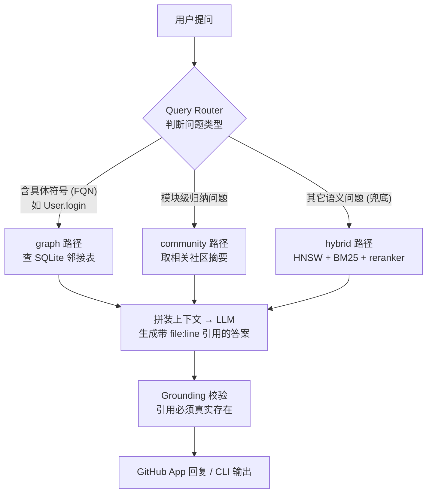

## 整体架构（一张图）

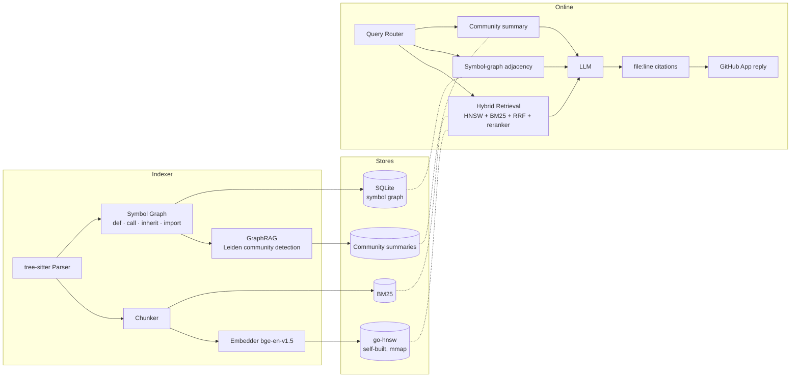

完整的架构长文见 [`docs/ARCHITECTURE.md`](docs/ARCHITECTURE.md)。
按阶段拆分的交付计划见 [`docs/ROADMAP.md`](docs/ROADMAP.md)。
关键设计取舍见 [`docs/DESIGN_DECISIONS.md`](docs/DESIGN_DECISIONS.md)。
基准测试（HNSW vs Faiss on SIFT-1M、200 题跨文件 QA）见 [`docs/BENCHMARKS.md`](docs/BENCHMARKS.md)。

## Indexing Pipeline（建索引流水线）

索引是离线、异步的一侧：在仓库收到 `push` 事件时触发，把源码转成在线检索能直接用的三种产物——**向量（HNSW）**、**符号图（SQLite）** 和 **社区摘要（community summaries）**。它和在线 serving 共享同一份 SQLite + 向量库，但完全独立运行，因此可以按宿主机的批并行度任意加速，而不影响线上问答延迟。

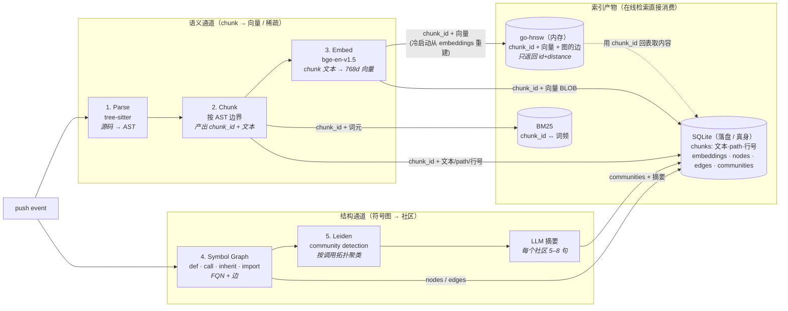

按阶段拆解（每一步都对应 [`reposage/indexer/`](reposage/indexer) 下的一个模块）：

| 阶段 | 做什么 | 关键取舍 |
| --- | --- | --- |
| **1. Parse（解析）** | 用 [tree-sitter](https://tree-sitter.github.io/) 做增量、容错的解析；语法来自 [`tree-sitter-language-pack`](https://github.com/Goldziher/tree-sitter-language-pack)（单 ABI 覆盖 100+ 语言）。 | Phase 1 端到端只打通 Python；TS/JS/Go 仅做 *parse 校验*，落 `file_meta` 时标 `parse_status='unsupported'`，保证覆盖率数字诚实可查。 |
| **2. Chunk（切块）** | 沿 AST 边界切（函数 / 方法 / 类 / 顶层语句），带最大行数上限和小重叠。 | AST 感知切块让语义完整的单元不被切散，code embedding 明显优于定长窗口切块。 |
| **3. Embed（向量化）** | 默认 `BAAI/bge-en-v1.5`，懒加载、支持 CPU / MPS / CUDA；向量经 gRPC 推给自建的 `go-hnsw`。同一份 chunk 同时进 BM25 稀疏索引。 | 稠密 + 稀疏双写，为在线 hybrid 检索（HNSW + BM25 + RRF + reranker）备料。 |
| **4. Symbol Graph（符号图）** | 抽取 `def` / `call` / `inherit` / `import` 四类边，作为邻接表存进 SQLite，并在 `(dst, kind)` / `(src, kind)` 上建覆盖索引。 | **两遍、模块感知的解析**：Pass 1 收集定义与 import 绑定到全局 FQN 表，Pass 2 再解析调用/继承/导入的目标；`self.X` / `cls.X` 查到所在类，点号路径按 import 绑定解析；解析不了的记成 `<unresolved:name>` 以保留计数。 |
| **5. GraphRAG 社区** | 在符号图上跑 [Leiden](https://www.nature.com/articles/s41598-019-41695-z)（call + inherit + import 作为带权边）划分社区，再让一个更便宜的小模型把每个社区摘成 5–8 句话。 | 社区按 **调用拓扑** 而非目录结构形成——这正是用 Leiden 而不是 `path.split("/")` 的理由；摘要用小模型生成、答题用大模型消费，把成本和质量解耦。 |

最终落地的索引产物：

- **`go-hnsw`** —— 稠密向量（默认 `M=16, efConstruction=200, efSearch=64`），冷启动时从 SQLite 的 `embeddings` 表流式 `Add` 重建。
- **BM25** —— 稀疏检索（Phase 2 用 rank-bm25，Phase 5/7 换 Tantivy）。
- **SQLite symbol graph** —— 确定性事实查询的来源；完整 schema 见 [`docs/INDEX_SCHEMA.md`](docs/INDEX_SCHEMA.md)。
- **Community summaries** —— 模块级归纳问题（community 路径）的来源。

这些产物建好后，在线三路检索各取所需——下面这张图说明 **哪条路径会读哪些索引产物**（实线 = 该路径检索时必读；虚线 = 拿到 `chunk_id` 后回 SQLite hydrate 文本）：

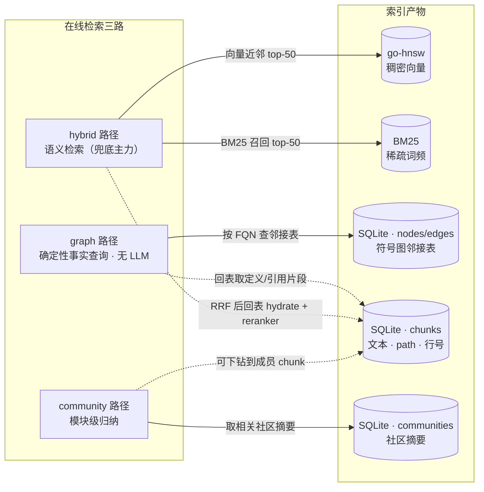

一句话对照：**graph 读符号图、hybrid 读向量+BM25、community 读社区摘要**；三路最后都要回 `chunks` 表取真正的文本与 `file:line`，这也是为什么 SQLite 是落盘"真身"、其余产物本质上是它的索引视图。

> 索引流水线的长文版本见 [`docs/ARCHITECTURE.md` 第 3 节](docs/ARCHITECTURE.md)；索引落库的字段定义见 [`docs/INDEX_SCHEMA.md`](docs/INDEX_SCHEMA.md)。

### 深入：两遍符号解析（Symbol Graph resolution）

上表「阶段 4」里那句"两遍、模块感知"值得单独画一张图。单遍扫描没法解析"先调用、后定义"或"调用别的文件里的符号"，所以解析分成 **先收集、再连边** 两趟：

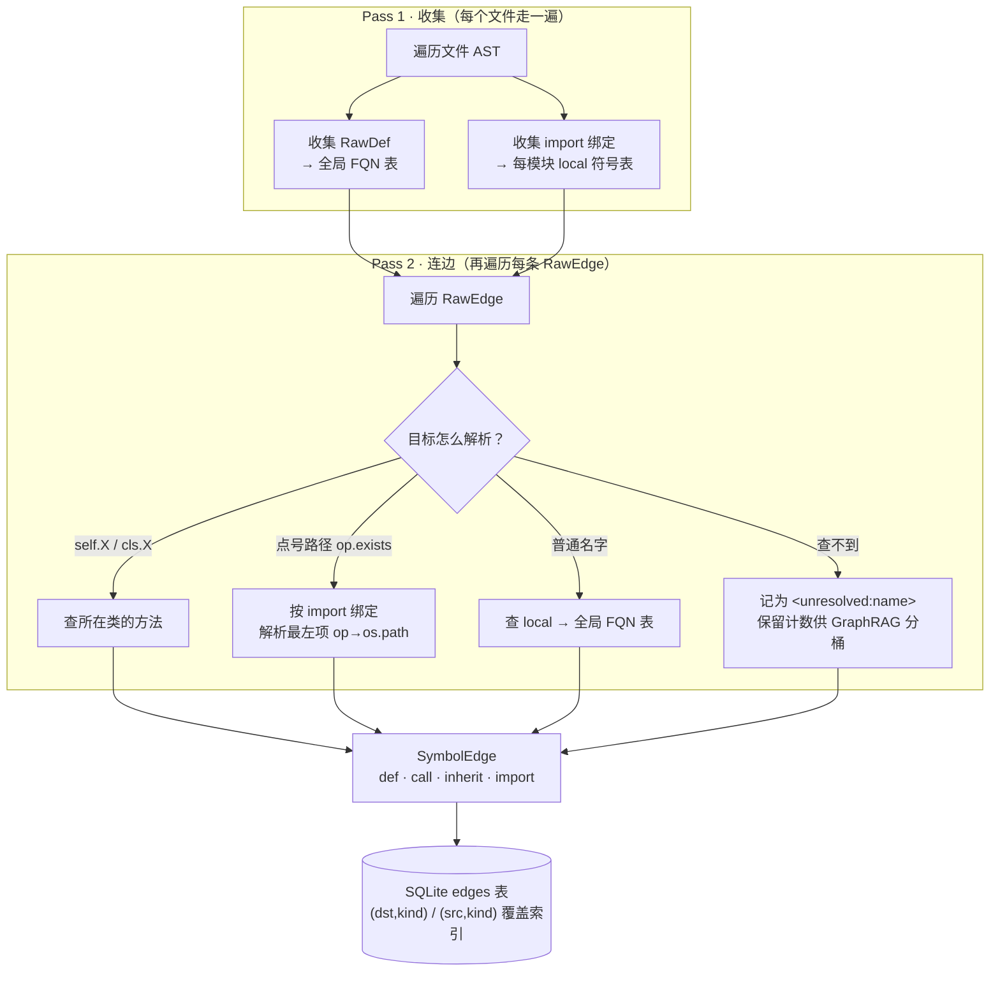

实现：每文件原始抽取在 [`reposage/indexer/extractor.py`](reposage/indexer/extractor.py)，跨文件解析在 [`reposage/indexer/python_resolver.py`](reposage/indexer/python_resolver.py)，落库在 [`reposage/storage/sqlite_graph.py`](reposage/storage/sqlite_graph.py)。目前 Python 端到端可用，TS/Go 标 `parse_status='unsupported'`。

### 深入：GraphRAG 社区检测与摘要

「阶段 5」展开就是一条 **聚类 → Map-Reduce 摘要 → 向量化** 的小流水线（由 `--graphrag` 开关控制，CLI 默认开）：

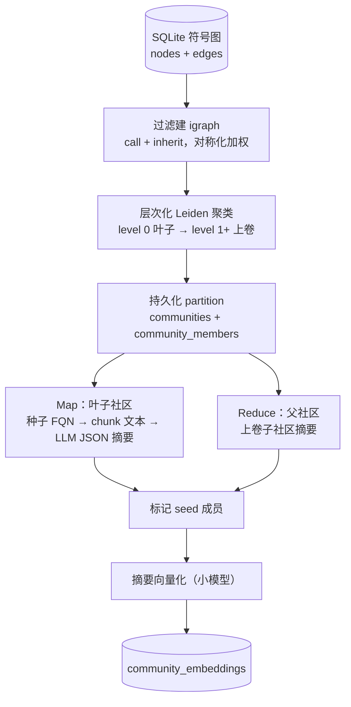

实现散落在 [`reposage/indexer/graphrag/`](reposage/indexer/graphrag)：建子图 `subgraph.py`、Leiden `community.py`、Map-Reduce 摘要 `summarizer.py`、种子选取 `seed.py`。没有可用 LLM 时跳过摘要，`--no-embed` 时跳过社区向量化——索引仍能跑通，只是少了 community 路径的料。

## 在线检索流水线（Retrieval Pipeline）

索引建好后，线上一条问题怎么变成"带 `file:line` 引用的答案"。这一侧**不下载模型、不解析源码**，所以延迟可控。入口统一是 `RetrievalService.answer(...)`，HTTP（`/ask`）和 CLI 都走它，不会各写一套。

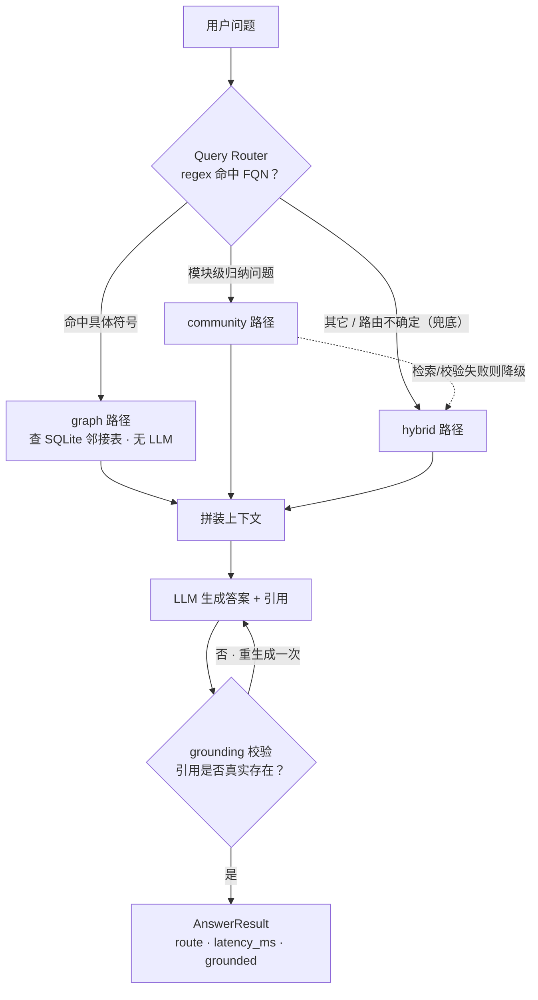

路由逻辑在 [`reposage/retrieval/router.py`](reposage/retrieval/router.py)：先用正则抓明显的 FQN（点号 / 调用 / snake_case），命中直接走 `graph`；否则让一个小 LLM 输出 JSON 路由，解析失败再兜底到 `hybrid`。总调度在 [`reposage/services/retrieval_service.py`](reposage/services/retrieval_service.py)。

### Hybrid 检索漏斗（HNSW + BM25 + RRF + reranker）

`hybrid` 路径是语义检索的主力，核心是一个 **逐级收窄的漏斗**：稠密 + 稀疏各取一批 → 融合 → 重排，让最贵的 cross-encoder 只打分 20 条，而不是整个语料库。

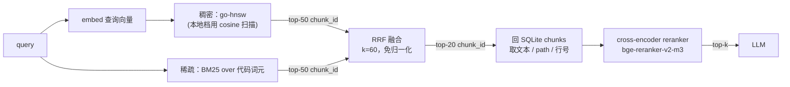

注意稠密分支返回的还是 `chunk_id`，要回 `chunks` 表 hydrate 出文本才能重排——和前面索引图里 `go-hnsw -.-> SQLite` 那条虚线是同一回事。实现：编排 [`reposage/retrieval/hybrid.py`](reposage/retrieval/hybrid.py)、gRPC 客户端 `hnsw_client.py`、本地稠密 `local_dense.py`、稀疏 `bm25.py`、重排 `reranker.py`。

### Grounding：引用校验循环（防止编造引用）

答案里的每个 `[path:lo-hi]` 都必须真实落在某个检索到的 chunk 行号区间内，否则视为编造。这是一个最多重试一次的 **两击封顶** 循环：

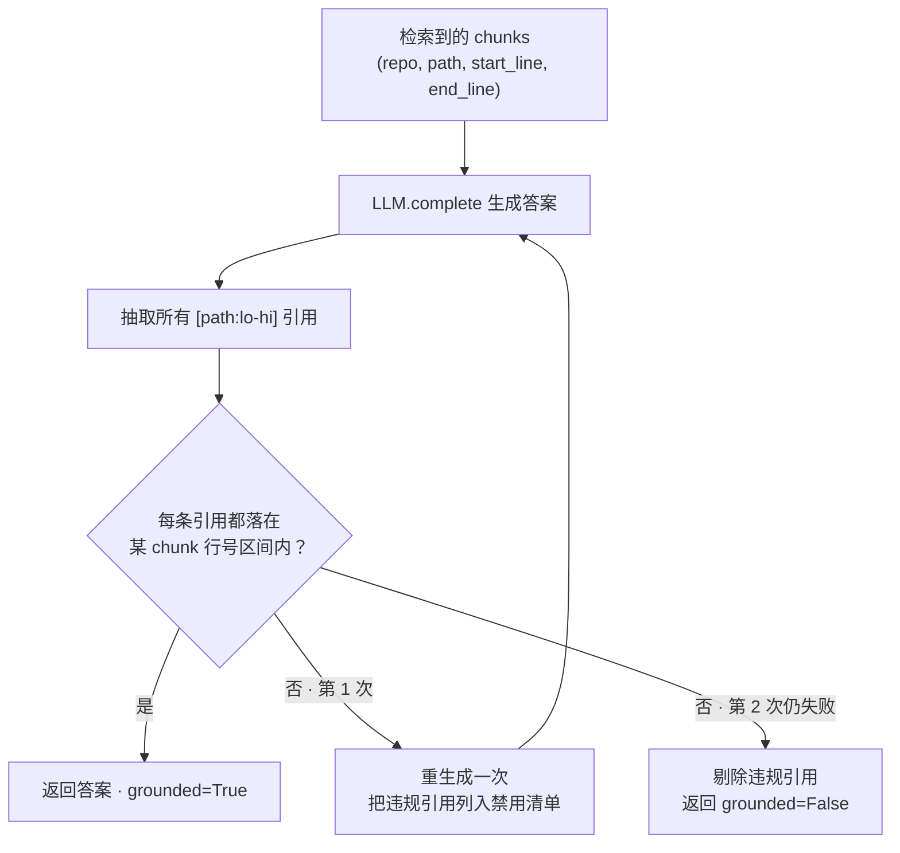

校验器在 [`reposage/llm/grounding.py`](reposage/llm/grounding.py)，重生成逻辑在 `RetrievalService._regenerate`。两击封顶是刻意的成本护栏（DD-013）。

## 运行形态：Profile 装配（mock / local / production）

同一套 `RetrievalService` 在三种 profile 下装配不同的"零件"，靠一个环境变量 `REPOSAGE_PROFILE` 切换——这就是为什么第一次跑不需要任何 API key。

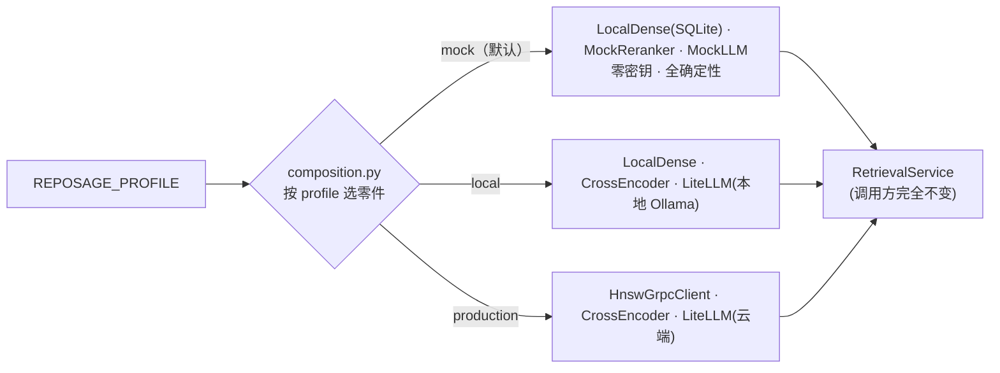

| Profile | 稠密后端 | Reranker | LLM | 适用 |
| --- | --- | --- | --- | --- |
| `mock` | `LocalDenseIndex`（读 SQLite） | `MockReranker` | `MockLLMClient` | 第一次跑通 / CI |
| `local` | `LocalDenseIndex` | `CrossEncoderReranker` | `LiteLLMClient`（Ollama） | 本地真实模型 |
| `production` | `HnswGrpcClient`（gRPC） | `CrossEncoderReranker` | `LiteLLMClient`（云） | 线上 |

装配点在 [`reposage/composition.py`](reposage/composition.py)，配置在 [`reposage/config.py`](reposage/config.py)，FastAPI 注入在 [`reposage/api/dependencies.py`](reposage/api/dependencies.py)。这些后端都藏在 `reposage/retrieval/protocols.py` 的几个 `Protocol` 背后，换一个不影响调用方。

## go-hnsw 服务与冷启动

`go-hnsw` 是内存索引，没有自己的持久化（Phase 5 才上 mmap），所以每次启动靠 **从 SQLite `embeddings` 表流式重建**：

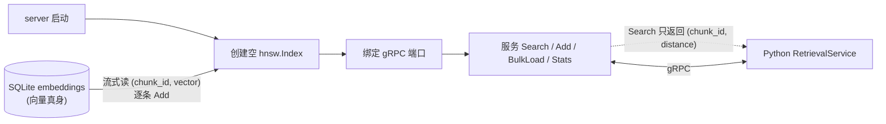

冷启动是 `O(N)` 读 float32 BLOB（10k 向量 <100ms，200k 约 2s）。`Stats` 暴露 `(size, dim, model, M, efC, efSearch)`，让 Python 端在维度/模型不匹配时快速失败。算法核心（插入 Alg 1、搜索 Alg 5）在 [`go-hnsw/insert.go`](go-hnsw/insert.go) / [`search.go`](go-hnsw/search.go)，gRPC 服务在 [`go-hnsw/internal/grpcserver/`](go-hnsw/internal/grpcserver)，冷启动加载在 `sqlite_load.go`。

> mmap 快照（`Snapshot`/`Recover`）目前是 Phase 5 规划，[`go-hnsw/persist.go`](go-hnsw/persist.go) 暂返回 `errPersistNotImplemented`。

## 有什么新东西

| 亮点 | 说明 |
| --- | --- |
| **`go-hnsw/`：从零自研的 HNSW** | 用 Go 实现 Malkov & Yashunin 2018 的 HNSW，带 `mmap` 持久化。在 SIFT-1M 上与 Faiss 做对照，沿 `M` / `efConstruction` / `efSearch` 报告 QPS、内存、P99 延迟。本身是一个可独立 `go get` 的 Go module。 |
| **双索引检索（dual-index）** | Symbol Graph（确定性）+ GraphRAG 社区摘要（聚合）+ 向量/BM25 混合检索（语义兜底），由一个轻量 query router 选路。**目标**：在自建 200 题跨文件基准上，相比纯向量基线把回答准确率提升 ≥ 25%（见 [ROADMAP](docs/ROADMAP.md) Phase 3 退出指标；实测数字以 [BENCHMARKS](docs/BENCHMARKS.md) 为唯一来源，当前为 pending）。 |
| **自建评测 harness** | 横跨 Python / TypeScript / Go、共 200 题人工标注的跨文件问答集；用 Ragas + 自定义引用对齐校验打分，并接入 CI 作为回归门（regression gate）。 |
| **代码智能栈的"读"侧** | 与负责"写"侧（重构 / mutation）的姐妹项目共享同一份索引格式。 |

## 快速开始

> 完整的安装步骤（包括模型下载、tree-sitter 语法）会在 Phase 1 加到 `docs/SETUP.md`。

```bash
# 1. 克隆 & 安装 Python 依赖（推荐 uv）
git clone https://github.com/AndyUneducated/repo-sage.git
cd repo-sage
make install

# 2. 编译 Go HNSW 服务
make hnsw-build

# 3. 启动本地 dev 栈（FastAPI + go-hnsw + SQLite）
make dev

# 4. 给一个仓库建索引
python -m reposage.cli index --repo /path/to/your/repo

# 5. 问问题
python -m reposage.cli ask "where is User.login called?"
```

> **零密钥起步**：默认 profile 是 `mock`（全部用确定性假实现，不需要任何 API key 或 Go 二进制），适合第一次跑通流程。换成 `local`（真实模型、本地 Ollama）或 `production`（接 gRPC + 云端 LLM）只需改一个环境变量 `REPOSAGE_PROFILE`，详见 [`docs/SETUP.md`](docs/SETUP.md)。

## 仓库结构

```
repo-sage/
├── reposage/               # Python 服务（FastAPI、indexer、retrieval、bot）
│   ├── api/                # FastAPI 路由与 schema
│   ├── indexer/            # tree-sitter 解析、chunking、embedding、symbol graph
│   │   └── graphrag/       # Leiden 社区检测 + LLM 摘要
│   ├── retrieval/          # 混合检索、query router、reranker
│   ├── storage/            # SQLite symbol graph、community store
│   ├── bot/                # GitHub App webhook + 引用构造器
│   ├── llm/                # 基于 LiteLLM 的多 provider 客户端
│   └── observability/      # OpenTelemetry 接线
├── go-hnsw/                # 自建的 HNSW Go module（可独立 OSS）
│   ├── cmd/server/         # 提供给 Python 端的 gRPC / HTTP server
│   └── cmd/bench/          # SIFT-1M 基准测试 harness
├── benchmarks/
│   ├── cross_file_qa/      # 200 题跨文件 QA 基准 + Ragas
│   └── sift1m/             # ANN 基准（HNSW vs Faiss）
├── docs/                   # 架构、roadmap、决策、基准
├── scripts/                # 一次性的 dev 脚本
└── .github/workflows/      # CI: Python / Go / lint / eval-gate
```

## 项目状态

项目正在积极开发中。按阶段的交付计划见 [`docs/ROADMAP.md`](docs/ROADMAP.md)，进行中的里程碑见 issue tracker。

## 贡献

欢迎 issue / PR — 详细流程见 [CONTRIBUTING.md](./CONTRIBUTING.md)。

## License

Apache 2.0，详见 [`LICENSE`](./LICENSE)。
