# RepoSage

> A repository-scale code Q&A system with a **dual-index** design (Symbol Graph + GraphRAG) and a **from-scratch Go HNSW** vector store. Delivered as a GitHub App.

[](https://github.com/AndyUneducated/repo-sage/actions/workflows/ci-python.yml)
[](https://github.com/AndyUneducated/repo-sage/actions/workflows/ci-go.yml)
[](https://github.com/AndyUneducated/repo-sage/actions/workflows/lint.yml)
[](https://codecov.io)
[](./LICENSE)

[](https://www.python.org/)
[](https://go.dev/)
[](https://fastapi.tiangolo.com/)
[](https://tree-sitter.github.io/)
[](https://www.sqlite.org/)
[](./go-hnsw)
[](https://microsoft.github.io/graphrag/)
[](https://opentelemetry.io/)
[](https://pre-commit.com/)

---

## Why RepoSage

Someone joining a 500 kLOC repository asks three very different kinds of questions. One tool cannot answer all three well, so RepoSage gives each kind its own retrieval **route**:

| Question type | What it actually needs | Why pure vector RAG is not enough | Route |
| --- | --- | --- | --- |
| *"`User.login()` — where is it called?"* | A deterministic fact query (graph query) | Top-k similarity misses cross-file and reflective call edges — this is a fact question, not a semantic one | **graph** |
| *"What do I change to update session timeout?"* | Cross-file, cross-chunk semantic retrieval | Raw embeddings alone are imprecise; you need hybrid retrieval + a reranker | **hybrid** |
| *"How do the auth and billing modules communicate?"* | Module-level synthesis | Five to ten chunks cannot reconstruct a module boundary; the modules need to be summarised first | **community** |

In one line: **classify the question, then query the matching index** — do not force every question through a single vector store.

The diagram below is the full path from a question to an answer:

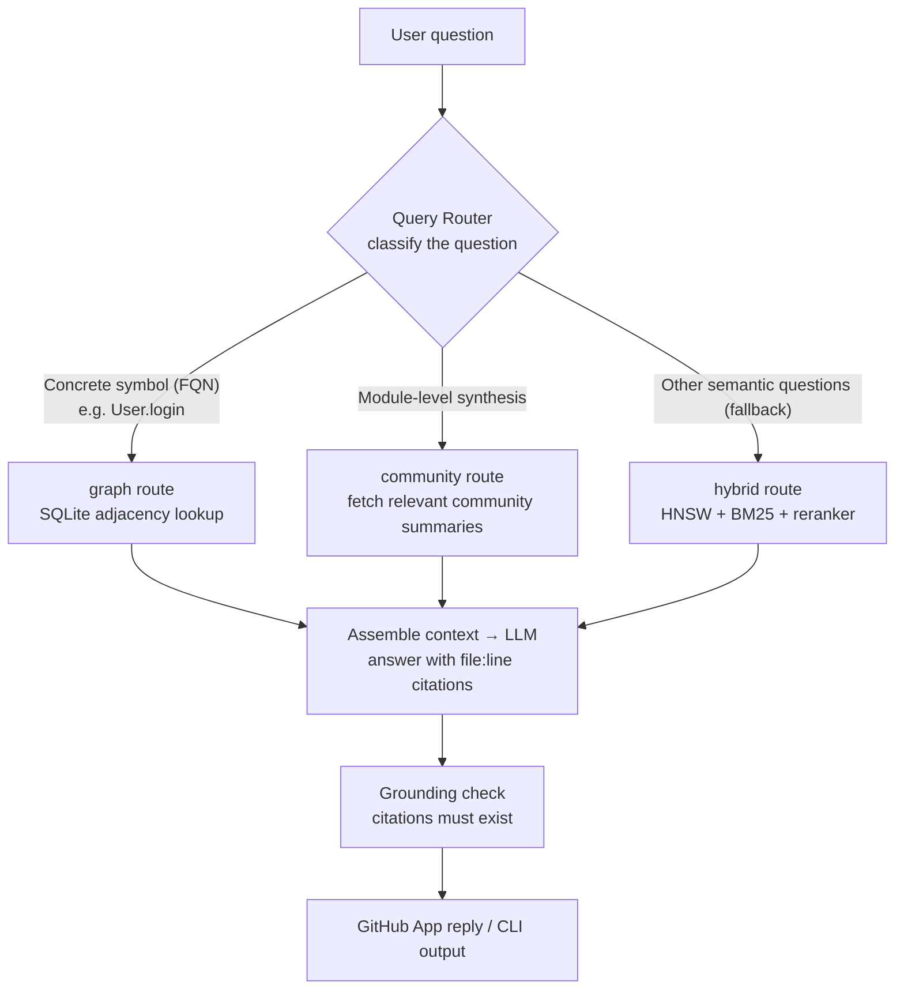

## Architecture at a glance

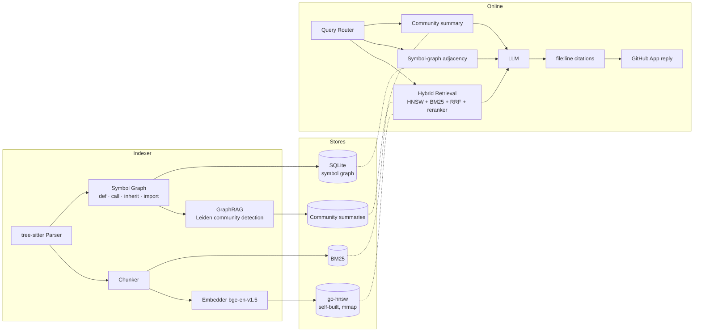

Full architecture write-up: [`docs/ARCHITECTURE.md`](docs/ARCHITECTURE.md).
Phased delivery plan: [`docs/ROADMAP.md`](docs/ROADMAP.md).
Key design trade-offs: [`docs/DESIGN_DECISIONS.md`](docs/DESIGN_DECISIONS.md).
Benchmarks (HNSW vs Faiss on SIFT-1M, 200-question cross-file QA): [`docs/BENCHMARKS.md`](docs/BENCHMARKS.md).

## Indexing pipeline

Indexing is the offline, asynchronous side: it runs on `push`, and turns source into three artifacts the online retriever can consume directly — **vectors (HNSW)**, a **symbol graph (SQLite)**, and **community summaries**. It shares SQLite and the vector store with online serving, but runs independently, so it can scale with host batch parallelism without affecting Q&A latency.

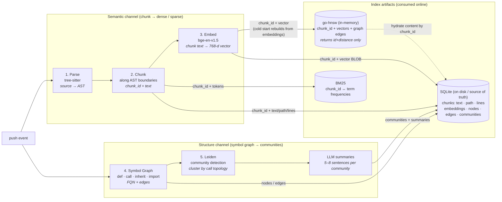

Broken down by stage (each maps to a module under [`reposage/indexer/`](reposage/indexer)):

| Stage | What it does | Key trade-off |
| --- | --- | --- |
| **1. Parse** | Incremental, fault-tolerant parsing with [tree-sitter](https://tree-sitter.github.io/); grammars from [`tree-sitter-language-pack`](https://github.com/Goldziher/tree-sitter-language-pack) (one ABI, 100+ languages). | Phase 1 end-to-end is Python only; TS/JS/Go get *parse validation* only, recorded as `parse_status='unsupported'` in `file_meta`, so coverage numbers stay honest. |
| **2. Chunk** | Split on AST boundaries (function / method / class / top-level statements), with a max-line cap and a small overlap. | AST-aware chunks keep semantic units intact; code embeddings beat fixed-window slicing. |
| **3. Embed** | Default `BAAI/bge-en-v1.5`, lazy-loaded, CPU / MPS / CUDA; vectors are pushed over gRPC to self-built `go-hnsw`. The same chunks also feed the BM25 sparse index. | Dual-write dense + sparse so online hybrid retrieval (HNSW + BM25 + RRF + reranker) has both views. |
| **4. Symbol Graph** | Extract `def` / `call` / `inherit` / `import` edges, store as an adjacency list in SQLite, with covering indexes on `(dst, kind)` / `(src, kind)`. | **Two-pass, module-aware resolution**: Pass 1 collects defs and import bindings into a global FQN table; Pass 2 resolves call / inherit / import targets. `self.X` / `cls.X` look up the enclosing class; dotted paths resolve the leftmost name via import bindings; unresolved names become `<unresolved:name>` so counts are preserved. |
| **5. GraphRAG communities** | Run [Leiden](https://www.nature.com/articles/s41598-019-41695-z) on the symbol graph (call + inherit + import as weighted edges), then summarise each community in 5–8 sentences with a cheaper small model. | Communities form from **call topology**, not directory layout — that is why Leiden, not `path.split("/")`. Small model writes summaries; large model consumes them at answer time, decoupling cost from quality. |

Artifacts that land on disk:

- **`go-hnsw`** — dense vectors (default `M=16, efConstruction=200, efSearch=64`); cold start rebuilds by streaming `Add` from the SQLite `embeddings` table.
- **BM25** — sparse retrieval (rank-bm25 in Phase 2; Tantivy in Phase 6).
- **SQLite symbol graph** — source of deterministic fact queries; full schema in [`docs/INDEX_SCHEMA.md`](docs/INDEX_SCHEMA.md).
- **Community summaries** — source for module-level questions (community route).

Once they exist, the three online routes each read a different subset — solid lines are required at search time; dashed lines hydrate text from SQLite after a `chunk_id` is known:

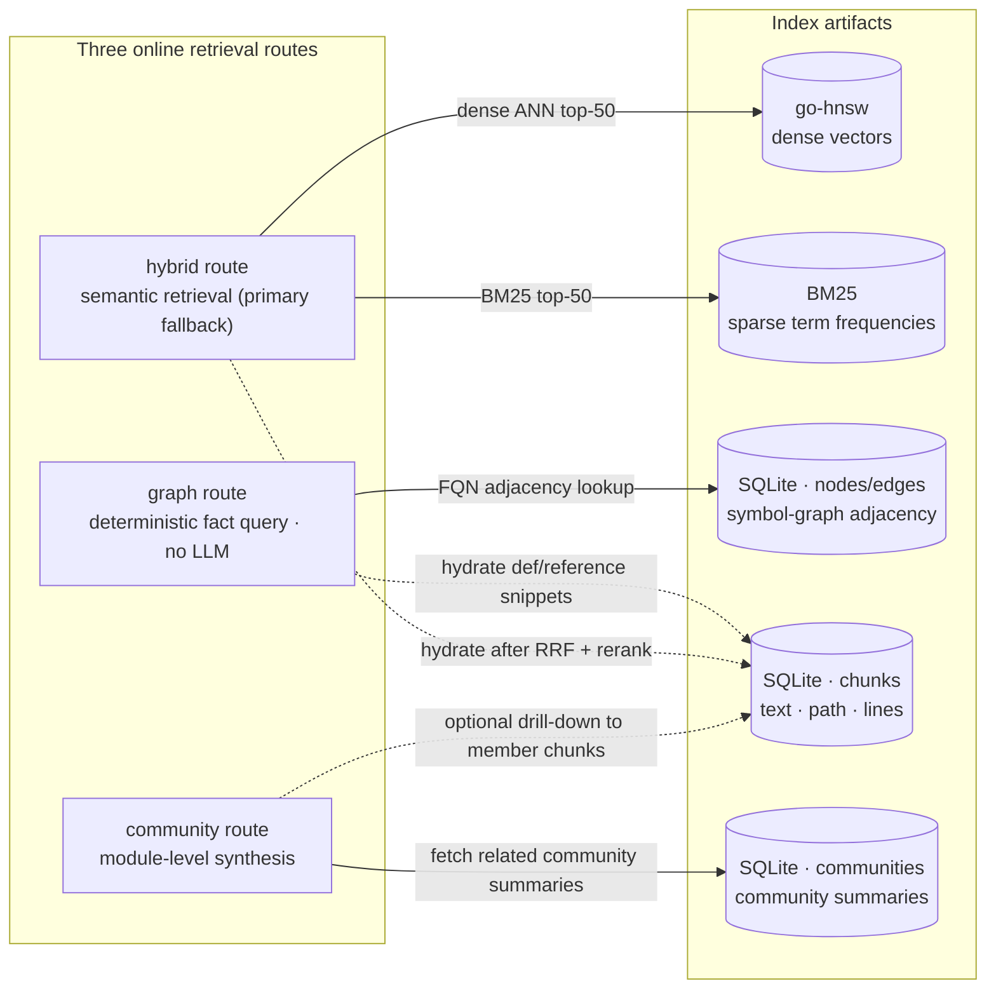

In one line: **graph reads the symbol graph, hybrid reads vectors + BM25, community reads community summaries**. All three eventually hydrate real text and `file:line` from `chunks`, which is why SQLite is the on-disk source of truth and the other artifacts are index views over it.

> Long-form indexing pipeline: [`docs/ARCHITECTURE.md` §3](docs/ARCHITECTURE.md). Field definitions: [`docs/INDEX_SCHEMA.md`](docs/INDEX_SCHEMA.md).

### Deep dive: two-pass symbol resolution

The “two-pass, module-aware” note in stage 4 deserves its own diagram. A single scan cannot resolve “call before define” or “call a symbol in another file”, so resolution is **collect first, then wire edges**:

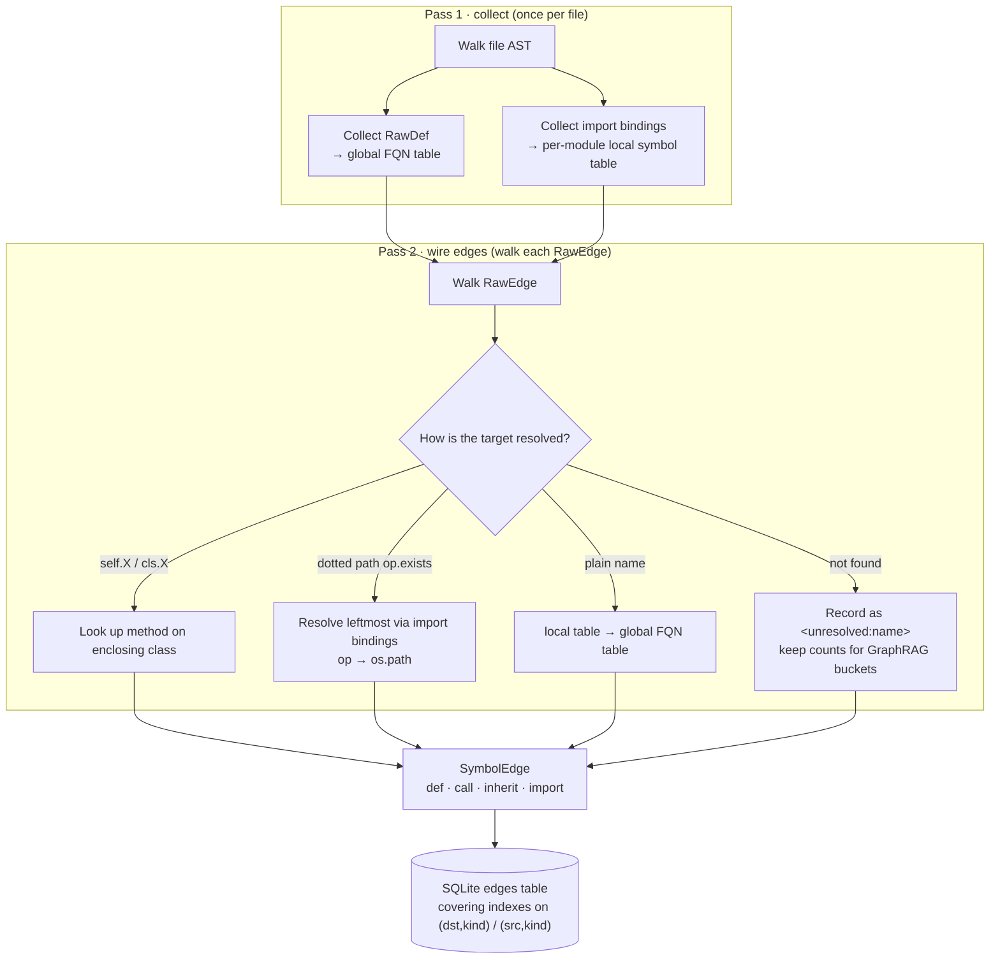

Implementation: per-file extraction in [`reposage/indexer/extractor.py`](reposage/indexer/extractor.py), cross-file resolution in [`reposage/indexer/python_resolver.py`](reposage/indexer/python_resolver.py), persistence in [`reposage/storage/sqlite_graph.py`](reposage/storage/sqlite_graph.py). Python is end-to-end; TS/Go stay `parse_status='unsupported'`.

### Deep dive: GraphRAG community detection and summaries

Stage 5 is a small **cluster → Map-Reduce summarise → embed** pipeline (gated by `--graphrag`, on by default in the CLI):

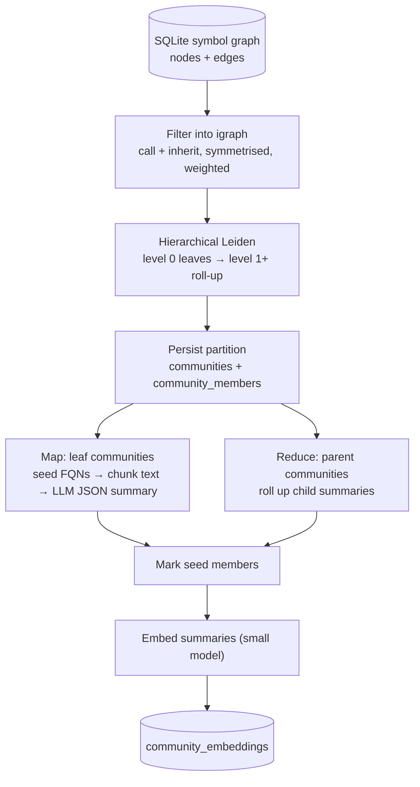

Code lives under [`reposage/indexer/graphrag/`](reposage/indexer/graphrag): subgraph `subgraph.py`, Leiden `community.py`, Map-Reduce summariser `summarizer.py`, seed selection `seed.py`. With no LLM, summaries are skipped; with `--no-embed`, community embeddings are skipped — indexing still completes, the community route just has less to work with.

## Online retrieval pipeline

After the index exists, a live question becomes an answer with `file:line` citations. This side **does not download models or parse source**, so latency stays bounded. The single entry point is `RetrievalService.answer(...)`; HTTP (`/ask`) and the CLI both use it.

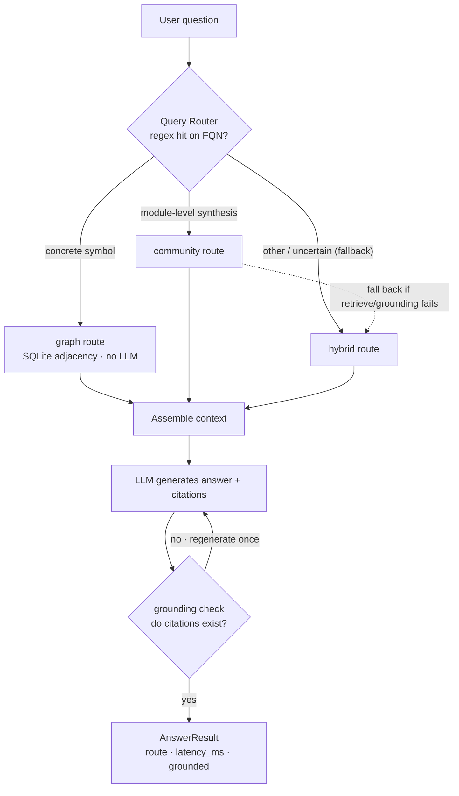

Routing lives in [`reposage/retrieval/router.py`](reposage/retrieval/router.py): regex first for obvious FQNs (dots / calls / snake_case) → `graph`; otherwise a small LLM emits JSON routing, and parse failure falls back to `hybrid`. Orchestration is [`reposage/services/retrieval_service.py`](reposage/services/retrieval_service.py).

### Hybrid retrieval funnel (HNSW + BM25 + RRF + reranker)

The `hybrid` route is the semantic workhorse: a **narrowing funnel** so the expensive cross-encoder scores 20 hits, not the whole corpus.

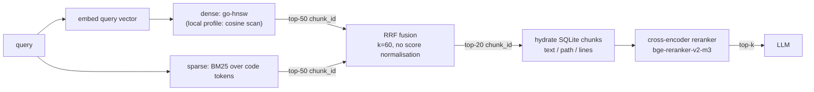

The dense branch still returns `chunk_id`; text is hydrated from `chunks` before rerank — the same dashed `go-hnsw -.-> SQLite` edge as in the indexing diagram. Implementation: orchestration [`reposage/retrieval/hybrid.py`](reposage/retrieval/hybrid.py), gRPC client `hnsw_client.py`, local dense `local_dense.py`, sparse `bm25.py`, rerank `reranker.py`.

### Grounding: citation verification loop

Every `[path:lo-hi]` in the answer must fall inside a retrieved chunk’s line range, or it is treated as invented. At most one retry — a **two-strike** loop:

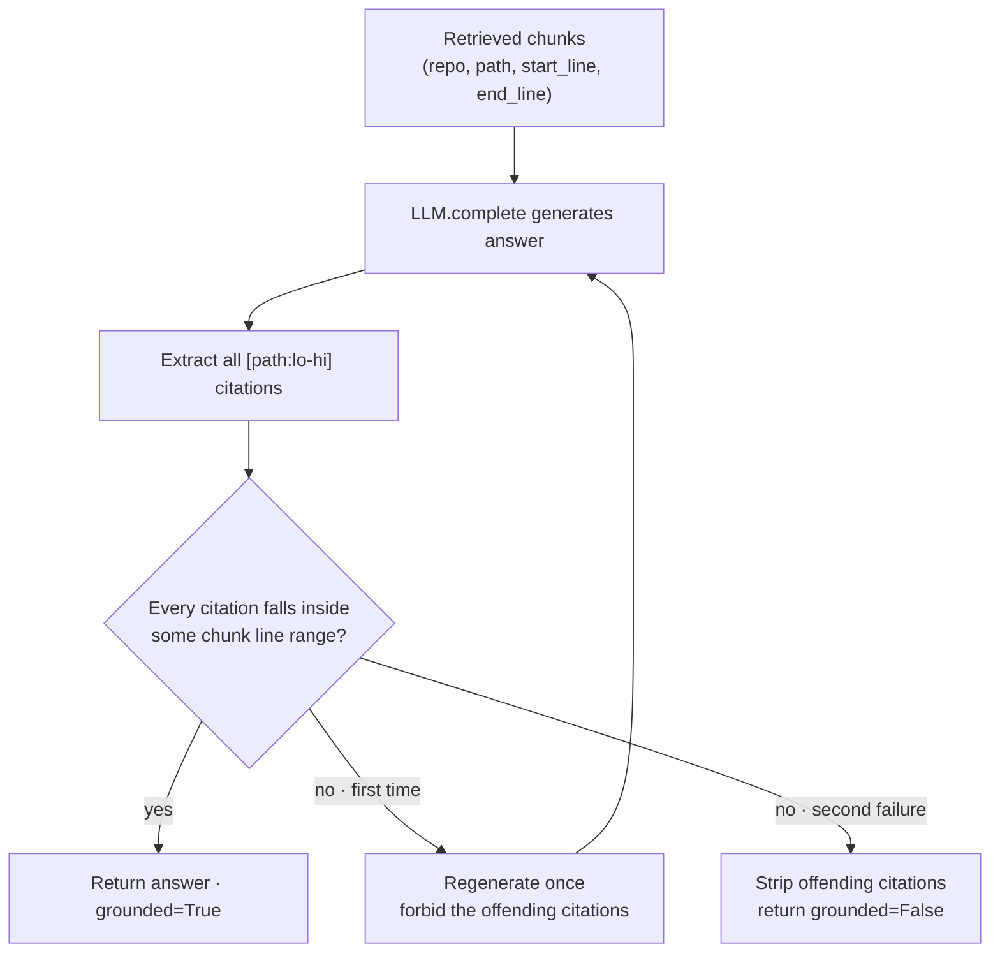

Checker: [`reposage/llm/grounding.py`](reposage/llm/grounding.py); regenerate: `RetrievalService._regenerate`. Two strikes is an intentional cost guardrail (DD-013).

## Runtime shape: profile composition (mock / local / production)

The same `RetrievalService` is wired with different backends via `REPOSAGE_PROFILE` — that is why the first run needs no API key.

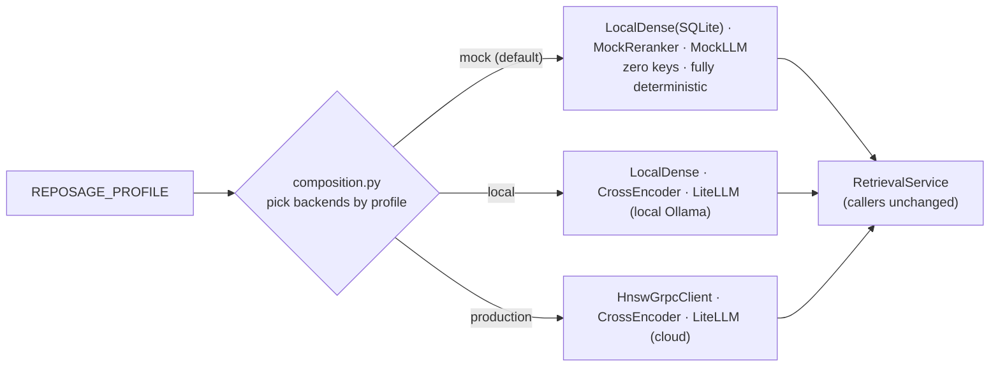

| Profile | Dense backend | Reranker | LLM | Use |
| --- | --- | --- | --- | --- |
| `mock` | `LocalDenseIndex` (SQLite) | `MockReranker` | `MockLLMClient` | First-run / CI |
| `local` | `LocalDenseIndex` | `CrossEncoderReranker` | `LiteLLMClient` (Ollama) | Real models locally |
| `production` | `HnswGrpcClient` (gRPC) | `CrossEncoderReranker` | `LiteLLMClient` (cloud) | Production |

Wiring: [`reposage/composition.py`](reposage/composition.py), config [`reposage/config.py`](reposage/config.py), FastAPI injection [`reposage/api/dependencies.py`](reposage/api/dependencies.py). Backends sit behind `Protocol`s in `reposage/retrieval/protocols.py`, so swapping one does not change callers.

## go-hnsw service and cold start

`go-hnsw` is an in-memory index. **Phase 4** shipped mmap snapshots (`Snapshot` / `Recover`): boot prefers a fast snapshot reload, and only streams a rebuild from SQLite when no snapshot exists:

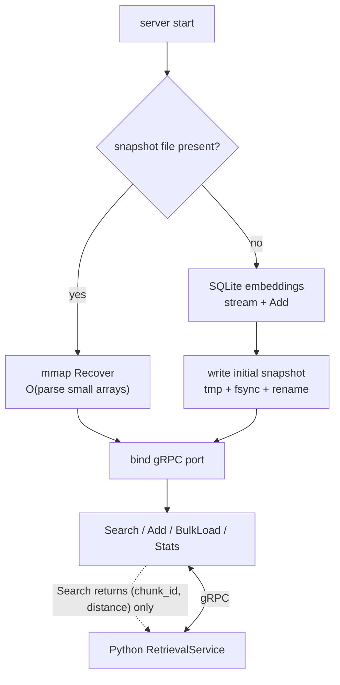

| Boot path | When | Typical cost |
| --- | --- | --- |
| **Snapshot Recover** (fast path) | Production / large indexes; `--snapshot` or `hnsw_snapshot_path` set | 1M×128-d: **P50 ≈ 12 ms** (see [BENCHMARKS](docs/BENCHMARKS.md)) |
| **SQLite stream Add** (fallback) | First deploy, missing snapshot, rebuild after model/dim change | `O(N)` BLOB reads (10k vectors <100 ms, 200k ≈ 2 s) |

* `Stats` exposes `(size, dim, model, M, efC, efSearch)`; Python fails fast on dim/model mismatch.
* Algorithms: insert Alg 1 + heuristic neighbour selection Alg 4 + search Alg 5 — [`go-hnsw/insert.go`](go-hnsw/insert.go) / [`search.go`](go-hnsw/search.go).
* Persistence layout and atomic writes: [`go-hnsw/persist.go`](go-hnsw/persist.go), [`docs/plans/phase-4-hnsw-v2.md`](docs/plans/phase-4-hnsw-v2.md).
* gRPC service: [`go-hnsw/internal/grpcserver/`](go-hnsw/internal/grpcserver); SQLite cold load: [`sqlite_load.go`](go-hnsw/internal/grpcserver/sqlite_load.go).

## What is new here

| Highlight | Notes |
| --- | --- |
| **`go-hnsw/`: HNSW from scratch** | Go implementation of Malkov & Yashunin 2018. **Phase 4 shipped mmap persistence.** Pareto vs Faiss-HNSWFlat on SIFT-1M is published ([BENCHMARKS §1](docs/BENCHMARKS.md)). Standalone `go get`-able module. |
| **Dual-index retrieval** | Symbol Graph (deterministic) + GraphRAG community summaries (aggregation) + vector/BM25 hybrid (semantic fallback), selected by a light query router. **Target**: ≥ 25% lift vs a pure-vector baseline on the 200-question cross-file bench (Phase 3 exit criterion; SIFT-1M numbers in [BENCHMARKS](docs/BENCHMARKS.md); cross-file QA still pending). |
| **In-house eval harness** | 200 human-labelled cross-file questions across Python / TypeScript / Go; scored with Ragas plus custom citation-alignment checks, wired as a CI regression gate. |
| **The “read” side of a code-intel stack** | Shares the index format with a sister project that owns the “write” side (refactor / mutation). |

## Quick start

> Full install (model download, tree-sitter grammars) will land in `docs/SETUP.md` during Phase 1.

```bash
# 1. Clone & install Python deps (uv recommended)
git clone https://github.com/AndyUneducated/repo-sage.git
cd repo-sage
make install

# 2. Build the Go HNSW server
make hnsw-build

# 3. Start the local dev stack (FastAPI + go-hnsw + SQLite)
make dev

# 4. Index a repository
python -m reposage.cli index --repo /path/to/your/repo

# 5. Ask a question
python -m reposage.cli ask "where is User.login called?"
```

> **Zero-key start**: the default profile is `mock` (deterministic fakes, no API key, no Go binary) — enough to walk the pipeline once. Switch to `local` (real models, local Ollama) or `production` (gRPC + cloud LLM) with `REPOSAGE_PROFILE`. See [`docs/SETUP.md`](docs/SETUP.md).

## Repository layout

```
repo-sage/
├── reposage/               # Python service (FastAPI, indexer, retrieval, bot)
│   ├── api/                # FastAPI routes and schemas
│   ├── indexer/            # tree-sitter parse, chunking, embedding, symbol graph
│   │   └── graphrag/       # Leiden community detection + LLM summaries
│   ├── retrieval/          # hybrid retrieval, query router, reranker
│   ├── storage/            # SQLite symbol graph, community store
│   ├── bot/                # GitHub App webhook + citation builder
│   ├── llm/                # LiteLLM multi-provider client
│   └── observability/      # OpenTelemetry wiring
├── go-hnsw/                # self-built HNSW Go module (independently OSS-able)
│   ├── cmd/server/         # gRPC / HTTP server for the Python side
│   └── cmd/bench/          # SIFT-1M benchmark harness
├── benchmarks/
│   ├── cross_file_qa/      # 200-question cross-file QA bench + Ragas
│   └── sift1m/             # ANN bench (HNSW vs Faiss)
├── docs/                   # architecture, roadmap, decisions, benchmarks
├── scripts/                # one-off dev scripts
└── .github/workflows/      # CI: Python / Go / lint / eval-gate
```

## Project status

Actively developed. Phased delivery: [`docs/ROADMAP.md`](docs/ROADMAP.md). In-progress milestones: the issue tracker.

## Contributing

Issues and PRs welcome — see [CONTRIBUTING.md](./CONTRIBUTING.md).

## License

Apache 2.0 — [`LICENSE`](./LICENSE).
