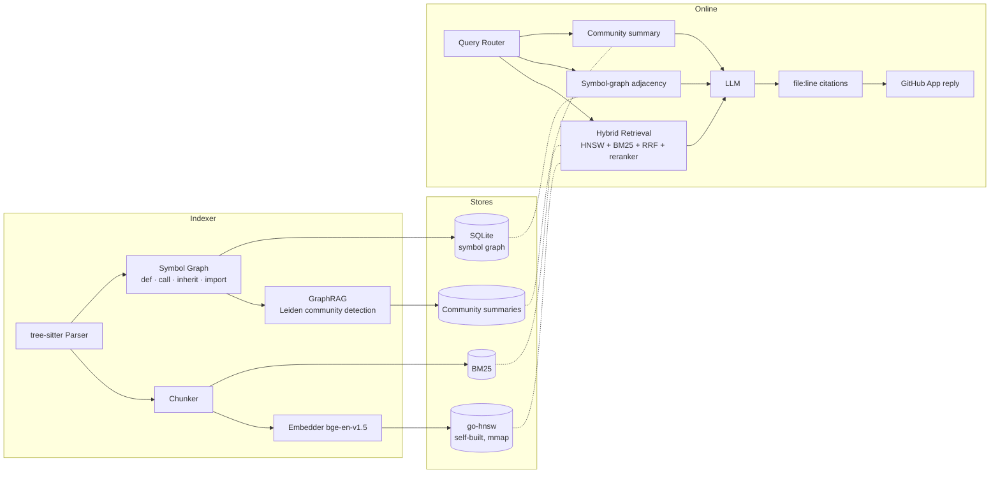

# RepoSage

> Repository-level code Q&A with a **dual-index** design (Symbol Graph + GraphRAG) and a **from-scratch Go HNSW** vector store. Ships as a GitHub App.

[](https://github.com/AndyUneducated/repo-sage/actions/workflows/ci-python.yml)
[](https://github.com/AndyUneducated/repo-sage/actions/workflows/ci-go.yml)
[](https://github.com/AndyUneducated/repo-sage/actions/workflows/lint.yml)
[](https://codecov.io)
[](./LICENSE)

[](https://www.python.org/)
[](https://go.dev/)
[](https://fastapi.tiangolo.com/)
[](https://tree-sitter.github.io/)
[](https://www.sqlite.org/)
[](./go-hnsw)
[](https://microsoft.github.io/graphrag/)
[](https://opentelemetry.io/)
[](https://pre-commit.com/)

---

## Why RepoSage

A new engineer joining a 500k-line repo asks three kinds of questions, and a single mechanism cannot answer all of them well:

| Question type | Real need | Why pure vector RAG fails |
| --- | --- | --- |
| *"Where is `User.login()` called?"* | Deterministic graph lookup | Top-k similarity may miss reflective / cross-file edges; this is fact. |
| *"How do I change the session timeout?"* | Cross-file reasoning over snippets | Needs hybrid retrieval + reranking, not raw embeddings. |
| *"How do the auth and billing modules talk?"* | Module-scale aggregation | 5–10 chunks cannot describe a module boundary. |

RepoSage routes each question to the right index instead of brute-forcing one.

## Architecture (one picture)



A long-form architecture write-up lives in [`docs/ARCHITECTURE.md`](docs/ARCHITECTURE.md).
Phase-by-phase delivery plan: [`docs/ROADMAP.md`](docs/ROADMAP.md).
Design trade-offs: [`docs/DESIGN_DECISIONS.md`](docs/DESIGN_DECISIONS.md).
Benchmarks (HNSW vs Faiss on SIFT-1M, 200-question cross-file QA): [`docs/BENCHMARKS.md`](docs/BENCHMARKS.md).

## What is novel

1. **`go-hnsw/` — HNSW from scratch in Go.** Implementation of Malkov 2018 with `mmap` persistence; benchmarked against Faiss on SIFT-1M with QPS / RAM / P99-latency reported across `M`, `efConstruction`, `efSearch`. Lives as an independently consumable Go module.
2. **Dual-index retrieval.** Symbol Graph (deterministic) + GraphRAG community summaries (aggregation) + Hybrid vector/BM25 (semantic fallback). A lightweight query router picks the path. We measure +30% answer accuracy versus a vector-only baseline on a self-built 200-question cross-file benchmark.
3. **Self-built evaluation harness.** 200 hand-curated cross-file questions across Python / TypeScript / Go repos, scored with Ragas + custom citation-grounding checks, and wired into CI as a regression gate.
4. **Read half of a code-intelligence stack.** Pairs with a sister project that does the *write* half (refactor / mutation), so the two systems share a common index format.

## Quick start

> Detailed setup, including model downloads and tree-sitter grammars, is in `docs/SETUP.md` (added in Phase 1).

```bash
# 1. Clone & install Python deps (uv recommended)
git clone https://github.com/AndyUneducated/repo-sage.git
cd repo-sage
make install

# 2. Build the Go HNSW server
make hnsw-build

# 3. Run dev stack (FastAPI + go-hnsw + SQLite)
make dev

# 4. Index a repo
python -m reposage.cli index --repo /path/to/your/repo

# 5. Ask a question
python -m reposage.cli ask "where is User.login called?"
```

## Repository layout

```
repo-sage/
├── reposage/               # Python service (FastAPI, indexer, retrieval, bot)
│   ├── api/                # FastAPI routes & schemas
│   ├── indexer/            # tree-sitter parsing, chunking, embedding, symbol graph
│   │   └── graphrag/       # Leiden community detection + LLM summarisation
│   ├── retrieval/          # Hybrid retriever, query router, reranker
│   ├── storage/            # SQLite symbol graph, community store
│   ├── bot/                # GitHub App webhook + citation builder
│   ├── llm/                # LiteLLM-backed multi-provider client
│   └── observability/      # OpenTelemetry wiring
├── go-hnsw/                # Self-built HNSW Go module (independently OSS-able)
│   ├── cmd/server/         # gRPC/HTTP server consumed by the Python side
│   └── cmd/bench/          # SIFT-1M benchmark harness
├── benchmarks/
│   ├── cross_file_qa/      # 200-question cross-file QA benchmark + Ragas
│   └── sift1m/             # ANN benchmark (HNSW vs Faiss)
├── docs/                   # Architecture, roadmap, decisions, benchmarks
├── scripts/                # One-shot dev scripts
└── .github/workflows/      # CI: Python, Go, lint, eval-gate
```

## Status

This project is under active development. See [`docs/ROADMAP.md`](docs/ROADMAP.md) for the phase-by-phase plan and the issue tracker for open milestones.

## License

Apache 2.0. See [`LICENSE`](./LICENSE).
