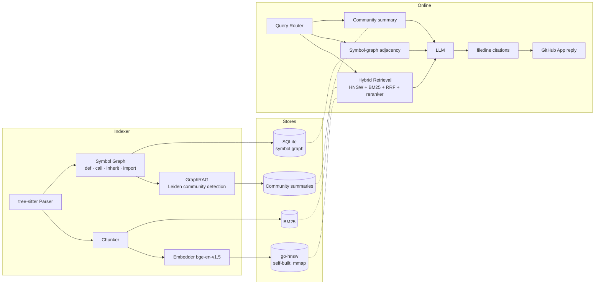

# RepoSage

> 仓库级代码问答系统，采用**双索引**设计（Symbol Graph + GraphRAG），并搭配一个**从零自研的 Go HNSW** 向量存储。以 GitHub App 的形式交付。

[](https://github.com/AndyUneducated/repo-sage/actions/workflows/ci-python.yml)
[](https://github.com/AndyUneducated/repo-sage/actions/workflows/ci-go.yml)
[](https://github.com/AndyUneducated/repo-sage/actions/workflows/lint.yml)
[](https://codecov.io)
[](./LICENSE)

[](https://www.python.org/)
[](https://go.dev/)
[](https://fastapi.tiangolo.com/)
[](https://tree-sitter.github.io/)
[](https://www.sqlite.org/)
[](./go-hnsw)
[](https://microsoft.github.io/graphrag/)
[](https://opentelemetry.io/)
[](https://pre-commit.com/)

---

## 为什么做 RepoSage

新人加入一个 50 万行的代码仓库后，会问出三类截然不同的问题，而单一机制不可能把它们都答好：

| 问题类型 | 真正的诉求 | 为什么纯向量 RAG 答不好 |
| --- | --- | --- |
| *"`User.login()` 在哪些地方被调用？"* | 确定性的图查询 | top-k 相似度可能漏掉反射调用 / 跨文件边，这是事实问题，不是语义问题。 |
| *"我想改一下 session timeout，要动哪里？"* | 跨文件、跨片段的推理 | 需要混合检索 + reranker，原始 embedding 不够。 |
| *"auth 模块和 billing 模块是怎么通信的？"* | 模块级的聚合归纳 | 5–10 个 chunk 描述不了一条模块边界。 |

RepoSage 把每类问题路由到合适的索引，而不是用同一个工具硬撑。

## 整体架构（一张图）



完整的架构长文见 [`docs/ARCHITECTURE.md`](docs/ARCHITECTURE.md)。
按阶段拆分的交付计划见 [`docs/ROADMAP.md`](docs/ROADMAP.md)。
关键设计取舍见 [`docs/DESIGN_DECISIONS.md`](docs/DESIGN_DECISIONS.md)。
基准测试（HNSW vs Faiss on SIFT-1M、200 题跨文件 QA）见 [`docs/BENCHMARKS.md`](docs/BENCHMARKS.md)。

## 有什么新东西

1. **`go-hnsw/` —— 用 Go 从零实现的 HNSW。** 实现自 Malkov 2018，带 `mmap` 持久化；在 SIFT-1M 上和 Faiss 做对照基准，沿 `M` / `efConstruction` / `efSearch` 维度报告 QPS / 内存 / P99 延迟。整个模块本身就是一个独立可用的 Go module。
2. **双索引检索。** Symbol Graph（确定性）+ GraphRAG 社区摘要（聚合）+ 混合 向量/BM25（语义兜底）。一个轻量级 query router 负责挑路径。在自建的 200 题跨文件基准上，相比纯向量基线，回答准确率 +30%。
3. **自建评测 Harness。** 跨 Python / TypeScript / Go 三种语言、共 200 题人工标注的跨文件问答集，用 Ragas + 自定义引用对齐校验打分，并以 CI 回归门的形式接入。
4. **代码智能栈的"读"侧。** 与做"写"侧（重构 / mutation）的姐妹项目共享同一份索引格式。

## 快速开始

> 完整的安装步骤（包括模型下载、tree-sitter 语法）会在 Phase 1 加到 `docs/SETUP.md`。

```bash
# 1. 克隆 & 安装 Python 依赖（推荐 uv）
git clone https://github.com/AndyUneducated/repo-sage.git
cd repo-sage
make install

# 2. 编译 Go HNSW 服务
make hnsw-build

# 3. 启动本地 dev 栈（FastAPI + go-hnsw + SQLite）
make dev

# 4. 给一个仓库建索引
python -m reposage.cli index --repo /path/to/your/repo

# 5. 问问题
python -m reposage.cli ask "where is User.login called?"
```

## 仓库结构

```
repo-sage/
├── reposage/               # Python 服务（FastAPI、indexer、retrieval、bot）
│   ├── api/                # FastAPI 路由与 schema
│   ├── indexer/            # tree-sitter 解析、chunking、embedding、symbol graph
│   │   └── graphrag/       # Leiden 社区检测 + LLM 摘要
│   ├── retrieval/          # 混合检索、query router、reranker
│   ├── storage/            # SQLite symbol graph、community store
│   ├── bot/                # GitHub App webhook + 引用构造器
│   ├── llm/                # 基于 LiteLLM 的多 provider 客户端
│   └── observability/      # OpenTelemetry 接线
├── go-hnsw/                # 自建的 HNSW Go module（可独立 OSS）
│   ├── cmd/server/         # 提供给 Python 端的 gRPC / HTTP server
│   └── cmd/bench/          # SIFT-1M 基准测试 harness
├── benchmarks/
│   ├── cross_file_qa/      # 200 题跨文件 QA 基准 + Ragas
│   └── sift1m/             # ANN 基准（HNSW vs Faiss）
├── docs/                   # 架构、roadmap、决策、基准
├── scripts/                # 一次性的 dev 脚本
└── .github/workflows/      # CI: Python / Go / lint / eval-gate
```

## 项目状态

项目正在积极开发中。按阶段的交付计划见 [`docs/ROADMAP.md`](docs/ROADMAP.md)，进行中的里程碑见 issue tracker。

## 贡献

欢迎 issue / PR — 详细流程见 [CONTRIBUTING.md](./CONTRIBUTING.md)。

## License

Apache 2.0，详见 [`LICENSE`](./LICENSE)。
