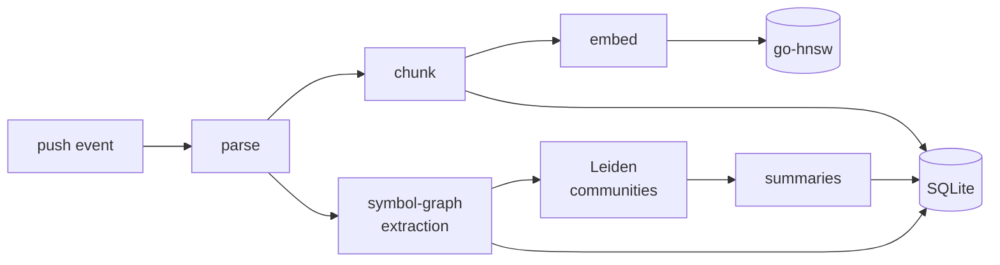
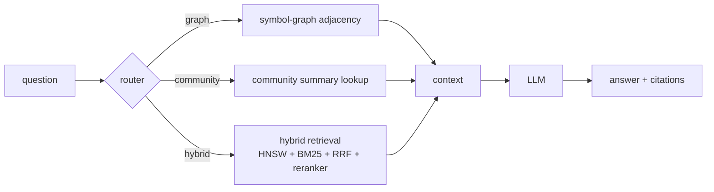
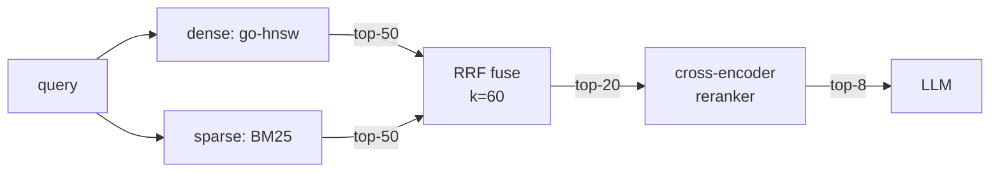
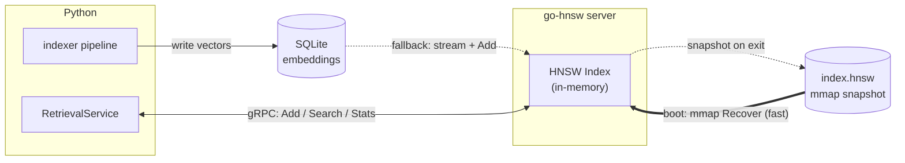

# Architecture

> A long-form companion to the picture in the project README.

## 1. Goals

RepoSage answers questions about a code repository the way an experienced teammate would: precise, cited, and aware of what spans multiple files. It is **read-only by design** — it never proposes mutations — so it can be deployed against unfamiliar third-party repositories without trust concerns.

## 2. Two halves: indexing and serving

The system is two largely independent pipelines that share a SQLite database and a vector store.

**Indexing (async, runs on a `push` event):**

**Serving (online, runs on a question):**

This split keeps the online path fast (no model downloads, no parsing) while the indexing path can run with whatever batch parallelism is appropriate for the host.

## 3. Indexing pipeline

### 3.1 Parsing
We use [tree-sitter](https://tree-sitter.github.io/) for incremental, error-resilient parsing. Grammars come from [`tree-sitter-language-pack`](https://github.com/Goldziher/tree-sitter-language-pack), which ships pre-compiled bindings for 100+ languages on a single ABI; this replaced the older `tree-sitter-languages` package (unmaintained since 2024). Phase 1 wires up Python end-to-end. TypeScript / JavaScript / Go grammars are loaded so non-Python files can be *parse-validated*, but their symbol-extraction queries are deferred — every such file lands in `file_meta` with `parse_status='unsupported'` so we always have an honest coverage number.

### 3.2 Chunking
Chunks follow AST boundaries (function / method / class / top-level statement) with a max-line cap and small overlap. AST-aware chunking gives noticeably better embeddings on code than fixed-window chunking because semantically coherent units stay together.

### 3.3 Embedding
Default model is `BAAI/bge-en-v1.5`. The embedder is a thin wrapper that lazily loads the model and supports CPU / MPS / CUDA. Embeddings are pushed to the in-house `go-hnsw` service over gRPC.

### 3.4 Symbol graph
For each parsed file we emit:

| Edge kind | Source | Destination | Use case |
| --- | --- | --- | --- |
| `def` | enclosing scope FQN | new symbol FQN | "list every method on `User`" |
| `call` | calling function | callee FQN | "where is `User.login` called?" |
| `inherit` | subclass FQN | superclass FQN | "what extends `BaseAuth`?" |
| `import` | importing module | imported module FQN | "who imports `payments.client`?" |

Stored as adjacency tables in SQLite with covering indexes on `(dst, kind)` and `(src, kind)`, which is the access pattern of every graph query the router will issue. The full schema lives in [`docs/INDEX_SCHEMA.md`](INDEX_SCHEMA.md).

Resolution is **two-pass and module-aware** (the `scip-python` v1 water-line):

1. *Pass 1* walks every file to collect definitions and Python `import` bindings into a global FQN table and a per-file local symbol table.
2. *Pass 2* re-walks edges and resolves `call` / `inherit` / `import` destinations against the local table, with two extra rules: `self.X` and `cls.X` look up methods on the enclosing class, and dotted call paths like `op.exists` are resolved against the import binding for the leftmost component (`op` -> `os.path`). Names we cannot resolve (e.g. calls on local-variable instances) are emitted as `<unresolved:original_name>` so the count is preserved for Phase 3 GraphRAG bucketing.

### 3.5 GraphRAG community detection
We run [Leiden](https://www.nature.com/articles/s41598-019-41695-z) on the symbol graph (treating call + inherit + import as edges, weighted), then ask the LLM to summarise each community into 5–8 sentences. Two design choices worth flagging:

* **Communities form on call topology, not file directories.** Two files in the same folder can belong to different communities, and two distant files that exchange many calls can land together. This is the whole reason we use Leiden instead of `path.split("/")`.
* **Summaries are generated by a smaller, cheaper model** (e.g. GPT-4o-mini), then consumed by the answering model. This decouples cost from quality.

## 4. Serving pipeline

### 4.1 Query router
A small, fast LLM (or a regex fast-path when the question contains an obvious FQN) classifies the question into `graph`, `community`, or `hybrid`. The router emits a confidence score; below a threshold we run the hybrid path as a safety net and let the answering LLM choose.

### 4.2 Deterministic graph queries
For `graph`-routed questions we never call the embedder. We resolve the named symbol against `nodes.fqn` and walk the SQLite adjacency tables. The answer is a fact — not a vector approximation — and the LLM's only job is presentation.

### 4.3 Hybrid retrieval
For semantic questions we run two retrievers in parallel:

* **Dense**: `go-hnsw` with `M=16, efConstruction=200, efSearch=64` (Malkov & Yashunin 2018 defaults).
* **Sparse**: BM25 over code tokens (rank-bm25 in Phase 2; Tantivy in Phase 6).

Both branches return their top-50 candidates, which are fused with [Reciprocal Rank Fusion](https://plg.uwaterloo.ca/~gvcormac/cormacksigir09-rrf.pdf) (`k=60`, the original paper's default). RRF is score-scale invariant — we do not need to normalise BM25 scores against cosine similarity. The fused top-20 then goes through `bge-reranker-v2-m3` for cross-encoder rescoring; the resulting top-8 is handed to the LLM.

The funnel narrows at each stage — `50 + 50 → 20 → 8` — so the expensive cross-encoder only ever scores 20 candidates, not the whole corpus.

The Phase 2 plumbing is mediated by four `Protocol`s
(`SparseRetriever`, `DenseRetriever`, `Reranker`, `LLMClient`) in
[`reposage/retrieval/protocols.py`](../reposage/retrieval/protocols.py).
This is the swap point for Phase 4 mmap HNSW, Phase 6 Tantivy, and
Phase 9 sharding — no caller of `RetrievalService` changes.

### 4.4 Citations and grounding
Every chunk we hand to the LLM carries `(repo, path, start_line, end_line)`. The system prompt forbids citing anything that is not present in the context. A post-generation `verify_grounding` check (see [`reposage/llm/grounding.py`](../reposage/llm/grounding.py)) parses each `[path:lo-hi]` reference and confirms it is fully contained inside one of the retrieved chunks. If any citation is fabricated we regenerate the answer once with the offending references explicitly forbidden (DD-013); if the second attempt also fails, we strip the bad citations and return the cleaned answer marked `grounded=False`. The two-strikes ceiling is a deliberate cost guard.

### 4.5 The `/ask` contract
The HTTP and CLI both call into a single `RetrievalService.answer(...)` so they cannot drift. The response carries `route`, `latency_ms`, `grounded`, and a `graph_context` slot reserved for Phase 3 GraphRAG community summaries — Phase 2 always sets it to `null`. See [`docs/plans/phase-2-retrieval.md`](plans/phase-2-retrieval.md) for the full shape.

## 5. The Go HNSW module

`go-hnsw/` is a separate Go module so it can be consumed independently.

* **Algorithm**: from-scratch implementation of Malkov & Yashunin (2018)
  Algorithms 1 (insert) + 4 (heuristic neighbour selection, Phase 4) + 5
  (search), with a min/max-heap candidate set in `internal/heap/`. Insert is
  single-writer; Phase 5 swaps in per-layer `RWMutex` for concurrent reads.
* **Transport**: gRPC service defined in [`proto/hnsw.proto`](../proto/hnsw.proto).
  The surface is `Add`, `BulkLoad`, `Search`, and `Stats`.
  `Stats` exposes `(size, dim, model, M, efConstruction, efSearch)` so
  the Python client can fail fast on mismatch.
* **Persistence (Phase 4)**: `Index.Snapshot(path)` writes an mmap-friendly
  image atomically (`tmp + fsync + rename`) — a fixed header, columnar ids, a
  CSR adjacency (layer-0 contiguous for search cache-locality), and a 64-byte
  aligned float32 vector arena at the tail. `hnsw.Recover(path)` mmaps the file
  and aliases the big arrays zero-copy, so reloading a 1M × 128 index is `O(parse
  small arrays)` rather than an O(n) re-insert. See
  [`docs/plans/phase-4-hnsw-v2.md`](plans/phase-4-hnsw-v2.md) for the byte layout.
* **Cold start**: with a snapshot configured the server `Recover`s it on boot
  (the fast path); otherwise it falls back to streaming `embeddings WHERE model
  = ?` out of SQLite and `Add`-ing every row, then writes an initial snapshot.
* **Bench**: `cmd/bench` runs the SIFT-1M sweep (or a synthetic stand-in),
  writing a CSV row per `(M, efC, efSearch)` with recall@10 / QPS / P50 / P99 /
  build / RSS / recover-P50. [`benchmarks/sift1m/run_sweep.py`](../benchmarks/sift1m/run_sweep.py)
  drives the grid, overlays a Faiss baseline, and plots the Pareto curve into
  `docs/BENCHMARKS.md`.

## 6. Observability

OpenTelemetry spans wrap the four interesting boundaries: pipeline stages, router decisions, each retrieval branch, and LLM completions. The schema is intentionally compatible with the sister project's evaluation harness so that production traces double as offline eval inputs.

## 7. Non-goals

* Code generation / refactoring (the sister project covers that).
* Cross-repo search.
* Real-time indexing under 100 ms (we target seconds-to-minutes per push event).
