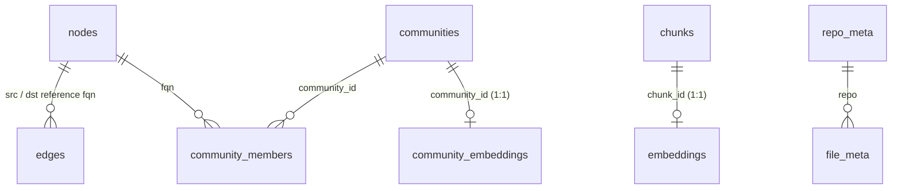

# Index schema

Single source of truth for the SQLite tables produced by `reposage index`.
The index is one file (default `data/reposage.db`) shared by the symbol
graph store and the chunk store; later phases will add embeddings, BM25,
and community summaries to the same file.

`PRAGMA user_version` carries the schema version. Phase 1 stamps `1`.
Phase 2+ migrations will bump this and ship idempotent `ALTER TABLE`
scripts gated on the version number.

## How the tables relate



* **Phase 1** writes `nodes`, `edges`, `chunks`, `repo_meta`, `file_meta`.
* **Phase 2** adds `embeddings` (one vector per chunk).
* **Phase 3** adds the three `communities*` tables.
* Everything lives in **one** `data/reposage.db` file, so a single `cp` is a full backup.

## Tables

### `nodes` — symbol definitions

```sql
CREATE TABLE nodes(
  fqn        TEXT PRIMARY KEY,         -- e.g. 'pkg.mod.Class.method'
  kind       TEXT NOT NULL,            -- module|class|function|method|variable
  language   TEXT NOT NULL,            -- python|typescript|javascript|go
  repo       TEXT NOT NULL,            -- logical repo name
  path       TEXT NOT NULL,            -- repo-relative file path
  start_line INTEGER NOT NULL,         -- 1-based, inclusive
  end_line   INTEGER NOT NULL          -- 1-based, inclusive
);
```

`fqn` is globally unique within an index. Phase 1 only emits Python nodes;
TypeScript / JavaScript / Go are recorded in `file_meta` only.

### `edges` — symbol-to-symbol relationships

```sql
CREATE TABLE edges(
  src       TEXT NOT NULL,             -- enclosing FQN (a `nodes.fqn` or '<anonymous>')
  dst       TEXT NOT NULL,             -- target FQN, possibly '<unresolved:NAME>'
  kind      TEXT NOT NULL,             -- def|call|inherit|import
  src_path  TEXT NOT NULL,             -- repo-relative path of the call site
  src_line  INTEGER NOT NULL,
  weight    INTEGER NOT NULL DEFAULT 1,-- bumped on duplicate inserts; Phase 3 Leiden weighting
  PRIMARY KEY (src, dst, kind, src_line)
);
CREATE INDEX edges_dst_kind ON edges(dst, kind);  -- reverse adjacency: callers_of()
CREATE INDEX edges_src_kind ON edges(src, kind);  -- forward adjacency: callees_of()
```

Edge kinds:

| `kind`    | Source                         | Destination                               | Use case                              |
| --------- | ------------------------------ | ----------------------------------------- | ------------------------------------- |
| `def`     | enclosing-scope FQN            | newly-defined FQN                         | "list every method on `User`"         |
| `call`    | calling function FQN           | callee FQN (or `<unresolved:NAME>`)       | "where is `User.login` called?"       |
| `inherit` | subclass FQN                   | superclass FQN (or unresolved)            | "what extends `Payment`?"             |
| `import`  | importing module FQN           | imported module path                      | "who imports `payments`?"             |

Unresolved destinations look like `<unresolved:u.login>` and are kept on
purpose: GraphRAG community detection in Phase 3 buckets them by source
module, and the count is a useful "type-inference deficit" signal.

### `chunks` — embeddings-ready code spans

```sql
CREATE TABLE chunks(
  chunk_id      TEXT PRIMARY KEY,      -- sha1(repo|path|start_line|end_line|text)
  repo          TEXT NOT NULL,
  path          TEXT NOT NULL,
  language      TEXT NOT NULL,
  start_line    INTEGER NOT NULL,
  end_line      INTEGER NOT NULL,
  symbol        TEXT,                  -- bare name of the enclosing def
  parent_symbol TEXT,                  -- enclosing class for methods
  text          TEXT NOT NULL,
  file_sha      TEXT NOT NULL,         -- sha1 of the whole source file
  created_at    INTEGER NOT NULL       -- unix seconds
);
CREATE INDEX chunks_repo_path ON chunks(repo, path);
CREATE INDEX chunks_symbol    ON chunks(symbol);
```

Phase 2 adds a separate `embeddings` table keyed on `chunks.chunk_id` —
no migration to `chunks` itself.

### `embeddings` — Phase 2 dense vectors

```sql
CREATE TABLE embeddings(
  chunk_id   TEXT PRIMARY KEY REFERENCES chunks(chunk_id) ON DELETE CASCADE,
  model      TEXT NOT NULL,         -- e.g. 'BAAI/bge-en-v1.5'
  dim        INTEGER NOT NULL,      -- usually 768
  vector     BLOB NOT NULL,         -- little-endian float32 of length dim*4
  created_at INTEGER NOT NULL
);
CREATE INDEX embeddings_model ON embeddings(model);
```

Vectors are written in the same SQLite transaction as their owning
chunk (see [`reposage/indexer/pipeline.py`](../reposage/indexer/pipeline.py)),
so a crash mid-index never produces orphan or split state. `hnsw-server`
cold-starts by streaming this table and inserting each row into the
HNSW graph; loads of 10k 768-d vectors take <100 ms locally.

Two embedding sets can coexist for the same `chunk_id` only by writing
different `model` rows in different generations (Phase 7 model swap).
Phase 2 always writes a single model per index. The `dim` column is
explicit so a stale `embed_dim` setting fails loudly at startup rather
than silently writing truncated vectors.

### `communities` / `community_members` / `community_embeddings` — Phase 3 GraphRAG

Three Phase 3 tables hold the Leiden partition and its LLM-generated
summaries. They sit alongside `nodes` / `edges` / `chunks` in the same
database; FK relationships are scoped within the GraphRAG tables so
the rest of the index never has to know they exist (DD-015).

```sql
CREATE TABLE communities(
  community_id   INTEGER PRIMARY KEY AUTOINCREMENT,
  repo           TEXT NOT NULL,
  level          INTEGER NOT NULL,          -- 0 = leaf (finest), 1+ = rolled-up parent
  parent_id      INTEGER REFERENCES communities(community_id) ON DELETE SET NULL,
  member_count   INTEGER NOT NULL,
  subtree_size   INTEGER NOT NULL,          -- members reachable through descendants
  content_sha    TEXT NOT NULL,             -- sha256(sorted FQNs + file_shas); summary cache key
  title          TEXT,                      -- 3-6 word noun-phrase title, e.g. 'Authentication'
  summary        TEXT,                      -- 2-3 sentences of grounded prose
  summary_model  TEXT,                      -- writes the model id, e.g. 'ollama_chat/qwen2.5-coder:3b'
  detected_at    INTEGER NOT NULL,          -- unix seconds, Leiden finish time
  summarized_at  INTEGER                    -- NULL until the summariser writes a non-placeholder summary
);
CREATE INDEX communities_repo_level  ON communities(repo, level);
CREATE INDEX communities_parent      ON communities(parent_id);
CREATE INDEX communities_content_sha ON communities(repo, content_sha);

CREATE TABLE community_members(
  community_id INTEGER NOT NULL REFERENCES communities(community_id) ON DELETE CASCADE,
  fqn          TEXT NOT NULL,
  is_seed      INTEGER NOT NULL DEFAULT 0,  -- 1 = representative member used in the Map prompt
  PRIMARY KEY (community_id, fqn)
);
CREATE INDEX community_members_fqn ON community_members(fqn);

CREATE TABLE community_embeddings(
  community_id INTEGER PRIMARY KEY REFERENCES communities(community_id) ON DELETE CASCADE,
  model        TEXT NOT NULL,               -- same convention as embeddings.model (DD-011)
  dim          INTEGER NOT NULL,
  vector       BLOB NOT NULL,               -- little-endian float32 of length dim*4
  created_at   INTEGER NOT NULL
);
CREATE INDEX community_embeddings_model ON community_embeddings(model);
```

Invariants:

* A row in `community_embeddings` only exists when `communities.summarized_at IS NOT NULL`
  on the same `community_id` — enforced in `CommunityStore.upsert_embedding`.
* `content_sha` is the **only** stable identifier across re-indexes;
  `community_id` is an autoincrement and will drift. Clients should
  cite communities by `title`, never by id (DD-016).
* `parent_id` can be `NULL` after re-indexing because the rebuild
  uses `ON DELETE SET NULL`; the post-build pass re-stitches parent
  references in a second transaction.

### `repo_meta` and `file_meta` — incremental indexing bookkeeping

```sql
CREATE TABLE repo_meta(
  repo             TEXT PRIMARY KEY,
  head_sha         TEXT,
  default_branch   TEXT,
  last_indexed_at  INTEGER NOT NULL
);

CREATE TABLE file_meta(
  repo             TEXT NOT NULL,
  path             TEXT NOT NULL,
  file_sha         TEXT NOT NULL,
  mtime            INTEGER NOT NULL,
  parse_status     TEXT NOT NULL,      -- ok|cached|parse_error|unsupported
  last_indexed_at  INTEGER NOT NULL,
  PRIMARY KEY (repo, path)
);
```

The pipeline writes `file_meta` for every Python file (`ok` or
`parse_error`), every recognised non-Python source file (`unsupported`),
and every previously-indexed file whose `file_sha` is unchanged
(`cached`). This makes `parse_status` the single source of truth for
"what does the index cover for this repo?".

Phase 7 incremental indexing reads `file_meta` to skip unchanged files.

## Reverse adjacency hot path

The graph route hits one query:

```sql
SELECT src, dst, kind, src_path, src_line
FROM edges WHERE dst = ? AND kind = 'call'
ORDER BY src_path, src_line;
```

`edges_dst_kind` makes this an O(matches) lookup — no full scan even at
millions of edges, and no need for a graph database.

## Inserting and updating

All writes go through Python helpers in
[`reposage/storage/sqlite_graph.py`](../reposage/storage/sqlite_graph.py)
and [`reposage/storage/chunk_store.py`](../reposage/storage/chunk_store.py).
Use the helpers — direct SQL is fine for diagnostics but may become a
maintenance hazard once Phase 7 adds delta updates.
