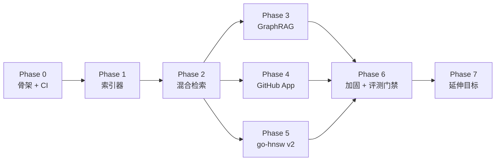

# 路线图

项目按 **七个阶段** 组织。每个阶段都有明确的 *交付物*、可录制的 *演示*，以及能用一句话写清的 *退出指标*。各阶段大致按一个专注日历周来规划；较大的系统阶段（HNSW、GraphRAG）会占两周。

> **运作原则**：每个阶段都以可演示的成果和 CI 信号收尾。我们从不把功能攒到一次巨型集成里再发布。

| 阶段 | 主题 | 周期 | 退出指标 |
| --- | --- | --- | --- |
| 0 | 骨架与 CI | 0.5 周 | `main` 上仓库全绿、空桩就绪；CI 徽章可用；本地一行命令即可拉起。 |
| 1 | 索引器 v1：tree-sitter + 符号图 | 1.0 周 | `reposage index <repo>` 写入 SQLite；对 10 kLOC 夹具可回答「X 在哪里被调用」。 |
| 2 | 检索 v1：端到端混合 RAG | 1.5 周 | `/ask` 返回带引用的答案；HNSW + BM25 + RRF + 重排序器已接通；小仓库上 P50 延迟 < 1.5 s。 |
| 3 | GraphRAG（Leiden + 摘要） | 1.5 周 | 可回答模块级问题；200 题基准中前 50 题上线；相对混合基线有 +X% 提升。 |
| 4 | GitHub App | 1.0 周 | 在公开 OSS 仓库上线；@ 提及 → 30 秒内带引用的 PR 评论。 |
| 5 | go-hnsw v2：持久化 + 基准测试 | 1.5 周 | mmap 快照；SIFT-1M Pareto 曲线写入 `docs/BENCHMARKS.md`，与 Faiss 对比。 |
| 6 | 加固：评测门禁、OTel、性能 | 1.0 周 | Eval-gate 工作流拦截回归；完整 200 题基准；OTel 链路可观测。 |
| 7 | 延伸：Tantivy / TS+Go 语法 | 灵活 | 替换 BM25；在真实多语言仓库上做多语言索引；博客初稿。 |

各阶段的依赖关系（哪些必须先做、哪些可以并行）：

> Phase 3 / 4 / 5 都只依赖 Phase 2，理论上可并行推进；Phase 6 把三者收口。

---

## 阶段 0 — 骨架与 CI

**为何先做**：让仓库长期保持全绿，后续每个阶段都是向前推进，而不是救火恢复。

* 项目布局（`reposage/`、`go-hnsw/`、`benchmarks/`、`docs/`）。
* `pyproject.toml`：ruff + mypy strict + pytest。
* Go HNSW 模块的 `go.mod`；CI 中强制 `gofmt -l`。
* GitHub Actions 工作流：`ci-python`、`ci-go`、`lint`、`eval-gate`（无标签时跳过）。
* README 含徽章；LICENSE（Apache 2.0）；`.env.example`。
* 一个冒烟测试（`/healthz`）、一个 Go 单元测试（`Cosine`）。

**演示**：`git clone && make install-dev && make test` 全绿。
**退出指标**：四个 CI 工作流全绿；覆盖率发布已接通（为 0 亦可）。

---

## 阶段 1 — 索引器 v1：tree-sitter + 符号图

**目标**：把已检出的仓库变成可查询的符号图行。

* tree-sitter 解析器封装：先做 Python，再做 TypeScript 和 Go。
* 基于 AST 的分块器：最大行数 + 重叠。
* 符号图抽取（`def`、`call`、`inherit`、`import`）。
* SQLite schema + 邻接表存储实现。
* `reposage index` CLI；在夹具仓库上 `reposage ask --route graph`。

**演示**：索引 `pallets/flask`（或本地夹具），回答「`Flask.route` 在哪里被调用？」并列出 `file:line` 链接。
**退出指标**：对夹具上 30 道手工评分的图查询，精确率 ≥ 90%；50 kLOC 索引一轮 < 60 s。

---

## 阶段 2 — 检索 v1：端到端混合 RAG

**目标**：可用的 `/ask` 端点，带引用。

* 嵌入模型（`bge-en-v1.5`，懒加载）。
* `go-hnsw` 插入与检索 v1（内存、单线程，论文 Algorithm 1 / 5）。`cmd/server` 中的 gRPC 服务。
* 使用 rank-bm25 的 BM25 索引。
* 带 RRF 的 `HybridRetriever`；交叉编码器重排序器。
* `QueryRouter` 启发式 + LLM 回退。
* LiteLLM 客户端；提示模板（`reposage/llm/prompts.py`）。
* 引用 grounding 校验 + 丢弃并重生成回退。

**演示**：对某 OSS 仓库问「session timeout 如何配置？」；答案引用正确的两个文件。
**退出指标**：50 kLOC 仓库上端到端 P50 延迟 < 1.5 s；20 道题达到「我会把这个答案发给同事」的手动质量线。

---

## 阶段 3 — GraphRAG：Leiden + 社区摘要

**目标**：回答混合检索无法覆盖的模块级问题。

* 由 igraph + leidenalg 驱动的 `CommunityDetector`；层次（多级）划分。
* 用更便宜 LLM 的 `CommunitySummarizer`；结果缓存在 SQLite。
* `QueryRouter` 中的 `community` 路由。
* 跨文件基准的前 50 题，含参考答案。
* 跑基准：40 道模块聚合题上 `community` 路由 vs `hybrid` 路由。

**演示**：在真实 OSS 仓库问「auth 与 billing 模块如何交互？」；答案引用多个模块并含社区摘要。
**退出指标**：在 40 道模块聚合题上，Ragas `answer_correctness` 相对仅 hybrid 有 ≥ 25% 绝对提升。

---

## 阶段 4 — GitHub App 部署

**目标**：真实用户（先是我们，再是任何人）能在公开仓库安装 RepoSage。

* GitHub App 注册；私钥与 webhook secret 放在 `.env`。
* HMAC 校验 + JWT 签发 + installation token 缓存。
* `@reposage` 命令解析；评论线程生命周期。
* Webhook 处理器转发到现有 `/ask` 流程。
* Markdown 引用渲染，含永久链接（`#L42-L57`）。
* 由 `push` 事件触发的长时间索引任务。

**演示**：在公开 OSS 仓库安装，开 PR，评论 `@reposage where does the request enter routing?`，30 秒内收到带引用的回复。
**退出指标**：演示仓库往返 P95 < 30 s；签名校验通过；限流处理已测。

---

## 阶段 5 — go-hnsw v2：持久化 + SIFT-1M 基准

**目标**：把 HNSW 模块从「内存能用」做成可严肃对标、可基准测试的产物。

* mmap 快照/恢复，采用 `docs/ARCHITECTURE.md` 中的 CSR 邻接格式。
* 启发式邻居选择（Algorithm 4）与正确的层级乘子采样。
* 原子快照写入（`tmp + rename`）。
* `cmd/bench` 中的 SIFT-1M 基准：构建 / recall@10 / QPS / P50 / P99 / RSS。
* `benchmarks/sift1m/run_sweep.py` 中的扫描驱动。
* Recall 对 QPS 的 Pareto 图提交到 `docs/BENCHMARKS.md`。
* 在同一硬件上跑 Faiss 基线。

**演示**：打开 `docs/BENCHMARKS.md`；图上有两条曲线（go-hnsw、Faiss-HNSWFlat）及对差距的如实说明。
**退出指标**：Pareto 曲线已发布；1M × 128-d 从快照重载 P50 < 200 ms。

---

## 阶段 6 — 加固：评测门禁、OTel、性能

**目标**：每次变更在合并前都有度量。

* `benchmarks/cross_file_qa/questions.jsonl` 中完整 200 题（Python + TS + Go）。
* 带 `run-eval` 标签的 PR 上，`eval-gate` GitHub Action 成为必过检查。
* 索引与服务端的 OTel 链路导出到本地 Tempo / Jaeger；`docs/` 中有注释好的仪表盘说明。
* 性能 pass：剖析热路径、批量 HNSW upsert、并行社区摘要。
* `go-hnsw` 并发：每层 RWMutex、无锁读路径。

**演示**：开一个拉低检索 recall 的 PR；eval-gate 将其拦截。
**退出指标**：eval-gate 运行 < 10 分钟；4 核笔记本上 P99 索引吞吐 ≥ 1k chunks/s。

---

## 阶段 7 — 延伸目标（顺序任意）

以下为可单独交付的改进；按当前痛点选收益最大的一项即可。

* **Tantivy BM25**：用小型 Rust → Python 桥接把 rank-bm25 换成 Tantivy；预期索引吞吐约 10×。
* **更多语言**：增加 Java、Rust 语法；验证符号图查询仍可用。
* **增量重索引**：`push` 时只重解析变更文件；未动文件复用符号图行。
* **缓存层**：按 `(repo_sha, question)` 缓存每题；重复问题 < 100 ms 返回。
* **公开博客**：「用 Go 从零写 HNSW 我们学到了什么」，附 SIFT-1M 数据。

---

## 进度跟踪

* 每个阶段在 issue 跟踪器里对应一个里程碑（`Phase 0` … `Phase 7`）。
* 阶段退出指标写在本文件 *以及* 对应里程碑描述中；与实际情况不符时两处同步更新。
* `docs/BENCHMARKS.md` 是 README 中一切对外数字的唯一来源。
