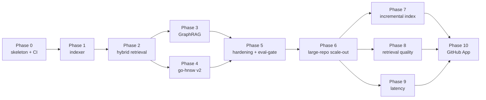
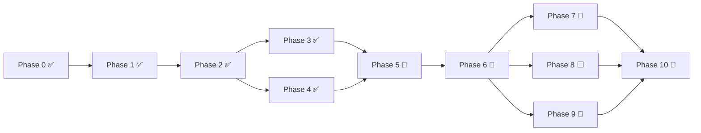

# Roadmap

The project is organised into **eleven phases (Phase 0–10)**. Each phase has concrete *deliverables*, a recordable *demo*, and an *exit criterion* that fits in one sentence. Phases are sized around one focused calendar week; larger systems work (HNSW, GraphRAG, large-repo scale-out) takes two.

> **Operating principle**: every phase ends with a demonstrable result and a CI signal. We never stockpile features into one giant integration.

| Phase | Theme | Duration | Exit criterion |
| --- | --- | --- | --- |
| 0 | Skeleton and CI | 0.5 wk | `main` fully green, stubs in place; CI badges live; one local command brings the stack up. |
| 1 | Indexer v1: tree-sitter + symbol graph | 1.0 wk | `reposage index <repo>` writes SQLite; on a 10 kLOC fixture, answer “where is X called”. |
| 2 | Retrieval v1: end-to-end hybrid RAG | 1.5 wk | `/ask` returns cited answers; HNSW + BM25 + RRF + reranker wired; P50 < 1.5 s on a small repo. |
| 3 | GraphRAG (Leiden + summaries) | 1.5 wk | Module-level questions work; first 50 of the 200-question bench online; +X% vs hybrid baseline. |
| 4 | go-hnsw v2: persistence + benchmarks | 1.5 wk | mmap snapshots; SIFT-1M Pareto curve in `docs/BENCHMARKS.md`, vs Faiss. |
| 5 | Hardening: eval-gate, OTel, performance | 1.0 wk | Eval-gate thresholds block regressions; OTel traces live; batch upsert + concurrent reads landed (full 200 questions moved to Phase 8). |
| 6 | Large-repo scale-out | 1.5 wk | Index a 500 kLOC / 1M+ chunk repo without OOM; indexing throughput ≥ 1k chunks/s; server memory bounded. |
| 7 | Incremental reindex | 1.0 wk | Re-parse only changed files; at 5% churn, ≥ 10× faster than a full rebuild. |
| 8 | Retrieval quality | 1.5 wk | Full 200-question bench; end-to-end accuracy +X% vs current baseline; citation alignment up. |
| 9 | Latency and throughput | 1.0 wk | Cache hits on repeat questions < 100 ms; HNSW QPS closes the gap toward Faiss; serving P95 down. |
| 10 | GitHub App | 1.0 wk | Public launch on a hardened, scaled, tuned engine; @-mention → cited PR comment within 30 s. |

Dependencies (what must precede what, and what can run in parallel):

> Phase 3 and 4 both depend only on Phase 2, so they can proceed in parallel; Phase 5 closes and hardens both. The former “stretch goals” then split into four focused phases: Phase 6 first makes the engine swallow large repos (scale-out); Phase 7 / 8 / 9 then attack incremental indexing, retrieval quality, and latency — all depend on Phase 6 and are largely parallel with each other. Phase 10 deploys the GitHub App only after the engine is hardened, scaled, and tuned (`push` events drive Phase 7 incremental reindex). Extra languages (Java / Rust, …) are a **low-priority optional add-on** folded into Phase 8, not a standalone phase.

---

## Phase 0 — Skeleton and CI

**Why first**: keep the repo green so later phases move forward instead of firefighting.

* Layout (`reposage/`, `go-hnsw/`, `benchmarks/`, `docs/`).
* `pyproject.toml`: ruff + mypy strict + pytest.
* Go HNSW module `go.mod`; CI enforces `gofmt -l`.
* GitHub Actions: `ci-python`, `ci-go`, `lint`, `eval-gate` (skipped without the label).
* README badges; LICENSE (Apache 2.0); `.env.example`.
* One smoke test (`/healthz`), one Go unit test (`Cosine`).

**Demo**: `git clone && make install-dev && make test` all green.
**Exit**: four CI workflows green; coverage publishing wired (zero coverage is fine).

---

## Phase 1 — Indexer v1: tree-sitter + symbol graph

**Goal**: turn a checked-out repo into queryable symbol-graph rows.

* tree-sitter parser wrapper: Python first, then TypeScript and Go.
* AST-based chunker: max lines + overlap.
* Symbol-graph extraction (`def`, `call`, `inherit`, `import`).
* SQLite schema + adjacency-list store.
* `reposage index` CLI; `reposage ask --route graph` on a fixture repo.

**Demo**: index `pallets/flask` (or a local fixture), answer “where is `Flask.route` called?” with `file:line` links.
**Exit**: ≥ 90% precision on 30 hand-scored graph queries on the fixture; one 50 kLOC index pass < 60 s.

---

## Phase 2 — Retrieval v1: end-to-end hybrid RAG

**Goal**: a usable `/ask` endpoint with citations.

* Embeddings (`bge-en-v1.5`, lazy-loaded).
* `go-hnsw` insert/search v1 (in-memory, single-threaded, paper Algorithms 1 / 5). gRPC service in `cmd/server`.
* BM25 index via rank-bm25.
* `HybridRetriever` with RRF; cross-encoder reranker.
* `QueryRouter` heuristics + LLM fallback.
* LiteLLM client; prompt templates (`reposage/llm/prompts.py`).
* Citation grounding check + drop-and-regenerate fallback.

**Demo**: on an OSS repo, ask “how is session timeout configured?”; the answer cites the two correct files.
**Exit**: end-to-end P50 < 1.5 s on a 50 kLOC repo; 20 questions meet the manual bar “I would send this answer to a colleague”.

---

## Phase 3 — GraphRAG: Leiden + community summaries

**Goal**: answer module-level questions hybrid retrieval cannot cover.

* `CommunityDetector` driven by igraph + leidenalg; hierarchical (multi-level) partitions.
* `CommunitySummarizer` on a cheaper LLM; results cached in SQLite.
* `community` route in `QueryRouter`.
* First 50 questions of the cross-file bench, with reference answers.
* Bench: `community` vs `hybrid` on 40 module-aggregation questions.

**Demo**: on a real OSS repo, ask “how do auth and billing interact?”; the answer cites multiple modules and includes community summaries.
**Exit**: ≥ 25% absolute lift in Ragas `answer_correctness` vs hybrid-only on those 40 questions.

---

## Phase 4 — go-hnsw v2: persistence + SIFT-1M benchmarks

**Status: ✅ complete** (2026-06-29, commit `28bc663`)

**Goal**: take the HNSW module from “works in memory” to something that can be seriously compared and benchmarked.

* mmap snapshot/recover using the CSR adjacency format in `docs/ARCHITECTURE.md`.
* Heuristic neighbour selection (Algorithm 4) and correct level-multiplier sampling.
* Atomic snapshot writes (`tmp + rename`).
* SIFT-1M bench in `cmd/bench`: build / recall@10 / QPS / P50 / P99 / RSS.
* Sweep driver in `benchmarks/sift1m/run_sweep.py`.
* Recall-vs-QPS Pareto plot committed to `docs/BENCHMARKS.md`.
* Faiss baseline on the same hardware.

**Demo**: open `docs/BENCHMARKS.md`; two curves (go-hnsw, Faiss-HNSWFlat) and an honest write-up of the gap.
**Exit**: Pareto curve published; 1M × 128-d snapshot reload P50 < 200 ms.

| Exit criterion | Target | Measured |
| --- | --- | --- |
| Pareto curve (go-hnsw + Faiss) | published | ✅ [`docs/BENCHMARKS.md`](BENCHMARKS.md) §1 |
| 1M×128 snapshot reload P50 | < 200 ms | ✅ **11.7–13.0 ms** |
| mmap persistence + Algorithm 4 | landed | ✅ `persist.go` / `insert.go` |
| unit tests + race | green | ✅ `make hnsw-test` |

---

## Phase 5 — Hardening: eval-gate, OTel, performance

**Status: 🚧 in progress** (OTel spans, go-hnsw concurrent-read path + batch upsert landed; full 200-question bench and required eval-gate check still open)
**Technical plan**: [`docs/plans/phase-5-hardening.md`](plans/phase-5-hardening.md).

**Goal**: every change has a metric before merge.

* ⬜ Full 200 questions (Python + TS + Go) in `benchmarks/cross_file_qa/questions.jsonl`. *(data task, deferred)*
* ⬜ `eval-gate` GitHub Action as a required check on PRs labelled `run-eval`. *(repo branch-protection setting)*
* 🚧 Indexer and server OTel traces: spans cover index / router / three retrieval routes / LLM completion; export via `REPOSAGE_OTEL_ENABLED` to OTLP (Tempo / Jaeger). Dashboard notes still open.
* 🚧 Performance pass: ✅ batch HNSW upsert (`Index.AddBatch` + gRPC `BulkLoad`), ✅ parallel community summaries (`summarizer.summarize_all`); hot-path profiling still open.
* 🚧 `go-hnsw` concurrency: ✅ gRPC server `RWMutex` concurrent-read path (reads no longer serialise); per-layer shard locks (per-layer RWMutex) left as a later optimisation.

**Demo**: open a PR that tanks retrieval recall; eval-gate blocks it.
**Exit**: eval-gate runs < 10 minutes; P99 indexing throughput ≥ 1k chunks/s on a 4-core laptop.

---

## Phase 6 — Large-repo scale-out

**Technical plan**: [`docs/plans/phase-6-scale-out.md`](plans/phase-6-scale-out.md).

**Goal**: take indexing and serving from “works on small repos” to swallowing a real 500 kLOC / 1M+ chunk repo with bounded memory and target throughput. This is the foundation for the next three phases (incremental / quality / speed).

* **Parallel indexing pipeline**: parse / chunk / embed in staged parallel (process or thread pool); batched SQLite transactions, no per-row commits.
* **Bounded memory**: embed large repos in batches; vectors enter via Phase 5 `bulk_load` / `AddBatch` — never load the full vector set at once.
* **HNSW at scale**: batch graph build (`AddBatch`); server prefers Phase 4 mmap snapshot reload; keep watching RSS.
* **BM25 at scale → Tantivy**: replace rank-bm25 (pure in-memory, O(N) rebuild every time) with **Tantivy** (Rust inverted index, disk-resident, incremental-friendly). Expected ~10× indexing throughput and a large memory drop. Also paves the way for Phase 7 (incremental) and Phase 9 (speed).
* **Large-repo fixture + load test**: full-index a real large OSS repo (e.g. a Django / CPython subset); measure peak RSS / throughput / per-stage time (Phase 5 OTel spans).

**Demo**: index a ≥ 500 kLOC repo with bounded RSS, no OOM, throughput on target, Q&A still works.
**Exit**: peak RSS bounded on a 500 kLOC index (< target threshold); indexing throughput ≥ 1k chunks/s (4 cores); server snapshot reload < 200 ms (reuse Phase 4).

---

## Phase 7 — Incremental reindex

**Technical plan**: [`docs/plans/phase-7-incremental.md`](plans/phase-7-incremental.md).

**Goal**: re-index only changed files, so repeating a large-repo index drops from “minutes full rebuild” to “seconds incremental”.

* **Change detection**: pick added / modified / deleted files via `file_sha` / `mtime` (already written in Phase 1).
* **Incremental symbol graph**: re-parse only changed files; reuse `nodes` / `edges` / `chunks` / `embeddings` for untouched files; locally re-resolve affected cross-file references.
* **Incremental HNSW upsert**: changed chunks via `Add` (replace semantics already supported); evict deleted-chunk vectors (tombstone, or rebuild past a threshold).
* **Incremental communities**: `content_sha` cache already skips unchanged community LLM summaries (Phase 3); re-run Leiden only when graph structure changes materially.
* **`push` wiring**: feed the changed-files list from the Phase 10 webhook straight into the incrementer.

**Demo**: change one file in a large repo, re-index in seconds, and only the affected symbols / vectors / communities update.
**Exit**: at 5% churn, incremental ≥ 10× faster than full rebuild; post-incremental retrieval **matches** a full rebuild (equivalence tests).

---

## Phase 8 — Retrieval quality

**Technical plan**: [`docs/plans/phase-8-retrieval-quality.md`](plans/phase-8-retrieval-quality.md).

**Goal**: systematically raise end-to-end accuracy of the three retrieval routes, driven by the eval harness.

* **Eval first**: complete the **200-question bench** (deferred from Phase 5; Python + TS + Go) as the accuracy baseline — without a baseline there is no “more accurate”.
* **Hybrid tuning**: grid-search RRF `k` / per-branch top-k / rerank top-n; upgrade the cross-encoder reranker.
* **Query understanding**: rewrite / expand (LLM normalises symbol names, splits multi-intent questions); router confidence modulates top-k.
* **Graph-augmented retrieval**: after a hybrid hit, multi-hop expand along the symbol graph (callers / callees); community route drills down to member chunks.
* **Chunk quality**: tune AST chunk boundaries and overlap so semantic units are less often split.
* **(Low priority) extra languages**: add **symbol extraction** for TS / Go (parse validation only today, DD-010); Java / Rust only if needed. Extra languages are explicitly not the focus; opportunistic when expanding accuracy coverage, not a blocker for this phase’s exit.

**Demo**: same 200-question bench, accuracy clearly up vs pre-tuning, with a per-bucket lift table.
**Exit**: 200-question end-to-end accuracy (Ragas `answer_correctness` / custom citation alignment) **+X% (absolute)** vs the current baseline.

---

## Phase 9 — Latency and throughput

**Technical plan**: [`docs/plans/phase-9-latency.md`](plans/phase-9-latency.md).

**Goal**: bring online Q&A P50 / P95 down, and close HNSW QPS toward Faiss.

* **Cache layer**: cache full answers by `(repo_sha, question)` so repeats return in < 100 ms; embeddings / rerank results can be cached too.
* **HNSW performance**: pprof the hot path; SIMD distances; `searchLayer` visited-set optimisation; **per-layer shard locks / lock-free reads** (deferred from Phase 5) land here, with batched queries.
* **Batched query RPC**: upgrade `Search` to server-streaming / batch to amortise gRPC round-trips.
* **Indexer speed**: tune embed batch size; query speed-up after BM25 moves to Tantivy (Phase 6).
* **End-to-end profiling**: use Phase 5 OTel spans to find the most expensive segment across the three routes and optimise it.

**Demo**: cached repeats < 100 ms; large-repo P95 clearly down; HNSW QPS–recall Pareto approaches Faiss.
**Exit**: cache hit < 100 ms; single-thread HNSW QPS up vs Phase 4 (toward Faiss); serving P95 down X%.

---

## Phase 10 — GitHub App launch

**Technical plan**: [`docs/plans/phase-10-github-app.md`](plans/phase-10-github-app.md).

**Goal**: real users (us first, then anyone) can install RepoSage on a public repo. After hardening + scale-out + tuning, so public launch has OTel, eval-gate, and performance in place, large-repo throughput / incremental / cache are polished, and Phase 4 snapshots give fast reload.

* GitHub App registration; private key and webhook secret in `.env`.
* HMAC verify + JWT mint + installation-token cache.
* `@reposage` command parse; comment-thread lifecycle.
* Webhook handler forwards into the existing `/ask` flow.
* Markdown citation rendering with permalinks (`#L42-L57`).
* Long-running index jobs triggered by `push` (drives Phase 7 incremental reindex).

**Demo**: install on a public OSS repo, open a PR, comment `@reposage where does the request enter routing?`, receive a cited reply within 30 s.
**Exit**: demo-repo round-trip P95 < 30 s; signature verification passes; rate-limit handling tested.

---

## Progress

| Phase | Status | Completed | Notes |
| --- | --- | --- | --- |
| 0 skeleton + CI | ✅ | 2026-05 | `make test` green |
| 1 indexer v1 | ✅ | 2026-05 | tree-sitter + symbol graph |
| 2 hybrid RAG | ✅ | 2026-05 | `/ask` + HNSW/BM25/RRF |
| 3 GraphRAG | ✅ | 2026-06 | Leiden + community summaries; 50-question bench |
| 4 go-hnsw v2 | ✅ | 2026-06-29 | mmap snapshots + SIFT-1M bench |
| 5 hardening + eval-gate | 🚧 | — | in progress: OTel spans, go-hnsw concurrent reads, batch upsert |
| 6 large-repo scale-out | 🚧 | — | landed: shared tokenise (BM25/Tantivy same contract) + scale-out config knobs; parallel/streaming pipeline and Tantivy backend still open |
| 7 incremental index | 🚧 | — | landed: changeset/affected-set/per-file delete + **pipeline incremental purge and change refresh** (fixes edge-weight inflation / orphan files / emptied-file leftovers) + equivalence tests; incremental symbol resolve and HNSW tombstones still open |
| 8 retrieval quality | ⬜ | — | 200-question bench + rerank / query understanding / graph augmentation; extra languages (low priority) (needs eval/LM, deferred) |
| 9 latency | 🚧 | — | landed: versioned answer cache (opt-in, invalidated by `repo_version`); SIMD / batched query / lock-free reads still open |
| 10 GitHub App | 🚧 | — | landed: HMAC verify + command/event parse + commit-SHA citation rendering + fast-ACK webhook; JWT/token/reply (network) still open |

* Each phase maps to a milestone in the issue tracker (`Phase 0` … `Phase 10`).
* Exit criteria live in this file *and* in the matching milestone description; keep both in sync when reality diverges.
* `docs/BENCHMARKS.md` is the single source of truth for every external number in the README.
