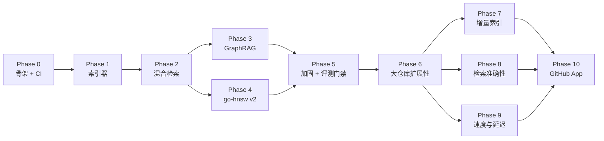
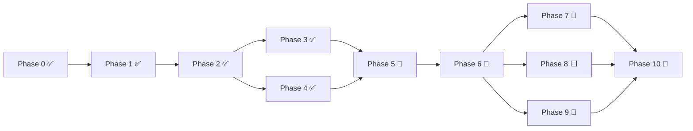

# 路线图

项目按 **十一个阶段（Phase 0–10）** 组织。每个阶段都有明确的 *交付物*、可录制的 *演示*，以及能用一句话写清的 *退出指标*。各阶段大致按一个专注日历周来规划；较大的系统阶段（HNSW、GraphRAG、大仓库扩展）会占两周。

> **运作原则**：每个阶段都以可演示的成果和 CI 信号收尾。我们从不把功能攒到一次巨型集成里再发布。

| 阶段 | 主题 | 周期 | 退出指标 |
| --- | --- | --- | --- |
| 0 | 骨架与 CI | 0.5 周 | `main` 上仓库全绿、空桩就绪；CI 徽章可用；本地一行命令即可拉起。 |
| 1 | 索引器 v1：tree-sitter + 符号图 | 1.0 周 | `reposage index <repo>` 写入 SQLite；对 10 kLOC 夹具可回答「X 在哪里被调用」。 |
| 2 | 检索 v1：端到端混合 RAG | 1.5 周 | `/ask` 返回带引用的答案；HNSW + BM25 + RRF + 重排序器已接通；小仓库上 P50 延迟 < 1.5 s。 |
| 3 | GraphRAG（Leiden + 摘要） | 1.5 周 | 可回答模块级问题；200 题基准中前 50 题上线；相对混合基线有 +X% 提升。 |
| 4 | go-hnsw v2：持久化 + 基准测试 | 1.5 周 | mmap 快照；SIFT-1M Pareto 曲线写入 `docs/BENCHMARKS.md`，与 Faiss 对比。 |
| 5 | 加固：评测门禁、OTel、性能 | 1.0 周 | Eval-gate 阈值门禁生效拦截回归；OTel 链路可观测；批量 upsert + 并发读落地（完整 200 题挪到 Phase 8）。 |
| 6 | 大仓库扩展性（scale-out） | 1.5 周 | 索引 500 kLOC / 1M+ chunk 仓库不 OOM；索引吞吐 ≥ 1k chunks/s；服务端内存有界。 |
| 7 | 增量索引（incremental reindex） | 1.0 周 | 只重解析变更文件；改动占比 5% 时重跑相对全量提速 ≥ 10×。 |
| 8 | 检索准确性（retrieval quality） | 1.5 周 | 完整 200 题基准；端到端准确率相对当前基线 +X%；引用对齐率提升。 |
| 9 | 速度与延迟（latency & throughput） | 1.0 周 | 缓存命中重复问题 < 100 ms；HNSW QPS 向 Faiss 收口；服务 P95 下降。 |
| 10 | GitHub App | 1.0 周 | 在已加固、已扩展、已调优的引擎上对外上线；@ 提及 → 30 秒内带引用的 PR 评论。 |

各阶段的依赖关系（哪些必须先做、哪些可以并行）：

> Phase 3 / 4 都只依赖 Phase 2，理论上可并行推进；Phase 5 把两者收口加固。随后把原「延伸目标」拆成四个聚焦阶段：Phase 6 先把引擎做到能吞下大仓库（scale-out），Phase 7 / 8 / 9 在此之上分别攻「增量索引」「检索准确性」「速度与延迟」——三者都依赖 Phase 6、彼此大体可并行。最后 Phase 10 才在已加固、已扩展、已调优的引擎上把 GitHub App 对外部署（其 `push` 事件正好驱动 Phase 7 的增量重索引）。多语言（Java / Rust 等）已降级为**低优先的可选增项**（并入 Phase 8），不再单列阶段。

---

## 阶段 0 — 骨架与 CI

**为何先做**：让仓库长期保持全绿，后续每个阶段都是向前推进，而不是救火恢复。

* 项目布局（`reposage/`、`go-hnsw/`、`benchmarks/`、`docs/`）。
* `pyproject.toml`：ruff + mypy strict + pytest。
* Go HNSW 模块的 `go.mod`；CI 中强制 `gofmt -l`。
* GitHub Actions 工作流：`ci-python`、`ci-go`、`lint`、`eval-gate`（无标签时跳过）。
* README 含徽章；LICENSE（Apache 2.0）；`.env.example`。
* 一个冒烟测试（`/healthz`）、一个 Go 单元测试（`Cosine`）。

**演示**：`git clone && make install-dev && make test` 全绿。
**退出指标**：四个 CI 工作流全绿；覆盖率发布已接通（为 0 亦可）。

---

## 阶段 1 — 索引器 v1：tree-sitter + 符号图

**目标**：把已检出的仓库变成可查询的符号图行。

* tree-sitter 解析器封装：先做 Python，再做 TypeScript 和 Go。
* 基于 AST 的分块器：最大行数 + 重叠。
* 符号图抽取（`def`、`call`、`inherit`、`import`）。
* SQLite schema + 邻接表存储实现。
* `reposage index` CLI；在夹具仓库上 `reposage ask --route graph`。

**演示**：索引 `pallets/flask`（或本地夹具），回答「`Flask.route` 在哪里被调用？」并列出 `file:line` 链接。
**退出指标**：对夹具上 30 道手工评分的图查询，精确率 ≥ 90%；50 kLOC 索引一轮 < 60 s。

---

## 阶段 2 — 检索 v1：端到端混合 RAG

**目标**：可用的 `/ask` 端点，带引用。

* 嵌入模型（`bge-en-v1.5`，懒加载）。
* `go-hnsw` 插入与检索 v1（内存、单线程，论文 Algorithm 1 / 5）。`cmd/server` 中的 gRPC 服务。
* 使用 rank-bm25 的 BM25 索引。
* 带 RRF 的 `HybridRetriever`；交叉编码器重排序器。
* `QueryRouter` 启发式 + LLM 回退。
* LiteLLM 客户端；提示模板（`reposage/llm/prompts.py`）。
* 引用 grounding 校验 + 丢弃并重生成回退。

**演示**：对某 OSS 仓库问「session timeout 如何配置？」；答案引用正确的两个文件。
**退出指标**：50 kLOC 仓库上端到端 P50 延迟 < 1.5 s；20 道题达到「我会把这个答案发给同事」的手动质量线。

---

## 阶段 3 — GraphRAG：Leiden + 社区摘要

**目标**：回答混合检索无法覆盖的模块级问题。

* 由 igraph + leidenalg 驱动的 `CommunityDetector`；层次（多级）划分。
* 用更便宜 LLM 的 `CommunitySummarizer`；结果缓存在 SQLite。
* `QueryRouter` 中的 `community` 路由。
* 跨文件基准的前 50 题，含参考答案。
* 跑基准：40 道模块聚合题上 `community` 路由 vs `hybrid` 路由。

**演示**：在真实 OSS 仓库问「auth 与 billing 模块如何交互？」；答案引用多个模块并含社区摘要。
**退出指标**：在 40 道模块聚合题上，Ragas `answer_correctness` 相对仅 hybrid 有 ≥ 25% 绝对提升。

---

## 阶段 4 — go-hnsw v2：持久化 + SIFT-1M 基准

**状态：✅ 已完成**（2026-06-29，commit `28bc663`）

**目标**：把 HNSW 模块从「内存能用」做成可严肃对标、可基准测试的产物。

* mmap 快照/恢复，采用 `docs/ARCHITECTURE.md` 中的 CSR 邻接格式。
* 启发式邻居选择（Algorithm 4）与正确的层级乘子采样。
* 原子快照写入（`tmp + rename`）。
* `cmd/bench` 中的 SIFT-1M 基准：构建 / recall@10 / QPS / P50 / P99 / RSS。
* `benchmarks/sift1m/run_sweep.py` 中的扫描驱动。
* Recall 对 QPS 的 Pareto 图提交到 `docs/BENCHMARKS.md`。
* 在同一硬件上跑 Faiss 基线。

**演示**：打开 `docs/BENCHMARKS.md`；图上有两条曲线（go-hnsw、Faiss-HNSWFlat）及对差距的如实说明。
**退出指标**：Pareto 曲线已发布；1M × 128-d 从快照重载 P50 < 200 ms。

| 退出指标 | 目标 | 实测 |
| --- | --- | --- |
| Pareto 曲线（go-hnsw + Faiss） | 已发布 | ✅ [`docs/BENCHMARKS.md`](BENCHMARKS.md) §1 |
| 1M×128 快照重载 P50 | < 200 ms | ✅ **11.7–13.0 ms** |
| mmap 持久化 + Algorithm 4 | 落地 | ✅ `persist.go` / `insert.go` |
| 单测 + race | 全绿 | ✅ `make hnsw-test` |

---

## 阶段 5 — 加固：评测门禁、OTel、性能

**状态：🚧 进行中**（OTel span 埋点、go-hnsw 并发读路径 + 批量 upsert 已落地；完整 200 题基准与 eval-gate 必过检查待补）
**技术方案**：见 [`docs/plans/phase-5-hardening.md`](plans/phase-5-hardening.md)。

**目标**：每次变更在合并前都有度量。

* ⬜ `benchmarks/cross_file_qa/questions.jsonl` 中完整 200 题（Python + TS + Go）。*(数据任务，暂缓)*
* ⬜ 带 `run-eval` 标签的 PR 上，`eval-gate` GitHub Action 成为必过检查。*(仓库分支保护设置)*
* 🚧 索引与服务端的 OTel 链路：span 埋点已覆盖 index / router / 三路检索 / LLM 补全；导出经 `REPOSAGE_OTEL_ENABLED` 开关接 OTLP（Tempo / Jaeger）。仪表盘说明待补。
* 🚧 性能 pass：✅ 批量 HNSW upsert（`Index.AddBatch` + gRPC `BulkLoad`）、✅ 并行社区摘要（`summarizer.summarize_all`）；热路径剖析待做。
* 🚧 `go-hnsw` 并发：✅ gRPC 服务端 `RWMutex` 并发读路径（读读不再互斥）；每层分片锁（per-layer RWMutex）留作后续优化。

**演示**：开一个拉低检索 recall 的 PR；eval-gate 将其拦截。
**退出指标**：eval-gate 运行 < 10 分钟；4 核笔记本上 P99 索引吞吐 ≥ 1k chunks/s。

---

## 阶段 6 — 大仓库扩展性（scale-out）

**技术方案**：见 [`docs/plans/phase-6-scale-out.md`](plans/phase-6-scale-out.md)。

**目标**：把索引与服务从「小仓库能用」做到能吞下 500 kLOC / 1M+ chunk 的真实大仓库，全程内存有界、吞吐达标。这是后续三个阶段（增量 / 准确 / 速度）的地基。

* **索引流水线并行化**：解析 / chunk / embed 分阶段并行（进程或线程池）；批量事务写 SQLite，避免逐行 commit。
* **有界内存**：大仓库分批 embed，向量走 Phase 5 的 `bulk_load` / `AddBatch` 批量灌入，杜绝「一次性载入全量向量」。
* **HNSW 规模化**：批量建图（`AddBatch`）；服务端优先走 Phase 4 的 mmap 快照重载；持续监控 RSS。
* **BM25 规模化 → Tantivy**：把 rank-bm25（纯内存、每次 O(N) 重建）换成 **Tantivy**（Rust 倒排索引，磁盘驻留、增量友好），预期索引吞吐约 10×、内存大降。这条同时为 Phase 7（增量）与 Phase 9（速度）铺路。
* **大仓库夹具 + 压测**：选一个真实大 OSS 仓库（如 Django / CPython 子集）跑全量索引，量峰值 RSS / 吞吐 / 各阶段耗时（用 Phase 5 的 OTel span）。

**演示**：索引一个 ≥ 500 kLOC 仓库，全程 RSS 有界、无 OOM，吞吐达标，问答仍正常。
**退出指标**：索引 500 kLOC 仓库峰值 RSS 有界（< 目标阈值）；索引吞吐 ≥ 1k chunks/s（4 核）；服务端快照重载 < 200 ms（复用 Phase 4）。

---

## 阶段 7 — 增量索引（incremental reindex）

**技术方案**：见 [`docs/plans/phase-7-incremental.md`](plans/phase-7-incremental.md)。

**目标**：re-index 只处理变更文件，把大仓库的重复索引从「分钟级全量」压到「秒级增量」。

* **变更检测**：按 `file_sha` / `mtime`（Phase 1 已写入）挑出新增 / 改动 / 删除的文件。
* **符号图增量**：只重解析变更文件；未动文件复用 `nodes` / `edges` / `chunks` / `embeddings` 行；对受影响的跨文件引用做局部重解析。
* **HNSW 增量 upsert**：变更 chunk 走 `Add`（替换语义已支持）；删除的 chunk 逐出向量（tombstone 或到阈值重建）。
* **社区增量**：`content_sha` 缓存已让未变社区跳过 LLM 摘要（Phase 3 已备）；仅在图结构显著变化时才重跑 Leiden。
* **对接 `push`**：与 Phase 10 的 webhook 打通——changed files 列表直接喂增量器。

**演示**：改动大仓库中 1 个文件后 re-index，秒级完成且只更新受影响的符号 / 向量 / 社区。
**退出指标**：改动占比 5% 时增量相对全量提速 ≥ 10×；增量后检索结果与全量重建**一致**（等价性测试）。

---

## 阶段 8 — 检索准确性（retrieval quality）

**技术方案**：见 [`docs/plans/phase-8-retrieval-quality.md`](plans/phase-8-retrieval-quality.md)。

**目标**：用评测 harness 驱动，把三路检索的端到端准确率系统性拉高。

* **评测先行**：补齐 **200 题基准**（Phase 5 暂缓项，Python + TS + Go），作为准确率优化的度量基线——没有基线就无从判断「更准」。
* **混合检索调优**：RRF `k` / 各分支 top-k / rerank top-n 网格调参；升级交叉编码器重排。
* **查询理解**：查询改写 / 扩展（LLM 归一符号名、拆分多意图问题）；router 置信度联动 top-k。
* **图增强检索**：hybrid 命中后沿符号图多跳扩展（callers / callees）补上下文；community 路径下钻到成员 chunk。
* **chunk 质量**：AST 切块边界与重叠调优，减少「语义单元被切散」。
* **（低优先）多语言**：给 TS / Go 补**符号抽取**（目前仅 parse 校验，DD-010），Java / Rust 视需要再加。用户已明确多语言非重点，仅在扩大准确率覆盖面时择机做，不阻塞本阶段退出。

**演示**：同一 200 题基准，准确率相对优化前显著提升，并给出 per-bucket 提升表。
**退出指标**：200 题端到端准确率（Ragas `answer_correctness` / 自定义引用对齐）相对当前基线 **+X%（绝对）**。

---

## 阶段 9 — 速度与延迟（latency & throughput）

**技术方案**：见 [`docs/plans/phase-9-latency.md`](plans/phase-9-latency.md)。

**目标**：把线上问答 P50 / P95 压下来，把 HNSW QPS 向 Faiss 收口。

* **缓存层**：按 `(repo_sha, question)` 缓存整题答案，重复问题 < 100 ms 返回；embedding / rerank 结果也可缓存。
* **HNSW 性能**：热路径 pprof 剖析；SIMD 距离；`searchLayer` 的 visited 结构优化；**per-layer 分片锁 / 无锁读**（Phase 5 后移项）在此落地，配合批量查询。
* **批量查询 RPC**：把 `Search` 升级为 server-streaming / 批量，摊薄 gRPC 往返。
* **索引侧提速**：embed 批大小调优；BM25 走 Tantivy（Phase 6）后的查询提速。
* **端到端剖析**：用 Phase 5 的 OTel span 定位三路里最贵的段，针对性优化。

**演示**：重复问题走缓存 < 100 ms；大仓库 P95 明显下降；HNSW 的 QPS-recall Pareto 逼近 Faiss。
**退出指标**：缓存命中 < 100 ms；单线程 HNSW QPS 相对 Phase 4 提升（向 Faiss 收口）；服务 P95 下降 X%。

---

## 阶段 10 — GitHub App 部署

**技术方案**：见 [`docs/plans/phase-10-github-app.md`](plans/phase-10-github-app.md)。

**目标**：真实用户（先是我们，再是任何人）能在公开仓库安装 RepoSage。放在加固 + 扩展 + 调优之后，确保对外开放时 OTel 可观测、eval-gate 与性能均已就位，大仓库吞吐 / 增量 / 缓存也已打磨，且可复用 Phase 4 的快照实现快速重载。

* GitHub App 注册；私钥与 webhook secret 放在 `.env`。
* HMAC 校验 + JWT 签发 + installation token 缓存。
* `@reposage` 命令解析；评论线程生命周期。
* Webhook 处理器转发到现有 `/ask` 流程。
* Markdown 引用渲染，含永久链接（`#L42-L57`）。
* 由 `push` 事件触发的长时间索引任务（驱动 Phase 7 的增量重索引）。

**演示**：在公开 OSS 仓库安装，开 PR，评论 `@reposage where does the request enter routing?`，30 秒内收到带引用的回复。
**退出指标**：演示仓库往返 P95 < 30 s；签名校验通过；限流处理已测。

---

## 进度跟踪

| 阶段 | 状态 | 完成日期 | 备注 |
| --- | --- | --- | --- |
| 0 骨架 + CI | ✅ | 2026-05 | `make test` 全绿 |
| 1 索引器 v1 | ✅ | 2026-05 | tree-sitter + 符号图 |
| 2 混合检索 RAG | ✅ | 2026-05 | `/ask` + HNSW/BM25/RRF |
| 3 GraphRAG | ✅ | 2026-06 | Leiden + 社区摘要；50 题基准 |
| 4 go-hnsw v2 | ✅ | 2026-06-29 | mmap 快照 + SIFT-1M 基准 |
| 5 加固 + eval-gate | 🚧 | — | 进行中：OTel 埋点、go-hnsw 并发读、批量 upsert |
| 6 大仓库扩展性 | 🚧 | — | 已落地：共享 tokenise（BM25/Tantivy 同口径）+ scale-out 配置旋钮；并行/流式管线、Tantivy 后端待补 |
| 7 增量索引 | 🚧 | — | 已落地：变更集/影响集/单文件删除 + **管线增量删除与变更刷新**（修复边权膨胀/孤儿文件/空文件残留）+ 等价性测试；增量符号解析、HNSW 墓碑待补 |
| 8 检索准确性 | ⬜ | — | 200 题基准 + 重排 / 查询理解 / 图增强；多语言(低优先)（需评测/LM，暂缓） |
| 9 速度与延迟 | 🚧 | — | 已落地：版本化问答缓存（opt-in，`repo_version` 失效）；SIMD / 批量查询 / 无锁读待补 |
| 10 GitHub App | 🚧 | — | 已落地：HMAC 校验 + 命令/事件解析 + commit-SHA 引用渲染 + webhook 快速 ACK；JWT/token/回帖(网络)待补 |

* 每个阶段在 issue 跟踪器里对应一个里程碑（`Phase 0` … `Phase 10`）。
* 阶段退出指标写在本文件 *以及* 对应里程碑描述中；与实际情况不符时两处同步更新。
* `docs/BENCHMARKS.md` 是 README 中一切对外数字的唯一来源。
