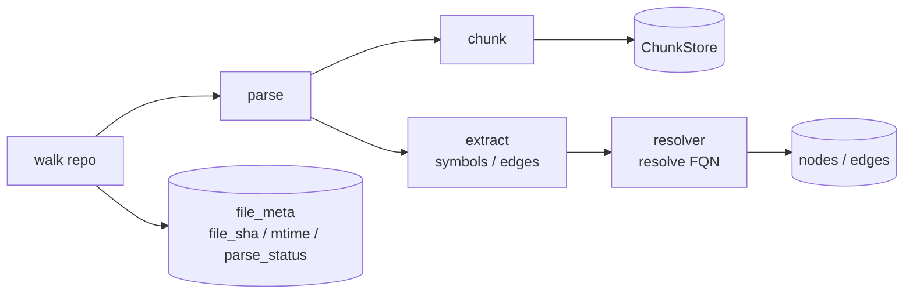
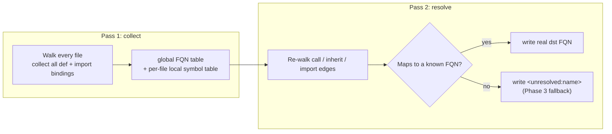

# Phase 1 — Indexer v1: tree-sitter + symbol graph

> Technical design. tree-sitter is the syntax-tree parser; the symbol graph records who defines, calls, inherits, and imports whom.
>
> This is the final Phase 1 technical design for this repo, corresponding to stage 1 of [`docs/ROADMAP.md`](../ROADMAP.md).
> Created: 2026-05-21.
> A contemporaneous discussion copy lives at `~/.cursor/plans/phase_1_indexer_*.plan.md`.

## Goal alignment

Roadmap Phase 1 exit criteria:

- `reposage index <repo>` writes a Python repository into SQLite.
- `reposage ask --route graph "where is X called?"` returns a `file:line` list on a 10 kLOC fixture (a small, fixed sample repo).
- ≥ 90% precision on a 30-question hand-scored set (share of expected citations that are returned correctly); 50 kLOC index in < 60 s.

This design adds two **forward-looking** enhancements on top of the roadmap:

1. **Module-aware Python FQN resolution** (FQN: fully-qualified name, e.g. `pkg.module.Class.method`; aligned with the Sourcegraph `scip-python` v1 water-line).
2. **Schema used by Phases 2 / 3 / 7 is added in one shot**: `chunks`, `repo_meta`, `file_meta`, `edges.weight`, so later work does not require invasive migrations.

## Industry-standard alignment

- **tree-sitter package swap**: [`pyproject.toml`](../../pyproject.toml) currently uses `tree-sitter-languages`, unmaintained since 2024; the community standard is now `tree-sitter-language-pack`. Also bump `tree-sitter` to `>=0.23` and the matching new API.
- **AST-aware chunking**: units are function / method / class / top-level statement; over-long functions split into line-level sub-chunks (`max_lines=80`, `overlap=4` so adjacent chunks share 4 lines). Matches Cursor / Cody / Copilot Workspace.
- **SCIP-style FQN (simplified)**: keep the `pkg.module.Class.method` string form, but add a `language` column on `nodes`; TS / Go use a `<lang>:` prefix for disambiguation. Do not introduce full SCIP protobuf.
- **Two-pass parsing** (cross-file resolution): pass 1 collects all `def` FQNs into a module symbol table; pass 2 lands `call` / `inherit` / `import` edges on known FQNs; unresolved names stay as `<unresolved:name>` for Phase 3 fallback.
- **CSR-style reverse adjacency**: the SQLite equivalent is `INDEX edges_dst_kind ON edges(dst, kind)` (speeds “who calls this symbol”).

## Data flow



The resolver is **two-pass** because pass 1 must see the whole repo’s definitions before pass 2 can bind a call name to a real definition.



Full field docs also land in [`docs/INDEX_SCHEMA.md`](../INDEX_SCHEMA.md); this section is structure only.

```sql
-- Symbol-graph core
CREATE TABLE nodes(
  fqn TEXT PRIMARY KEY,         -- fully-qualified name, primary key
  kind TEXT NOT NULL,           -- module|class|function|method|variable
  language TEXT NOT NULL,       -- python|typescript|go
  repo TEXT NOT NULL,
  path TEXT NOT NULL,
  start_line INT NOT NULL,
  end_line INT NOT NULL
);

CREATE TABLE edges(
  src TEXT NOT NULL,            -- edge source (caller, etc.)
  dst TEXT NOT NULL,            -- edge destination; may be '<unresolved:foo>'
  kind TEXT NOT NULL,           -- def|call|inherit|import
  src_path TEXT NOT NULL,
  src_line INT NOT NULL,
  weight INTEGER NOT NULL DEFAULT 1,   -- used by Phase 3 Leiden
  PRIMARY KEY (src, dst, kind, src_line)
);
CREATE INDEX edges_dst_kind ON edges(dst, kind);   -- reverse adjacency: who points at this symbol
CREATE INDEX edges_src_kind ON edges(src, kind);   -- forward: what this symbol points to

-- Chunks (code fragments; Phase 2 HNSW attaches here to avoid a later migration)
CREATE TABLE chunks(
  chunk_id TEXT PRIMARY KEY,    -- sha1(repo|path|start|end|text) (stable ID)
  repo TEXT NOT NULL,
  path TEXT NOT NULL,
  language TEXT NOT NULL,
  start_line INT NOT NULL,
  end_line INT NOT NULL,
  symbol TEXT,                  -- enclosing symbol name, if any
  parent_symbol TEXT,
  text TEXT NOT NULL,
  file_sha TEXT NOT NULL,       -- whole-file content hash, for incremental reindex
  created_at INTEGER NOT NULL
);
CREATE INDEX chunks_repo_path ON chunks(repo, path);
CREATE INDEX chunks_symbol ON chunks(symbol);

-- Incremental-index metadata (Phase 7 consumes; Phase 1 writes only)
CREATE TABLE repo_meta(
  repo TEXT PRIMARY KEY,
  head_sha TEXT,                -- current Git commit hash
  default_branch TEXT,
  last_indexed_at INTEGER NOT NULL
);

CREATE TABLE file_meta(
  repo TEXT NOT NULL,
  path TEXT NOT NULL,
  file_sha TEXT NOT NULL,
  mtime INTEGER NOT NULL,       -- file mtime
  parse_status TEXT NOT NULL,   -- ok|parse_error|unsupported
  last_indexed_at INTEGER NOT NULL,
  PRIMARY KEY (repo, path)
);
```

## Key file changes

- [`pyproject.toml`](../../pyproject.toml): drop `tree-sitter-languages`, add `tree-sitter-language-pack`, `tree-sitter>=0.23`; rename the matching mypy override.
- [`reposage/indexer/parser.py`](../../reposage/indexer/parser.py): cache grammars via `tree_sitter_language_pack.get_language`; `parse(path)` reads bytes → picks grammar → returns `ParseResult`; decode failure / unsupported language returns `None`, recorded in `file_meta.parse_status`.
- [`reposage/indexer/chunker.py`](../../reposage/indexer/chunker.py): recursively find `function_definition` / `class_definition` / top-level statements; over-long functions use `_split_long(text, max_lines, overlap)`; `chunk_id = sha1(repo|path|start|end|text).hexdigest()` (same content → same ID).
- New `reposage/indexer/extractor.py`: run `.scm` tree-sitter queries, emit intermediate `RawEdge(kind, local_name, src_node, src_path, src_line)`, decoupled from FQN resolution.
- New `reposage/indexer/python_resolver.py`: Python-specific module-aware resolver; interface is `LanguageResolver` so TS / Go can hook in later.
- [`reposage/indexer/symbol_graph.py`](../../reposage/indexer/symbol_graph.py): add `language` on `SymbolNode`; keep the in-memory version for unit tests.
- [`reposage/storage/sqlite_graph.py`](../../reposage/storage/sqlite_graph.py): schema / upsert / reverse-adjacency queries; `PRAGMA journal_mode=WAL`, `synchronous=NORMAL`.
- New `reposage/storage/chunk_store.py`: shares one DB file with `SQLiteSymbolGraphStore`.
- [`reposage/indexer/pipeline.py`](../../reposage/indexer/pipeline.py): `run(force)` walks → compares `file_sha` → parse → chunk → extract → resolve → persist → returns `IndexManifest`; parse failures do not abort, they go into `manifest.failures`.
- [`reposage/retrieval/router.py`](../../reposage/retrieval/router.py): add graph fast-path (skip the LLM); regex `Foo.bar` → `QueryRoute(name="graph", confidence=1.0, reason="symbolic")`; other routes still raise `NotImplementedError` (Phase 2 takes over).
- [`reposage/cli.py`](../../reposage/cli.py): `index` runs `IndexPipeline`; `ask --route graph` calls `SQLiteSymbolGraphStore.callers_of` and prints a Rich table.

## Tests and benchmarks

- `tests/unit/`
  - `test_parser.py`: one fixture byte string each for Python/TS/Go; assert `Tree.root_node.has_error is False`.
  - `test_chunker.py`: a 200-line function splits into 3 chunks; line ranges are closed intervals with 4-line overlap; empty file returns `[]`.
  - `test_python_resolver.py`: 5 `(import_form, call_site, expected_fqn)` cases.
  - `test_sqlite_graph.py`: roundtrip + `callers_of` reverse-adjacency hit.
  - `test_chunk_store.py`: `chunk_id` stability + overwrite semantics for the same `(repo, path)`.
- New `tests/fixtures/tiny_python_repo/`: ~12 files, 1.5 kLOC, with cross-module inherit / call / import.
- New `tests/integration/test_index_e2e.py`: run `IndexPipeline` over the fixture; assert `manifest.n_symbols / n_edges` match golden values.
- New `benchmarks/graph_queries/python_30.jsonl`: 30 `{"question", "expected": [{"path","line"}]}` items; new `benchmarks/graph_queries/run_eval.py` reports precision; CI target `make bench-graph` is a hard Phase 1 exit gate.
- Large-repo performance: `make bench-graph LARGE=1` on a 50 kLOC checkout (skipped in CI; local only); assert wall time < 60 s.

## TS / Go behavior

> Already confirmed with the user.

When Phase 1 sees `.ts` / `.tsx` / `.js` / `.jsx` / `.go` files:

1. Parse once with tree-sitter to confirm the grammar does not crash.
2. Write one `file_meta` row with `parse_status='unsupported'`, including path, `mtime`, and `file_sha`.
3. **Do not write `chunks` / `nodes` / `edges`**.
4. When Phase 1.5 / Phase 7 attach a TS or Go resolver, rescan every `file_meta` row with `parse_status='unsupported'`.

## Exit verification

Run in order:

1. `make lint && make typecheck`
2. `pytest -q tests/unit tests/integration`
3. `make bench-graph` → precision ≥ 0.90
4. `make bench-graph LARGE=1` → wall time < 60 s (local 4 cores)
5. Manual demo: `reposage index --repo tests/fixtures/tiny_python_repo` → `reposage ask --route graph "where is User.login called?"`, non-empty output.

## Explicitly out of scope (later phases)

- TypeScript / Go edge extraction, embeddings / HNSW writes, Leiden / community summaries, and LLM answers are **all out of scope**. Phase 1 `ask --route graph` hits tables directly and **does not call an LLM** (consistent with [`docs/DESIGN_DECISIONS.md`](../DESIGN_DECISIONS.md) DD-002).

## Demo commands

### One-liner end-to-end

```bash
reposage index --repo tests/fixtures/tiny_python_repo --force \
  && reposage ask "where is User.login called?" --route graph
```

Or via `python -m`:

```bash
python -m reposage.cli index --repo tests/fixtures/tiny_python_repo --force \
  && python -m reposage.cli ask "where is User.login called?" --route graph
```

### Full exit-criteria replay

```bash
# 1) lint + typecheck
make lint && make typecheck

# 2) full pytest (includes the 30-question gate)
make test

# 3) explicit 30-question bench (same definition as pytest test_graph_bench)
make bench-graph                  # exits 0 only if precision >= 0.90

# 4) 50 kLOC performance check (any 50 kLOC+ Python checkout)
REPOSAGE_LARGE_REPO=.venv/lib/python3.12/site-packages/langchain_classic \
  make bench-graph LARGE=1        # exits 0 only if wall time < 60s

# 5) Go race detector
make hnsw-test
```

### Common local ask examples

> Index once with `reposage index --repo tests/fixtures/tiny_python_repo --force`; each command below prints a table.

```bash
reposage ask "where is User.login called?"        --route graph
reposage ask "who calls require_auth?"             --route graph
reposage ask "list callers of Invoice.issue"       --route graph
reposage ask "where is utils.logging.log called?"  --route graph
reposage ask "who calls AdminUser.has_admin_flag?" --route graph
```
