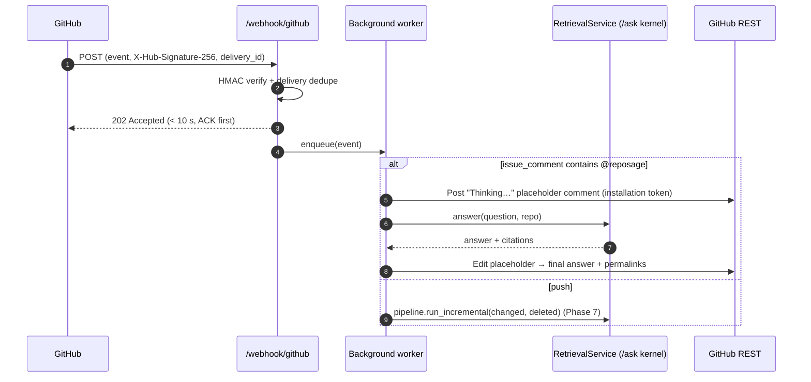
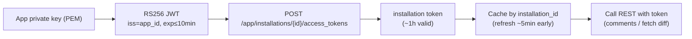
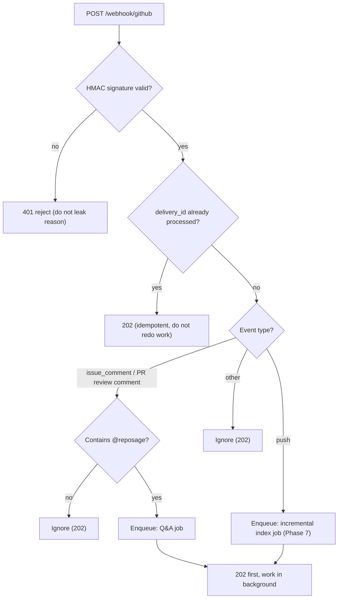

# Phase 10 — GitHub App deployment (webhook + @mention + push incremental) (technical design)

> This document corresponds to stage 10 of [`docs/ROADMAP.md`](../ROADMAP.md).
> Created: 2026-07-16. **Status: 🚧 Partially implemented** (HMAC / command parse / citation render / fast ACK have landed; JWT / token / posting replies (network) still pending — see “Implementation progress” below).
> Style matches [phase-1-indexer.md](phase-1-indexer.md) … [phase-9-latency.md](phase-9-latency.md): proper nouns annotated in parentheses.
> Closing phase: deploy externally on an engine that is **hardened (Phase 5), scaled (Phase 6), incremental (Phase 7), accuracy-tuned (Phase 8), and sped up (Phase 9)**. See DD-005.

## Implementation progress (LM-free code slice, 2026-07-16)

- ✅ HMAC-SHA256 signature verification (constant-time compare; missing secret / bad header fail-closed, DD-052): [`bot/github_app.py`](../../reposage/bot/github_app.py)`::verify_signature`.
- ✅ Command and event parse: `parse_command` (extract `@reposage` questions), `IssueCommentEvent` / `PushEvent`, `route_event → WebhookAction` (answer / reindex / ignore, including ignore-own-comments to prevent reply loops, ignore branch deletions).
- ✅ Citation render: [`bot/citation.py`](../../reposage/bot/citation.py) **commit-SHA permalinks** (not HEAD, DD-053) + dedupe by span.
- ✅ Fast webhook ACK: [`routes/webhook.py`](../../reposage/api/routes/webhook.py) verify → route → background task → 202 (DD-051); bad signature 401, bad JSON 400.
- ⏳ Still to do (needs network / crypto deps): JWT minting (RS256), installation-token exchange and cache, placeholder comment → edit into reply, REST rate-limit handling.

## 0. Background and current state

The external delivery shape is a **GitHub App** (DD-005): install on a public OSS repo; in a PR/issue, `@reposage <question>` → a comment with citation permalinks within 30 seconds. This is the lowest-friction demo: “zero upload, zero auth dance, comment-and-go”. Today this layer is a row of **stubs**:

| Component | Current state (code) | What’s missing |
| --- | --- | --- |
| Webhook endpoint | [`api/routes/webhook.py`](../../reposage/api/routes/webhook.py): read body, return `{status: queued}` | No HMAC verify, no dispatch |
| App handler | [`bot/github_app.py`](../../reposage/bot/github_app.py): `verify_signature`/`handle_issue_comment` both `NotImplementedError` | JWT, installation token, command parse, posting replies |
| Citation render | [`bot/citation.py`](../../reposage/bot/citation.py): `from_chunks` implemented, `render_markdown` `NotImplementedError`; template uses `blob/HEAD` | Markdown render + **commit permalinks** |
| Config | `config.py`: `github_app_id` / `github_app_private_key_path` / `github_webhook_secret` | In place, unused |
| Q&A kernel | `/ask` → `RetrievalService.answer` (Phases 2–8) | Reuse as-is |
| Index | `pipeline.run` / `run_incremental` (Phase 7) | Driven by `push` |

**Positioning**: this phase **does not change the Q&A/retrieval kernel**; it only completes the “GitHub events ↔ kernel” lifecycle layer and wires `push` to Phase 7 incremental.

## 1. Goals and scope

**Goal**: a real user can install RepoSage, `@reposage` a question, and get a comment with permalink citations within 30 seconds; `push` automatically triggers incremental reindex.

**In scope**: App registration and keys, webhook HMAC verification, JWT minting, installation-token exchange and cache, event routing (`issue_comment`/`pull_request_review_comment`/`push`), `@reposage` command parse, comment-thread lifecycle, Markdown citations + commit permalinks, background long jobs (index/Q&A), rate-limit handling.

**Out of scope**:
- Retrieval/answer quality, latency, cache → Phases 8/9 (this phase benefits directly).
- Incremental index **logic** → Phase 7 (this phase only provides `push` trigger and changed-files handoff).
- Web UI / VS Code extension → not a goal of this repo (DD-005 alternatives; not doing them).

## 2. Deliverables

| # | Deliverable | Landing place |
| --- | --- | --- |
| D1 | Webhook HMAC-SHA256 signature verification (constant-time compare) | `bot/github_app.py::verify_signature` + `routes/webhook.py` |
| D2 | JWT minting (App private key RS256, `iat/exp/iss`) | `bot/github_app.py::mint_jwt` |
| D3 | Installation-token exchange + cache (by installation_id, refresh before expiry) | `bot/github_app.py::installation_token` |
| D4 | Event routing + `@reposage` command parse | `bot/github_app.py::route_event` / `parse_command` |
| D5 | Reply lifecycle: placeholder “Thinking…” → edit into the final answer | `bot/github_app.py::handle_issue_comment` |
| D6 | Markdown citation render + **commit permalinks** (`#L42-L57`) | `bot/citation.py::render_markdown` |
| D7 | `push` → Phase 7 incremental (pass changed/deleted files) | `bot/github_app.py::handle_push` → `pipeline.run_incremental` |
| D8 | Background job execution + fast webhook ACK (<10 s) | `bot/worker.py` (new) / FastAPI `BackgroundTasks` |
| D9 | Rate-limit handling (primary/secondary rate limit, exponential backoff) | `bot/github_client.py` (new, REST wrapper) |

## 3. Exit criteria

| Metric | Target | How measured |
| --- | --- | --- |
| **End-to-end round-trip** | Demo repo `@reposage` → comment **P95 < 30 s** (faster on cache hit, Phase 9) | Demo timing / OTel |
| **Signature verification** | Valid signatures pass; forged/tampered **rejected** (401) | Unit + integration |
| **Webhook ACK** | Return 2xx **< 10 s** after receipt (avoid GitHub retries); heavy work goes to background | Endpoint timing |
| **Rate limits tested** | On primary/secondary limit: backoff and retry, no crash, no duplicate replies | Injected 429/403 cases |
| **Permalinks correct** | Citations anchored on **commit SHA** (not HEAD); line numbers clickable | Render unit tests |
| **Push incremental** | After push, only affected files reindexed (Phase 7 equivalence guarantee) | Integration |
| **Idempotent** | Same delivery retried does not produce duplicate comments | delivery_id dedupe cases |

## 4. Architecture and data flow

### 4.1 End-to-end sequence



### 4.2 Auth chain (JWT → installation token)



## 5. Key design and trade-offs

### 5.1 Preference flow: how a webhook is handled



### 5.2 Trade-off: synchronous reply vs fast ACK + background

GitHub requires a webhook **response within ~10 s**, or it times out and **retries**. Q&A includes an LLM (seconds to tens of seconds); indexing takes longer. Must decouple:

| Option | Times out? | Complexity | Verdict |
| --- | --- | --- | --- |
| Sync: finish Q&A then return | ❌ Will time out → GitHub retries → duplicate comments | Low | ❌ |
| **Fast ACK (202) + background job** | ✅ | Medium | ✅ **Adopt** (202 first; heavy work in background) |
| Fast ACK + external queue (Redis/Celery) | ✅ | High | ⬜ Not needed for a single instance; introduce when multi-instance / high concurrency |

**Preference**: single instance uses FastAPI `BackgroundTasks` / built-in worker (`bot/worker.py`) — enough for demo and moderate load; treat “switch to an external queue” as a scale-out switch, not something to take on early. **UX**: post a “Thinking…” placeholder first, then **edit** that same comment into the final answer (do not post a second comment) so the thread stays clean.

### 5.3 Trade-off: security (signatures, keys, tokens)

| Concern | Choice | Why |
| --- | --- | --- |
| Signature verify | HMAC-SHA256 + **constant-time compare** (`hmac.compare_digest`) | Prevent timing side-channels; prevent forge/replay |
| Body used for verify | **Raw bytes** (not re-serialized JSON) | Any re-serialization changes bytes and breaks the signature |
| Private key | Read only from `github_app_private_key_path`; **never in logs/comments/traces** | A leak is App takeover |
| JWT lifetime | ≤ 10 min (GitHub max) | Shrink leak window |
| Installation token | Cache by id, refresh early, **in-memory only** | Token ~1h; avoid exchanging every time, and do not persist to disk |
| Failure messages | Verify failure returns a **generic 401** (do not echo the reason) | Do not give attackers a hint |

Signature-verify failure **never** enters the Q&A/index path — that is the security boundary (first gate in the §5.1 flowchart).

### 5.4 Trade-off: permalinks anchored on HEAD vs commit SHA

`citation.py` currently templates `blob/HEAD/{path}#L{start}-L{end}`. `HEAD` **drifts** as the repo evolves; line numbers in historical comments will point at the wrong code.

| Anchor | Stability | Verdict |
| --- | --- | --- |
| `HEAD` (current) | ❌ Drifts with later commits | Change it |
| **Commit SHA of the triggering event** (`blob/{sha}/{path}#Lx-Ly`) | ✅ Permanently points at the code of that time | ✅ **Adopt** |

`push`/comment events carry `head_sha`; when answering, build permalinks from the **commit the index was built from**. Same origin as Phase 9’s `repo_sha` cache key (`repo_meta.head_sha`).

### 5.5 Trade-off: REST interaction and rate limits

- Add a thin `bot/github_client.py` wrapper (create/edit comments, fetch PR diffs, exchange tokens) that centralizes **primary rate limit** (`X-RateLimit-Remaining`) and **secondary rate limit** (`Retry-After` / 403 abuse): exponential backoff + jitter + max retries; if exceeded, “skip this attempt and record a metric” — never retry without backoff until we get blocked.
- All REST uses the installation token; App-level operations (token exchange) use JWT.

## 6. Key file changes

- **`bot/github_app.py`**: implement `verify_signature` (HMAC + `compare_digest`), `mint_jwt` (RS256), `installation_token` (exchange + cache), `parse_command` (extract the question after `@reposage`), `route_event`, `handle_issue_comment` (placeholder → edit), `handle_push` (→ `run_incremental`).
- **`bot/github_client.py`** (new): REST wrapper + rate-limit backoff.
- **`bot/worker.py`** (new): background job queue/execution (in-process first).
- **`bot/citation.py`**: `render_markdown` (Markdown code citation blocks); template to commit-SHA permalinks; reuse `from_chunks`.
- **`api/routes/webhook.py`**: HMAC verify → delivery dedupe → fast 202 → enqueue; fail 401.
- **`api/main.py`**: register worker lifecycle (start/stop in lifespan).
- **`config.py`**: add `github_api_base` (GHES-compatible), `github_bot_login` (@mention name), `webhook_dedup_ttl`.
- **`docs/SETUP.md`**: App registration, permissions (`contents:read`, `issues:write`, `pull_requests:write`), event subscriptions (`issue_comment`, `push`), `.env` config.

## 7. Test matrix

| Layer | Case | Assertion |
| --- | --- | --- |
| Unit | `verify_signature` | Valid signature True; tampered body / wrong secret / missing header → False; constant-time path |
| Unit | `mint_jwt` | RS256, `exp≤10min`, `iss=app_id`; verifiable with the public key |
| Unit | Token cache | Reuse while unexpired; refresh near expiry; installations isolated |
| Unit | `parse_command` | Extract question after `@reposage`; no mention → ignore; robust to multiline / quote blocks |
| Unit | `render_markdown` | Permalinks anchored on commit SHA, line numbers correct, paths escaped |
| Unit | Rate-limit backoff | 429/403 abuse → backoff retry; over cap skip without crash |
| Integration | Webhook end-to-end (mock GitHub) | Valid issue_comment → placeholder → edit to final answer; push → triggers `run_incremental` |
| Integration | Idempotency | Same delivery_id retried → no duplicate comments |
| Security | Forged signature | → 401, and **does not** enter Q&A/index |
| Contract | ACK latency | Endpoint returns in < 10 s (heavy work already in background) |

Real GitHub interaction uses **recorded/mock** (do not hit the live API); one `requires_github`-marked manual smoke stays local.

## 8. Design decisions (proposed; register when landing)

- **DD-051 Fast ACK + background jobs (in-process first, switchable to an external queue)**: meet the 10 s webhook constraint; avoid retry duplicate comments; placeholder → edit for a clean thread.
- **DD-052 HMAC constant-time verify + raw body + generic 401**: security boundary first; any unverified event never enters the kernel; private keys/tokens never appear in logs.
- **DD-053 Permalinks anchored on commit SHA (not HEAD)**: historical comment citations stay valid forever; same origin as Phase 9 `repo_sha` cache key.
- **DD-054 `push` drives Phase 7 incremental; REST rate-limit backoff is centralized**: steady-state under external load; no retries without backoff.

## 9. Risks and mitigations

- **Risk: webhook timeout causes GitHub retries**. Mitigation: fast 202 + background; delivery_id idempotent dedupe.
- **Risk: private key/token leak**. Mitigation: read only from the config path; never in logs/traces/comments; short-lived JWT; tokens in-memory only.
- **Risk: rate-limit blow-up or abuse flag**. Mitigation: centralized wrapper + backoff jitter + cap; honor `X-RateLimit`/`Retry-After`; over limit record a metric and skip.
- **Risk: first install on a large repo indexes for a long time**. Mitigation: reply first with “index is being built; you can ask later”; after push, use Phase 7 incremental; reuse Phase 4 snapshots for fast reload.
- **Risk: answer quality/latency misses hurt first impressions**. Mitigation: this phase depends on Phases 8/9 first; run the 200-question gate + P95 gate before going external.
- **Risk: multi-instance background jobs duplicate or drop work**. Mitigation: start single-instance; at scale-out switch to an external queue (DD-051 reserved switch).

## 10. Milestones and demo commands

**Milestones**: M1 HMAC verify + fast ACK + background skeleton → M2 JWT/token + REST wrapper + replies (placeholder → edit) → M3 citation permalinks + `push` incremental → M4 rate limits + idempotency + demo targets met.

```bash
# Start locally (webhook endpoint is /webhook/github)
python -m reposage.cli serve

# Forward webhooks to local with GitHub CLI / smee.io for a live smoke
gh webhook forward --repo you/demo --events issue_comment,push --url http://localhost:8000/webhook/github

# Demo: comment on a PR `@reposage where does the request enter routing?`
#   Expect a reply with commit permalinks within 30 s
# Push a change → watch background incremental-reindex logs (Phase 7)
```
