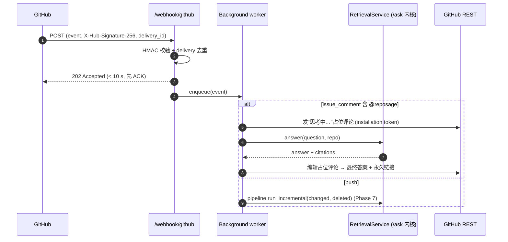
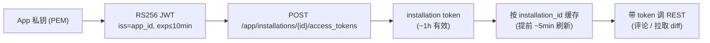
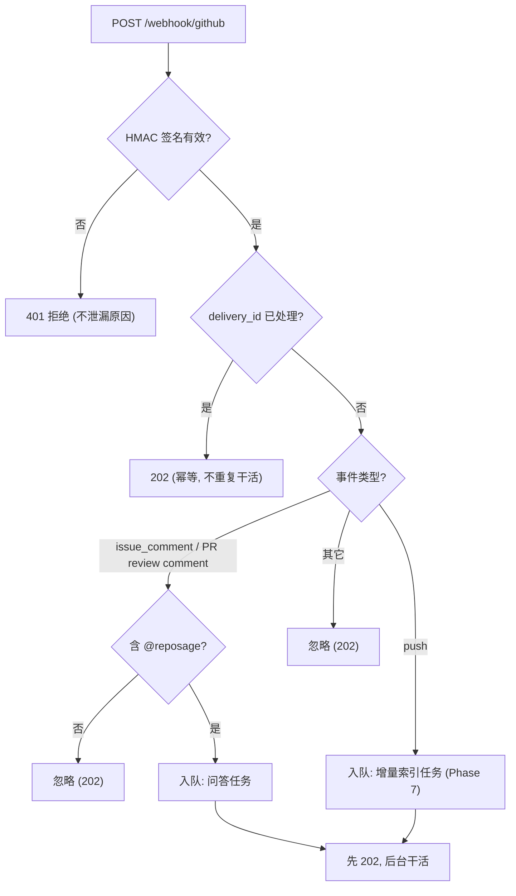

# Phase 10 — GitHub App 部署（webhook + @提及 + push 增量）（技术方案）

> 本文档与 [`docs/ROADMAP.md`](../ROADMAP.md) 第 10 阶段对应。
> 创建日期：2026-07-16。**状态：🚧 部分实现**（HMAC/命令解析/引用渲染/快速 ACK 已落地；JWT/token/回帖(网络)待补，见下「本次实现进展」）。
> 风格与 [phase-1-indexer.md](phase-1-indexer.md) … [phase-9-latency.md](phase-9-latency.md) 一致：专有名词括号注解。
> 收尾阶段：在**已加固（Phase 5）、已扩展（Phase 6）、已增量（Phase 7）、已调准（Phase 8）、已提速（Phase 9）**的引擎上对外部署。参考 DD-005。

## 本次实现进展（LM-free 代码切片，2026-07-16）

- ✅ HMAC-SHA256 签名校验（常量时间比较、无 secret / 坏头 fail-closed，DD-052）：[`bot/github_app.py`](../../reposage/bot/github_app.py)`::verify_signature`。
- ✅ 命令与事件解析：`parse_command`（`@reposage` 提问提取）、`IssueCommentEvent` / `PushEvent`、`route_event → WebhookAction`（answer / reindex / ignore，含自评论防回环、分支删除忽略）。
- ✅ 引用渲染：[`bot/citation.py`](../../reposage/bot/citation.py) **commit-SHA 永久链接**（非 HEAD，DD-053）+ 按 span 去重。
- ✅ Webhook 快速 ACK：[`routes/webhook.py`](../../reposage/api/routes/webhook.py) 校验→路由→后台任务→202（DD-051）；坏签名 401、坏 JSON 400。
- ⏳ 待补（需网络 / 加密依赖）：JWT 铸造（RS256）、installation token 换取与缓存、占位评论→编辑回帖、REST 限流处理。

## 0. 背景与现状

对外交付形态选定为 **GitHub App**（DD-005）：在公开 OSS 仓库安装，PR/issue 里 `@reposage <问题>` → 30 秒内带引用永久链接的评论。这是「零上传、零 auth 舞蹈、评论即用」的最低摩擦 demo。当前是一排**桩件**：

| 组件 | 现状（代码） | 缺什么 |
| --- | --- | --- |
| Webhook 端点 | [`api/routes/webhook.py`](../../reposage/api/routes/webhook.py)：读 body、返回 `{status: queued}` | 无 HMAC 校验、无分发 |
| App 处理器 | [`bot/github_app.py`](../../reposage/bot/github_app.py)：`verify_signature`/`handle_issue_comment` 均 `NotImplementedError` | JWT、installation token、命令解析、回帖 |
| 引用渲染 | [`bot/citation.py`](../../reposage/bot/citation.py)：`from_chunks` 已实现、`render_markdown` `NotImplementedError`；模板用 `blob/HEAD` | Markdown 渲染 + **commit 永久链接** |
| 配置 | `config.py`：`github_app_id` / `github_app_private_key_path` / `github_webhook_secret` | 就位，待用 |
| 问答内核 | `/ask` → `RetrievalService.answer`（Phase 2–8） | 直接复用 |
| 索引 | `pipeline.run` / `run_incremental`（Phase 7） | 由 `push` 驱动 |

**定位**：本 Phase **不改问答/检索内核**，只把「GitHub 事件 ↔ 内核」这层生命周期补全，并把 `push` 接到 Phase 7 增量。

## 1. 目标与范围

**目标**：真实用户能安装 RepoSage，`@reposage` 提问 30 秒内收到带永久链接引用的评论；`push` 自动触发增量重索引。

**In scope**：App 注册与密钥、webhook HMAC 校验、JWT 签发、installation token 交换与缓存、事件路由（`issue_comment`/`pull_request_review_comment`/`push`）、`@reposage` 命令解析、评论线程生命周期、Markdown 引用 + commit 永久链接、后台长任务（索引/问答）、限流处理。

**Out of scope**：
- 检索/答案质量、延迟、缓存 → Phase 8/9（本 Phase 直接受益）。
- 增量索引**逻辑** → Phase 7（本 Phase 只提供 `push` 触发与 changed-files 传递）。
- Web UI / VS Code 扩展 → 非本仓目标（DD-005 备选，不做）。

## 2. 交付物（deliverables）

| # | 交付物 | 落点 |
| --- | --- | --- |
| D1 | Webhook HMAC-SHA256 签名校验（常量时间比较） | `bot/github_app.py::verify_signature` + `routes/webhook.py` |
| D2 | JWT 签发（App 私钥 RS256，`iat/exp/iss`） | `bot/github_app.py::mint_jwt` |
| D3 | installation token 交换 + 缓存（按 installation_id，提前过期刷新） | `bot/github_app.py::installation_token` |
| D4 | 事件路由 + `@reposage` 命令解析 | `bot/github_app.py::route_event` / `parse_command` |
| D5 | 回帖生命周期：占位「思考中」→ 编辑为最终答案 | `bot/github_app.py::handle_issue_comment` |
| D6 | Markdown 引用渲染 + **commit 永久链接**（`#L42-L57`） | `bot/citation.py::render_markdown` |
| D7 | `push` → Phase 7 增量（传 changed/deleted files） | `bot/github_app.py::handle_push` → `pipeline.run_incremental` |
| D8 | 后台任务执行 + 快速 ACK webhook（<10 s） | `bot/worker.py`（新）/ FastAPI `BackgroundTasks` |
| D9 | 限流处理（primary/secondary rate limit，指数退避） | `bot/github_client.py`（新，REST 封装） |

## 3. 准出指标（exit criteria）

| 指标 | 目标 | 量法 |
| --- | --- | --- |
| **端到端往返** | 演示仓库 `@reposage` → 评论 **P95 < 30 s**（命中缓存更快，Phase 9） | 演示计时 / OTel |
| **签名校验** | 合法签名通过、伪造/篡改**拒绝**（401） | 单测 + 集成 |
| **webhook ACK** | 收到后 **< 10 s** 返回 2xx（避免 GitHub 重投），重活转后台 | 端点计时 |
| **限流已测** | 命中 primary/secondary limit 时退避重试、不崩、不重复回帖 | 注入 429/403 用例 |
| **永久链接正确** | 引用锚定 **commit SHA**（非 HEAD），行号可点开 | 渲染单测 |
| **push 增量** | push 后仅受影响文件重索引（Phase 7 等价保证） | 集成 |
| **幂等** | 同一 delivery 重投不产生重复评论 | delivery_id 去重用例 |

## 4. 架构与数据流

### 4.1 端到端时序



### 4.2 认证链（JWT → installation token）



## 5. 关键设计与取舍

### 5.1 偏好流程图：webhook 进来怎么处理



### 5.2 取舍：同步回帖 vs 快速 ACK + 后台

GitHub 要求 webhook **~10 s 内响应**，否则判超时并**重投**。而问答含 LLM（数秒～数十秒）、索引更久。必须解耦：

| 方案 | 是否超时 | 复杂度 | 结论 |
| --- | --- | --- | --- |
| 同步：收到就跑完问答再返回 | ❌ 必超时 → GitHub 重投 → 重复回帖 | 低 | ❌ |
| **快速 ACK(202) + 后台任务** | ✅ | 中 | ✅ **采用**（先 202，重活入后台） |
| 快速 ACK + 外部队列（Redis/Celery） | ✅ | 高 | ⬜ 单实例用不上；多实例/高并发再引 |

**偏好**：单实例用 FastAPI `BackgroundTasks` / 内置 worker（`bot/worker.py`），足够 demo 与中等负载；把「换外部队列」列为扩容开关，不提前上。**用户体验**：先发「思考中…」占位评论，算完**编辑**同一条为最终答案（而非发第二条），线程干净。

### 5.3 取舍：安全（签名、密钥、token）

| 关注点 | 选择 | 理由 |
| --- | --- | --- |
| 签名校验 | HMAC-SHA256 + **常量时间比较**（`hmac.compare_digest`） | 防时序侧信道；防伪造/重放 |
| 校验用 body | **原始 bytes**（非重序列化 JSON） | 任何再序列化都会改字节导致签名不符 |
| 私钥 | 只从 `github_app_private_key_path` 读，**不进日志/评论/trace** | 泄漏即接管 App |
| JWT 有效期 | ≤ 10 min（GitHub 上限）| 减小泄漏窗口 |
| installation token | 按 id 缓存、提前刷新、**内存态** | token ~1h；避免每次重换、又不落盘 |
| 失败信息 | 校验失败返回**通用 401**（不回声原因） | 不给攻击者线索 |

签名校验失败**绝不**进入问答/索引路径——这是安全边界（§5.1 流程图第一道门）。

### 5.4 取舍：永久链接锚定 HEAD 还是 commit SHA

`citation.py` 现模板是 `blob/HEAD/{path}#L{start}-L{end}`。`HEAD` 会随仓库演进**漂移**，历史评论里的行号会指错。

| 锚点 | 稳定性 | 结论 |
| --- | --- | --- |
| `HEAD`（现状） | ❌ 随后续提交漂移 | 改掉 |
| **触发事件的 commit SHA**（`blob/{sha}/{path}#Lx-Ly`） | ✅ 永久指向当时代码 | ✅ **采用** |

`push`/comment 事件带 `head_sha`；问答时用**索引所依据的 commit**构造永久链接。这也和 Phase 9 的 `repo_sha` 缓存键同源（`repo_meta.head_sha`）。

### 5.5 取舍：REST 交互与限流

- 新增 `bot/github_client.py` 薄封装（发/编辑评论、取 PR diff、换 token），集中处理 **primary rate limit**（`X-RateLimit-Remaining`）与 **secondary rate limit**（`Retry-After`/403 abuse）：指数退避 + 抖动 + 上限重试；超限则「本次跳过并记 metric」，绝不裸奔重试打爆。
- 所有 REST 走 installation token；App 级操作（换 token）走 JWT。

## 6. 关键文件改动

- **`bot/github_app.py`**：落实 `verify_signature`（HMAC + `compare_digest`）、`mint_jwt`（RS256）、`installation_token`（换 + 缓存）、`parse_command`（提取 `@reposage` 后问题）、`route_event`、`handle_issue_comment`（占位→编辑）、`handle_push`（→ `run_incremental`）。
- **`bot/github_client.py`**（新）：REST 封装 + 限流退避。
- **`bot/worker.py`**（新）：后台任务队列/执行（先 in-process）。
- **`bot/citation.py`**：`render_markdown`（Markdown 代码引用块）；模板改 commit SHA 永久链接；`from_chunks` 复用。
- **`api/routes/webhook.py`**：HMAC 校验 → delivery 去重 → 快速 202 → 入队；失败 401。
- **`api/main.py`**：注册 worker 生命周期（lifespan 启停）。
- **`config.py`**：补 `github_api_base`（GHES 兼容）、`github_bot_login`（@提及名）、`webhook_dedup_ttl`。
- **`docs/SETUP.md`**：App 注册、权限（`contents:read`、`issues:write`、`pull_requests:write`）、事件订阅（`issue_comment`、`push`）、`.env` 配置。

## 7. 测试矩阵

| 层 | 用例 | 断言 |
| --- | --- | --- |
| 单元 | `verify_signature` | 合法签名 True；篡改 body / 错 secret / 缺头 → False；常量时间路径 |
| 单元 | `mint_jwt` | RS256、`exp≤10min`、`iss=app_id`；可被公钥验证 |
| 单元 | token 缓存 | 未过期复用；临近过期刷新；不同 installation 隔离 |
| 单元 | `parse_command` | 提取 `@reposage` 后问题；无提及→忽略；多行/引用块健壮 |
| 单元 | `render_markdown` | 永久链接锚 commit SHA、行号正确、路径转义 |
| 单元 | 限流退避 | 429/403 abuse → 退避重试；超上限跳过不崩 |
| 集成 | webhook 端到端(mock GitHub) | 合法 issue_comment → 占位→编辑最终答案；push → 触发 `run_incremental` |
| 集成 | 幂等 | 同 delivery_id 重投 → 不重复回帖 |
| 安全 | 伪造签名 | → 401，且**不**进入问答/索引 |
| 契约 | ACK 时延 | 端点 < 10 s 返回（重活已入后台） |

真实 GitHub 交互用**录制/mock**（不打真 API）；一条 `requires_github` 标记的手动冒烟留本地。

## 8. 设计决策（拟新增，落地时登记）

- **DD-051 快速 ACK + 后台任务（先 in-process，可切外部队列）**：满足 10 s webhook 约束、避免重投重复回帖；占位评论→编辑给干净线程。
- **DD-052 HMAC 常量时间校验 + 原始 body + 通用 401**：安全边界前置，任何未验证事件不进内核；私钥/ token 永不出日志。
- **DD-053 永久链接锚定 commit SHA（非 HEAD）**：历史评论引用永久有效；与 Phase 9 `repo_sha` 缓存键同源。
- **DD-054 `push` 驱动 Phase 7 增量、REST 集中限流退避**：对外负载下稳态运行，不裸奔重试。

## 9. 风险与对策

- **风险：webhook 超时被 GitHub 重投**。对策：快速 202 + 后台；delivery_id 幂等去重。
- **风险：私钥/token 泄漏**。对策：仅从配置路径读、不入日志/trace/评论；JWT 短时效；token 内存态。
- **风险：限流打爆或被判 abuse**。对策：集中封装 + 退避抖动 + 上限；`X-RateLimit`/`Retry-After` 感知；超限记 metric 跳过。
- **风险：大仓库首次安装索引很久**。对策：先回「正在建立索引，稍后可提问」；push 后走 Phase 7 增量；复用 Phase 4 快照快速重载。
- **风险：答案质量/延迟不达标影响首因**。对策：本 Phase 前置依赖 Phase 8/9；对外前跑 200 题门禁 + P95 门禁。
- **风险：多实例下后台任务重复/丢失**。对策：单实例起步；扩容时切外部队列（DD-051 预留开关）。

## 10. 里程碑与演示命令

**里程碑**：M1 HMAC 校验 + 快速 ACK + 后台骨架 → M2 JWT/token + REST 封装 + 回帖（占位→编辑）→ M3 引用永久链接 + `push` 增量 → M4 限流 + 幂等 + 演示达标。

```bash
# 本地起服务（webhook 端点在 /webhook/github）
python -m reposage.cli serve

# 用 GitHub CLI / smee.io 转发 webhook 到本地做真·冒烟
gh webhook forward --repo you/demo --events issue_comment,push --url http://localhost:8000/webhook/github

# 演示：在 PR 评论 `@reposage where does the request enter routing?`
#   期望 30 s 内出现带 commit 永久链接的回复
# push 一个改动 → 观察后台增量重索引日志（Phase 7）
```
