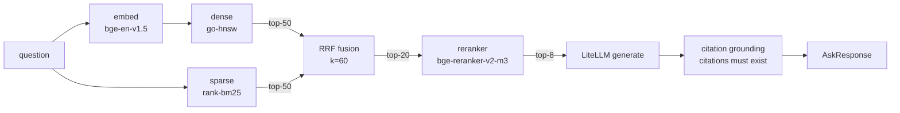
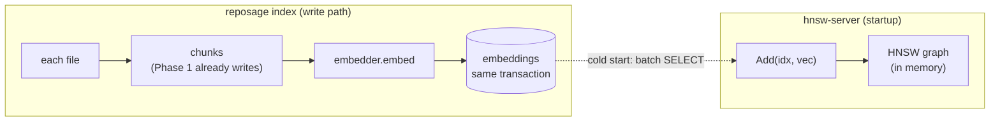

# Phase 2 — Retrieval v1: end-to-end hybrid RAG (technical design)

> Corresponds to stage 2 of [`docs/ROADMAP.md`](../ROADMAP.md).
> Created: 2026-05-24.
> A contemporaneous discussion copy lives at `~/.cursor/plans/phase-2_hybrid_rag_*.plan.md`.

## 1. Goal alignment

Roadmap Phase 2 exit criteria:

- `reposage ask --route hybrid` and `POST /ask` return answers with `[path:start-end]` citations.
- Pipeline: `bge-en-v1.5` embed → in-house `go-hnsw` gRPC (M=16, efC=200, efS=64) + `rank-bm25` → RRF fusion (k=60) → `bge-reranker-v2-m3` rerank → LiteLLM generate → citation grounding.
- 50 kLOC repo P50 end-to-end < 1.5 s; 20-question hand QA pass rate 100%.
- Demo: on `langchain_classic`, correctly answer “How is the session timeout configured?”.

Full `hybrid` path (each step narrows the candidate set):



## 2. Industry-standard alignment

| Choice | Citation / default |
| --- | --- |
| HNSW params | M=16, efConstruction=200, efSearch=64 (Malkov & Yashunin 2018) |
| RRF k | 60 (Cormack et al. 2009) |
| Embedding model | bge-en-v1.5 768-d (FlagEmbedding official) |
| Reranker | bge-reranker-v2-m3 (lightweight cross-encoder) |
| LLM abstraction | LiteLLM (DD-007) |
| IPC | gRPC + Protobuf (DD-001; in-house HNSW already stubbed) |
| HTTP contract | Pydantic v2; response keeps `graph_context: Optional` for Phase 3 |

## 3. Forward- and backward-compatible design

- Four Protocols ([`reposage/retrieval/protocols.py`](../../reposage/retrieval/protocols.py)): `SparseRetriever`, `DenseRetriever`, `Reranker`, `LLMClient`. Phase 7 Tantivy, Phase 5 mmap HNSW, and Phase 8 replicas all swap implementations here (DD-012).
- Embeddings live in SQLite with multiple `model` columns coexisting so Phase 7 can grey-switch models (DD-011).
- `embeddings.dim` is stored explicitly and checked at startup; a model-size mismatch is an error.
- Phase 5 mmap: a one-shot `export-snapshot` tool dumps the arena from the `embeddings` table; Phase 2 code does not need a later rewrite.
- Unit tests use [`LocalDenseIndex`](../../reposage/retrieval/local_dense.py) (pure numpy linear scan) and skip Go gRPC, so the CI Python stage needs no Go toolchain; `make test-grpc` starts the real server.

## 4. Data flow (including atomicity)

`reposage index` already writes `chunks` in Phase 1. Phase 2 appends `embeddings` in the same SQLite transaction:

```sql
CREATE TABLE IF NOT EXISTS embeddings(
  chunk_id   TEXT PRIMARY KEY REFERENCES chunks(chunk_id) ON DELETE CASCADE,
  model      TEXT NOT NULL,
  dim        INTEGER NOT NULL,
  vector     BLOB NOT NULL,
  created_at INTEGER NOT NULL
);
CREATE INDEX IF NOT EXISTS embeddings_model ON embeddings(model);
```

`hnsw-server` startup: batch `SELECT chunk_id, vector FROM embeddings WHERE model=?` → `Add(idx, vec)`; one O(N log N) HNSW build at boot.



> **Atomicity**: `chunks` and `embeddings` are written in one SQLite transaction, so a crash cannot leave a half-state of “chunk without vector”.

## 5. Key files

### 5.1 New (Python)

- [`reposage/retrieval/protocols.py`](../../reposage/retrieval/protocols.py): `SparseRetriever` / `DenseRetriever` / `Reranker` / `LLMClient` Protocol.
- [`reposage/storage/embeddings_store.py`](../../reposage/storage/embeddings_store.py): embeddings table CRUD + model/dim checks.
- [`reposage/retrieval/local_dense.py`](../../reposage/retrieval/local_dense.py): `LocalDenseIndex` (numpy linear scan).
- [`reposage/services/retrieval_service.py`](../../reposage/services/retrieval_service.py): `RetrievalService` orchestrator.
- [`reposage/llm/grounding.py`](../../reposage/llm/grounding.py): `extract_citations` + `verify_grounding`; uncited claims are dropped and regenerated.
- [`reposage/proto/hnsw_pb2.py`](../../reposage/proto/hnsw_pb2.py) (generated by buf/protoc).

### 5.2 Implementation (Python, stub → real)

- [`reposage/indexer/embedder.py`](../../reposage/indexer/embedder.py): `BgeEmbedder` (lazy sentence-transformers) + `HashEmbedder` (CI/test fake).
- [`reposage/indexer/pipeline.py`](../../reposage/indexer/pipeline.py): after `_index_file`, `embedder.embed` new chunks → `embeddings_store.upsert`, same transaction as chunks.
- [`reposage/retrieval/hnsw_client.py`](../../reposage/retrieval/hnsw_client.py): gRPC `DenseRetriever`; on start, `Stats` checks dim vs config.
- [`reposage/retrieval/bm25.py`](../../reposage/retrieval/bm25.py): `SparseRetriever`; tokenize `[A-Za-z0-9]+` → lowercase → length ≥ 2 and not all-digit; at start, full scan of `chunks` to build an in-memory inverted index.
- [`reposage/retrieval/hybrid.py`](../../reposage/retrieval/hybrid.py): parallel dense/sparse top-50 → RRF k=60 → top-20 → rerank → top-8.
- [`reposage/retrieval/reranker.py`](../../reposage/retrieval/reranker.py): `CrossEncoderReranker` (prod) + `MockReranker` (CI).
- [`reposage/llm/client.py`](../../reposage/llm/client.py): `LiteLLMClient` (prod) + `MockLLMClient` (CI, no key).
- [`reposage/llm/prompts.py`](../../reposage/llm/prompts.py): system prompt requires answers only from `<retrieved_chunk>`, citations must look like `[path:start-end]`.
- [`reposage/retrieval/router.py`](../../reposage/retrieval/router.py): extend `route`: graph fast-path first; on miss, LLM intent classification (few tokens, output `graph|hybrid|community`).
- [`reposage/api/routes/ask.py`](../../reposage/api/routes/ask.py): `POST /ask` → `RetrievalService.answer(question)` → `{answer, citations[], route, latency_ms, grounded, graph_context}`.
- [`reposage/cli.py`](../../reposage/cli.py): `ask --route hybrid/auto/graph/community` goes through `RetrievalService`; new `reposage serve` starts FastAPI (uvicorn).

### 5.3 New (Go)

- [`proto/hnsw.proto`](../../proto/hnsw.proto): `Add(id, vec)`, `BulkLoad(stream)`, `Search(vec, k, ef)`, `Stats() -> (size, dim, model, M, efC, efS)`.
- [`go-hnsw/cmd/server/main.go`](../../go-hnsw/cmd/server/main.go): flags `-addr -db -model -dim -m -ef-construction -ef-search`; open SQLite at start, BulkLoad, then serve.
- [`go-hnsw/internal/grpcserver/server.go`](../../go-hnsw/internal/grpcserver/server.go): map gRPC requests onto `hnsw.Index`.
- [`go-hnsw/internal/grpcserver/sqlite_load.go`](../../go-hnsw/internal/grpcserver/sqlite_load.go): cold-start load from `embeddings` (pure-Go SQLite driver).
- [`go-hnsw/insert.go`](../../go-hnsw/insert.go) / [`search.go`](../../go-hnsw/search.go) / [`internal/heap/heap.go`](../../go-hnsw/internal/heap/heap.go): fill in Algorithm 1 / 5.

### 5.4 Config / tooling

- [`pyproject.toml`](../../pyproject.toml): add `sentence-transformers`, `grpcio`, `grpcio-tools`, `protobuf`, `fastapi`, `uvicorn`, `litellm`, `rank-bm25`.
- [`Makefile`](../../Makefile): `proto-gen`, `hnsw-build`, `hnsw-run`, `bench-rag`, `bench-rag LARGE=1`, `test-grpc`.
- [`.github/workflows/ci-go.yml`](../../.github/workflows/ci-go.yml): build `cmd/server`, run `go test ./... -race`.
- [`.github/workflows/eval-gate.yml`](../../.github/workflows/eval-gate.yml): every PR runs `bench-rag` (mock LLM, no key); Monday cron runs the real LLM.

## 6. /ask response contract (forward-compatible)

```json
{
  "question": "...",
  "answer": "Session timeout is set in [auth/sessions.py:12-25] ...",
  "citations": [
    {"path": "auth/sessions.py", "start_line": 12, "end_line": 25}
  ],
  "route": "hybrid",
  "grounded": true,
  "latency_ms": {
    "embed_ms": 0, "retrieve_ms": 1, "rerank_ms": 0, "llm_ms": 1, "total_ms": 2
  ],
  "graph_context": null
}
```

`graph_context` is reserved for Phase 3 GraphRAG; Phase 2 always sends `null`.

## 7. Test matrix

### Unit (`pytest tests/unit`, no Go / no large models)

- `test_embeddings_store.py`: dim/model checks, CASCADE delete, batched streaming reads.
- `test_local_dense.py`: numpy top-k recall is correct; zero-vector guard.
- `test_bm25.py`: tokenizer, `User.login` → `["user", "login"]`, SQLite cold start.
- `test_hybrid_rrf.py`: RRF edges (same order, different order, empty input, effect of k).
- `test_grounding.py`: valid citations pass / out of range / missing path / reversed lines.
- `test_router_llm.py`: `mock` LLMClient chooses `hybrid`/`graph`/`community`; LLM failure falls back to hybrid.
- `test_prompts.py`: template fill and the `Never invent` anti-hallucination wording.
- `test_router.py`: keep Phase 1 heuristics; `route_sync` now returns `hybrid` for non-symbolic questions (fallback).

### Integration

- `tests/integration/test_ask_e2e.py`: `tiny_python_repo` + `HashEmbedder` + `LocalDenseIndex` + `MockLLMClient` end-to-end: `RetrievalService.answer` returns valid citations, `POST /ask` via FastAPI TestClient, grounder rejects fabricated citations.
- `tests/integration/test_grpc_hnsw.py` (`pytest.mark.requires_go_hnsw`): spawn `cmd/server` subprocess; after cold-load from `embeddings`, hits a known chunk.
- `tests/integration/test_rag_bench.py`: embed the 20-question QA into pytest; assert P50 < 1500 ms, citations 100% valid, recall@8 ≥ 0.80.

### Bench

- [`benchmarks/rag/python_20.jsonl`](../../benchmarks/rag/python_20.jsonl): 20 hand-labeled ground-truth items (question, expected hit files).
- [`benchmarks/rag/run_eval.py`](../../benchmarks/rag/run_eval.py): run `tiny_python_repo` (default) or `--large` (50 kLOC, `REPOSAGE_LARGE_REPO`). Report P50/P95 latency, file-level recall@k, citation validity rate.
- Current numbers: P50 ≈ 0 ms (mock LLM) / recall@8 = 1.000 / citation validity = 1.000, leaving a 1.5 s headroom budget for a real LLM.

## 8. Non-goals (not in Phase 2)

- Persistent HNSW (Phase 5).
- Incremental delete (Phase 7).
- Multi-threaded HNSW build/search (Phase 6).
- Tantivy (Phase 7).
- Real TS/Go embeddings (same as Phase 1: mark `unsupported` in file_meta, skip embedding).
- Streaming responses (Phase 6).

## 9. Risks and mitigations

- **Reranker on CPU blows P50**: cap rerank candidates at ≤ 20; log a metric alarm if exceeded; batching waits for Phase 6.
- **Cold-start BM25 full scan is slow**: Phase 2 repos are ≤ 50 kLOC, ~10 k chunks, scan < 200 ms; if larger, switch [`reposage/retrieval/bm25.py`](../../reposage/retrieval/bm25.py) to `pyarrow` streaming reads — not in Phase 2.
- **CI has no LLM key**: default `mock` provider; only `eval-gate` Monday cron adds `OPENAI_API_KEY` for the real 20-question quality gate.
- **gRPC unreachable**: CLI `Stats()` ping failure → raise “server dim X != client expected Y” and hint `make hnsw-run`.

## 10. Demo commands

### Local one-shot end-to-end (default mock LLM, no key)

```bash
REPOSAGE_PROFILE=mock \
  python -m reposage.cli index --repo tests/fixtures/tiny_python_repo --force

REPOSAGE_PROFILE=mock \
  python -m reposage.cli ask "How is the session opened against User.login?" --route hybrid
```

### Real bge + LiteLLM

```bash
REPOSAGE_PROFILE=local \
  python -m reposage.cli index --repo path/to/your/repo --force
make hnsw-run            # terminal 1
REPOSAGE_PROFILE=production \
  python -m reposage.cli ask "How is the session timeout configured?" --route hybrid
```

### Full exit-criteria replay

```bash
make lint && make typecheck
make test                 # python unit + integration (skips grpc mark)
make test-grpc            # spawn hnsw-server subprocess for grpc integration
make bench-graph          # Phase 1 30 questions, precision >= 0.90
make bench-rag            # Phase 2 20 questions, P50 < 1.5s, recall@8 >= 0.80, citations = 100%
make hnsw-test            # Go race detector
```
