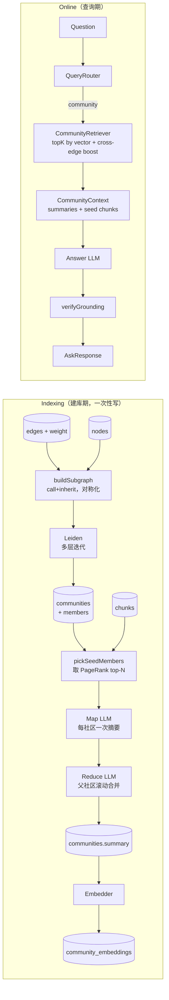
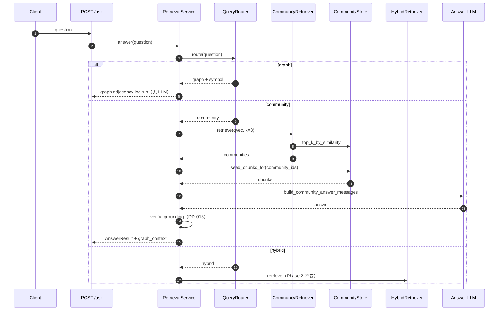

# Phase 3 — GraphRAG：Leiden（图社区划分算法，能保证「社区内部连通性」）+ 社区摘要（技术方案）

> 本文档与 [`docs/ROADMAP.md`](../ROADMAP.md) 第 3 阶段对应。
> 创建日期：2026-05-24。
> 风格与 [docs/plans/phase-1-indexer.md](phase-1-indexer.md)、[docs/plans/phase-2-retrieval.md](phase-2-retrieval.md) 一致：专有名词括号注解。

## 1. 目标对齐

路线图 Phase 3 退出指标：

- `reposage ask --route community` 能回答 *"auth 和 billing 模块如何交互"* 这类模块级（module-level，跨文件 / 跨子目录）问题，答案附 `[path:start-end]` 引用（citation，引用来源行号区间）。
- 200 题跨文件基准（[benchmarks/cross_file_qa/questions.jsonl](benchmarks/cross_file_qa/questions.jsonl)）的前 50 题写完参考答案；其中 40 道模块聚合题（aggregation question，需要把多个 chunk 合起来的题）上 `community` 路由相对 `hybrid` 路由的 Ragas（一套基于 LLM 的 RAG 评测库）`answer_correctness`（答案正确性，0–1 之间的分数）**绝对提升 ≥ 25%**。
- 演示：在 `tests/fixtures/tiny_python_repo` 或某真实 OSS 仓库上跑 *"how do the auth and billing modules interact?"*，答案引用多个模块且含社区摘要。

## 2. 行业标准对齐

| 选择 | 引用 / 默认 |
| --- | --- |
| 社区检测算法 | **Leiden**（Traag, Waltman, van Eck 2019：保证社区内部连通的 Louvain 升级版） |
| 实现库 | `python-igraph`（C 后端的图库，业内默认）+ `leidenalg`（Leiden 官方 Python 包） |
| 检测目标函数 | `RBConfigurationVertexPartition`（resolution-controlled modularity，可调节社区粒度的模块度变体），`resolution_parameter=1.0` |
| 层次结构 | 多层迭代 Leiden（multi-level，类似 Microsoft GraphRAG 2024 论文 Edge et al. 中的 Level-0 / Level-1 / Level-2） |
| 摘要范式 | **Map-Reduce summary**（Microsoft GraphRAG：先对每个叶子社区单独摘要，再向上滚动合并） |
| 边权重 | 复用 [reposage/storage/sqlite_graph.py](reposage/storage/sqlite_graph.py) 的 `edges.weight`（DD-009 已经在 Phase 1 写好） |
| 边的种类 | `call`（调用）+ `inherit`（继承）；显式排除 `import`（导入边过密，会让所有文件挤进一个社区） |
| 摘要 LLM | 复用 LiteLLM（DD-007），新增 `Settings.summarizer_model`，默认 `ollama_chat/qwen2.5-coder:3b`（更小，便于批量摘要） |
| 评测 | Ragas `answer_correctness`（LLM-judge 综合 factual + semantic 的标准指标） |
| 检索蓝本 | Microsoft GraphRAG 的 **Local Search**（局部检索：实体邻居 + 关联 chunk）形态，不做 **Global Search**（全局检索）以避免对大仓库整体扫描 |

## 3. 前后向兼容设计

- **不动 Phase 1 / 2 表**。新增三张独立表（`communities` / `community_members` / `community_embeddings`），与现有 `nodes` / `edges` / `chunks` / `embeddings` 通过 FQN（fully-qualified name，全限定名）与 `chunk_id` 关联，删表不影响主链路。
- **Protocol 抽象**：新增 `CommunityRetriever` Protocol（[reposage/retrieval/protocols.py](reposage/retrieval/protocols.py)），DD-012 模式延续；Phase 5 mmap HNSW 上线时可直接给 community embeddings 换实现而不动 service。
- **`AskResponse.graph_context`** 由 `object | None` 收紧为 `CommunityContext | None`（[reposage/api/schemas.py](reposage/api/schemas.py)）——Phase 2 始终为 null，Phase 3 起填值；客户端字段名不变，向后兼容。
- **多模型并存**：`community_embeddings.model` 列与 `embeddings.model` 同源（DD-011 多模型策略），Phase 7 升级 bge（`bge-en-v1.5` 嵌入模型）时可灰度。
- **增量索引钩子**：`communities.content_sha` 列存「社区成员 FQN + 各成员所在文件 file_sha 排序后的 sha256」。Phase 7 文件变更时，扫一遍受影响 FQN → 用同 sha 命中既有摘要复用，未命中才重摘要。
- **`reposage index --no-graphrag`** 旗标（CLI flag）：本 Phase 默认开，但保留关闭开关以便：(a) Phase 1 演示场景；(b) CI 上无 LLM 密钥时跳过摘要阶段（依然跑 Leiden，只是不写 `summary`）。
- **路由不破坏 Phase 2**：[reposage/llm/prompts.py](reposage/llm/prompts.py) 的 `ROUTER_SYSTEM` 已经包含 `community` 三分类，[reposage/services/retrieval_service.py](reposage/services/retrieval_service.py) 第 105–111 行的「community → hybrid 降级」分支被替换为真实实现；router 接口不变。
- **CommunityStore 接口**已经在 [reposage/storage/community_store.py](reposage/storage/community_store.py) 桩件里固定（`upsert / find_by_member / top_level`），Phase 3 只补实现，不动签名。

## 4. 数据流（含原子性边界）



**原子性约束**：

- Leiden + 入库在一个 SQLite 事务里：`communities` → `community_members` 一起 commit，避免半状态（half-state，crash 后既不是旧也不是新的中间态）。
- 摘要写盘是单独事务：每个社区的 `summary` / `summarized_at` 单独 UPDATE，崩溃只丢未完成的部分，下次 `reposage index` 用 `content_sha` 续跑。
- 嵌入与摘要绑定：写入 `community_embeddings` 之前先 verify `summarized_at IS NOT NULL`，确保不会嵌入一个未摘要的占位行。

## 5. SQLite schema（新增三张表）

完整字段说明同时落到 [docs/INDEX_SCHEMA.md](docs/INDEX_SCHEMA.md)：

```sql
CREATE TABLE communities(
  community_id   INTEGER PRIMARY KEY AUTOINCREMENT,
  repo           TEXT NOT NULL,
  level          INTEGER NOT NULL,            -- 0=叶子社区（最细），1+=向上滚动的父社区
  parent_id      INTEGER REFERENCES communities(community_id),
  member_count   INTEGER NOT NULL,
  subtree_size   INTEGER NOT NULL,            -- 含递归子社区的成员数（用于排序）
  content_sha    TEXT NOT NULL,               -- sha256(sorted FQNs + 成员 file_sha)，摘要复用键
  title          TEXT,                        -- LLM 给的短标签，例如 "Authentication"
  summary        TEXT,                        -- 2–3 句自然语言摘要
  summary_model  TEXT,                        -- 写出该摘要的模型字符串
  detected_at    INTEGER NOT NULL,            -- Leiden 跑完时间
  summarized_at  INTEGER                      -- 摘要完成时间；NULL 表示尚未摘要
);
CREATE INDEX communities_repo_level   ON communities(repo, level);
CREATE INDEX communities_parent       ON communities(parent_id);
CREATE INDEX communities_content_sha  ON communities(repo, content_sha);

CREATE TABLE community_members(
  community_id INTEGER NOT NULL REFERENCES communities(community_id) ON DELETE CASCADE,
  fqn          TEXT NOT NULL,
  is_seed      INTEGER NOT NULL DEFAULT 0,    -- 1 表示被 Map 阶段当作代表性成员喂给 LLM
  PRIMARY KEY (community_id, fqn)
);
CREATE INDEX community_members_fqn ON community_members(fqn);

CREATE TABLE community_embeddings(
  community_id INTEGER PRIMARY KEY REFERENCES communities(community_id) ON DELETE CASCADE,
  model        TEXT NOT NULL,
  dim          INTEGER NOT NULL,
  vector       BLOB NOT NULL,                 -- 与 embeddings 表同样的 little-endian float32 编码
  created_at   INTEGER NOT NULL
);
CREATE INDEX community_embeddings_model ON community_embeddings(model);
```

## 6. 关键文件改动

### 6.1 新建（Python）

- `reposage/indexer/graphrag/subgraph.py`：`build_igraph(store, repo, edge_kinds=("call","inherit"))` —— 从 SQLite 拉 `nodes` + `edges` → 过滤未解析（`<unresolved:*>`）→ 对称化（symmetrize：把有向调用 `a→b` 与 `b→a` 加权合成无向边） → 返回 `igraph.Graph`。
- `reposage/indexer/graphrag/seed.py`：`pick_seed_members(community, store, max_seeds=12)` —— 按入度（in-degree，多少人调用我）+ chunk 长度排序，取代表性 FQN 喂给 LLM Map 阶段。
- `reposage/retrieval/community_retriever.py`：`CommunityRetriever` Protocol + `LocalCommunityRetriever`（线性扫描社区向量，CI 不依赖 HNSW）+ `HnswCommunityRetriever`（Phase 5 留空实现，先返回 NotImplementedError）。
- `reposage/retrieval/protocols.py`：追加 `CommunityRetriever` Protocol（与 `DenseRetriever` 类似的形状：`retrieve(query_vec, top_k) -> list[CommunityHit]`）。
- `reposage/api/schemas.py`：新增 `CommunityContext`（带 `community_id / title / summary / level` 列表），把 `graph_context: object | None` 收紧为 `CommunityContext | None`。

### 6.2 实现（桩件 → 正式）

- [reposage/indexer/graphrag/community.py](reposage/indexer/graphrag/community.py)：实现 `CommunityDetector.detect`：
  1. 调 `subgraph.build_igraph` 拿无向加权图。
  2. `leidenalg.find_partition(g, RBConfigurationVertexPartition, weights="weight", resolution_parameter=self.resolution, seed=self.seed)` 得 level-0 划分。
  3. 收缩图（contract：把同一社区折成超级节点，边权累加）→ 再跑 Leiden → level-1；递归到 `max_levels`（默认 3）。
  4. 过滤 `member_count < min_size`（默认 3）的社区合并到父级，避免单元素噪声社区。
  5. 输出 `list[Community]`，`Community.parent_id` 串起层次。
- [reposage/indexer/graphrag/summarizer.py](reposage/indexer/graphrag/summarizer.py)：实现 `CommunitySummarizer.summarize`：
  1. **Map**（并行）：对每个 level-0 社区，挑 `seed` 成员 → 抓对应 chunk → 调 `LLMClient.complete(build_community_summary_messages(...))` → 抽 `title` + `summary`。
  2. **Reduce**（并行）：对每个 level-1+ 社区，把子社区的 `summary` 拼接作为输入，调 LLM 写一层摘要。
  3. `content_sha` 命中既有 row 时跳过 LLM 直接复用，**节省 token**（Microsoft GraphRAG 也是这套缓存模式）。
  4. 使用 `asyncio.Semaphore` 限并发（默认 4，避免本地 Ollama 排队）。
- [reposage/storage/community_store.py](reposage/storage/community_store.py)：实现 `init_schema / upsert / find_by_member / top_level / get_subtree / upsert_embedding / iter_embeddings_for_model`。沿用 [reposage/storage/sqlite_graph.py](reposage/storage/sqlite_graph.py) 的 `WAL + synchronous=NORMAL + foreign_keys=ON` 三件套。
- [reposage/indexer/pipeline.py](reposage/indexer/pipeline.py)：`run()` 末尾追加 stage：
  ```text
  ... resolver.resolve(extractions) → 写 nodes/edges
  if self.graphrag and not force_skip:
      communities = CommunityDetector(...).detect(symbol_graph)
      summarized  = CommunitySummarizer(...).summarize(communities, chunk_store, llm)
      community_store.upsert(summarized)
      embedder.embed([c.summary for c in summarized]) → community_store.upsert_embedding(...)
  ```
- [reposage/services/retrieval_service.py](reposage/services/retrieval_service.py)：把第 105–111 行的 community→hybrid 降级换成 `_answer_community(question, decision, t0, top_k)`：
  1. embed question
  2. `community_retriever.retrieve(qvec, top_k=3)` → top-3 社区
  3. 对每个社区，按 seed FQN 抓 1–2 个 chunk（仍走 chunk_store）作为引用源
  4. `build_community_answer_messages(question, communities, chunks)` → LLM → grounding（DD-013 不变）
  5. 填充 `AnswerResult.graph_context = CommunityContext(...)`
- [reposage/llm/prompts.py](reposage/llm/prompts.py)：新增 `build_community_summary_messages`、`build_community_answer_messages`；后者把社区摘要放在 `<community summary="..." level="...">` 块，**chunk 仍按 Phase 2 `<retrieved_chunk>` 格式**，保证 grounding 校验器不用动。
- [reposage/cli.py](reposage/cli.py)：`reposage index` 加 `--no-graphrag` 开关；`reposage ask --route community` 现在真的会跑社区路径而不是被服务层悄悄降级。
- [reposage/config.py](reposage/config.py)：新增
  ```python
  summarizer_model: str = "ollama_chat/qwen2.5-coder:3b"
  community_resolution: float = 1.0
  community_max_levels: int = 3
  community_min_size: int = 3
  community_summary_concurrency: int = 4
  ```

### 6.3 配置 / 工具

- [pyproject.toml](pyproject.toml)：加 `python-igraph>=0.11`、`leidenalg>=0.10`。两者都是纯 Python wheel + 预编译 C，安装无需系统编译器。
- [Makefile](Makefile)：新增 `bench-qa-community`：跑前 50 题，分 `--route community` 与 `--route hybrid` 两份成绩，输出 Ragas `answer_correctness` 差值。
- [.github/workflows/eval-gate.yml](.github/workflows/eval-gate.yml)：`run-eval` 标签 PR 上额外跑 `bench-qa-community`（mock LLM 模式，仅校验链路，不卡分值）；每周一 cron 用真实 LLM 跑硬门槛（≥ 25% 绝对提升）。

## 7. 路由 / 检索流程契约



`AskResponse.graph_context` 在 community 路由下填充：

```json
{
  "graph_context": {
    "communities": [
      {"community_id": 17, "title": "Authentication", "level": 0, "summary": "..."},
      {"community_id": 23, "title": "Billing",        "level": 0, "summary": "..."}
    ]
  }
}
```

## 8. 测试矩阵

### 单测（[tests/unit/](tests/unit/)，不依赖大模型 / Go）

- `test_subgraph.py`：构造已知图，断言对称化后边权 = `weight(a→b) + weight(b→a)`，未解析 dst 被过滤。
- `test_community_detector.py`：构造一个明显的「两团 + 一座桥」拓扑，断言 Leiden 划成 2 个社区；固定 seed → 划分稳定。
- `test_community_store.py`：roundtrip（写入再读取一致）、`content_sha` 不变时摘要复用、CASCADE 删除（删除社区时 `community_members` / `community_embeddings` 同步消失）。
- `test_community_summarizer.py`：用 `MockLLMClient` 跑 Map+Reduce；第二次跑相同输入 → LLM 调用 0 次（验证 sha 缓存）。
- `test_community_retriever.py`：3 个社区固定向量 + 一个 query，`LocalCommunityRetriever` 返回正确顺序；空索引返回空列表。
- `test_prompts.py`（扩展）：`build_community_answer_messages` 同时含 `<community>` 与 `<retrieved_chunk>` 块；`build_community_summary_messages` 不泄漏行号占位符。

### 集成（[tests/integration/](tests/integration/)）

- `test_graphrag_e2e.py`：`tiny_python_repo` + `HashEmbedder` + `MockLLMClient`：跑 `IndexPipeline` → 断言至少 2 个社区、每个社区都有非空 `summary`；调 `RetrievalService.answer("how do auth and billing interact?", route_hint="community")` → 答案非空、`grounded=True`、`graph_context.communities` ≥ 2 条。
- `test_qa_bench.py`（pytest mark `requires_ollama`，可选）：跑 `benchmarks/cross_file_qa` 前 50 题，断言 community vs hybrid `answer_correctness` 差值 ≥ 0.25。

### Bench

- [benchmarks/cross_file_qa/questions.jsonl](benchmarks/cross_file_qa/questions.jsonl)：扩到 50 条（含 40 道模块聚合题 + 5 道 graph 路由对照 + 5 道 hybrid 路由对照），每条带 `reference_answer` 和 `expected_citations: [{path, lines}]`。
- [benchmarks/cross_file_qa/run_eval.py](benchmarks/cross_file_qa/run_eval.py)：从当前 stub 改为真实 harness：
  - 对每题跑 `--route community` 与 `--route hybrid`
  - 算 Ragas `answer_correctness`、citation 合法率（cited path:line 必须真实落在 expected 范围 ±5 行内）、端到端延迟 P50 / P95
  - 输出 `results/<date>.csv` + Markdown 表写到 [docs/BENCHMARKS.md](docs/BENCHMARKS.md)（DD：「BENCHMARKS.md 是对外数字的唯一来源」）
- `make bench-qa` 把 `bench-qa-community` 合进来，与 [benchmarks/rag/run_eval.py](benchmarks/rag/run_eval.py)（Phase 2 已有）解耦。

## 9. 非目标（Phase 3 不做）

- **TypeScript / JavaScript / Go 的社区检测**：Phase 1 这些文件只在 `file_meta.parse_status='unsupported'`，没有 nodes/edges 喂给 Leiden（DD-010）。Phase 7 接入 resolver 后社区检测自动生效，本 Phase 不为此动代码。
- **Microsoft GraphRAG 的 Global Search**：「全局搜索」需要把所有 community report 灌进上下文做大型聚合，对大仓库消耗巨大。仅做 Local Search（top-K 社区 + 邻居），Phase 7 视效果再决定。
- **Claim Extraction**（Microsoft GraphRAG 论文里从社区摘要里抽取"声明"再走二次检索）：留 Phase 6 / 7。
- **社区动态可视化**：路线图未要求，不做。
- **community embedding 上 HNSW**：本 Phase 走 `LocalCommunityRetriever`（numpy 线性扫描，社区数 ≪ chunk 数，~几十到几百，线性扫描已经 < 5 ms）。Phase 5 mmap HNSW 上线后再切。
- **跨仓库社区**：communities.repo 是必填，单仓库范围内的社区。多仓库联邦留给 Phase 8。

## 10. 风险与对策

- **风险：本地 qwen2.5-coder:3b 摘要质量不稳定**。
  - 对策：Map 阶段加 `temperature=0.0`、最大 token 限制；摘要为空或低于 20 字符时重试一次；连续失败则在 `summary` 字段写 `"<auto-summary unavailable>"` 但仍写入嵌入（用 title 占位）。CI（mock 模式）保证链路绿，质量门槛只在周一 cron 真实 LLM 跑。
- **风险：Leiden 不稳定 / 重建后社区 id 漂移**。
  - 对策：`seed=1337` 固定（DD-003 已记）；`content_sha` 用于跨次重建复用摘要；不向客户端暴露 `community_id` 作为长期主键，对外只 quote `title`。
- **风险：摘要 LLM token 开销**。
  - 对策：sha 缓存 + 限 seed 数量（默认 ≤ 12）+ chunk 截断（每个 seed ≤ 80 行）；增量重索引时只重摘 `content_sha` 变化的社区。
- **风险：50 kLOC 仓库上 Leiden 慢**。
  - 对策：50 kLOC 大约 5–10 k 节点、20–40 k 边，`leidenalg` 在该规模 < 2 s；超过 10× 规模时切到 `la.find_partition` 的多次 random restart 降为 1 次（accuracy/latency tradeoff，留 Phase 6 性能 pass）。
- **风险：community 路由召回相关社区为 0**。
  - 对策：retriever 拿不到任何候选时（例如未索引的库），降级为 hybrid 并在 `AnswerResult.route` 标 `community→hybrid`，可观测，不报错。
- **风险：grounding 对社区摘要句失败**。
  - 对策：摘要句不算 citation 来源；prompt 显式约束 `[path:start-end]` 只能从 `<retrieved_chunk>` 取（与 Phase 2 一致）；摘要块 `<community>` 不带 path / line 字段，无法伪造引用。

## 11. 演示命令

### 本地一键端到端（mock LLM，无密钥）

```bash
REPOSAGE_PROFILE=mock \
  python -m reposage.cli index --repo tests/fixtures/tiny_python_repo --force

REPOSAGE_PROFILE=mock \
  python -m reposage.cli ask "how do the auth and billing modules interact?" --route community
```

### 真实 LLM（本地 Ollama）

```bash
ollama pull qwen2.5-coder:3b
ollama pull qwen2.5-coder:7b
python -m reposage.cli index --repo path/to/your/repo --force
python -m reposage.cli ask "how do the auth and billing modules interact?" --route community
```

### 退出指标全量回放

```bash
make lint && make typecheck
make test                 # unit + integration（mock LLM，跳过 ollama mark）
make bench-graph          # Phase 1 复测
make bench-rag            # Phase 2 复测
make bench-qa             # Phase 3 新增：50 题 community vs hybrid，硬门槛 +25% (周一 cron 跑真实 LLM)
make hnsw-test
```
