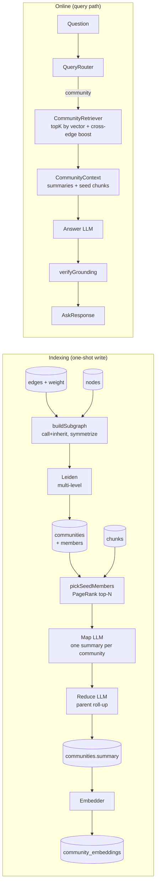
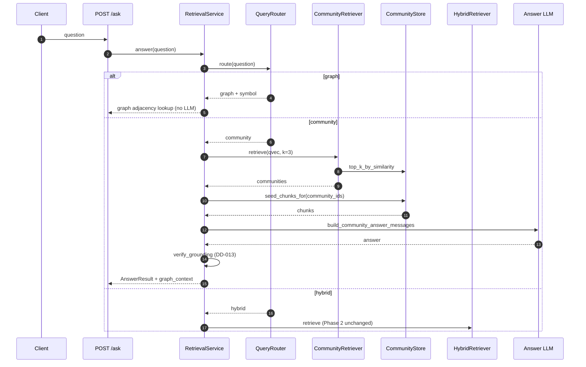

# Phase 3 — GraphRAG: Leiden + community summaries (technical design)

> Corresponds to stage 3 of [`docs/ROADMAP.md`](../ROADMAP.md).
> Created: 2026-05-24.
> Style matches [docs/plans/phase-1-indexer.md](phase-1-indexer.md) and [docs/plans/phase-2-retrieval.md](phase-2-retrieval.md).

## 1. Goal alignment

Roadmap Phase 3 exit criteria:

- `reposage ask --route community` can answer module-level questions such as *"how do the auth and billing modules interact"*, with `[path:start-end]` citations.
- Of the 200-question cross-file bench ([benchmarks/cross_file_qa/questions.jsonl](../../benchmarks/cross_file_qa/questions.jsonl)), write reference answers for the first 50; on 40 aggregation questions (questions that must combine multiple chunks), the `community` route must beat the `hybrid` route by **≥ 25% absolute** on Ragas `answer_correctness`.
- Demo: on `tests/fixtures/tiny_python_repo` or a real OSS repo, run *"how do the auth and billing modules interact?"*; the answer cites multiple modules and includes community summaries.

## 2. Industry-standard alignment

| Choice | Citation / default |
| --- | --- |
| Community detection | **Leiden** (Traag, Waltman, van Eck 2019: Louvain successor with guaranteed intra-community connectivity) |
| Library | `python-igraph` (C-backed, industry default) + `leidenalg` (official Leiden Python package) |
| Objective | `RBConfigurationVertexPartition` (resolution-controlled modularity), `resolution_parameter=1.0` |
| Hierarchy | Multi-level iterative Leiden (Level-0 / Level-1 / Level-2 as in Microsoft GraphRAG 2024, Edge et al.) |
| Summary paradigm | **Map-Reduce summary** (Microsoft GraphRAG: summarize each leaf community, then roll up) |
| Edge weights | Reuse `edges.weight` from [reposage/storage/sqlite_graph.py](../../reposage/storage/sqlite_graph.py) (DD-009, written in Phase 1) |
| Edge kinds | `call` + `inherit`; explicitly exclude `import` (too dense; would collapse files into one community) |
| Summarizer LLM | Reuse LiteLLM (DD-007); new `Settings.summarizer_model`, default `ollama_chat/qwen2.5-coder:3b` (smaller, for batch summaries) |
| Eval | Ragas `answer_correctness` (LLM-judge combining factual + semantic) |
| Retrieval blueprint | Microsoft GraphRAG **Local Search** (entity neighbors + related chunks); skip **Global Search** to avoid scanning the whole large repo |

## 3. Forward- and backward-compatible design

- **Do not change Phase 1 / 2 tables**. Add three independent tables (`communities` / `community_members` / `community_embeddings`), joined to existing `nodes` / `edges` / `chunks` / `embeddings` via FQN and `chunk_id`. Dropping them does not affect the main path.
- **Protocol**: add `CommunityRetriever` ([reposage/retrieval/protocols.py](../../reposage/retrieval/protocols.py)), continuing DD-012; Phase 5 mmap HNSW can swap the community-embedding implementation without touching the service.
- **`AskResponse.graph_context`** tightens from `object | None` to `CommunityContext | None` ([reposage/api/schemas.py](../../reposage/api/schemas.py)) — Phase 2 always null, Phase 3 fills it; client field name unchanged, backward compatible.
- **Multi-model coexistence**: `community_embeddings.model` shares the same strategy as `embeddings.model` (DD-011); Phase 7 can grey-switch bge (`bge-en-v1.5`).
- **Incremental-index hook**: `communities.content_sha` stores sha256 of (sorted member FQNs + each member’s `file_sha`). On Phase 7 file changes, scan affected FQNs → reuse summaries with the same sha; re-summarize only on miss.
- **`reposage index --no-graphrag` flag**: on by default this phase, but keep an off switch for (a) Phase 1 demo scenarios; (b) CI without an LLM key (still run Leiden, skip writing `summary`).
- **Routing does not break Phase 2**: `ROUTER_SYSTEM` in [reposage/llm/prompts.py](../../reposage/llm/prompts.py) already has the `community` third class; the “community → hybrid fallback” at [reposage/services/retrieval_service.py](../../reposage/services/retrieval_service.py) lines 105–111 is replaced with a real implementation; router interface unchanged.
- **CommunityStore API** is already fixed in the [reposage/storage/community_store.py](../../reposage/storage/community_store.py) stub (`upsert / find_by_member / top_level`); Phase 3 only fills the implementation, not the signature.

## 4. Data flow (including atomicity)



**Atomicity**:

- Leiden + persist in one SQLite transaction: `communities` → `community_members` commit together, avoiding a half-state.
- Summary writes are a separate transaction: each community’s `summary` / `summarized_at` is its own UPDATE; a crash only loses unfinished work; the next `reposage index` resumes via `content_sha`.
- Embeddings are bound to summaries: before writing `community_embeddings`, verify `summarized_at IS NOT NULL` so a placeholder row is never embedded.

## 5. SQLite schema (three new tables)

Full field docs also land in [docs/INDEX_SCHEMA.md](../INDEX_SCHEMA.md):

```sql
CREATE TABLE communities(
  community_id   INTEGER PRIMARY KEY AUTOINCREMENT,
  repo           TEXT NOT NULL,
  level          INTEGER NOT NULL,            -- 0=leaf (finest), 1+=rolled-up parent
  parent_id      INTEGER REFERENCES communities(community_id),
  member_count   INTEGER NOT NULL,
  subtree_size   INTEGER NOT NULL,            -- member count including recursive children (for ranking)
  content_sha    TEXT NOT NULL,               -- sha256(sorted FQNs + member file_sha), summary reuse key
  title          TEXT,                        -- short LLM label, e.g. "Authentication"
  summary        TEXT,                        -- 2–3 sentence natural-language summary
  summary_model  TEXT,                        -- model string that wrote the summary
  detected_at    INTEGER NOT NULL,            -- when Leiden finished
  summarized_at  INTEGER                      -- when summary finished; NULL = not yet summarized
);
CREATE INDEX communities_repo_level   ON communities(repo, level);
CREATE INDEX communities_parent       ON communities(parent_id);
CREATE INDEX communities_content_sha  ON communities(repo, content_sha);

CREATE TABLE community_members(
  community_id INTEGER NOT NULL REFERENCES communities(community_id) ON DELETE CASCADE,
  fqn          TEXT NOT NULL,
  is_seed      INTEGER NOT NULL DEFAULT 0,    -- 1 = used as a representative member in the Map stage
  PRIMARY KEY (community_id, fqn)
);
CREATE INDEX community_members_fqn ON community_members(fqn);

CREATE TABLE community_embeddings(
  community_id INTEGER PRIMARY KEY REFERENCES communities(community_id) ON DELETE CASCADE,
  model        TEXT NOT NULL,
  dim          INTEGER NOT NULL,
  vector       BLOB NOT NULL,                 -- same little-endian float32 encoding as embeddings
  created_at   INTEGER NOT NULL
);
CREATE INDEX community_embeddings_model ON community_embeddings(model);
```

## 6. Key file changes

### 6.1 New (Python)

- `reposage/indexer/graphrag/subgraph.py`: `build_igraph(store, repo, edge_kinds=("call","inherit"))` — load `nodes` + `edges` from SQLite → filter unresolved (`<unresolved:*>`) → symmetrize (merge directed `a→b` and `b→a` into a weighted undirected edge) → return `igraph.Graph`.
- `reposage/indexer/graphrag/seed.py`: `pick_seed_members(community, store, max_seeds=12)` — rank by in-degree + chunk length, pick representative FQNs for the LLM Map stage.
- `reposage/retrieval/community_retriever.py`: `CommunityRetriever` Protocol + `LocalCommunityRetriever` (linear scan of community vectors, CI needs no HNSW) + `HnswCommunityRetriever` (Phase 5 stub, returns NotImplementedError for now).
- `reposage/retrieval/protocols.py`: add `CommunityRetriever` Protocol (same shape as `DenseRetriever`: `retrieve(query_vec, top_k) -> list[CommunityHit]`).
- `reposage/api/schemas.py`: add `CommunityContext` (list of `community_id / title / summary / level`); tighten `graph_context: object | None` to `CommunityContext | None`.

### 6.2 Implementation (stub → real)

- [reposage/indexer/graphrag/community.py](../../reposage/indexer/graphrag/community.py): implement `CommunityDetector.detect`:
  1. `subgraph.build_igraph` for an undirected weighted graph.
  2. `leidenalg.find_partition(g, RBConfigurationVertexPartition, weights="weight", resolution_parameter=self.resolution, seed=self.seed)` for the level-0 partition.
  3. Contract (fold each community into a supernode, sum edge weights) → Leiden again → level-1; recurse to `max_levels` (default 3).
  4. Merge communities with `member_count < min_size` (default 3) into the parent, to drop singleton noise.
  5. Emit `list[Community]` with `Community.parent_id` linking the hierarchy.
- [reposage/indexer/graphrag/summarizer.py](../../reposage/indexer/graphrag/summarizer.py): implement `CommunitySummarizer.summarize`:
  1. **Map** (parallel): for each level-0 community, pick `seed` members → fetch chunks → `LLMClient.complete(build_community_summary_messages(...))` → extract `title` + `summary`.
  2. **Reduce** (parallel): for each level-1+ community, concatenate child `summary` values and ask the LLM for one more layer.
  3. On `content_sha` hit of an existing row, skip the LLM and reuse — **saves tokens** (same cache pattern as Microsoft GraphRAG).
  4. `asyncio.Semaphore` concurrency cap (default 4, to avoid local Ollama queueing).
- [reposage/storage/community_store.py](../../reposage/storage/community_store.py): implement `init_schema / upsert / find_by_member / top_level / get_subtree / upsert_embedding / iter_embeddings_for_model`. Same `WAL + synchronous=NORMAL + foreign_keys=ON` trio as [reposage/storage/sqlite_graph.py](../../reposage/storage/sqlite_graph.py).
- [reposage/indexer/pipeline.py](../../reposage/indexer/pipeline.py): append a stage at the end of `run()`:
  ```text
  ... resolver.resolve(extractions) → write nodes/edges
  if self.graphrag and not force_skip:
      communities = CommunityDetector(...).detect(symbol_graph)
      summarized  = CommunitySummarizer(...).summarize(communities, chunk_store, llm)
      community_store.upsert(summarized)
      embedder.embed([c.summary for c in summarized]) → community_store.upsert_embedding(...)
  ```
- [reposage/services/retrieval_service.py](../../reposage/services/retrieval_service.py): replace the community→hybrid fallback at lines 105–111 with `_answer_community(question, decision, t0, top_k)`:
  1. embed question
  2. `community_retriever.retrieve(qvec, top_k=3)` → top-3 communities
  3. for each community, fetch 1–2 chunks by seed FQN (still via chunk_store) as citation sources
  4. `build_community_answer_messages(question, communities, chunks)` → LLM → grounding (DD-013 unchanged)
  5. set `AnswerResult.graph_context = CommunityContext(...)`
- [reposage/llm/prompts.py](../../reposage/llm/prompts.py): add `build_community_summary_messages`, `build_community_answer_messages`; the latter puts community summaries in `<community summary="..." level="...">` blocks, **chunks still use the Phase 2 `<retrieved_chunk>` format**, so the grounding checker is unchanged.
- [reposage/cli.py](../../reposage/cli.py): `reposage index` gets `--no-graphrag`; `reposage ask --route community` actually runs the community path instead of silently falling back in the service layer.
- [reposage/config.py](../../reposage/config.py): add
  ```python
  summarizer_model: str = "ollama_chat/qwen2.5-coder:3b"
  community_resolution: float = 1.0
  community_max_levels: int = 3
  community_min_size: int = 3
  community_summary_concurrency: int = 4
  ```

### 6.3 Config / tooling

- [pyproject.toml](../../pyproject.toml): add `python-igraph>=0.11`, `leidenalg>=0.10`. Both are pure-Python wheels + prebuilt C; no system compiler required.
- [Makefile](../../Makefile): add `bench-qa-community`: first 50 questions, `--route community` vs `--route hybrid`, report the Ragas `answer_correctness` delta.
- [.github/workflows/eval-gate.yml](../../.github/workflows/eval-gate.yml): extra `bench-qa-community` on PRs labeled `run-eval` (mock LLM, path check only, no score gate); Monday cron runs the real LLM hard gate (≥ 25% absolute lift).

## 7. Route / retrieval contract



`AskResponse.graph_context` on the community route:

```json
{
  "graph_context": {
    "communities": [
      {"community_id": 17, "title": "Authentication", "level": 0, "summary": "..."},
      {"community_id": 23, "title": "Billing",        "level": 0, "summary": "..."}
    ]
  }
}
```

## 8. Test matrix

### Unit ([tests/unit/](../../tests/unit/), no large models / no Go)

- `test_subgraph.py`: known graph; after symmetrize, edge weight = `weight(a→b) + weight(b→a)`; unresolved dst filtered.
- `test_community_detector.py`: a clear “two clusters + one bridge” topology splits into 2 communities; fixed seed → stable partition.
- `test_community_store.py`: roundtrip, summary reuse when `content_sha` is unchanged, CASCADE delete (`community_members` / `community_embeddings` go with the community).
- `test_community_summarizer.py`: Map+Reduce with `MockLLMClient`; second run on the same input → 0 LLM calls (sha cache).
- `test_community_retriever.py`: 3 communities with fixed vectors + one query; `LocalCommunityRetriever` returns the right order; empty index returns `[]`.
- `test_prompts.py` (extended): `build_community_answer_messages` contains both `<community>` and `<retrieved_chunk>` blocks; `build_community_summary_messages` does not leak line-number placeholders.

### Integration ([tests/integration/](../../tests/integration/))

- `test_graphrag_e2e.py`: `tiny_python_repo` + `HashEmbedder` + `MockLLMClient`: run `IndexPipeline` → at least 2 communities, each with a non-empty `summary`; `RetrievalService.answer("how do auth and billing interact?", route_hint="community")` → non-empty answer, `grounded=True`, `graph_context.communities` ≥ 2.
- `test_qa_bench.py` (pytest mark `requires_ollama`, optional): first 50 of `benchmarks/cross_file_qa`; assert community vs hybrid `answer_correctness` delta ≥ 0.25.

### Bench

- [benchmarks/cross_file_qa/questions.jsonl](../../benchmarks/cross_file_qa/questions.jsonl): grow to 50 items (40 module aggregation + 5 graph-route controls + 5 hybrid-route controls), each with `reference_answer` and `expected_citations: [{path, lines}]`.
- [benchmarks/cross_file_qa/run_eval.py](../../benchmarks/cross_file_qa/run_eval.py): turn the stub into a real harness:
  - run `--route community` and `--route hybrid` per question
  - compute Ragas `answer_correctness`, citation validity (cited path:line must fall in expected range ±5 lines), end-to-end P50 / P95
  - write `results/<date>.csv` + a Markdown table into [docs/BENCHMARKS.md](../BENCHMARKS.md) (DD: “BENCHMARKS.md is the sole public source of numbers”)
- `make bench-qa` folds in `bench-qa-community`, decoupled from [benchmarks/rag/run_eval.py](../../benchmarks/rag/run_eval.py) (already in Phase 2).

## 9. Non-goals (not in Phase 3)

- **Community detection for TypeScript / JavaScript / Go**: Phase 1 only marks these in `file_meta.parse_status='unsupported'`; no nodes/edges for Leiden (DD-010). After Phase 7 attaches resolvers, detection works automatically; this phase does not special-case them.
- **Microsoft GraphRAG Global Search**: stuffing every community report into context for a large aggregation is too expensive on big repos. Local Search only (top-K communities + neighbors); revisit in Phase 7 based on results.
- **Claim Extraction** (second-pass retrieval from claims extracted from community summaries, per the GraphRAG paper): leave to Phase 6 / 7.
- **Live community visualization**: not on the roadmap.
- **HNSW for community embeddings**: this phase uses `LocalCommunityRetriever` (numpy linear scan; community count ≪ chunk count, tens to hundreds, scan already < 5 ms). Switch after Phase 5 mmap HNSW.
- **Cross-repo communities**: `communities.repo` is required; communities are per-repo. Multi-repo federation is Phase 8.

## 10. Risks and mitigations

- **Risk: local qwen2.5-coder:3b summary quality is unstable**.
  - Mitigation: Map stage `temperature=0.0` and a max-token cap; retry once if the summary is empty or under 20 characters; after consecutive failures write `"<auto-summary unavailable>"` in `summary` but still write an embedding (title as placeholder). CI (mock) keeps the path green; the quality gate runs only on Monday cron with a real LLM.
- **Risk: Leiden is unstable / community ids drift across rebuilds**.
  - Mitigation: `seed=1337` fixed (already in DD-003); `content_sha` reuses summaries across rebuilds; do not expose `community_id` to clients as a durable key — quote `title` only.
- **Risk: summarizer LLM token cost**.
  - Mitigation: sha cache + seed cap (default ≤ 12) + chunk truncation (each seed ≤ 80 lines); incremental reindex re-summarizes only communities whose `content_sha` changed.
- **Risk: Leiden is slow on a 50 kLOC repo**.
  - Mitigation: 50 kLOC is roughly 5–10 k nodes, 20–40 k edges; `leidenalg` at that size is < 2 s; at 10× scale, drop `la.find_partition` random restarts from many to 1 (accuracy/latency tradeoff, Phase 6 performance pass).
- **Risk: community route recalls zero related communities**.
  - Mitigation: if the retriever returns no candidates (e.g. unindexed library), fall back to hybrid and mark `AnswerResult.route` as `community→hybrid` — observable, not an error.
- **Risk: grounding fails on community-summary sentences**.
  - Mitigation: summary sentences are not citation sources; the prompt requires `[path:start-end]` only from `<retrieved_chunk>` (same as Phase 2); `<community>` blocks have no path / line fields, so they cannot fabricate citations.

## 11. Demo commands

### Local one-shot end-to-end (mock LLM, no key)

```bash
REPOSAGE_PROFILE=mock \
  python -m reposage.cli index --repo tests/fixtures/tiny_python_repo --force

REPOSAGE_PROFILE=mock \
  python -m reposage.cli ask "how do the auth and billing modules interact?" --route community
```

### Real LLM (local Ollama)

```bash
ollama pull qwen2.5-coder:3b
ollama pull qwen2.5-coder:7b
python -m reposage.cli index --repo path/to/your/repo --force
python -m reposage.cli ask "how do the auth and billing modules interact?" --route community
```

### Full exit-criteria replay

```bash
make lint && make typecheck
make test                 # unit + integration (mock LLM, skip ollama mark)
make bench-graph          # Phase 1 recheck
make bench-rag            # Phase 2 recheck
make bench-qa             # Phase 3: 50 questions community vs hybrid, hard gate +25% (Monday cron, real LLM)
make hnsw-test
```
