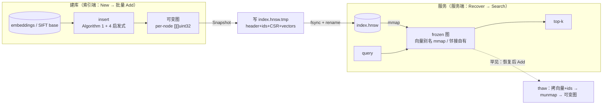
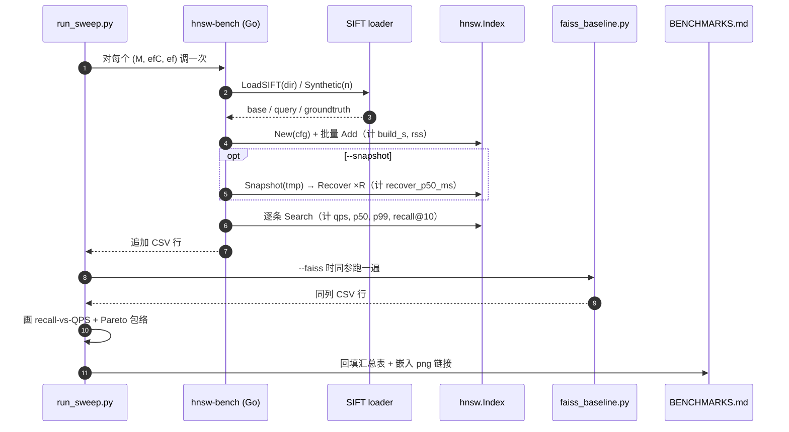

# Phase 4 — go-hnsw v2：持久化（persistence，索引落盘后可秒级重载）+ SIFT-1M 基准（技术方案）

> 本文档与 [`docs/ROADMAP.md`](../ROADMAP.md) 第 4 阶段对应。
> 创建日期：2026-06-12。
> 风格与 [docs/plans/phase-1-indexer.md](phase-1-indexer.md)、[docs/plans/phase-2-retrieval.md](phase-2-retrieval.md)、[docs/plans/phase-3-graphrag.md](phase-3-graphrag.md) 一致：专有名词括号注解。
> 历史注记：早期源码注释把"持久化 / 基准"标为 Phase 5、把"并发"标为 Phase 6。路线图在 commit `6fa8fe1` 重排后，**持久化 + SIFT-1M 基准 = Phase 4**，**加固 + 并发 = Phase 5**。本方案以路线图为准，并顺手把过期注释改正。

## 1. 目标对齐

路线图 Phase 4 退出指标与交付物：

- **mmap（memory-mapped file，把文件直接映射进进程地址空间、由内核按页惰性载入）快照/恢复**，采用 [`docs/ARCHITECTURE.md`](../ARCHITECTURE.md) §5 承诺的 **CSR（Compressed Sparse Row，压缩稀疏行——用「行偏移数组 + 扁平数据数组」表示变长邻接表）** 邻接格式。
- **启发式邻居选择（Algorithm 4 / SELECT-NEIGHBORS-HEURISTIC，Malkov & Yashunin 2018）** 替换 Phase 2 的朴素「取最近 M 个」（Algorithm 3），并确认层级乘子（level multiplier，`mL = 1/ln(M)`）采样正确。
- **原子快照写入**（atomic write：先写 `*.tmp` 再 `rename` 覆盖，崩溃也不会留下半截文件）。
- `cmd/bench` 的 SIFT-1M 基准：构建耗时 / recall@10（召回率，返回的前 10 个里有几个属于真正的前 10）/ QPS（queries per second，单线程每秒查询数）/ P50 / P99 / RSS（Resident Set Size，进程常驻物理内存）。
- [`benchmarks/sift1m/run_sweep.py`](../../benchmarks/sift1m/run_sweep.py) 扫描驱动（sweep driver：跑遍参数网格）。
- Recall-vs-QPS 的 **Pareto 前沿图**（Pareto frontier：在「召回更高」与「更快」之间不被任何其它配置同时碾压的点集）提交到 [`docs/BENCHMARKS.md`](../BENCHMARKS.md)。
- 同一硬件上的 **Faiss 基线**（Facebook AI Similarity Search，业界 ANN 标准库）。

**硬性退出指标**：

1. Pareto 曲线已发布（go-hnsw 与 Faiss-HNSWFlat 两条线 + 如实差距说明）。
2. **1M × 128-d 从快照重载 P50 < 200 ms**。

## 2. 行业标准对齐

| 选择 | 引用 / 默认 |
| --- | --- |
| 邻居选择 | **Algorithm 4 启发式**（RNG-style pruning，relative neighborhood graph 风格剪枝：一个候选只有"离 query 比离任何已选邻居都近"才入选，产生多样化的长短边） |
| 启发式参数 | `extendCandidates=false`、`keepPrunedConnections=true`（与 `hnswlib` 默认一致，保证邻居数填满 M） |
| 层级采样 | `level = floor(-ln(U(0,1]) · mL)`，`mL = 1/ln(M)`（论文 §4.1） |
| 持久化布局 | mmap 友好：向量连续 arena（vectors arena）+ CSR 邻接，向量段放文件尾且 64B 对齐 |
| 原子性 | `O_CREATE` 写 `*.hnsw.tmp` → `fsync` → `rename`（POSIX rename 同目录原子覆盖） |
| 基准数据集 | **SIFT-1M**（TEXMEX corpus：1M base × 128-d、10k query、每 query 100 个 ground-truth 近邻，**L2 度量**） |
| 数据格式 | `.fvecs`（每条 `int32 dim` + `dim × float32`）/ `.ivecs`（ground-truth，`int32 dim` + `dim × int32`） |
| 召回口径 | recall@10 = `|返回top10 ∩ 真值top10| / 10`，对全部 query 取平均（ANN-Benchmarks 口径） |
| 对照基线 | **Faiss `IndexHNSWFlat`**（同 M / efConstruction / efSearch、同硬件、单线程） |
| 报告纪律 | 「若 go-hnsw 比 Faiss 慢 N×，就如实写 N」（[`benchmarks/sift1m/README.md`](../../benchmarks/sift1m/README.md) 既有约定，DD-001 also） |
| 时延口径 | 单线程逐条 query，记录每条 wall-clock，报 P50 / P99（不混入预热那一条） |

## 3. 前后向兼容设计

- **算法核心 API 不破坏**：`hnsw.New / Index.Add / Index.Search / Index.Len` 签名不变。新增 `Index.Snapshot(path)`、`hnsw.Recover(path)`、`Index.Close()` 三个方法（`persist.go` 里原本就是返回 `not implemented` 的桩件，本 Phase 落实）。
- **Config 向后兼容**：新增字段 `Metric`（度量枚举）与 `Heuristic bool`。两者的零值（`MetricCosine` / `false`）+ `DefaultConfig` 的显式赋值保证旧调用方行为不变；旧代码若直接塞 `cfg.Distance` 仍可用（`New` 优先用显式 `Distance`，否则按 `Metric` 解析）。
- **gRPC 契约不动**：因本机缺 `protoc-gen-go` 插件，**本 Phase 不改 [`proto/hnsw.proto`](../../proto/hnsw.proto)**、不重生成 stub。快照/恢复挂在 **server 进程生命周期**（启动时若有快照则 `Recover`，否则维持 Phase 2 的「从 SQLite 冷载」；`--snapshot-on-exit` 退出时落盘）。`Snapshot` 作为 gRPC RPC 列为**可选延后项**（见 §9），等 Phase 5 顺手补插件时再加，届时 Python 侧 `hnsw_client.py` 零改动。
- **磁盘格式带版本号**：header 里 `version=2`、`magic="HNSW"`。`Recover` 校验 magic + version，遇到未知版本**显式报错**而非误读，给 Phase 5/7 演进留空间。
- **`.gitignore` 已覆盖**：`*.hnsw` / `*.mmap` / `data/` / `benchmarks/**/*.csv` 都已忽略，快照与基准产物不会误提交。
- **Python 配置新增可选项**：[`reposage/config.py`](../../reposage/config.py) 复用既有 `hnsw_data_dir`，新增 `hnsw_snapshot_path`（默认 `<hnsw_data_dir>/index.hnsw`）。未配置时行为同 Phase 2（冷载 SQLite），不影响现有 `test-grpc` 集成测试。
- **度量自洽**：SIFT 是 L2，RepoSage 嵌入是 cosine。`Metric` 写进快照头，`Recover` 据此还原 `DistanceFunc`，避免「用错距离重载」的隐患。

## 4. 磁盘格式（go-hnsw v2 快照）

所有整数小端（little-endian，x86-64 / arm64 原生序，CI 与开发机均如此；大端平台在 `Recover` 处直接 panic 并注明不支持）。

```text
┌──────────────────────────────────────────────────────────────────────┐
│ header（固定 64 字节）                                                 │
│   magic[4]="HNSW" | version u16=2 | metric u8 | _pad u8                │
│   dim u32 | M u32 | maxM u32 | efConstruction u32 | efSearch u32       │
│   maxLevel u32 | entry u32 | _pad u32 | n u64 | levelMult f64 | seed i64│
├──────────────────────────────────────────────────────────────────────┤
│ idOff   : (n+1) × u64   每个节点 id 字符串在 idData 中的字节偏移        │
│ idData  : 打包的 id 字节（idOff[n] 字节）                              │
│ levels  : n × u16       每个节点的最高层 L_i（共 L_i+1 层）            │
│ off0    : (n+1) × u64   第 0 层 CSR 行偏移（单位：u32 个数）           │
│ adj0    : off0[n] × u32  第 0 层邻居（连续，搜索热路径的缓存局部性来源） │
│ offU    : (n+1) × u64   第 1+ 层打包 blob 的 CSR 行偏移                 │
│ adjU    : offU[n] × u32  第 1+ 层邻居 blob：每节点为 [count u32, ids…]   │
│           按 lc=1..L_i 顺序拼接                                        │
├──────────────────────────────────────────────────────────────────────┤
│ PAD     : 对齐到 64 字节边界                                           │
│ vectors : n·dim × f32   连续向量 arena —— mmap 的惰性载入对象（大头）   │
└──────────────────────────────────────────────────────────────────────┘
```

**为什么这样切**：

- **向量放文件尾 + 64B 对齐**：`Recover` 把整文件 `mmap`，向量段以 `unsafe` 别名（alias，不拷贝）成 `[]float32`，内核按页惰性载入。1M×128 = 512 MB 向量若靠 `read` 拷贝，单这一步就破 200 ms 预算；mmap 让 `Recover` 几乎只花在解析小数组上。
- **第 0 层单独 CSR**：搜索绝大部分时间在第 0 层 beam search，连续 `adj0` 给顺序扫描喂满缓存行（cache line）。
- **上层打包成一段 blob**：层 ≥ 1 的邻居极少，按节点打包进 `adjU`，避免为每层单独建偏移数组。
- **id 列式 + 惰性**：`Recover` **不**预构造 1M 个 Go string，也**不**重建 `idIndex` map（id→内部下标）。`Search` 只为 topK 命中按 `idData[idOff[i]:idOff[i+1]]` 即时取串；`idIndex` 只在「恢复后又收到 `Add`」时惰性重建。这把 `Recover` 的逐节点开销压到接近零。

**冻结（frozen）与解冻（thaw）**：

- `Recover` 得到的索引是 **frozen**：向量别名只读 mmap，邻接为「批量分配的自有切片」（owned slice，可安全改写）。
- `Search` 只读向量 → 安全。
- 若 frozen 索引收到 `Add`（替换语义会原地改写向量，触碰只读 mmap 会 `SIGBUS`）：先 **thaw**——把向量与 idData 拷成自有内存、`munmap`、转为可变图，再执行 `Add`。部署形态决定这是极少路径：**服务端 = Recover→Search**；**索引端 = New→批量 Add→Snapshot**，二者都不踩 thaw。
- `Index.Close()` 负责 `munmap`（frozen 且未 thaw 时）。

## 5. 数据流（含原子性边界）



**原子性约束**：

- **快照写盘**：`Snapshot` 全程写临时文件 `path + ".tmp"`，写完 `f.Sync()`（落盘）再 `os.Rename(tmp, path)`（同目录原子覆盖）。任何中途崩溃，旧快照仍完好、`.tmp` 是孤儿（下次覆盖）。
- **mmap 只读**：frozen 图的别名切片用三索引切片 `a[i:j:j]` 把 `cap` 收到 `len`，杜绝 `append` 误写只读页。
- **恢复后再改**：thaw 在第一个 `Add` 前完成「拷贝→munmap→转可变」，此后与全内存建库等价。
- **基准复跑**：`cmd/bench` 在「Build→Snapshot→Recover→Search」链路里测 recover P50，确保我们量的是真·重载而非缓存残留（每次 recover 前可选 `drop` 提示，见 §7）。

## 6. 关键文件改动

### 6.1 算法核心（`go-hnsw/`，纯 Go，无外部依赖）

- **`distance.go`**：新增 `type Metric uint8`（`MetricCosine=0 / MetricL2=1 / MetricInnerProduct=2`）与 `func (Metric) Func() DistanceFunc`。把已有 `Cosine / L2 / InnerProductNormalised` 接到枚举。
- **`hnsw.go`**：`Config` 加 `Metric Metric` 与 `Heuristic bool`；`DefaultConfig` 置 `Heuristic=true`、`Metric=MetricCosine`。`New` 解析：`Distance==nil` 时用 `cfg.Metric.Func()`。新增 `Index.Close()`；`Add` 在 frozen 时先 `thaw`。
- **`graph.go`**：`node` 去掉 `id string`，仅留 `vector []float32 / neighbors [][]uint32`。`graph` 加 `idData []byte`、`idOff []uint64`、`frozen bool`、`mmap []byte`（恢复时持有句柄）。新增 `nodeID(i)`（惰性取串）、`thaw()`。`idIndex` 在 frozen 时为 `nil`，`Add` 触发惰性重建。
- **`insert.go`**：把 `selectNeighborsSimple` 换成 `selectNeighborsHeuristic`（Algorithm 4），`connect` 与 `trimNeighbours` 都改走启发式；id 写入改为 append `idData/idOff`。保留 `selectNeighborsSimple` 供 `Heuristic=false` 回退与对照测试。
- **`search.go`**：结果取 id 改 `g.nodeID(it.ID)`。
- **`persist.go`**：落实 `Snapshot` / `Recover`（§4 格式 + §5 原子性）。
- **`bytesconv.go`**（新建）：`unsafe` 的 `[]byte↔[]float32/[]uint32` 别名 + 小端断言。
- **`mmap_unix.go`**（`//go:build unix`，新建）：`golang.org/x/sys/unix` 的 `Mmap/Munmap`。
- **`mmap_other.go`**（`//go:build !unix`，新建）：回退为 `os.ReadFile`（无 mmap 平台仍可用，只是不省拷贝）。

### 6.2 基准（`go-hnsw/internal/bench/` 新建包 + `cmd/bench` 重写）

放进 `internal/bench` 以便单测（`cmd` 的 `package main` 难直接测）：

- **`vecs.go`**：`ReadFvecs / ReadIvecs`（流式读 TEXMEX 格式，校验 dim 一致）。
- **`dataset.go`**：`LoadSIFT(dir, maxBase, maxQueries)`（读 base/query/groundtruth）+ `Synthetic(n, q, dim, seed)`（高斯随机 + 暴力算 ground-truth，给 CI 冒烟用，无需下载 1 GB）。
- **`recall.go`**：`RecallAtK(got, truth, k)`。
- **`run.go`**：`RunConfig(ds, cfg, topK, efSearch, snapshotPath) Result`，串起 Build→（可选 Snapshot→Recover）→Query，填 `Result{M, efC, ef, BuildS, QPS, Recall, P50ms, P99ms, RSSmb, RecoverP50ms, N, Dim}`；`Result.CSV()` / `CSVHeader()`。
- **`internal/bench/*_test.go`**：fvecs 往返、recall 边界、synthetic 上 recall>0.9 冒烟。
- **`cmd/bench/main.go`**：真实 CLI。`--dataset-dir`（空则 `--synthetic N` 走合成）、`--M/--efC/--ef`（后者可多值）、`--metric`、`--topk`、`--snapshot`、`--out`（CSV 追加；空则 stdout）、`--header`、`--max-base/--max-queries`。SIFT 默认 `--metric=l2`。

### 6.3 服务端生命周期（`cmd/server/main.go`）

- 新增 `--snapshot`（路径，默认空）、`--snapshot-on-exit`（bool）。
- **启动**：`--snapshot` 存在且文件在 → `hnsw.Recover` 快速重载，跳过 SQLite 冷载；否则维持 Phase 2 冷载，并在冷载后若给了 `--snapshot` 则写一份初始快照。
- **退出**：`--snapshot-on-exit` 时，`GracefulStop` 后 `Snapshot` 落盘。
- 日志打印 recover/冷载耗时与 size，便于核对 200 ms 指标。

### 6.4 Python 驱动 / 配置

- **`benchmarks/sift1m/run_sweep.py`** 重写：跑参数网格 → 调 `hnsw-bench`（带 `--out` 收 CSV）→ 解析 CSV → 用 matplotlib 画 recall-vs-QPS 散点 + Pareto 包络 → 存 `results/<date>-pareto.png` → 把汇总表回填 [`docs/BENCHMARKS.md`](../BENCHMARKS.md)。`--faiss` 时并跑 `faiss_baseline.py` 叠第二条线。无 matplotlib 时降级为「只出 CSV + 文本 Pareto」。
- **`benchmarks/sift1m/faiss_baseline.py`**（新建）：`IndexHNSWFlat` 同参跑 SIFT，输出同列 CSV，便于与 go-hnsw 对齐叠图。
- **`reposage/config.py`**：新增 `hnsw_snapshot_path: Path | None = None`（默认 `None` → 运行时回落 `hnsw_data_dir/index.hnsw`）。
- **`pyproject.toml`**：新增可选依赖组 `[project.optional-dependencies].bench = ["faiss-cpu>=1.8", "matplotlib>=3.8"]`，不进默认安装（避免给核心服务背 faiss 包袱）。

### 6.5 文档 / 构建

- **`docs/BENCHMARKS.md`**：补方法学（recover P50 口径、L2、单线程）、留 Pareto 图位、表头与 CSV 列对齐。
- **`docs/ARCHITECTURE.md`** §5：把「Phase 5 才有快照」更新为「Phase 4 落地 mmap 快照/恢复」，补冷启动两条路径。
- **`go-hnsw/README.md`**：Phase 表把持久化/基准归到 Phase 4；补持久化与基准命令。
- **`docs/DESIGN_DECISIONS.md`**：新增 DD-026..029（见 §10）。
- **`Makefile` / `go-hnsw/Makefile`**：`bench-sift` 接真实 CLI；新增 `hnsw-snapshot`（对 SQLite 建库后落一份快照）与 `bench-sift-synthetic`（CI 冒烟）。

## 7. 基准流程契约



**CSV 列**（`internal/bench.Result.CSV`，run_sweep 与 faiss_baseline 共用同一列序）：

```text
index,M,efC,efSearch,recall@10,qps,p50_ms,p99_ms,build_s,rss_mb,recover_p50_ms,n,dim
```

## 8. 测试矩阵

### Go 单测（`go test -race ./...`，CI ci-go）

- `distance_test.go`（扩展）：`Metric.Func()` 三种度量映射正确；L2/cosine 既有断言不变。
- `insert_test.go`（新建）：
  - 启发式选择在「一条直线上等距点」拓扑里挑出**分散**的邻居（验证 RNG 剪枝，不是简单取最近）；
  - `keepPrunedConnections` 让邻居数填满 M；
  - `Heuristic=false` 回退 `selectNeighborsSimple` 仍能跑。
- `hnsw_test.go`（扩展）：`randomLevel` 分布——大样本下 level 0 占比 ≈ `1 - 1/M`，最高层 ≈ `log_M(n)` 量级；`Heuristic=true` 下 1k×32d 的 recall@5 仍 ≥ 48/50。
- `persist_test.go`（新建）：
  - **roundtrip**：建索引 → Snapshot → Recover → 同一批 query 结果**逐位一致**（id + 距离）；
  - **header 校验**：错误 magic / 未知 version → 明确报错；
  - **原子性**：snapshot 写一半（注入写错误）→ 旧文件完好、目标未被破坏；
  - **frozen/thaw**：Recover 后 `Search` 正常；`Add` 触发 thaw 后 `Search` 反映新值；`Close` 后再用报错；
  - **mmap 别名安全**：Recover 后对邻居切片 `append` 不污染相邻节点（三索引切片保证）。
- `internal/bench/*_test.go`：
  - `vecs_test.go`：写 tiny `.fvecs/.ivecs` → 读回一致；dim 不符报错；
  - `recall_test.go`：构造已知 got/truth → recall@k 边界（全中=1、全错=0、部分）；
  - `run_test.go`：`Synthetic(2000, 50, 16)` 跑通 RunConfig，recall@10 > 0.9、recover_p50 有值。

### Python（pytest，沿用 mock 习惯）

- `tests/unit/test_sift_sweep.py`：用伪造的 `hnsw-bench`（打印两行固定 CSV 的 shell stub）跑 `run_sweep`，断言：CSV 被正确解析、Pareto 选点逻辑对（被支配点不入前沿）、无 matplotlib 时走文本降级不抛错。faiss/matplotlib 用 `pytest.importorskip` 跳过真正画图。
- 不新增对 faiss 的硬依赖；`faiss_baseline.py` 仅在 `--faiss` 显式调用。

### 集成 / 端到端

- `make hnsw-build && ./bin/hnsw-bench --synthetic 5000 --M 16 --efC 200 --ef 16,64,128 --snapshot /tmp/s.hnsw --header`：CI 可跑、秒级、产出多行 CSV 且 recover_p50 < 200 ms（synthetic 规模下远低于）。
- 真·SIFT-1M 与 Faiss 叠图：本地 / 后续 CI 大机器跑，数字落 `docs/BENCHMARKS.md`（dataset 1 GB 不进 CI）。

## 9. 非目标（Phase 4 不做）

- **gRPC `Snapshot` RPC**：本机无 `protoc-gen-go`，不重生成 stub。快照能力先挂 server 生命周期；RPC 形态等 Phase 5 顺手补插件再加，Python 侧零改动。
- **并发 / 无锁读路径**：路线图明确归 **Phase 5**（每层 RWMutex、lock-free 读）。本 Phase 仍单写单读，`Index.mu` 不动。
- **增量重索引 / 快照增量合并**：归 Phase 7（`push` 只重解析变更文件）。本 Phase 快照是全量。
- **SIFT-10M / 多线程构建 / SIMD 距离**：超出退出指标，留作后续性能 pass（Phase 5）。
- **量化（PQ/SQ）/ 磁盘驻留索引（DiskANN 式）**：非本仓目标，向量全驻内存（mmap 即足够）。
- **大端平台支持**：`Recover` 显式 panic 注明不支持（我们只跑 x86-64 / arm64）。

## 10. 设计决策（新增 DD）

- **DD-026 mmap 快照 + 列式惰性 id**：向量 arena mmap 别名（零拷贝、惰性载入）是 <200 ms 重载的关键；id 列式 + `idIndex` 惰性重建把恢复的逐节点开销压到接近零。代价：恢复得到 frozen 索引，写前需 thaw。
- **DD-027 Algorithm 4 启发式邻居选择**：以 RNG 风格剪枝替换朴素最近 M，`keepPrunedConnections=true`。提升聚簇数据 recall，与 hnswlib 默认一致。`Heuristic=false` 保留作对照与回退。
- **DD-028 原子快照（tmp+fsync+rename）**：崩溃安全优先于写入速度；半截写绝不污染现役快照。
- **DD-029 快照挂生命周期而非 gRPC RPC（暂）**：受限于缺 `protoc-gen-go`，本 Phase 走 server 启停 + CLI；保留 RPC 为低成本的后续增项。

## 11. 风险与对策

- **风险：`unsafe` 别名 + 只读 mmap 触发 `SIGBUS`**。对策：frozen 切片一律三索引切 `cap=len`；任何写前先 thaw；`persist_test` 专测 append 不越界；`Close` 统一 `munmap`。
- **风险：1M recover 仍 > 200 ms**。对策：默认只 mmap 别名向量、批量分配邻接、id/idIndex 惰性；bench 直接量 recover P50，若超标先砍「邻接也别名」（再省一次拷贝），并在 BENCHMARKS.md 如实记录。
- **风险：启发式拖慢构建 / 改变既有测试**。对策：启发式只在 `connect`/`trim` 的候选集上跑（候选已被 `ef` 限界，量级小）；保留 simple 路径；既有 recall 测试用 `DefaultConfig` 仍须绿。
- **风险：SIFT-1M 1 GB 数据集 CI 跑不动**。对策：CI 只跑 `--synthetic` 冒烟；真实数据集本地 / 大机器跑，结果落文档。`run_sweep` 找不到数据集时清晰报错并提示下载命令。
- **风险：Faiss 安装在某些平台麻烦**。对策：faiss 进可选 `bench` extra，不进核心安装；`faiss_baseline.py` 仅 `--faiss` 时导入；缺失时 sweep 仍出 go-hnsw 单线。
- **风险：小端假设在异构 CI 上不成立**。对策：包级 `init` 断言小端，否则 panic；目标平台均小端，文档注明。

## 12. 演示命令

### CI 冒烟（合成数据，无需下载）

```bash
make hnsw-build
./go-hnsw/bin/hnsw-bench --synthetic 5000 --M 16 --efC 200 --ef 16,64,128 \
  --snapshot /tmp/sift_smoke.hnsw --header
make hnsw-test           # 含 persist / heuristic / bench 单测
```

### 真实 SIFT-1M + Faiss 叠图（本地）

```bash
# 1) 取数据集（~1 GB，落到 benchmarks/sift1m/data/）
bash benchmarks/sift1m/fetch_sift1m.sh
# 2) go-hnsw 全扫 + Faiss 基线 + Pareto 图 + 回填 BENCHMARKS.md
pip install -e ".[bench]"
python benchmarks/sift1m/run_sweep.py --dataset-dir benchmarks/sift1m/data --faiss
# 3) 单独验「1M 重载 P50 < 200 ms」
./go-hnsw/bin/hnsw-bench --dataset-dir benchmarks/sift1m/data \
  --M 16 --efC 200 --ef 64 --snapshot benchmarks/sift1m/data/index.hnsw
```

### 退出指标回放

```bash
make lint && make hnsw-test          # 算法 + 持久化 + 基准单测全绿
# Pareto 曲线 + Faiss 对照已在 docs/BENCHMARKS.md
# recover P50 < 200 ms 由 hnsw-bench 的 recover_p50_ms 列佐证
```
