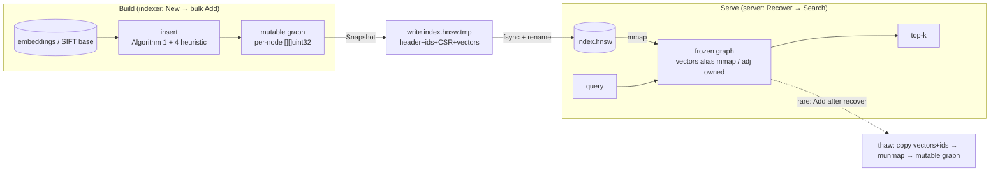
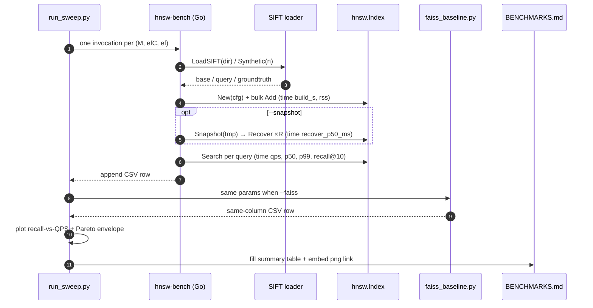

# Phase 4 — go-hnsw v2: persistence + SIFT-1M bench (technical design)

> Corresponds to stage 4 of [`docs/ROADMAP.md`](../ROADMAP.md).
> Created: 2026-06-12. **Completed: 2026-06-29** (commit `28bc663`).
> Style matches [docs/plans/phase-1-indexer.md](phase-1-indexer.md), [docs/plans/phase-2-retrieval.md](phase-2-retrieval.md), and [docs/plans/phase-3-graphrag.md](phase-3-graphrag.md).
> Historical note: early source comments labeled “persistence / bench” as Phase 5 and “concurrency” as Phase 6. After the roadmap reorder in commit `6fa8fe1`, **persistence + SIFT-1M bench = Phase 4**, **hardening + concurrency = Phase 5**. This design follows the roadmap and also corrects stale comments.

## 0. Completion status (2026-06-29)

| Deliverable | Status | Evidence |
| --- | --- | --- |
| mmap snapshot / Recover (CSR format) | ✅ | [`go-hnsw/persist.go`](../../go-hnsw/persist.go) |
| Algorithm 4 heuristic neighbor selection | ✅ | [`go-hnsw/insert.go`](../../go-hnsw/insert.go) |
| Atomic snapshot write (tmp + fsync + rename) | ✅ | `persist_test.go` |
| `cmd/bench` + `internal/bench` | ✅ | SIFT-1M / synthetic dual mode |
| `run_sweep.py` sweep driver + Faiss baseline | ✅ | [`benchmarks/sift1m/`](../../benchmarks/sift1m/) |
| Pareto curve published | ✅ | [`docs/BENCHMARKS.md`](../BENCHMARKS.md) §1 |
| 1M×128 snapshot reload P50 < 200 ms | ✅ | **11.7–13.0 ms** (median of 5 reloads) |

**SIFT-1M first-round measured summary** (reduced grid `M∈{16,32}×efC∈{200,400}`, full 1M base, Apple M4 single-thread):

| Metric | go-hnsw | Faiss-HNSWFlat | Notes |
| --- | --- | --- | --- |
| Recall@10 (best config) | 0.9992 | 0.9992 | match |
| QPS @ ~0.99 recall | ~1.0–1.1k | ~2.7k | Faiss ahead ~2.5–3× (SIMD + tuned search loop) |
| Build (M32/efC400) | 4105 s | 1034 s | build ~4× slower; not a Phase 4 exit metric |
| Recover P50 (1M×128) | 11.7–13.0 ms | n/a | **Phase 4 core exit metric** |

Full numbers, Pareto plots, and an honest gap analysis are in [`docs/BENCHMARKS.md`](../BENCHMARKS.md) §1 Findings.

**Extra ship tests**:

* `make hnsw-test` (`go test -race`) all green
* `make test` 243 passed
* `make test-ollama` real on-machine LM smoke test green

**Leftovers / follow-ups**:

* Full grid `M∈{8,16,32}×efC∈{100,200,400}` left for a later batch (each go-hnsw 1M build ~22–68 min)
* gRPC `Snapshot` RPC, concurrent read path → Phase 5
* Close the QPS gap (SIMD / lock-free reads) → Phase 5 performance pass

## 1. Goal alignment

Roadmap Phase 4 exit criteria and deliverables:

- **mmap snapshot/recover** using the **CSR** adjacency format promised in [`docs/ARCHITECTURE.md`](../ARCHITECTURE.md) §5.
- **Heuristic neighbor selection (Algorithm 4 / SELECT-NEIGHBORS-HEURISTIC, Malkov & Yashunin 2018)** replacing Phase 2’s naive “take the nearest M” (Algorithm 3), and confirm the level multiplier (`mL = 1/ln(M)`) sampling is correct.
- **Atomic snapshot write** (write `*.tmp` then `rename` over the target; a crash never leaves a truncated file).
- `cmd/bench` SIFT-1M bench: build time / recall@10 / QPS (single-thread) / P50 / P99 / RSS.
- [`benchmarks/sift1m/run_sweep.py`](../../benchmarks/sift1m/run_sweep.py) sweep driver (full parameter grid).
- Recall-vs-QPS **Pareto frontier** committed to [`docs/BENCHMARKS.md`](../BENCHMARKS.md).
- **Faiss baseline** on the same hardware.

**Hard exit criteria**:

1. Pareto curve published (go-hnsw and Faiss-HNSWFlat lines + honest gap notes).
2. **1M × 128-d reload from snapshot P50 < 200 ms**.

## 2. Industry-standard alignment

| Choice | Citation / default |
| --- | --- |
| Neighbor selection | **Algorithm 4 heuristic** (RNG-style pruning: a candidate is kept only if it is closer to the query than to any already-selected neighbor, yielding diverse long and short edges) |
| Heuristic params | `extendCandidates=false`, `keepPrunedConnections=true` (hnswlib defaults; keeps neighbor count filled to M) |
| Level sampling | `level = floor(-ln(U(0,1]) · mL)`, `mL = 1/ln(M)` (paper §4.1) |
| Persistence layout | mmap-friendly: contiguous vectors arena + CSR adjacency; vector segment at end of file, 64B-aligned |
| Atomicity | `O_CREATE` write `*.hnsw.tmp` → `fsync` → `rename` (POSIX rename is atomic within a directory) |
| Bench dataset | **SIFT-1M** (TEXMEX corpus: 1M base × 128-d, 10k query, 100 ground-truth neighbors per query, **L2**) |
| Data format | `.fvecs` (`int32 dim` + `dim × float32`) / `.ivecs` (ground-truth, `int32 dim` + `dim × int32`) |
| Recall definition | recall@10 = `|returned top10 ∩ true top10| / 10`, averaged over all queries (ANN-Benchmarks) |
| Baseline | **Faiss `IndexHNSWFlat`** (same M / efConstruction / efSearch, same hardware, single-thread) |
| Reporting rule | “If go-hnsw is N× slower than Faiss, write N” (existing [`benchmarks/sift1m/README.md`](../../benchmarks/sift1m/README.md) convention, also DD-001) |
| Latency definition | single-thread, one query at a time, record each wall-clock, report P50 / P99 (exclude the warmup query) |

## 3. Forward- and backward-compatible design

- **Core algorithm API stays**: `hnsw.New / Index.Add / Index.Search / Index.Len` signatures unchanged. Add `Index.Snapshot(path)`, `hnsw.Recover(path)`, `Index.Close()` (`persist.go` already returned `not implemented`; this phase fills them in).
- **Config backward compatible**: new fields `Metric` and `Heuristic bool`. Zero values (`MetricCosine` / `false`) plus explicit `DefaultConfig` keep old callers unchanged; old code that sets `cfg.Distance` still works (`New` prefers an explicit `Distance`, otherwise parses `Metric`).
- **gRPC contract unchanged**: this machine lacks `protoc-gen-go`, so **this phase does not change [`proto/hnsw.proto`](../../proto/hnsw.proto)** and does not regenerate stubs. Snapshot/recover hangs off the **server process lifecycle** (Recover if a snapshot exists at start, else keep Phase 2 SQLite cold-load; `--snapshot-on-exit` writes on shutdown). `Snapshot` as a gRPC RPC is an **optional deferral** (see §9) until Phase 5 adds the plugin; Python `hnsw_client.py` then needs zero changes.
- **On-disk format is versioned**: header `version=2`, `magic="HNSW"`. `Recover` checks magic + version and **errors explicitly** on unknown versions, leaving room for Phase 5/7 evolution.
- **`.gitignore` already covers**: `*.hnsw` / `*.mmap` / `data/` / `benchmarks/**/*.csv`; snapshots and bench artifacts will not be committed by accident.
- **Optional Python config**: [`reposage/config.py`](../../reposage/config.py) reuses `hnsw_data_dir`, adds `hnsw_snapshot_path` (default `<hnsw_data_dir>/index.hnsw`). Unset behaves like Phase 2 (cold-load SQLite); existing `test-grpc` is unaffected.
- **Metric consistency**: SIFT is L2; RepoSage embeddings are cosine. `Metric` is stored in the snapshot header; `Recover` restores `DistanceFunc` from it so a reload cannot use the wrong distance.

## 4. On-disk format (go-hnsw v2 snapshot)

All integers little-endian (native on x86-64 / arm64; CI and dev machines are that; big-endian platforms panic in `Recover` with an unsupported note).

```text
┌──────────────────────────────────────────────────────────────────────┐
│ header (fixed 64 bytes)                                                │
│   magic[4]="HNSW" | version u16=2 | metric u8 | _pad u8                │
│   dim u32 | M u32 | maxM u32 | efConstruction u32 | efSearch u32       │
│   maxLevel u32 | entry u32 | _pad u32 | n u64 | levelMult f64 | seed i64│
├──────────────────────────────────────────────────────────────────────┤
│ idOff   : (n+1) × u64   byte offset of each node id string in idData   │
│ idData  : packed id bytes (idOff[n] bytes)                             │
│ levels  : n × u16       each node's max layer L_i (L_i+1 layers total) │
│ off0    : (n+1) × u64   layer-0 CSR row offsets (units: u32 count)     │
│ adj0    : off0[n] × u32  layer-0 neighbors (contiguous; search hot path cache locality) │
│ offU    : (n+1) × u64   CSR row offsets into the packed layer-1+ blob  │
│ adjU    : offU[n] × u32  layer-1+ neighbor blob: per node [count u32, ids…] │
│           concatenated in lc=1..L_i order                              │
├──────────────────────────────────────────────────────────────────────┤
│ PAD     : align to 64-byte boundary                                    │
│ vectors : n·dim × f32   contiguous vector arena — mmap lazy-load target (the bulk) │
└──────────────────────────────────────────────────────────────────────┘
```

**Why this split**:

- **Vectors at end of file + 64B align**: `Recover` mmaps the whole file and `unsafe`-aliases the vector segment to `[]float32` with no copy; the kernel faults pages in. 1M×128 = 512 MB of vectors copied via `read` would blow the 200 ms budget on that step alone; mmap makes `Recover` spend time almost only on parsing the small arrays.
- **Layer 0 is its own CSR**: almost all search time is layer-0 beam search; contiguous `adj0` fills cache lines on sequential scans.
- **Upper layers packed into one blob**: neighbors at layer ≥ 1 are rare; pack per node into `adjU` instead of a separate offset array per layer.
- **Columnar ids + lazy**: `Recover` does **not** pre-build 1M Go strings and does **not** rebuild the `idIndex` map (id → internal index). `Search` materializes strings only for topK hits via `idData[idOff[i]:idOff[i+1]]`; `idIndex` is rebuilt lazily only if `Add` arrives after recover. That drives per-node recover cost near zero.

**Frozen and thaw**:

- An index from `Recover` is **frozen**: vector alias is read-only mmap; adjacency is a batch-allocated owned slice (safe to rewrite).
- `Search` only reads vectors → safe.
- If a frozen index receives `Add` (replace semantics would mutate vectors in place and hit read-only mmap with `SIGBUS`): **thaw** first — copy vectors and idData into owned memory, `munmap`, become a mutable graph, then `Add`. Deployments almost never hit this: **server = Recover→Search**; **indexer = New→bulk Add→Snapshot**.
- `Index.Close()` `munmap`s (when frozen and not yet thawed).

## 5. Data flow (including atomicity)



**Atomicity**:

- **Snapshot write**: `Snapshot` writes `path + ".tmp"` throughout, then `f.Sync()`, then `os.Rename(tmp, path)` (atomic replace in the same directory). Any mid-crash leaves the old snapshot intact and `.tmp` as an orphan (overwritten next time).
- **mmap read-only**: frozen alias slices use a three-index slice `a[i:j:j]` so `cap` equals `len`, blocking `append` from writing a read-only page.
- **Mutate after recover**: thaw finishes “copy→munmap→mutable” before the first `Add`; after that it is equivalent to a fully in-memory build.
- **Bench replay**: `cmd/bench` measures recover P50 on the Build→Snapshot→Recover→Search path so we time a real reload, not a warm cache (optional `drop` hint before each recover; see §7).

## 6. Key file changes

### 6.1 Algorithm core (`go-hnsw/`, pure Go, no extra deps)

- **`distance.go`**: add `type Metric uint8` (`MetricCosine=0 / MetricL2=1 / MetricInnerProduct=2`) and `func (Metric) Func() DistanceFunc`. Wire existing `Cosine / L2 / InnerProductNormalised` to the enum.
- **`hnsw.go`**: `Config` gains `Metric Metric` and `Heuristic bool`; `DefaultConfig` sets `Heuristic=true`, `Metric=MetricCosine`. `New` uses `cfg.Metric.Func()` when `Distance==nil`. Add `Index.Close()`; `Add` thaws if frozen.
- **`graph.go`**: `node` drops `id string`, keeps `vector []float32 / neighbors [][]uint32`. `graph` gains `idData []byte`, `idOff []uint64`, `frozen bool`, `mmap []byte` (handle held after recover). Add `nodeID(i)` (lazy string) and `thaw()`. `idIndex` is `nil` while frozen; `Add` rebuilds it lazily.
- **`insert.go`**: replace `selectNeighborsSimple` with `selectNeighborsHeuristic` (Algorithm 4); `connect` and `trimNeighbours` both use the heuristic; ids append into `idData/idOff`. Keep `selectNeighborsSimple` for `Heuristic=false` fallback and contrast tests.
- **`search.go`**: fetch ids via `g.nodeID(it.ID)`.
- **`persist.go`**: implement `Snapshot` / `Recover` (§4 format + §5 atomicity).
- **`bytesconv.go`** (new): `unsafe` `[]byte↔[]float32/[]uint32` alias + little-endian assert.
- **`mmap_unix.go`** (`//go:build unix`, new): `golang.org/x/sys/unix` `Mmap/Munmap`.
- **`mmap_other.go`** (`//go:build !unix`, new): fall back to `os.ReadFile` (works without mmap, just no copy savings).

### 6.2 Bench (`go-hnsw/internal/bench/` new package + rewrite `cmd/bench`)

Put logic in `internal/bench` so unit tests can hit it (`package main` under `cmd` is awkward to test):

- **`vecs.go`**: `ReadFvecs / ReadIvecs` (streaming TEXMEX, check dim consistency).
- **`dataset.go`**: `LoadSIFT(dir, maxBase, maxQueries)` (base/query/groundtruth) + `Synthetic(n, q, dim, seed)` (Gaussian random + brute-force ground-truth, CI smoke, no 1 GB download).
- **`recall.go`**: `RecallAtK(got, truth, k)`.
- **`run.go`**: `RunConfig(ds, cfg, topK, efSearch, snapshotPath) Result` chains Build→(optional Snapshot→Recover)→Query, fills `Result{M, efC, ef, BuildS, QPS, Recall, P50ms, P99ms, RSSmb, RecoverP50ms, N, Dim}`; `Result.CSV()` / `CSVHeader()`.
- **`internal/bench/*_test.go`**: fvecs roundtrip, recall edges, synthetic recall>0.9 smoke.
- **`cmd/bench/main.go`**: real CLI. `--dataset-dir` (empty → `--synthetic N`), `--M/--efC/--ef` (ef can be multi-valued), `--metric`, `--topk`, `--snapshot`, `--out` (append CSV; empty → stdout), `--header`, `--max-base/--max-queries`. SIFT default `--metric=l2`.

### 6.3 Server lifecycle (`cmd/server/main.go`)

- Add `--snapshot` (path, default empty), `--snapshot-on-exit` (bool).
- **Start**: if `--snapshot` is set and the file exists → `hnsw.Recover` fast reload, skip SQLite cold-load; else keep Phase 2 cold-load, and if `--snapshot` was given, write an initial snapshot after load.
- **Exit**: if `--snapshot-on-exit`, `Snapshot` after `GracefulStop`.
- Log recover/cold-load time and size so the 200 ms metric is easy to check.

### 6.4 Python driver / config

- **`benchmarks/sift1m/run_sweep.py` rewrite**: parameter grid → invoke `hnsw-bench` (`--out` CSV) → parse CSV → matplotlib recall-vs-QPS scatter + Pareto envelope → save `results/<date>-pareto.png` → fill the summary table back into [`docs/BENCHMARKS.md`](../BENCHMARKS.md). `--faiss` also runs `faiss_baseline.py` as a second line. Without matplotlib, degrade to “CSV + text Pareto only”.
- **`benchmarks/sift1m/faiss_baseline.py`** (new): `IndexHNSWFlat` on SIFT with the same params, same-column CSV for overlay plots.
- **`reposage/config.py`**: add `hnsw_snapshot_path: Path | None = None` (default `None` → runtime fallback `hnsw_data_dir/index.hnsw`).
- **`pyproject.toml`**: optional extra `[project.optional-dependencies].bench = ["faiss-cpu>=1.8", "matplotlib>=3.8"]`, not in the default install (keep faiss off the core service).

### 6.5 Docs / build

- **`docs/BENCHMARKS.md`**: methodology (recover P50 definition, L2, single-thread), Pareto figure slot, headers aligned with CSV columns.
- **`docs/ARCHITECTURE.md`** §5: “snapshot only in Phase 5” → “Phase 4 lands mmap snapshot/recover”; document the two cold-start paths.
- **`go-hnsw/README.md`**: Phase table moves persistence/bench to Phase 4; add persist and bench commands.
- **`docs/DESIGN_DECISIONS.md`**: add DD-026..029 (see §10).
- **`Makefile` / `go-hnsw/Makefile`**: `bench-sift` wired to the real CLI; add `hnsw-snapshot` (snapshot after SQLite build) and `bench-sift-synthetic` (CI smoke).

## 7. Bench pipeline contract



**CSV columns** (`internal/bench.Result.CSV`; run_sweep and faiss_baseline share column order):

```text
index,M,efC,efSearch,recall@10,qps,p50_ms,p99_ms,build_s,rss_mb,recover_p50_ms,n,dim
```

## 8. Test matrix

### Go unit (`go test -race ./...`, CI ci-go)

- `distance_test.go` (extended): `Metric.Func()` maps all three metrics; existing L2/cosine asserts unchanged.
- `insert_test.go` (new):
  - heuristic selection on an “equidistant points on a line” topology picks **spread-out** neighbors (RNG prune, not nearest-only);
  - `keepPrunedConnections` fills neighbor count to M;
  - `Heuristic=false` still runs `selectNeighborsSimple`.
- `hnsw_test.go` (extended): `randomLevel` distribution — in a large sample, fraction at level 0 ≈ `1 - 1/M`, max level ≈ `log_M(n)`; with `Heuristic=true`, 1k×32d recall@5 still ≥ 48/50.
- `persist_test.go` (new):
  - **roundtrip**: build → Snapshot → Recover → same query batch **bitwise identical** (id + distance);
  - **header checks**: bad magic / unknown version → clear error;
  - **atomicity**: snapshot half-written (injected write error) → old file intact, target not corrupted;
  - **frozen/thaw**: `Search` works after Recover; after `Add` triggers thaw, `Search` reflects the new value; use-after-`Close` errors;
  - **mmap alias safety**: `append` on a neighbor slice after Recover does not corrupt adjacent nodes (three-index slice).
- `internal/bench/*_test.go`:
  - `vecs_test.go`: write tiny `.fvecs/.ivecs` → read back equal; dim mismatch errors;
  - `recall_test.go`: known got/truth → recall@k edges (all hit=1, all miss=0, partial);
  - `run_test.go`: `Synthetic(2000, 50, 16)` through RunConfig, recall@10 > 0.9, recover_p50 set.

### Python (pytest, same mock habits)

- `tests/unit/test_sift_sweep.py`: fake `hnsw-bench` (shell stub that prints two fixed CSV rows) through `run_sweep`; assert CSV parse, Pareto selection (dominated points off the frontier), text fallback without matplotlib does not throw. Skip real plotting via `pytest.importorskip` for faiss/matplotlib.
- No hard faiss dependency; `faiss_baseline.py` only imported when `--faiss` is passed.

### Integration / e2e

- `make hnsw-build && ./bin/hnsw-bench --synthetic 5000 --M 16 --efC 200 --ef 16,64,128 --snapshot /tmp/s.hnsw --header`: CI-runnable, seconds, multi-row CSV, recover_p50 < 200 ms (far below at synthetic scale).
- Real SIFT-1M + Faiss overlay: local / later large CI machine; numbers land in `docs/BENCHMARKS.md` (1 GB dataset stays out of CI).

## 9. Non-goals (not in Phase 4)

- **gRPC `Snapshot` RPC**: no `protoc-gen-go` locally, no stub regen. Snapshot hangs off server lifecycle first; RPC form waits for Phase 5 to add the plugin; Python side zero changes.
- **Concurrency / lock-free read path**: roadmap assigns this to **Phase 5** (per-layer RWMutex, lock-free reads). This phase stays single-writer single-reader; `Index.mu` untouched.
- **Incremental reindex / incremental snapshot merge**: Phase 7 (`push` re-parses only changed files). This phase’s snapshot is full.
- **SIFT-10M / multi-thread build / SIMD distance**: beyond the exit criteria; later performance pass (Phase 5).
- **Quantization (PQ/SQ) / disk-resident index (DiskANN-style)**: not a goal of this repo; vectors stay fully in memory (mmap is enough).
- **Big-endian platforms**: `Recover` panics with an unsupported note (we only run x86-64 / arm64).

## 10. Design decisions (new DDs)

- **DD-026 mmap snapshot + columnar lazy ids**: mmap-aliasing the vector arena (zero-copy, lazy load) is what makes <200 ms reload possible; columnar ids + lazy `idIndex` rebuild drive per-node recover cost near zero. Cost: recovered indexes are frozen and need thaw before writes.
- **DD-027 Algorithm 4 heuristic neighbor selection**: RNG-style prune instead of naive nearest M, `keepPrunedConnections=true`. Better recall on clustered data; matches hnswlib defaults. `Heuristic=false` kept for contrast and fallback.
- **DD-028 atomic snapshot (tmp+fsync+rename)**: crash safety over write speed; a truncated write must never taint the live snapshot.
- **DD-029 snapshot on lifecycle, not gRPC RPC (for now)**: missing `protoc-gen-go`; this phase uses server start/stop + CLI; RPC stays a cheap follow-on.

## 11. Risks and mitigations

- **Risk: `unsafe` alias + read-only mmap causes `SIGBUS`**. Mitigation: frozen slices always three-index `cap=len`; thaw before any write; `persist_test` covers append not overflowing; `Close` always `munmap`s.
- **Risk: 1M recover still > 200 ms**. Mitigation: default mmap-alias vectors only, batch-allocate adjacency, lazy id/idIndex; bench measures recover P50 directly; if over budget, next cut is “alias adjacency too” (one fewer copy), and record it honestly in BENCHMARKS.md.
- **Risk: heuristic slows build / breaks existing tests**. Mitigation: heuristic only on the `connect`/`trim` candidate set (already bounded by `ef`, small); keep the simple path; existing recall tests must stay green under `DefaultConfig`.
- **Risk: SIFT-1M 1 GB dataset cannot run in CI**. Mitigation: CI only `--synthetic` smoke; real dataset local / large machine, results in docs. `run_sweep` errors clearly and prints the download command if the dataset is missing.
- **Risk: Faiss install is painful on some platforms**. Mitigation: faiss in optional `bench` extra, not core; `faiss_baseline.py` imported only with `--faiss`; missing faiss still yields the go-hnsw-only curve.
- **Risk: little-endian assumption fails on heterogeneous CI**. Mitigation: package `init` asserts little-endian or panics; target platforms are all LE; document it.

## 12. Demo commands

### CI smoke (synthetic, no download)

```bash
make hnsw-build
./go-hnsw/bin/hnsw-bench --synthetic 5000 --M 16 --efC 200 --ef 16,64,128 \
  --snapshot /tmp/sift_smoke.hnsw --header
make hnsw-test           # includes persist / heuristic / bench unit tests
```

### Real SIFT-1M + Faiss overlay (local)

```bash
# 1) fetch dataset (~1 GB into benchmarks/sift1m/data/)
bash benchmarks/sift1m/fetch_sift1m.sh
# 2) go-hnsw full sweep + Faiss baseline + Pareto plot + fill BENCHMARKS.md
pip install -e ".[bench]"
python benchmarks/sift1m/run_sweep.py --dataset-dir benchmarks/sift1m/data --faiss
# 3) isolate "1M reload P50 < 200 ms"
./go-hnsw/bin/hnsw-bench --dataset-dir benchmarks/sift1m/data \
  --M 16 --efC 200 --ef 64 --snapshot benchmarks/sift1m/data/index.hnsw
```

### Exit-criteria replay

```bash
make lint && make hnsw-test          # algorithm + persist + bench unit tests all green
# Pareto curve + Faiss comparison already in docs/BENCHMARKS.md
# recover P50 < 200 ms evidenced by hnsw-bench recover_p50_ms column
```
