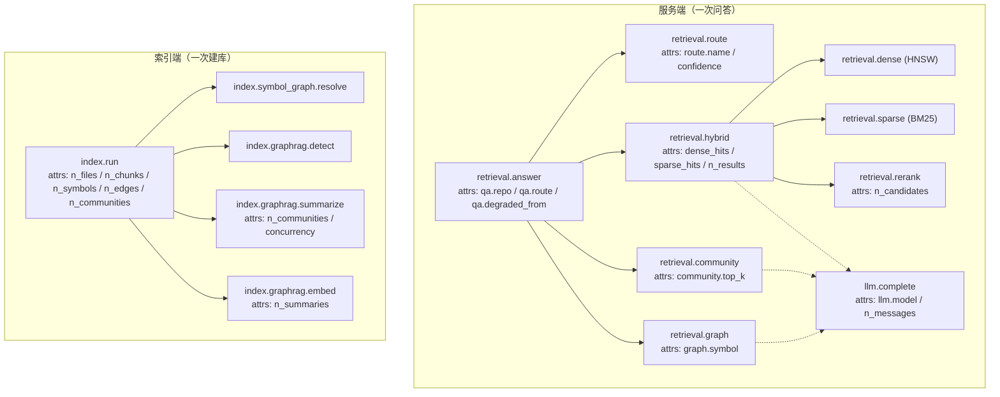
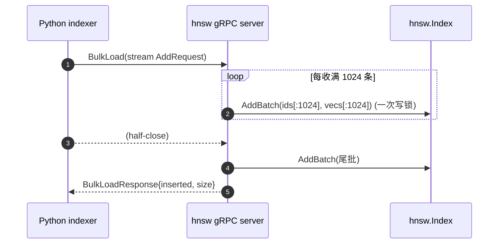

# Phase 5 — 加固：评测门禁（eval-gate）、可观测性（OTel）、性能（技术方案）

> 本文档与 [`docs/ROADMAP.md`](../ROADMAP.md) 第 5 阶段对应。
> 创建日期：2026-07-16。**状态：🚧 进行中**（首批代码已落地，commit `9dfc575`）。
> 风格与 [phase-1-indexer.md](phase-1-indexer.md)、[phase-2-retrieval.md](phase-2-retrieval.md)、[phase-3-graphrag.md](phase-3-graphrag.md)、[phase-4-hnsw-v2.md](phase-4-hnsw-v2.md) 一致：专有名词括号注解。
> 历史注记：早期源码注释把「并发 / 无锁读」标为 Phase 6、把「持久化」标为 Phase 5。路线图 commit `6fa8fe1` 重排后，**持久化 + SIFT-1M = Phase 4**、**加固（eval-gate + OTel + 性能 + 并发）= Phase 5**。本方案以路线图为准。

## 审计与修复（2026-07-17，全仓 bug / 冗余 / 漏洞排查）

一轮全项目审计，修复以下已确认问题（均附回归测试）：

| 类别 | 问题 | 修复 | 证据 |
| --- | --- | --- | --- |
| 🔴 漏洞 (ReDoS) | `grounding.CITATION_RE` 的路径段字符类含 `/`，`seg+(?:/seg+)*` 存在灾难性回溯——对 `[/a/a/a…` 类输入指数级耗时（实测 n=26 → 3.9s），经 `@reposage` 问答的 LLM 输出半可达 | 路径段字符类排除 `/`，分隔符唯一化（微秒级） | `llm/grounding.py`、`tests/unit/test_grounding.py::test_extract_is_not_catastrophic_on_slash_bomb` |
| 🟠 Bug | 增量（非 force）重索引对变更文件不清旧边，`upsert_edges` 的 `ON CONFLICT weight+1` 导致边权每次重索引膨胀 | 重解析前 `delete_nodes_by_path` + `delete_edges_by_src_path` | `indexer/pipeline.py`、`test_incremental_e2e.py::test_reindex_does_not_inflate_edge_weight` |
| 🟠 Bug | 磁盘上已删除的文件永不从索引清除（孤儿 nodes/edges/chunks） | `_purge_deleted_files`（基于 walk 集合差） | `test_incremental_e2e.py::test_deleted_file_is_purged` |
| 🟡 Bug | 文件被清空（0 chunk）后旧 chunk 及级联 embedding 残留 | 无条件 `delete_by_path` 再插入 | `test_incremental_e2e.py::test_emptied_file_purges_stale_chunks` |
| 🟡 设计 | `GitHubAppHandler.from_settings` 每个 webhook 都读私钥文件（JWT 未实现，属过早 I/O + 失败面） | 延迟到 JWT 落地再读（`load_private_key()`） | `bot/github_app.py` |

**排查未发现问题**：`eval`/`exec`/`shell=True`/`pickle`/`md5` 均无；SQL 全走参数化占位符（含新增 `IN (...)`）；router 三个正则均线性（无 ReDoS）；webhook HMAC 走 `compare_digest` 且 fail-closed。

## 0. 进度状态（2026-07-16，commit `9dfc575`）

首批「纯代码、不跑大模型、不做数据任务」的加固已落地：

| 交付物 | 状态 | 证据 |
| --- | --- | --- |
| OTel `span()` 轻量埋点助手（无 provider 时零成本 no-op） | ✅ | [`reposage/observability/otel.py`](../../reposage/observability/otel.py) |
| span 覆盖：索引各阶段 / query router / 三路检索 / LLM 补全 | ✅ | `indexer/pipeline.py`、`retrieval/router.py`、`retrieval/hybrid.py`、`services/retrieval_service.py`、`llm/client.py` |
| 导出器 opt-in（`REPOSAGE_OTEL_ENABLED`） | ✅ | [`reposage/config.py`](../../reposage/config.py)、`api/main.py`、`cli.py` |
| 批量 upsert：`Index.AddBatch`（一次写锁插 N 条 + 先校验维度） | ✅ | [`go-hnsw/hnsw.go`](../../go-hnsw/hnsw.go) |
| gRPC `BulkLoad` / SQLite 冷载走批量 | ✅ | `internal/grpcserver/server.go`、`sqlite_load.go` |
| Python 客户端 `bulk_load`（client-streaming） | ✅ | [`reposage/retrieval/hnsw_client.py`](../../reposage/retrieval/hnsw_client.py) |
| go-hnsw 并发读路径：gRPC 服务端 `Mutex` → `RWMutex` | ✅ | `internal/grpcserver/server.go` |
| `-race` 并发测试（读读并发 + 单写） + `AddBatch` 等价测试 | ✅ | [`go-hnsw/concurrency_test.go`](../../go-hnsw/concurrency_test.go) |
| 并行社区摘要（`asyncio.gather` + `Semaphore`） | ✅（Phase 3 已实现） | [`reposage/indexer/graphrag/summarizer.py`](../../reposage/indexer/graphrag/summarizer.py) |

**准出门测试**（本批）：`go test -race ./...` 全绿、`gofmt -l` 空、`ruff` / `mypy --strict`（50 文件）通过、`pytest` 245 passed（mock profile）。

**待补（本 Phase 剩余）**：

* ⬜ **完整 200 题跨文件基准**（Python + TS + Go）——数据任务，按「优先代码」暂缓（见 §8）。
* ⬜ **eval-gate 成为必过检查**——属仓库分支保护（branch protection）设置，非代码（见 §8）。
* 🚧 **OTel 仪表盘说明**（Tempo / Jaeger 的注释好的面板）——埋点已就位，文档待补（见 §4.4）。
* 🚧 **性能 pass 之热路径剖析**（profiling）——批量 upsert / 并行摘要已做，pprof 剖析待做（见 §6.3）。
* ⬜ **per-layer 分片锁（sharded lock）**——当前单写多读已够用，留作 Phase 9 速度优化（见 §6.2、§11）。

## 1. 目标对齐

路线图 Phase 5 退出指标与交付物：

- `benchmarks/cross_file_qa/questions.jsonl` 中**完整 200 题**（Python + TS + Go）。
- 带 `run-eval` 标签的 PR 上，`eval-gate` **GitHub Action 成为必过检查（required check）**。
- 索引与服务端的 **OTel（OpenTelemetry，厂商中立的分布式追踪 / 指标标准）链路**导出到本地 **Tempo / Jaeger**（trace 后端）；`docs/` 中有注释好的**仪表盘**说明。
- **性能 pass**：剖析热路径、**批量 HNSW upsert**、**并行社区摘要**。
- `go-hnsw` **并发**：每层 RWMutex（读写锁）、无锁读路径（lock-free read path）。

**硬性退出指标**（路线图）：eval-gate 运行 < 10 分钟；4 核笔记本上 P99 索引吞吐 ≥ 1k chunks/s。

**本方案的取舍**：路线图 Phase 5 五条里，**OTel 埋点 / 批量 upsert / 并行摘要 / 并发读路径**四条属纯代码，本批全部落地；**200 题数据集 / required-check 设置**两条分别是数据任务与仓库设置，按用户「优先代码、避开数据任务、不跑大模型」的指示暂缓，并在本文与路线图如实标注。**「每层 RWMutex 无锁读」** 降级为「gRPC 服务端 RWMutex 并发读」（读读不再互斥，即 Phase 4 遗留的 QPS 串行瓶颈已解），真正的 per-layer 分片锁作为可选优化后移（§6.2 论证）。

## 2. 行业标准对齐

| 选择 | 引用 / 默认 |
| --- | --- |
| 追踪 API | **OpenTelemetry**（CNCF 毕业项目，trace / metrics / logs 的事实标准） |
| span 命名 | 点分层级命名（`index.run`、`retrieval.hybrid`、`retrieval.dense` …），贴近 OTel semantic conventions 的「`<namespace>.<operation>`」惯例 |
| 上下文传播 | `start_as_current_span` 走 contextvars；`asyncio.create_task` 拷贝当前 context，故并发 fan-out 的子 span 自动挂到父 span |
| 导出协议 | **OTLP/gRPC**（OpenTelemetry Protocol，默认 `:4317`），`BatchSpanProcessor` 批量异步导出 |
| 无 provider 语义 | 未装 `TracerProvider` 时 `get_tracer` 返回 **non-recording span**（不记录、不导出），`set_attribute` 是廉价 no-op —— 这是 OTel 官方推荐的「库随时可埋点、由应用决定是否导出」模式 |
| 并发模型 | **单写多读（single-writer / many-reader）**：`sync.RWMutex`，读 RPC 走 `RLock`、写 RPC 走 `Lock`，与底层 `hnsw.Index` 内部锁一致 |
| 批量写 | 一次持锁插入 N 条（amortise lock hand-off），与 `hnswlib.add_items` 批量语义对齐 |
| 客户端流式 | gRPC **client-streaming** `BulkLoad(stream AddRequest)`，冷载 / 重建时的标准批量灌入形态 |

## 3. 前后向兼容设计

- **埋点零侵入调用方**：`span()` 是上下文管理器，包住已有代码块即可；返回 `Span | None`，`None` 分支（OTel API 缺失）由 mypy 强制 `if sp is not None` 守卫。删除埋点不改变任何返回值 / 行为。
- **追踪 opt-in**：新增 `Settings.otel_enabled: bool = False`。**span 永远编译在内**（无 provider 时接近零成本），但**只有** `otel_enabled=True` 才 `setup_tracing` 起 OTLP 导出。默认关，保证 `reposage index` / 测试 / 全新 clone 不会去连不存在的 collector 刷 connection-refused 日志。API `lifespan` 与 CLI `index` 都据此守卫。
- **算法核心 API 不破坏**：`hnsw.New / Add / Search / Len / Snapshot / Recover / Close` 签名不变。**新增** `Index.AddBatch(ids, vecs) (int, error)`，是 `Add` 的批量快路径，语义与逐条 `Add` **逐位一致**（同 seed、同插入顺序 → 同图，见 §10 等价测试）。
- **gRPC 契约不动**：`proto/hnsw.proto` 一字未改。`BulkLoad` 本就是 client-streaming RPC，本 Phase 只是把服务端实现从「逐条 `Add`」改成「缓冲后 `AddBatch`」——线路格式、Python stub 全不动。
- **锁类型收窄式升级**：服务端 `sync.Mutex` → `sync.RWMutex` 是纯放宽（读并发化）；写路径行为不变。旧的「所有 RPC 串行」是新行为的严格子集，无回归风险。
- **Python 客户端纯增量**：`HnswGrpcClient` 新增 `bulk_load(items)`，旧 `add` / `search` 不动。

## 4. OTel span 埋点设计

### 4.1 span 助手（`reposage/observability/otel.py`）

两层设计，把「埋点」与「起导出」解耦：

```python
@contextmanager
def span(name, attributes=None) -> Iterator[Span | None]:
    try:
        from opentelemetry import trace
    except ImportError:      # opentelemetry-api 是核心依赖，兜底而已
        yield None; return
    tracer = trace.get_tracer("reposage")
    with tracer.start_as_current_span(name) as current:
        if attributes:
            for k, v in attributes.items():
                current.set_attribute(k, v)
        yield current
```

- **随时可调用、永不失败**：无 `TracerProvider` 时 `get_tracer` 给的是 non-recording span，`start_as_current_span` / `set_attribute` 只写两三个 contextvar，量级可忽略。
- **动态属性守卫**：块内算出来的属性（如最终命中数、路由名）用 `if sp is not None: sp.set_attribute(...)` 追加，mypy strict 下强制守卫。

### 4.2 span 覆盖（对齐路线图「索引 + 三路检索 + LLM」）



- **检索**：`retrieval.answer` 是根 span，路由后打 `qa.route`；三路各有独立 span；`hybrid` 内的 dense / sparse 是并发 fan-out 的子 span（在父 span context 内 `create_task`，context 自动拷贝 → 父子关系正确），rerank 是同步子 span。
- **LLM**：`llm.complete` 埋在 `LiteLLMClient.complete` 内（唯一网络出口，覆盖答案生成、重生成、社区摘要三处调用点）；`MockLLMClient` 不埋（确定性、仅测试用）。
- **索引**：根 span `index.run` 收尾把 manifest 计数写成属性；子 span 覆盖 resolve / detect / summarize / embed 四段；**不做 per-file span**（大仓库上千文件会撑爆 cardinality）。

### 4.3 低基数（cardinality）纪律

属性只放**有界值**（计数、模型名、路由名、布尔），**不放** chunk_id / 问题原文 / 路径这类高基数或含用户内容的值，避免 trace 后端索引爆炸与信息泄漏。

### 4.4 导出与仪表盘（待补文档）

- 打开：`REPOSAGE_OTEL_ENABLED=true` + `OTEL_EXPORTER_OTLP_ENDPOINT=http://localhost:4317`。
- 本地栈：`docker compose` 起 Jaeger（或 Grafana Tempo），OTLP 收 span。
- **待补**：`docs/` 一节，附「索引吞吐」「三路 P50/P95」「grounding 失败率」几个面板的 PromQL/TraceQL 说明（本 Phase 剩余项）。

## 5. 批量 upsert（batch upsert）设计

### 5.1 核心：`Index.AddBatch`

```go
func (ix *Index) AddBatch(ids []string, vecs [][]float32) (int, error) {
    // 1) 先校验：len 对齐 + 每条维度对 —— 坏行在任何改动前失败（all-or-nothing per call）
    // 2) 取一次写锁；frozen 则先 thaw
    // 3) 循环 g.insert(id, vec)，返回成功条数
}
```

- **动机**：逐条 `Add` 每次都 `ix.mu.Lock()/Unlock()`，单 goroutine 灌一个仓库的 embedding 时，锁的交接（hand-off）成了开销大头。`AddBatch` 一次持锁插 N 条，把交接摊薄。
- **契约**：先全量校验维度，坏行**不改动索引**（保 gRPC「每 RPC all-or-nothing」语义）；顺序保留，返回值可与输入切片对位定位错误。

### 5.2 gRPC `BulkLoad` 批量化（`server.go`）

client-streaming 收到的向量**缓冲到 1024 条**（`bulkLoadFlush`）就取一次写锁 `AddBatch` 冲一批，EOF 再冲尾批。既摊薄锁交接，又**有界内存**（百万级流不会整份进 RAM）。



### 5.3 SQLite 冷载批量化（`sqlite_load.go`）

`LoadFromSQLite` 从 embeddings 表逐行读 float32 BLOB，同样**每 1024 条 `AddBatch` 一次**，取代原「逐行 `Add` + 逐行持锁」。

### 5.4 Python 客户端 `bulk_load`（`hnsw_client.py`）

```python
async def bulk_load(self, items: Iterable[tuple[str, Sequence[float]]]) -> int:
    stub = await self._connect()
    async def _requests():
        for cid, vec in items:
            yield hnsw_pb2.AddRequest(id=cid, vector=list(vec))
    resp = await stub.BulkLoad(_requests())
    return int(resp.inserted)
```

冷载 / 重建时用它取代「逐条 `add` 循环」，配合服务端批量落地端到端批量 upsert。

## 6. 并发读路径设计

### 6.1 已落地：gRPC 服务端 `RWMutex`

Phase 4 遗留的真正瓶颈**不在算法核心**——`hnsw.Index` 早就是 `sync.RWMutex`（`Search` 走 `RLock`、`Add` 走 `Lock`，读读本可并发）——**而在 gRPC 外层**：`Server.mu` 是一把 `sync.Mutex`，把 `Search` 也串行化了。

本 Phase 把 `Server.mu` 改成 `sync.RWMutex`：

| RPC | 锁 | 效果 |
| --- | --- | --- |
| `Search` / `Stats` | `RLock` | 并发搜索不再互相阻塞 |
| `Add` / `BulkLoad` / `Snapshot` / `Close` / `LoadFromSQLite` | `Lock` | 写路径互斥（与 in-flight 搜索互斥，写完读立即恢复） |

这就是路线图「无锁读路径」的**务实兑现**：读之间无锁竞争（`RLock` 共享），只有写才短暂独占。

### 6.2 后移：per-layer 分片锁（sharded lock）—— 论证

路线图原文「每层 RWMutex」意在让**写与读并发**（一次 insert 改某层邻接时，另一路 search 仍能读别的层）。这需要把可变图改造成：节点数组用原子/分片、邻接切片写时复制（copy-on-write）。风险与收益：

- **收益有限**：当前部署形态是**单写（索引端 New→批量 Add→Snapshot）/ 多读（服务端 Recover→Search）**，读读已全并发；写写并发本就不是目标。per-layer 锁只优化「边写边读」，而线上服务几乎不在服务实例里写。
- **风险偏高**：插入会 `append` 节点数组（可能整体重分配）、原地换邻接切片头、改 `entry`/`maxLvl`，要做到读无锁且无数据竞争，需 COW + 原子指针的一次较大重写；在无法充分压测的窗口内易引入难查的竞态 / 索引损坏。

**结论**：保留正确且简单的单写多读 `RWMutex`，把 per-layer / 无锁读的重写**后移到 Phase 9（速度）** 与 SIMD 距离、批量查询 RPC 一起做——那时有明确的 QPS 目标与压测基线来验证。已把过期注释（`hnsw.go` / `graph.go` / `server.go` 里提「Phase 6 加 per-layer」）订正为现状。

### 6.3 待做：热路径剖析（profiling）

用 `go test -bench` + `pprof` 采样建图与搜索热点（距离计算、堆操作、`searchLayer` 的 visited map），指导后续 SIMD / 内存池优化。属性能 pass 剩余项，非本批。

## 7. 并行社区摘要（已实现，登记在案）

路线图性能 pass 的「并行社区摘要」在 **Phase 3 就已落地**：`CommunitySummarizer.summarize_all` 按层 `asyncio.gather` 并发，`asyncio.Semaphore(concurrency)`（默认 4，`Settings.community_summary_concurrency`）限流，避免本地 Ollama 排队 / 远端 API 触发限流。本 Phase 无需改动，仅在 span 上补 `index.graphrag.summarize` 的 `concurrency` 属性以便观测。

## 8. eval-gate + 200 题（暂缓项的落地计划）

**现状**：`eval-gate.yml` 已有三个 job——`bench-rag`（Phase 2 mock，恒跑且**已 gate** P50/recall/citation）、`bench-qa-mock`（Phase 3 mock，连通性）、`cross-file-qa`（真 LLM，`run-eval` 标签或周跑）。阈值判定与非零退出**均已实现**（见 `benchmarks/rag/run_eval.py`、`benchmarks/cross_file_qa/run_eval.py`）。

**剩余两项及暂缓理由**：

- **补齐 200 题（Python + TS + Go）**：当前 `questions.jsonl` 50 题。这是**数据标注任务**（写题、标 `expected_paths` / `expected_citations`），按用户「避开冗长数据任务」暂缓。落地时：每语言 fixture 各出一批跨文件聚合题，沿用现有 schema，`run_eval` 的 bucket 统计与门禁无需改。
- **eval-gate 设为 required check**：这是 **GitHub 仓库分支保护设置**（Settings → Branches → Require status checks），非代码可提交项。落地时把 `bench-rag`（及打了 `run-eval` 后的 `cross-file-qa`）勾成必过即可。

## 9. 关键文件改动（本批）

### 9.1 Python

- **`reposage/observability/otel.py`**：新增 `span()` 上下文管理器 + `AttributeValue` 类型；`get_tracer` 保留；`setup_tracing` 不变。
- **`reposage/config.py`**：新增 `otel_enabled: bool = False`。
- **`reposage/api/main.py`** / **`reposage/cli.py`**：`setup_tracing` 由 `otel_enabled` 守卫。
- **`reposage/llm/client.py`**：`LiteLLMClient.complete` 包 `llm.complete` span。
- **`reposage/retrieval/router.py`**：`route()` 包 `retrieval.route`，内部逻辑拆到 `_route()`。
- **`reposage/retrieval/hybrid.py`**：`retrieve()` 包 `retrieval.hybrid`，dense/sparse 子协程各包 `retrieval.dense`/`retrieval.sparse`，rerank 包 `retrieval.rerank`；命中数写属性。
- **`reposage/services/retrieval_service.py`**：`answer()` 包根 span `retrieval.answer`；`_run_graph` / `_run_community` 各包分支 span（community 拆出 `_run_community_inner`）。
- **`reposage/indexer/pipeline.py`**：`run()` 薄包 `index.run`（真身移到 `_run()`）；resolve / graphrag 三段各包 span。
- **`reposage/retrieval/hnsw_client.py`**：新增 `bulk_load`。
- **`.env.example`**：补 `REPOSAGE_OTEL_ENABLED`。

### 9.2 Go（`go-hnsw/`）

- **`hnsw.go`**：新增 `Index.AddBatch`（+ `fmt` import）；订正包头并发注释。
- **`graph.go`**：订正「Phase 5 换分片锁」的过期注释为现状。
- **`internal/grpcserver/server.go`**：`Mutex` → `RWMutex`；`Search`/`Stats` 用 `RLock`；`BulkLoad` 缓冲 1024 走 `AddBatch`；订正 `Add` 注释。
- **`internal/grpcserver/sqlite_load.go`**：冷载缓冲 1024 走 `AddBatch`。
- **`concurrency_test.go`**（新建）：`AddBatch` vs 逐条 `Add` 等价、length/dim 校验、`-race` 并发（8 读 + 1 写）。

## 10. 测试矩阵

### Go（`go test -race ./...`，CI ci-go）

- **`AddBatch` 等价**：同 seed 下 `AddBatch(全量)` 与逐条 `Add` 产出同 `Len`，40 条随机 query top-1 一致。
- **`AddBatch` 校验**：`ids/vecs` 长度不符报错；坏维度行报错且 `Len==0`（未改动索引）。
- **并发 `-race`**：8 读 goroutine × 200 query 与 1 写 goroutine 并发，读完停写；`go test -race` 无竞态、无错误。
- **既有**：`persist` / `insert` / `hnsw` / `internal/bench` 全套仍绿（回归）。

### Python（pytest，mock profile）

- **回归**：埋点改动不改变任何返回值 —— 现有 245 测试全绿即证明「span 无侵入」。
- span 助手本身：无 provider 时 `with span(...) as sp:` 得 `sp is None` 或 non-recording，不抛错（隐式由全套跑绿覆盖）。

### 工具链

- `gofmt -l` 空、`ruff` 通过、`mypy --strict` 50 文件通过。

## 11. 非目标（Phase 5 不做 / 后移）

- **per-layer 分片锁 / 真·无锁读**：后移 Phase 9（速度），与 SIMD、批量查询 RPC 同批（§6.2 论证）。
- **SIMD 距离 / QPS 收口**：Phase 4 遗留的 ~2.5× Faiss 差距，归 Phase 9。
- **缓存层（`(repo_sha, question)`）**：归 Phase 9。
- **增量重索引**：归 Phase 7。
- **200 题数据集 / required-check 设置**：数据 / 仓库设置，非本批代码（§8）。
- **`Snapshot` gRPC RPC**：仍如 DD-029 挂生命周期；缺 `protoc-gen-go`，不动 proto。

## 12. 设计决策（新增 DD）

- **DD-030 OTel 埋点常在、导出 opt-in**：span 永远编译在内（no-op 成本），导出由 `REPOSAGE_OTEL_ENABLED` 控。理由：库随时可观测、应用决定是否连 collector；默认关避免 CLI/测试/新 clone 刷 connection-refused。代价：忘记开则线上无 trace（用启动日志提示缓解）。
- **DD-031 `AddBatch` 批量写**：一次持锁插 N 条、先全量校验维度（all-or-nothing）。理由：摊薄锁交接，`BulkLoad`/冷载吞吐提升；坏行不污染索引。与逐条 `Add` 逐位等价（有测试）。代价：一个新公开方法。可逆成本：低。
- **DD-032 gRPC 服务端 RWMutex 并发读，per-layer 分片锁后移**：服务端 `Mutex`→`RWMutex`，读读并发；真正的 per-layer 无锁读因「单写多读下收益有限、重写风险高」后移 Phase 9。理由见 §6.2。可逆成本：低（锁类型改动局部）。

## 13. 风险与对策

- **风险：埋点拖慢热路径**。对策：无 provider 时全是 non-recording no-op；属性低基数；245 测试跑时长无明显变化（16s 量级）。
- **风险：`asyncio.create_task` 里子 span 丢父子关系**。对策：在父 span 的 `with` 块内建 task，context 随 task 拷贝，父子自动挂接；靠 trace 后端目视校验。
- **风险：`BulkLoad` 批量缓冲吃内存**。对策：`bulkLoadFlush=1024` 有界；SQLite 冷载同界。
- **风险：`RWMutex` 写饥饿（writer starvation）**。对策：Go `sync.RWMutex` 对挂起的 writer 会阻止后续 reader 加读锁，避免写饿死；且线上服务实例几乎不写。
- **风险：opt-in 追踪被忘记打开**。对策：`.env.example` 注释 + 启动日志（后续可加「otel disabled」info 行）。

## 14. 演示命令

### 本批回归（不跑大模型）

```bash
# Go：并发 + 批量 + 既有全绿
cd go-hnsw && go test -race ./... && gofmt -l .

# Python：埋点无侵入（mock profile）
REPOSAGE_PROFILE=mock python -m pytest -q
ruff check reposage/ && mypy reposage/
```

### 打开追踪看 span 树（本地 Jaeger）

```bash
# 1) 起一个 OTLP collector（Jaeger all-in-one 暴露 4317）
docker run --rm -p 16686:16686 -p 4317:4317 jaegertracing/all-in-one:latest
# 2) 开追踪跑一次索引 + 问答
export REPOSAGE_OTEL_ENABLED=true OTEL_EXPORTER_OTLP_ENDPOINT=http://localhost:4317
python -m reposage.cli index --repo tests/fixtures/tiny_python_repo
python -m reposage.cli ask "how do auth and billing interact?"
# 3) 浏览器开 http://localhost:16686 看 index.run / retrieval.answer span 树
```

### 批量 upsert 冒烟

```bash
# 客户端 bulk_load 走 client-streaming（production profile + 起 hnsw-server）
# 服务端每 1024 条 AddBatch 一次；对照逐条 add 的锁交接开销
make hnsw-build && make dev   # 或手动起 go-hnsw/bin/hnsw-server
```
