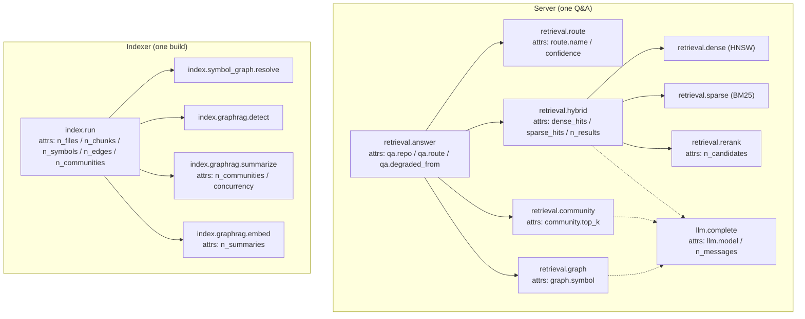
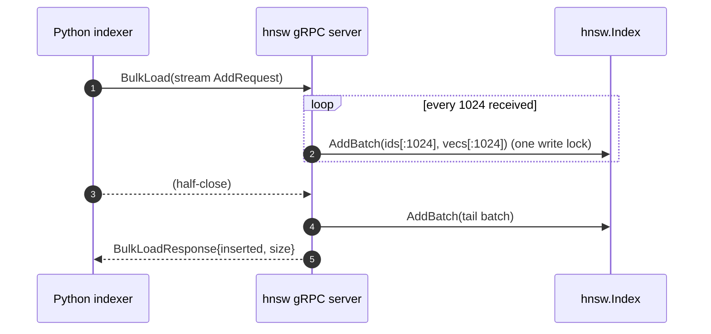

# Phase 5 — Hardening: eval-gate, observability (OTel), performance (technical design)

> This document corresponds to Phase 5 of [`docs/ROADMAP.md`](../ROADMAP.md).
> Created: 2026-07-16. **Status: 🚧 in progress** (first code slice landed, commit `9dfc575`).
> Style matches [phase-1-indexer.md](phase-1-indexer.md), [phase-2-retrieval.md](phase-2-retrieval.md), [phase-3-graphrag.md](phase-3-graphrag.md), [phase-4-hnsw-v2.md](phase-4-hnsw-v2.md): proper nouns annotated in parentheses.
> Historical note: early source comments labelled “concurrency / lock-free reads” as Phase 6 and “persistence” as Phase 5. After the roadmap reorder in commit `6fa8fe1`, **persistence + SIFT-1M = Phase 4** and **hardening (eval-gate + OTel + performance + concurrency) = Phase 5**. This design follows the roadmap.

## Audit and fixes (2026-07-17, repo-wide bug / redundancy / vulnerability pass)

A full-project audit fixed the following confirmed issues (each with a regression test):

| Category | Issue | Fix | Evidence |
| --- | --- | --- | --- |
| 🔴 Vulnerability (ReDoS) | Path-segment character class in `grounding.CITATION_RE` included `/`, so `seg+(?:/seg+)*` had catastrophic backtracking — exponential time on inputs like `[/a/a/a…` (measured n=26 → 3.9s), reachable via LLM output from `@reposage` Q&A | Exclude `/` from the path-segment class; unique delimiter (microseconds) | `llm/grounding.py`, `tests/unit/test_grounding.py::test_extract_is_not_catastrophic_on_slash_bomb` |
| 🟠 Bug | Incremental (non-force) reindex did not clear old edges for changed files; `upsert_edges` `ON CONFLICT weight+1` caused edge-weight inflation on every reindex | `delete_nodes_by_path` + `delete_edges_by_src_path` before re-parse | `indexer/pipeline.py`, `test_incremental_e2e.py::test_reindex_does_not_inflate_edge_weight` |
| 🟠 Bug | Files deleted on disk were never purged from the index (orphan nodes/edges/chunks) | `_purge_deleted_files` (set difference against the walk set) | `test_incremental_e2e.py::test_deleted_file_is_purged` |
| 🟡 Bug | After a file was emptied (0 chunks), old chunks and cascaded embeddings remained | Unconditional `delete_by_path` then insert | `test_incremental_e2e.py::test_emptied_file_purges_stale_chunks` |
| 🟡 Design | `GitHubAppHandler.from_settings` read the private-key file on every webhook (JWT not implemented — premature I/O + extra failure surface) | Defer read until JWT lands (`load_private_key()`) | `bot/github_app.py` |

**Audit found no issues in**: `eval` / `exec` / `shell=True` / `pickle` / `md5` — none present; all SQL uses parameterised placeholders (including new `IN (...)`); the three router regexes are linear (no ReDoS); webhook HMAC uses `compare_digest` and is fail-closed.

## 0. Progress (2026-07-16, commit `9dfc575`)

The first hardening slice — “code only, no LLM runs, no data tasks” — has landed:

| Deliverable | Status | Evidence |
| --- | --- | --- |
| Lightweight OTel `span()` helper (zero-cost no-op when no provider) | ✅ | [`reposage/observability/otel.py`](../../reposage/observability/otel.py) |
| Span coverage: index stages / query router / three-way retrieval / LLM completion | ✅ | `indexer/pipeline.py`, `retrieval/router.py`, `retrieval/hybrid.py`, `services/retrieval_service.py`, `llm/client.py` |
| Exporter opt-in (`REPOSAGE_OTEL_ENABLED`) | ✅ | [`reposage/config.py`](../../reposage/config.py), `api/main.py`, `cli.py` |
| Batch upsert: `Index.AddBatch` (one write lock for N inserts + dimension check first) | ✅ | [`go-hnsw/hnsw.go`](../../go-hnsw/hnsw.go) |
| gRPC `BulkLoad` / SQLite cold load use batching | ✅ | `internal/grpcserver/server.go`, `sqlite_load.go` |
| Python client `bulk_load` (client-streaming) | ✅ | [`reposage/retrieval/hnsw_client.py`](../../reposage/retrieval/hnsw_client.py) |
| go-hnsw concurrent-read path: gRPC server `Mutex` → `RWMutex` | ✅ | `internal/grpcserver/server.go` |
| `-race` concurrency tests (concurrent reads + single writer) + `AddBatch` equivalence tests | ✅ | [`go-hnsw/concurrency_test.go`](../../go-hnsw/concurrency_test.go) |
| Parallel community summaries (`asyncio.gather` + `Semaphore`) | ✅ (done in Phase 3) | [`reposage/indexer/graphrag/summarizer.py`](../../reposage/indexer/graphrag/summarizer.py) |

**Exit-criteria tests (this batch)**: `go test -race ./...` all green, `gofmt -l` empty, `ruff` / `mypy --strict` (50 files) pass, `pytest` 245 passed (mock profile).

**Still to do (remainder of this phase)**:

* ⬜ **Full 200-question cross-file benchmark** (Python + TS + Go) — a data task; deferred under “code first” (see §8).
* ⬜ **eval-gate as a required check** — GitHub branch-protection settings, not code (see §8).
* 🚧 **OTel dashboard notes** (annotated Tempo / Jaeger panels) — instrumentation is in place; docs still to write (see §4.4).
* 🚧 **Performance-pass hot-path profiling** — batch upsert / parallel summaries done; pprof still to do (see §6.3).
* ⬜ **Per-layer sharded lock** — single-writer / many-reader is enough for now; deferred to Phase 9 speed work (see §6.2, §11).

## 1. Goal alignment

Roadmap Phase 5 exit criteria and deliverables:

- **Full 200 questions** in `benchmarks/cross_file_qa/questions.jsonl` (Python + TS + Go).
- On PRs with the `run-eval` label, the `eval-gate` **GitHub Action becomes a required check**.
- **OTel (OpenTelemetry, vendor-neutral distributed tracing / metrics standard)** traces from indexer and server export to local **Tempo / Jaeger** (trace backends); `docs/` has annotated **dashboard** notes.
- **Performance pass**: profile hot paths, **batched HNSW upsert**, **parallel community summaries**.
- `go-hnsw` **concurrency**: per-layer RWMutex (read–write lock), lock-free read path.

**Hard exit criteria** (roadmap): eval-gate runs in < 10 minutes; P99 index throughput ≥ 1k chunks/s on a 4-core laptop.

**Trade-offs in this design**: of the five Phase 5 roadmap items, **OTel instrumentation / batched upsert / parallel summaries / concurrent-read path** are pure code and all landed in this batch; **the 200-question dataset / required-check setting** are a data task and a repo setting, deferred per the instruction “prefer code, avoid data tasks, do not run LLMs”, and marked as such here and on the roadmap. **“Per-layer RWMutex lock-free reads”** is downgraded to “gRPC-server RWMutex concurrent reads” (reads no longer mutually exclude — the leftover Phase 4 serial QPS bottleneck is gone). True per-layer sharded locks are an optional optimisation deferred later (§6.2 justifies this).

## 2. Alignment with industry practice

| Choice | Citation / default |
| --- | --- |
| Tracing API | **OpenTelemetry** (CNCF graduated project; de facto standard for traces / metrics / logs) |
| Span naming | Dotted hierarchical names (`index.run`, `retrieval.hybrid`, `retrieval.dense` …), close to OTel semantic conventions’ `` `<namespace>.<operation>` `` convention |
| Context propagation | `start_as_current_span` via contextvars; `asyncio.create_task` copies the current context, so concurrent fan-out child spans attach to the parent automatically |
| Export protocol | **OTLP/gRPC** (OpenTelemetry Protocol, default `:4317`), `BatchSpanProcessor` for batched async export |
| No-provider semantics | Without a `TracerProvider`, `get_tracer` returns a **non-recording span** (not recorded, not exported); `set_attribute` is a cheap no-op — the official OTel “libraries may instrument anytime; the app decides whether to export” pattern |
| Concurrency model | **Single-writer / many-reader**: `sync.RWMutex`; read RPCs take `RLock`, write RPCs take `Lock`, matching the inner lock of `hnsw.Index` |
| Batched writes | Hold the lock once and insert N items (amortise lock hand-off), aligned with `hnswlib.add_items` batch semantics |
| Client streaming | gRPC **client-streaming** `BulkLoad(stream AddRequest)`, the standard bulk-ingest shape for cold load / rebuild |

## 3. Forward- and backward-compatible design

- **Instrumentation does not change callers**: `span()` is a context manager wrapping existing blocks; it returns `Span | None`, and the `None` branch (OTel API missing) is forced by mypy via `if sp is not None`. Removing instrumentation changes no return values / behaviour.
- **Tracing is opt-in**: new `Settings.otel_enabled: bool = False`. **Spans are always compiled in** (near-zero cost with no provider), but **only** `otel_enabled=True` calls `setup_tracing` to start OTLP export. Default off, so `reposage index` / tests / a fresh clone never talk to a missing collector and spam connection-refused logs. Both the API `lifespan` and CLI `index` gate on this.
- **Core algorithm API is not broken**: `hnsw.New / Add / Search / Len / Snapshot / Recover / Close` signatures unchanged. **New** `Index.AddBatch(ids, vecs) (int, error)` is a batched fast path for `Add`, bit-for-bit equivalent to sequential `Add` (same seed, same insert order → same graph; see §10 equivalence tests).
- **gRPC contract unchanged**: `proto/hnsw.proto` is byte-identical. `BulkLoad` was already a client-streaming RPC; this phase only changes the server from “`Add` one-by-one” to “buffer then `AddBatch`” — wire format and Python stubs are untouched.
- **Lock-type widening**: server `sync.Mutex` → `sync.RWMutex` is a pure relaxation (reads become concurrent); write-path behaviour is unchanged. The old “all RPCs serialise” is a strict subset of the new behaviour, so no regression risk.
- **Python client is additive**: `HnswGrpcClient` gains `bulk_load(items)`; existing `add` / `search` are unchanged.

## 4. OTel span instrumentation design

### 4.1 Span helper (`reposage/observability/otel.py`)

Two-layer design, decoupling “instrument” from “start export”:

```python
@contextmanager
def span(name, attributes=None) -> Iterator[Span | None]:
    try:
        from opentelemetry import trace
    except ImportError:      # opentelemetry-api is a core dep; this is only a fallback
        yield None; return
    tracer = trace.get_tracer("reposage")
    with tracer.start_as_current_span(name) as current:
        if attributes:
            for k, v in attributes.items():
                current.set_attribute(k, v)
        yield current
```

- **Always callable, never fails**: without a `TracerProvider`, `get_tracer` gives a non-recording span; `start_as_current_span` / `set_attribute` only write a couple of contextvars — negligible cost.
- **Dynamic-attribute guard**: attributes computed inside the block (final hit counts, route name) are appended with `if sp is not None: sp.set_attribute(...)`, forced under mypy strict.

### 4.2 Span coverage (aligned with the roadmap “index + three-way retrieval + LLM”)



- **Retrieval**: `retrieval.answer` is the root span; after routing it records `qa.route`; each of the three paths has its own span; dense / sparse inside `hybrid` are concurrent fan-out child spans (`create_task` inside the parent span’s context, so context is copied and parent/child is correct); rerank is a synchronous child span.
- **LLM**: `llm.complete` is instrumented inside `LiteLLMClient.complete` (the only network egress, covering answer generation, regeneration, and community summaries); `MockLLMClient` is not instrumented (deterministic, tests only).
- **Index**: root span `index.run` writes manifest counts as attributes at the end; child spans cover resolve / detect / summarize / embed; **no per-file spans** (thousands of files in a large repo would explode cardinality).

### 4.3 Low-cardinality discipline

Attributes hold **bounded values** only (counts, model name, route name, booleans). **Do not** put chunk_id / question text / paths — high-cardinality or user-content values — to avoid exploding the trace-backend index and leaking information.

### 4.4 Export and dashboards (docs still to write)

- Enable: `REPOSAGE_OTEL_ENABLED=true` + `OTEL_EXPORTER_OTLP_ENDPOINT=http://localhost:4317`.
- Local stack: `docker compose` for Jaeger (or Grafana Tempo); OTLP receives spans.
- **Still to write**: a `docs/` section with PromQL/TraceQL for panels such as “index throughput”, “three-way P50/P95”, “grounding failure rate” (remainder of this phase).

## 5. Batch upsert design

### 5.1 Core: `Index.AddBatch`

```go
func (ix *Index) AddBatch(ids []string, vecs [][]float32) (int, error) {
    // 1) Validate first: matching lengths + every row’s dimension — bad rows fail before any mutation (all-or-nothing per call)
    // 2) Take the write lock once; thaw if frozen
    // 3) Loop g.insert(id, vec); return the success count
}
```

- **Motivation**: each `Add` does `ix.mu.Lock()/Unlock()`; when a single goroutine loads a repo’s embeddings, lock hand-off dominates. `AddBatch` holds the lock once for N inserts and amortises that hand-off.
- **Contract**: validate all dimensions first; a bad row **does not mutate the index** (preserves gRPC “all-or-nothing per RPC”); order is preserved; the return value can be aligned with the input slices to locate the error.

### 5.2 Batched gRPC `BulkLoad` (`server.go`)

Vectors from the client stream are **buffered to 1024** (`bulkLoadFlush`), then one write lock `AddBatch` flushes a batch; EOF flushes the tail. That amortises lock hand-off and **bounds memory** (a million-scale stream never sits entirely in RAM).



### 5.3 Batched SQLite cold load (`sqlite_load.go`)

`LoadFromSQLite` reads float32 BLOBs row by row from the embeddings table and likewise **`AddBatch` every 1024 rows**, replacing the old “`Add` + lock per row”.

### 5.4 Python client `bulk_load` (`hnsw_client.py`)

```python
async def bulk_load(self, items: Iterable[tuple[str, Sequence[float]]]) -> int:
    stub = await self._connect()
    async def _requests():
        for cid, vec in items:
            yield hnsw_pb2.AddRequest(id=cid, vector=list(vec))
    resp = await stub.BulkLoad(_requests())
    return int(resp.inserted)
```

Use this for cold load / rebuild instead of an `add` loop, so client and server together form end-to-end batch upsert.

## 6. Concurrent-read path design

### 6.1 Landed: gRPC server `RWMutex`

The real leftover Phase 4 bottleneck was **not in the algorithm core** — `hnsw.Index` already used `sync.RWMutex` (`Search` takes `RLock`, `Add` takes `Lock`, so reads could already run concurrently) — **but in the gRPC wrapper**: `Server.mu` was a `sync.Mutex`, which serialised `Search` too.

This phase changes `Server.mu` to `sync.RWMutex`:

| RPC | Lock | Effect |
| --- | --- | --- |
| `Search` / `Stats` | `RLock` | Concurrent searches no longer block each other |
| `Add` / `BulkLoad` / `Snapshot` / `Close` / `LoadFromSQLite` | `Lock` | Write path is exclusive (also exclusive of in-flight searches; reads resume immediately after the write) |

This is the **pragmatic delivery** of the roadmap “lock-free read path”: no lock contention among readers (`RLock` is shared); only writers take a brief exclusive lock.

### 6.2 Deferred: per-layer sharded lock — rationale

The roadmap’s “per-layer RWMutex” was meant to let **writes and reads run concurrently** (one insert mutates one layer’s adjacency while another search still reads other layers). That requires reshaping the mutable graph: atomic/sharded node arrays, copy-on-write adjacency slices. Risks vs reward:

- **Limited reward**: the current deployment is **single-writer (indexer New→batched Add→Snapshot) / many-reader (server Recover→Search)**. Reads already fully concurrent; write–write concurrency was never a goal. Per-layer locks only help “write while reading”, and production serving instances almost never write.
- **High risk**: insert `append`s the node array (possible reallocation), swaps adjacency slice headers in place, and mutates `entry`/`maxLvl`. Lock-free reads without data races need a sizable COW + atomic-pointer rewrite; in a window without thorough load testing that easily introduces hard-to-find races / index corruption.

**Conclusion**: keep the correct, simple single-writer / many-reader `RWMutex`, and **defer per-layer / lock-free-read rewrites to Phase 9 (speed)** alongside SIMD distance and batched-query RPCs — when there are explicit QPS targets and a load-test baseline to validate against. Stale comments (`hnsw.go` / `graph.go` / `server.go` mentioning “Phase 6 per-layer”) have been corrected to match reality.

### 6.3 Still to do: hot-path profiling

Use `go test -bench` + `pprof` to sample graph-build and search hotspots (distance, heap ops, `searchLayer` visited map) and guide later SIMD / memory-pool work. Remainder of the performance pass, not this batch.

## 7. Parallel community summaries (already implemented; recorded here)

The performance-pass item “parallel community summaries” **already landed in Phase 3**: `CommunitySummarizer.summarize_all` fans out per layer with `asyncio.gather`, rate-limited by `asyncio.Semaphore(concurrency)` (default 4, `Settings.community_summary_concurrency`) so local Ollama is not queued up / remote APIs are not rate-limited. This phase needs no code change, only a `concurrency` attribute on the `index.graphrag.summarize` span for observability.

## 8. eval-gate + 200 questions (plan for deferred items)

**Status**: `eval-gate.yml` already has three jobs — `bench-rag` (Phase 2 mock, always runs and **already gates** P50/recall/citation), `bench-qa-mock` (Phase 3 mock, connectivity), `cross-file-qa` (real LLM, `run-eval` label or weekly). Threshold checks and non-zero exit **are already implemented** (see `benchmarks/rag/run_eval.py`, `benchmarks/cross_file_qa/run_eval.py`).

**Two remaining items and why they are deferred**:

- **Fill out 200 questions (Python + TS + Go)**: `questions.jsonl` currently has 50. This is a **data-labelling task** (write questions, label `expected_paths` / `expected_citations`), deferred per “avoid lengthy data tasks”. When done: each language fixture contributes a batch of cross-file aggregation questions, same schema; `run_eval` bucket stats and the gate need no change.
- **Make eval-gate a required check**: this is a **GitHub branch-protection setting** (Settings → Branches → Require status checks), not a code commit. When done: tick `bench-rag` (and `cross-file-qa` after the `run-eval` label) as required.

## 9. Key file changes (this batch)

### 9.1 Python

- **`reposage/observability/otel.py`**: new `span()` context manager + `AttributeValue` type; `get_tracer` kept; `setup_tracing` unchanged.
- **`reposage/config.py`**: new `otel_enabled: bool = False`.
- **`reposage/api/main.py`** / **`reposage/cli.py`**: `setup_tracing` gated by `otel_enabled`.
- **`reposage/llm/client.py`**: `LiteLLMClient.complete` wrapped in `llm.complete` span.
- **`reposage/retrieval/router.py`**: `route()` wrapped in `retrieval.route`; inner logic moved to `_route()`.
- **`reposage/retrieval/hybrid.py`**: `retrieve()` wrapped in `retrieval.hybrid`; dense/sparse sub-coroutines wrapped in `retrieval.dense`/`retrieval.sparse`; rerank wrapped in `retrieval.rerank`; hit counts as attributes.
- **`reposage/services/retrieval_service.py`**: `answer()` wrapped in root span `retrieval.answer`; `_run_graph` / `_run_community` each wrapped in a branch span (community extracted to `_run_community_inner`).
- **`reposage/indexer/pipeline.py`**: `run()` thin wrap of `index.run` (body moved to `_run()`); resolve / graphrag three stages each wrapped in a span.
- **`reposage/retrieval/hnsw_client.py`**: new `bulk_load`.
- **`.env.example`**: add `REPOSAGE_OTEL_ENABLED`.

### 9.2 Go (`go-hnsw/`)

- **`hnsw.go`**: new `Index.AddBatch` (+ `fmt` import); concurrency comment in the package header corrected.
- **`graph.go`**: stale “Phase 5 switch to sharded locks” comment corrected to current state.
- **`internal/grpcserver/server.go`**: `Mutex` → `RWMutex`; `Search`/`Stats` use `RLock`; `BulkLoad` buffers 1024 then `AddBatch`; `Add` comments corrected.
- **`internal/grpcserver/sqlite_load.go`**: cold load buffers 1024 then `AddBatch`.
- **`concurrency_test.go`** (new): `AddBatch` vs sequential `Add` equivalence, length/dim validation, `-race` concurrency (8 readers + 1 writer).

## 10. Test matrix

### Go (`go test -race ./...`, CI ci-go)

- **`AddBatch` equivalence**: same seed, `AddBatch(all)` vs sequential `Add` produce the same `Len`; 40 random queries agree on top-1.
- **`AddBatch` validation**: mismatched `ids/vecs` lengths error; a bad-dimension row errors and `Len==0` (index not mutated).
- **Concurrent `-race`**: 8 reader goroutines × 200 queries concurrent with 1 writer; stop the writer after readers finish; `go test -race` reports no races and no errors.
- **Existing**: full `persist` / `insert` / `hnsw` / `internal/bench` suites still green (regression).

### Python (pytest, mock profile)

- **Regression**: instrumentation changes no return values — existing 245 tests all green prove “spans are non-invasive”.
- Span helper itself: without a provider, `with span(...) as sp:` yields `sp is None` or a non-recording span and does not raise (implicitly covered by the full suite staying green).

### Tooling

- `gofmt -l` empty, `ruff` pass, `mypy --strict` 50 files pass.

## 11. Non-goals (not in Phase 5 / deferred)

- **Per-layer sharded lock / true lock-free reads**: deferred to Phase 9 (speed), same batch as SIMD and batched-query RPC (§6.2).
- **SIMD distance / QPS close-out**: leftover ~2.5× Faiss gap from Phase 4, belongs to Phase 9.
- **Cache layer (`(repo_sha, question)`)**: Phase 9.
- **Incremental reindex**: Phase 7.
- **200-question dataset / required-check setting**: data / repo settings, not this code batch (§8).
- **`Snapshot` gRPC RPC**: still parked with the lifecycle per DD-029; no `protoc-gen-go`, proto untouched.

## 12. Design decisions (new DDs)

- **DD-030 OTel instrumentation always on, export opt-in**: spans always compiled in (no-op cost); export gated by `REPOSAGE_OTEL_ENABLED`. Rationale: libraries can be observable anytime; the app decides whether to talk to a collector; default off avoids CLI/tests/fresh clones spamming connection-refused. Cost: forgetting to enable means no traces in production (mitigate with a startup log).
- **DD-031 `AddBatch` batched writes**: hold the lock once for N inserts; validate all dimensions first (all-or-nothing). Rationale: amortise lock hand-off; better `BulkLoad`/cold-load throughput; bad rows do not pollute the index. Bit-for-bit equivalent to sequential `Add` (tested). Cost: one new public method. Reversibility: low.
- **DD-032 gRPC-server RWMutex concurrent reads; per-layer sharded lock deferred**: server `Mutex`→`RWMutex`, concurrent reads; true per-layer lock-free reads deferred to Phase 9 because “limited reward under single-writer / many-reader, high rewrite risk”. Rationale in §6.2. Reversibility: low (local lock-type change).

## 13. Risks and mitigations

- **Risk: instrumentation slows the hot path**. Mitigation: without a provider everything is a non-recording no-op; low-cardinality attributes; 245-test wall time unchanged at the ~16s scale.
- **Risk: child spans from `asyncio.create_task` lose parent/child**. Mitigation: create tasks inside the parent span’s `with` block so context is copied with the task and parent/child attach automatically; visually verify on the trace backend.
- **Risk: `BulkLoad` batch buffers eat memory**. Mitigation: bounded `bulkLoadFlush=1024`; SQLite cold load uses the same bound.
- **Risk: `RWMutex` writer starvation**. Mitigation: Go `sync.RWMutex` blocks subsequent readers from taking the read lock when a writer is waiting, so writers are not starved; production serving instances almost never write.
- **Risk: opt-in tracing is forgotten**. Mitigation: comments in `.env.example` + startup logs (later an “otel disabled” info line).

## 14. Demo commands

### This-batch regression (no LLM)

```bash
# Go: concurrency + batching + existing suite green
cd go-hnsw && go test -race ./... && gofmt -l .

# Python: instrumentation is non-invasive (mock profile)
REPOSAGE_PROFILE=mock python -m pytest -q
ruff check reposage/ && mypy reposage/
```

### Enable tracing and inspect the span tree (local Jaeger)

```bash
# 1) Start an OTLP collector (Jaeger all-in-one exposes 4317)
docker run --rm -p 16686:16686 -p 4317:4317 jaegertracing/all-in-one:latest
# 2) Enable tracing, run one index + one Q&A
export REPOSAGE_OTEL_ENABLED=true OTEL_EXPORTER_OTLP_ENDPOINT=http://localhost:4317
python -m reposage.cli index --repo tests/fixtures/tiny_python_repo
python -m reposage.cli ask "how do auth and billing interact?"
# 3) Open http://localhost:16686 and inspect the index.run / retrieval.answer span trees
```

### Batch-upsert smoke

```bash
# Client bulk_load uses client-streaming (production profile + start hnsw-server)
# Server AddBatch every 1024 items; compare lock-handoff cost vs sequential add
make hnsw-build && make dev   # or start go-hnsw/bin/hnsw-server by hand
```
