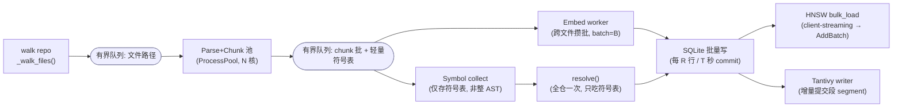
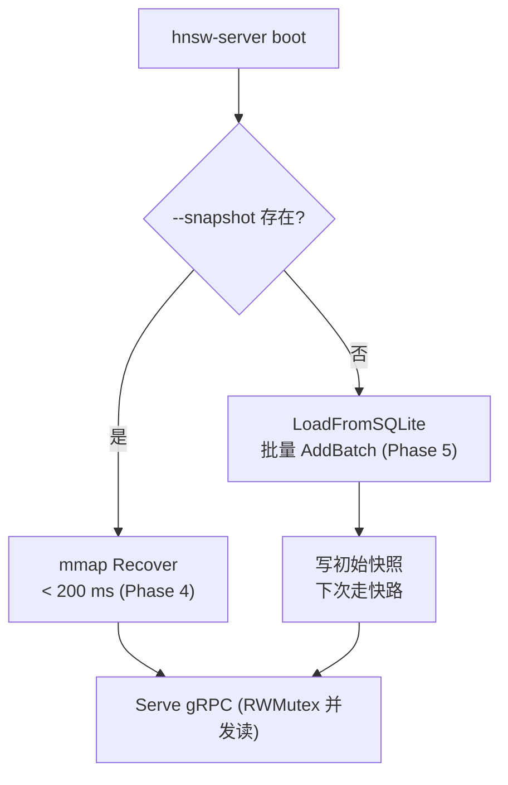
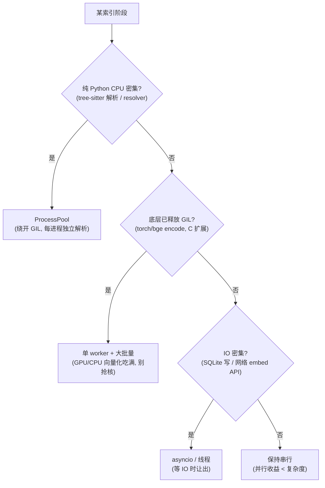

# Phase 6 — 大仓库扩展性（scale-out：内存有界 + 索引吞吐 + Tantivy）（技术方案）

> 本文档与 [`docs/ROADMAP.md`](../ROADMAP.md) 第 6 阶段对应。
> 创建日期：2026-07-16。**状态：🚧 部分实现**（共享 tokeniser + 配置旋钮已落地；并行/流式管线与 Tantivy 待补，见下「本次实现进展」）。
> 风格与 [phase-1-indexer.md](phase-1-indexer.md)、[phase-2-retrieval.md](phase-2-retrieval.md)、[phase-3-graphrag.md](phase-3-graphrag.md)、[phase-4-hnsw-v2.md](phase-4-hnsw-v2.md)、[phase-5-hardening.md](phase-5-hardening.md) 一致：专有名词括号注解。
> 定位：这是 Phase 6–9 的**地基**。Phase 7（增量）/ 8（准确）/ 9（速度）都建立在「引擎已能吞下大仓库」之上。

## 本次实现进展（LM-free 代码切片，2026-07-16）

- ✅ 共享 tokeniser：新增 [`retrieval/tokenize.py`](../../reposage/retrieval/tokenize.py)，`bm25.py` 复用之——为 Tantivy 无缝替换保**同一 tokenise 口径**（DD-035）。
- ✅ scale-out 配置旋钮：`config.py` 增 `index_concurrency` / `embed_batch_size` / `sqlite_commit_rows` / `sparse_backend` / `tantivy_index_dir`。
- ⏳ 待补：并行 + 流式索引管线（bounded memory）、SQLite 批量事务落地、Tantivy 后端实现、大仓库夹具压测。

## 0. 背景与现状（为什么现在做）

RepoSage 到 Phase 5 为止只在小仓库（`tiny_python_repo` 47 符号、`pallets/flask` 量级 50 kLOC）验证过。把它对准 **500 kLOC / 1M+ chunk** 的真实大仓库（Django、CPython 子集）时，几条链路会先撞墙：

| 环节 | 现状（代码位置） | 大仓库上的问题 |
| --- | --- | --- |
| 索引主循环 | [`indexer/pipeline.py`](../../reposage/indexer/pipeline.py) `_run` 单线程 `for path in self._walk_files()` | 纯串行；解析 / chunk / embed 全在一个线程排队 |
| 符号解析 | `python_extractions: list[FileExtraction]` **整仓累积**后一次性 `resolver.resolve()` | 全仓 AST 抽取结果常驻内存 → O(repo) RSS 峰值 |
| 嵌入 | `_embed_and_store` **逐文件** `embedder.embed([c.text for c in chunks])` | bge 每文件一批（batch=32），GPU/CPU 利用率低；无跨文件批量 |
| SQLite 写 | 每个 `upsert` 一个 `with conn`（一次事务） | 百万 chunk → 百万级小事务，`fsync` 放大 |
| 稀疏检索 | [`retrieval/bm25.py`](../../reposage/retrieval/bm25.py) `rank-bm25`（纯 Python，内存） | 启动时 `SELECT ... FROM chunks` 全量 tokenise 进内存；O(N) 重建、无磁盘驻留、无增量 |
| 稠密检索 | go-hnsw 服务端 [`cmd/server/main.go`](../../go-hnsw/cmd/server/main.go) 冷载 SQLite 或 mmap 快照 | Phase 4/5 已做快照 + `AddBatch`，规模化基本就绪，需接上索引端 `bulk_load` |

**结论**：稠密侧（HNSW）Phase 4/5 已基本可扩展；**瓶颈集中在索引管道（内存 + 吞吐）与稀疏侧（rank-bm25）**。本 Phase 专治这两块。

## 1. 目标与范围

**目标**：索引与服务从「小仓库能用」做到能吞下 500 kLOC / 1M+ chunk 的真实大仓库，全程 **内存有界**、**吞吐达标**，检索结果不回退。

**In scope**：
- 索引管道并行化 + 流式化（bounded memory）。
- SQLite 批量事务写。
- **Tantivy** 替换 rank-bm25（`SparseRetriever` Protocol 为迁移边界）。
- HNSW 索引端 `bulk_load` 接线（复用 Phase 5 客户端）。
- 大仓库夹具 + 压测 + OTel 分段计量。

**Out of scope（明确不做，各有归属）**：
- 增量索引（只重解析变更文件）→ **Phase 7**。
- 检索准确性调优（重排 / 查询理解 / 图增强）→ **Phase 8**。
- 查询侧延迟 / 缓存 / SIMD / 无锁读 → **Phase 9**。
- 多语言符号抽取（Java/Rust）→ **Phase 8**（低优先）。
- 分布式 / 多机分片（sharding across machines）→ 非本仓目标（单机可扩展即止）。

## 2. 交付物（deliverables）

| # | 交付物 | 证据 / 落点 |
| --- | --- | --- |
| D1 | 并行索引管道：解析/chunk/embed 分阶段并发，bounded queue | `indexer/pipeline.py` 重构 + `indexer/parallel.py`（新） |
| D2 | 流式符号解析：不再整仓累积 `FileExtraction`，改累积**轻量符号表** | `indexer/python_resolver.py` two-pass 拆成 collect→resolve |
| D3 | SQLite 批量事务写（每 N 行/每 M 秒 commit 一次） | `storage/*_store.py` 增 `begin_batch`/`flush` |
| D4 | 有界内存嵌入：跨文件攒批、embed 缓冲上限、背压 | `indexer/embedder.py` 批量接口 + pipeline 背压 |
| D5 | **Tantivy 稀疏检索**（磁盘驻留倒排索引），满足 `SparseRetriever` | `retrieval/tantivy_sparse.py`（新）+ `bm25.py` 保留为回退 |
| D6 | 索引端 HNSW `bulk_load` 接线（冷建走批量流） | `indexer/pipeline.py` → `HnswGrpcClient.bulk_load` |
| D7 | 大仓库夹具 + 压测脚本（RSS / 吞吐 / 分段耗时） | `benchmarks/scale/run_scale.py`（新）+ `docs/BENCHMARKS.md` §4 |
| D8 | 可调档位：`index_concurrency` / `embed_batch` / `sqlite_commit_rows` | `config.py` |

## 3. 准出指标（exit criteria）

| 指标 | 目标 | 量法 |
| --- | --- | --- |
| **大仓库不 OOM** | 索引 500 kLOC / 1M+ chunk 全程完成 | 压测脚本跑通 Django 或等规模合成仓库 |
| **峰值内存有界** | 峰值 RSS < 阈值（默认档，随夹具定标，目标 ≤ 4 GB） | `benchmarks/scale` 采样 RSS |
| **索引吞吐** | ≥ **1k chunks/s**（4 核笔记本，含 embed 用 mock/hash 或本机 bge） | `n_chunks / elapsed_seconds` |
| **Tantivy 建库吞吐** | 相对 rank-bm25 ≥ **10×**，稀疏索引 RSS 大降（磁盘驻留） | 同一仓库对照 |
| **快照重载** | 1M×128 < 200 ms（复用 Phase 4，不回退） | `hnsw-bench` recover_p50 |
| **无检索回退** | 切 Tantivy 后同一 RAG 基准 recall/citation 不低于 rank-bm25 基线 | `make bench-rag`（Phase 2 门禁）保持绿 |

## 4. 架构与数据流

### 4.1 目标索引管道（并行 + 流式 + 背压）



**背压（backpressure）**：队列有界（`maxsize`），下游慢则上游阻塞，内存自然封顶。这是「有界内存」的核心机制——任何时刻在途数据 = 队列容量 × 单元大小，与仓库总量无关。

### 4.2 服务端冷启动（复用 Phase 4/5，登记于此）



## 5. 关键设计与取舍

### 5.1 偏好流程图：每个阶段选什么并行模型

Python 的 **GIL（Global Interpreter Lock，全局解释器锁）** 决定了「并行模型」不能一刀切。按阶段的 CPU/IO 特性分别选：



| 阶段 | 选择 | 理由 |
| --- | --- | --- |
| Parse + chunk | **ProcessPool** | tree-sitter 封装 + AST 遍历是纯 Python CPU；进程池绕 GIL，近线性加速 |
| Embed（本机 bge） | **单 worker + 跨文件大批量** | `SentenceTransformer.encode` 在 torch 里释放 GIL 且内部向量化；多进程反而抢核 + 重复载模型 |
| Embed（远端 API） | **asyncio 并发 + 攒批** | 瓶颈是网络 RTT；并发填满而非算力 |
| Symbol resolve | **串行（吃符号表）** | 需要**全仓符号表**做跨文件解析，天然不可并行；但把输入从「整 AST」瘦身为「符号表」即可去掉内存瓶颈 |
| SQLite 写 | **单写线程 + 批量事务** | SQLite 单写者最稳；批量 commit 摊薄 fsync |

### 5.2 取舍：流式解析 vs 全仓累积（内存）

现状 `_run` 把所有 `FileExtraction` 留到最后一次 `resolve()`，是 RSS 峰值元凶。但 `PythonModuleResolver` 是 **two-pass 模块感知解析**（先建全仓符号表，再解析 `import` / `self.X` / `cls.X`），**无法逐文件独立解析**。取舍：

| 方案 | 内存 | 正确性 | 结论 |
| --- | --- | --- | --- |
| A. 现状：整仓 `FileExtraction` 常驻 | O(repo)（含每文件完整 AST 派生结构） | ✅ | ❌ 大仓 OOM |
| B. 纯逐文件解析、不建全仓表 | O(1) | ❌ 跨文件引用全 `<unresolved>` | ❌ 砸准确率 |
| **C. 两段瘦身：collect 只留轻量符号表 + 边草稿，resolve 吃符号表** | O(符号数) ≪ O(AST) | ✅ 与 A 等价 | ✅ **采用** |

方案 C：第一遍并行解析每个文件，只吐出「本文件定义的 FQN 列表 + import 语句 + 未解析边草稿」这类**扁平小结构**（丢弃 tree-sitter 树与源码副本），第二遍 `resolve()` 只吃这些符号表。内存从「AST 派生结构 × 文件数」降到「符号数量级」。

### 5.3 取舍：Tantivy 接入方式

| 方案 | 依赖 | 维护成本 | 结论 |
| --- | --- | --- | --- |
| A. `tantivy` PyPI 包（官方 Rust→Python 绑定） | 一个 wheel | 低 | ✅ **首选** |
| B. 自写 Rust bridge（PyO3） | 自维护 Rust crate | 高 | ⬜ 仅当 A 缺关键能力才考虑 |
| C. 继续 rank-bm25 | 无 | —— | ❌ 不满足吞吐/内存目标 |

**迁移边界 = `SparseRetriever` Protocol**（DD-012）：新增 `TantivySparseRetriever` 满足同 `async def search(query, top_k) -> list[ScoredId]`，`HybridRetriever` / `RetrievalService` 零改动。rank-bm25 保留为 `REPOSAGE_SPARSE=bm25` 回退 + 小仓库默认，避免给核心装 Rust 包袱。

Tokenise 复用现有 `bm25.tokenize` 的口径（`User.login`→`[user, login]`），把它抽到 `retrieval/tokenize.py` 供两实现共用，**保证切 Tantivy 后 recall 不漂**。

### 5.4 取舍：SQLite 批量事务粒度

| 粒度 | 吞吐 | 崩溃暴露窗口 | 结论 |
| --- | --- | --- | --- |
| 每行一事务（现状 `upsert`） | 低（百万 fsync） | 极小 | ❌ 慢 |
| 每 N 行 / 每 T 秒一事务 | 高 | ≤ 一个批次 | ✅ **采用**（`sqlite_commit_rows` 默认 2000） |
| 全仓一事务 | 最高 | 全量（崩溃全丢） | ❌ 违反 DD-011 原子性精神、WAL 膨胀 |

配合已开的 `PRAGMA journal_mode=WAL` + `synchronous=NORMAL`（见 `sqlite_graph._connect`），批量 commit 是安全且高收益的一档。

## 6. 关键文件改动

### 6.1 索引管道（Python）
- **`indexer/pipeline.py`**：`_run` 重构为「生产者（walk）→ 并行 parse/chunk → embed worker + symbol collect → 批量写」；引入有界队列与背压；`python_extractions` 改为轻量符号表流。
- **`indexer/parallel.py`**（新）：`ProcessPool` 封装 + 有界队列 + 有序聚合（保证 chunk_id 稳定、可复现）。
- **`indexer/python_resolver.py`**：拆 `collect_symbols(file)`（可并行、纯函数）与 `resolve(symbol_tables)`（串行、吃符号表）。
- **`indexer/embedder.py`**：新增 `embed_iter(texts, batch)` 跨文件攒批接口；bge `batch_size` 提到 config。

### 6.2 存储（Python）
- **`storage/chunk_store.py` / `embeddings_store.py` / `sqlite_graph.py`**：新增 `begin_batch()` / `flush()`，`upsert*` 支持挂到外部批量事务；`sqlite_commit_rows` 触发自动 flush。

### 6.3 稀疏检索（Python）
- **`retrieval/tokenize.py`**（新）：抽出共享 tokenise（从 `bm25.py`）。
- **`retrieval/tantivy_sparse.py`**（新）：`TantivySparseRetriever`（写 schema=`chunk_id`(stored) + `text`(indexed)；`search` 走 Tantivy top_k → `ScoredId`）。
- **`retrieval/bm25.py`**：改用共享 tokenise；保留为回退。
- **`composition.py`**：按 `REPOSAGE_SPARSE`（`tantivy`|`bm25`）选实现。

### 6.4 基准 / 配置
- **`benchmarks/scale/run_scale.py`**（新）：取真实大仓库或合成大仓库，跑索引，采 RSS（复用 `internal/bench/rss_*` 思路的 Python 版）/ 吞吐 / 分段耗时（OTel span 导出解析）。
- **`config.py`**：`index_concurrency`、`embed_batch`、`sqlite_commit_rows`、`sparse_backend`、`tantivy_index_dir`（复用 `bm25_index_dir` 命名族）。
- **`docs/BENCHMARKS.md`** §4：填索引吞吐表（本就标注「Phase 6 填」）。

## 7. 测试矩阵

| 层 | 用例 | 断言 |
| --- | --- | --- |
| 单元 | 并行管道有序聚合 | 同仓库并行 vs 串行产出**逐 chunk_id 一致**（可复现） |
| 单元 | 背压 | 队列满时上游阻塞、在途内存不随仓库增长（注入慢下游探针） |
| 单元 | 批量事务 | 崩溃注入（flush 前 kill）→ 已 commit 批完好、未 commit 批干净重跑 |
| 单元 | Tantivy vs bm25 同口径 | 同一 tokenise，固定语料上 top-k 集合高度重合（Jaccard ≥ 阈值） |
| 集成 | mock profile 端到端 | `REPOSAGE_SPARSE=tantivy` 下 `/ask` 全绿；rank-bm25 回退亦绿 |
| 基准 | `benchmarks/scale` 冒烟 | 合成 100k chunk 仓库：RSS 有界、吞吐 ≥ 目标、无 OOM |
| 回归 | `make bench-rag` | 切 Tantivy 后 recall/citation 不低于基线 |

## 8. 设计决策（拟新增，落地时登记进 `DESIGN_DECISIONS.md`）

- **DD-033 有界队列 + 背压的流式索引**：以队列容量而非仓库规模决定在途内存；ProcessPool 治 GIL、单 embed worker 吃满向量化。取舍：调度复杂度换 O(1) 内存与近线性吞吐。
- **DD-034 两段瘦身解析（collect 轻量符号表 → 串行 resolve）**：保留 two-pass 模块感知的正确性，同时把内存从 O(AST) 降到 O(符号)。
- **DD-035 Tantivy 经 `SparseRetriever` 无缝替换、rank-bm25 保留回退**：迁移边界即 Protocol；共享 tokenise 保 recall 不漂；Rust 依赖走可选后端不进核心。
- **DD-036 SQLite 批量事务（每 N 行/ T 秒）**：在 WAL+NORMAL 上摊薄 fsync；崩溃暴露窗口 ≤ 一个批。

## 9. 风险与对策

- **风险：ProcessPool 序列化开销吃掉加速**。对策：传路径而非大对象，worker 内读文件；只回传扁平符号表；`chunksize` 调优。
- **风险：并行破坏 chunk_id / FQN 可复现性**。对策：产出按文件路径排序聚合后再写；`chunk_id = sha1(repo|path|span|text)` 本就与顺序无关（见 `INDEX_SCHEMA` chunks）。
- **风险：Tantivy 与 rank-bm25 打分不同导致 RAG 漂移**。对策：统一 tokenise；RRF 只看 rank（DD-006）对绝对分不敏感；上线前 `bench-rag` 对照 gate。
- **风险：大批量事务在崩溃时丢一批**。对策：批次幂等重跑（`INSERT ... ON CONFLICT`）；`file_meta` 只在该文件全部写完后落 `ok`（配合 Phase 7 幂等）。
- **风险：embed 成大仓瓶颈（bge 单机慢）**。对策：本 Phase 目标是「管道有界且不 OOM + 吞吐达标」，embed 绝对速度靠 batch 调优；深度提速（GPU/远端并发）留 Phase 9。

## 10. 里程碑与演示命令

**里程碑**：M1 并行 parse/chunk + 批量写（吞吐达标）→ M2 流式 resolve（内存达标）→ M3 Tantivy 上线（稀疏吞吐/内存达标）→ M4 大仓库压测出数、回填 BENCHMARKS。

```bash
# 合成大仓库冒烟（CI 可跑，无需下载真实仓库）
python -m benchmarks.scale.run_scale --synthetic-chunks 100000 --concurrency 4

# 真实大仓库（本地）
python -m reposage.cli index --repo /path/to/django   # 观察 RSS 有界、吞吐达标
REPOSAGE_SPARSE=tantivy python -m reposage.cli serve   # Tantivy 稀疏后端

# 对照：切后端不砸 RAG 质量
REPOSAGE_PROFILE=mock make bench-rag                   # 保持绿
```
