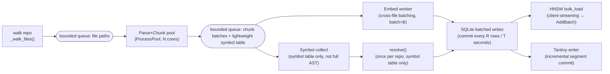
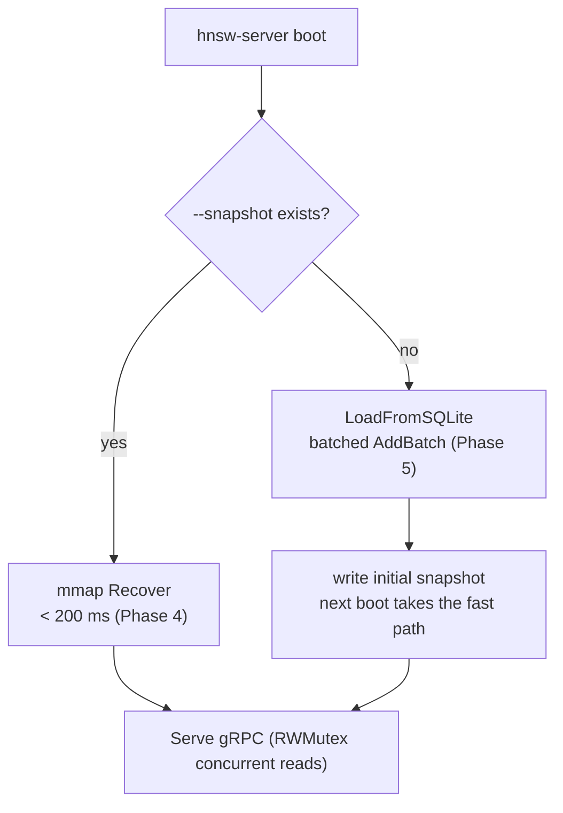
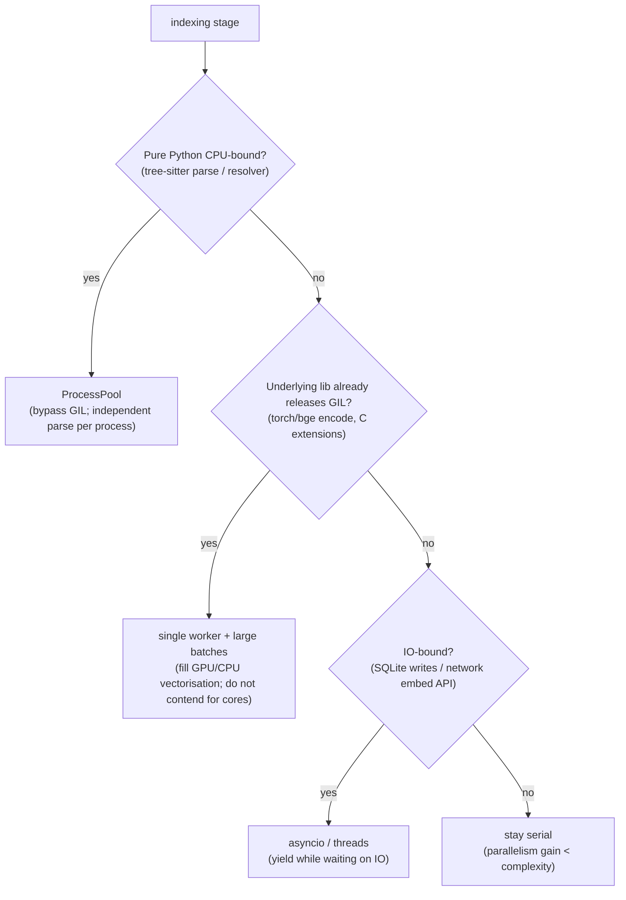

# Phase 6 — Large-repo scale-out (bounded memory + index throughput + Tantivy) (technical design)

> This document corresponds to Phase 6 of [`docs/ROADMAP.md`](../ROADMAP.md).
> Created: 2026-07-16. **Status: 🚧 partially implemented** (shared tokeniser + config knobs have landed; parallel/streaming pipeline and Tantivy still to do — see “Progress this slice” below).
> Style matches [phase-1-indexer.md](phase-1-indexer.md), [phase-2-retrieval.md](phase-2-retrieval.md), [phase-3-graphrag.md](phase-3-graphrag.md), [phase-4-hnsw-v2.md](phase-4-hnsw-v2.md), [phase-5-hardening.md](phase-5-hardening.md): proper nouns annotated in parentheses.
> Role: this is the **foundation** for Phases 6–9. Phase 7 (incremental) / 8 (accuracy) / 9 (speed) all assume “the engine can already swallow a large repo”.

## Progress this slice (LM-free code, 2026-07-16)

- ✅ Shared tokeniser: new [`retrieval/tokenize.py`](../../reposage/retrieval/tokenize.py), reused by `bm25.py` — keeps the **same tokenisation contract** when Tantivy is swapped in (DD-035).
- ✅ Scale-out config knobs: `config.py` adds `index_concurrency` / `embed_batch_size` / `sqlite_commit_rows` / `sparse_backend` / `tantivy_index_dir`.
- ⏳ Still to do: parallel + streaming index pipeline (bounded memory), SQLite batched transactions, Tantivy backend, large-repo fixture load tests.

## 0. Background and current state (why now)

Through Phase 5, RepoSage was only validated on small repos (`tiny_python_repo` 47 symbols, `pallets/flask`-scale ~50 kLOC). Aimed at real large repos (**500 kLOC / 1M+ chunks** — Django, a CPython subset), several paths hit the wall first:

| Stage | Current state (code location) | Problem at large-repo scale |
| --- | --- | --- |
| Index main loop | [`indexer/pipeline.py`](../../reposage/indexer/pipeline.py) `_run` single-threaded `for path in self._walk_files()` | Fully serial; parse / chunk / embed all queue on one thread |
| Symbol resolution | `python_extractions: list[FileExtraction]` **accumulated for the whole repo** then one `resolver.resolve()` | Whole-repo AST extractions stay in RAM → O(repo) RSS peak |
| Embedding | `_embed_and_store` **per file** `embedder.embed([c.text for c in chunks])` | bge one batch per file (batch=32); low GPU/CPU utilisation; no cross-file batching |
| SQLite writes | each `upsert` in its own `with conn` (one transaction) | A million chunks → a million tiny transactions; `fsync` amplification |
| Sparse retrieval | [`retrieval/bm25.py`](../../reposage/retrieval/bm25.py) `rank-bm25` (pure Python, in-memory) | On start, `SELECT ... FROM chunks` tokenises everything into RAM; O(N) rebuild, no on-disk residence, no incrementals |
| Dense retrieval | go-hnsw server [`cmd/server/main.go`](../../go-hnsw/cmd/server/main.go) cold-loads SQLite or an mmap snapshot | Phase 4/5 already have snapshots + `AddBatch`; scale-out is mostly ready; still need indexer-side `bulk_load` |

**Conclusion**: the dense side (HNSW) is already largely scalable after Phase 4/5; **the bottleneck is the index pipeline (memory + throughput) and the sparse side (rank-bm25)**. This phase targets those two.

## 1. Goals and scope

**Goal**: take indexing and serving from “works on small repos” to swallowing a real 500 kLOC / 1M+ chunk repo, with **bounded memory** and **throughput that meets the bar** throughout, and no retrieval regression.

**In scope**:
- Parallelise + stream the index pipeline (bounded memory).
- SQLite batched transactional writes.
- **Tantivy** replacing rank-bm25 (`SparseRetriever` Protocol as the migration boundary).
- Wire indexer-side HNSW `bulk_load` (reuse the Phase 5 client).
- Large-repo fixtures + load tests + OTel per-stage timing.

**Out of scope (explicitly not this phase; each has an owner)**:
- Incremental indexing (re-parse only changed files) → **Phase 7**.
- Retrieval-accuracy tuning (rerank / query understanding / graph enrichment) → **Phase 8**.
- Query-side latency / cache / SIMD / lock-free reads → **Phase 9**.
- Multi-language symbol extraction (Java/Rust) → **Phase 8** (low priority).
- Distributed / multi-machine sharding → not a goal of this repo (single-machine scale-out is the ceiling).

## 2. Deliverables

| # | Deliverable | Evidence / landing spot |
| --- | --- | --- |
| D1 | Parallel index pipeline: parse/chunk/embed concurrent by stage, bounded queues | `indexer/pipeline.py` refactor + `indexer/parallel.py` (new) |
| D2 | Streaming symbol resolution: stop accumulating whole-repo `FileExtraction`; accumulate a **lightweight symbol table** instead | `indexer/python_resolver.py` two-pass split into collect→resolve |
| D3 | SQLite batched transactional writes (commit every N rows / every M seconds) | `storage/*_store.py` add `begin_batch`/`flush` |
| D4 | Bounded-memory embedding: cross-file batching, embed buffer cap, backpressure | `indexer/embedder.py` batch API + pipeline backpressure |
| D5 | **Tantivy sparse retrieval** (on-disk inverted index) satisfying `SparseRetriever` | `retrieval/tantivy_sparse.py` (new) + keep `bm25.py` as fallback |
| D6 | Indexer-side HNSW `bulk_load` wiring (cold build via batched stream) | `indexer/pipeline.py` → `HnswGrpcClient.bulk_load` |
| D7 | Large-repo fixture + load-test script (RSS / throughput / per-stage time) | `benchmarks/scale/run_scale.py` (new) + `docs/BENCHMARKS.md` §4 |
| D8 | Tunable knobs: `index_concurrency` / `embed_batch` / `sqlite_commit_rows` | `config.py` |

## 3. Exit criteria

| Metric | Target | How measured |
| --- | --- | --- |
| **Large repo does not OOM** | Indexing 500 kLOC / 1M+ chunks completes end to end | Load-test script runs Django or a same-scale synthetic repo |
| **Peak memory bounded** | Peak RSS below a threshold (default profile, calibrated on the fixture; target ≤ 4 GB) | `benchmarks/scale` samples RSS |
| **Index throughput** | ≥ **1k chunks/s** (4-core laptop, embed via mock/hash or local bge) | `n_chunks / elapsed_seconds` |
| **Tantivy build throughput** | ≥ **10×** vs rank-bm25; sparse-index RSS drops sharply (on-disk) | Same-repo comparison |
| **Snapshot reload** | 1M×128 < 200 ms (reuse Phase 4; no regression) | `hnsw-bench` recover_p50 |
| **No retrieval regression** | After switching to Tantivy, same RAG-benchmark recall/citation no worse than the rank-bm25 baseline | `make bench-rag` (Phase 2 gate) stays green |

## 4. Architecture and data flow

### 4.1 Target index pipeline (parallel + streaming + backpressure)



**Backpressure**: queues are bounded (`maxsize`); a slow downstream blocks upstream, so memory naturally caps. That is the core of “bounded memory” — in-flight data at any moment = queue capacity × unit size, independent of repo size.

### 4.2 Server cold start (reuse Phase 4/5; recorded here)



## 5. Key design and trade-offs

### 5.1 Preference flowchart: which parallelism model per stage

Python’s **GIL (Global Interpreter Lock)** means there is no one parallelism model. Choose by each stage’s CPU/IO profile:



| Stage | Choice | Rationale |
| --- | --- | --- |
| Parse + chunk | **ProcessPool** | tree-sitter wrapper + AST walk is pure Python CPU; process pool bypasses the GIL, near-linear speedup |
| Embed (local bge) | **Single worker + large cross-file batches** | `SentenceTransformer.encode` releases the GIL inside torch and vectorises internally; extra processes contend for cores and reload the model |
| Embed (remote API) | **asyncio concurrency + batching** | Bottleneck is network RTT; fill the pipe, not the CPU |
| Symbol resolve | **Serial (consume the symbol table)** | Needs a **whole-repo symbol table** for cross-file resolution — inherently not parallel; shrinking input from “full AST” to “symbol table” removes the memory bottleneck |
| SQLite writes | **Single writer thread + batched transactions** | SQLite is most stable with one writer; batched commits amortise fsync |

### 5.2 Trade-off: streaming parse vs whole-repo accumulation (memory)

Today `_run` keeps every `FileExtraction` until a final `resolve()` — the RSS-peak culprit. But `PythonModuleResolver` is **two-pass module-aware resolution** (build the whole-repo symbol table first, then resolve `import` / `self.X` / `cls.X`) and **cannot resolve each file independently**. Trade-off:

| Option | Memory | Correctness | Verdict |
| --- | --- | --- | --- |
| A. Status quo: whole-repo `FileExtraction` resident | O(repo) (full AST-derived structures per file) | ✅ | ❌ large-repo OOM |
| B. Pure per-file resolution, no whole-repo table | O(1) | ❌ all cross-file refs become `<unresolved>` | ❌ tanks accuracy |
| **C. Two-stage slim-down: collect keeps only a lightweight symbol table + edge drafts; resolve consumes the symbol table** | O(#symbols) ≪ O(AST) | ✅ equivalent to A | ✅ **adopt** |

Option C: pass 1 parses each file in parallel and emits only **flat small structures** — this file’s defined FQN list + import statements + unresolved edge drafts (drop the tree-sitter tree and source copy). Pass 2 `resolve()` consumes only those symbol tables. Memory drops from “AST-derived structures × file count” to “order of symbol count”.

### 5.3 Trade-off: how to bring in Tantivy

| Option | Dependencies | Maintenance | Verdict |
| --- | --- | --- | --- |
| A. `tantivy` PyPI package (official Rust→Python bindings) | one wheel | low | ✅ **preferred** |
| B. Homegrown Rust bridge (PyO3) | self-maintained Rust crate | high | ⬜ only if A lacks a critical capability |
| C. Keep rank-bm25 | none | — | ❌ misses throughput/memory targets |

**Migration boundary = `SparseRetriever` Protocol** (DD-012): new `TantivySparseRetriever` satisfies the same `async def search(query, top_k) -> list[ScoredId]`; `HybridRetriever` / `RetrievalService` need zero changes. Keep rank-bm25 as `REPOSAGE_SPARSE=bm25` fallback + default for small repos, so core does not take a Rust dependency tax.

Reuse the existing `bm25.tokenize` **tokenisation contract** (`User.login`→`[user, login]`), extract it to `retrieval/tokenize.py` for both implementations, **so recall does not drift after switching to Tantivy**.

### 5.4 Trade-off: SQLite batched-transaction granularity

| Granularity | Throughput | Crash-exposure window | Verdict |
| --- | --- | --- | --- |
| One transaction per row (current `upsert`) | low (a million fsyncs) | tiny | ❌ slow |
| One transaction every N rows / every T seconds | high | ≤ one batch | ✅ **adopt** (`sqlite_commit_rows` default 2000) |
| One transaction for the whole repo | highest | full (crash loses everything) | ❌ violates the spirit of DD-011 atomicity; WAL bloat |

Together with already-on `PRAGMA journal_mode=WAL` + `synchronous=NORMAL` (see `sqlite_graph._connect`), batched commit is a safe, high-payoff setting.

## 6. Key file changes

### 6.1 Index pipeline (Python)
- **`indexer/pipeline.py`**: `_run` becomes “producer (walk) → parallel parse/chunk → embed worker + symbol collect → batched writes”; introduce bounded queues and backpressure; `python_extractions` becomes a lightweight symbol-table stream.
- **`indexer/parallel.py`** (new): `ProcessPool` wrapper + bounded queues + ordered aggregation (stable, reproducible chunk_id).
- **`indexer/python_resolver.py`**: split `collect_symbols(file)` (parallelisable, pure) and `resolve(symbol_tables)` (serial, consumes the symbol table).
- **`indexer/embedder.py`**: new `embed_iter(texts, batch)` cross-file batching API; bge `batch_size` lifted to config.

### 6.2 Storage (Python)
- **`storage/chunk_store.py` / `embeddings_store.py` / `sqlite_graph.py`**: new `begin_batch()` / `flush()`; `upsert*` can attach to an external batched transaction; `sqlite_commit_rows` triggers auto-flush.

### 6.3 Sparse retrieval (Python)
- **`retrieval/tokenize.py`** (new): extract shared tokenise (from `bm25.py`).
- **`retrieval/tantivy_sparse.py`** (new): `TantivySparseRetriever` (write schema=`chunk_id`(stored) + `text`(indexed); `search` takes Tantivy top_k → `ScoredId`).
- **`retrieval/bm25.py`**: use the shared tokeniser; keep as fallback.
- **`composition.py`**: pick implementation from `REPOSAGE_SPARSE` (`tantivy`|`bm25`).

### 6.4 Benchmarks / config
- **`benchmarks/scale/run_scale.py`** (new): take a real large repo or a synthetic one, run indexing, sample RSS (Python analogue of `internal/bench/rss_*`) / throughput / per-stage time (parse OTel span export).
- **`config.py`**: `index_concurrency`, `embed_batch`, `sqlite_commit_rows`, `sparse_backend`, `tantivy_index_dir` (same naming family as `bm25_index_dir`).
- **`docs/BENCHMARKS.md`** §4: fill the index-throughput table (already marked “fill in Phase 6”).

## 7. Test matrix

| Layer | Case | Assertion |
| --- | --- | --- |
| Unit | Parallel pipeline ordered aggregation | Parallel vs serial on the same repo produce **identical chunk_ids one-for-one** (reproducible) |
| Unit | Backpressure | Upstream blocks when the queue is full; in-flight memory does not grow with repo size (inject a slow-downstream probe) |
| Unit | Batched transactions | Crash injection (kill before flush) → committed batches intact, uncommitted batch clean on rerun |
| Unit | Tantivy vs bm25 same tokenisation contract | Same tokeniser; high overlap of top-k sets on a fixed corpus (Jaccard ≥ threshold) |
| Integration | mock-profile end-to-end | `/ask` all green under `REPOSAGE_SPARSE=tantivy`; rank-bm25 fallback also green |
| Benchmark | `benchmarks/scale` smoke | Synthetic 100k-chunk repo: RSS bounded, throughput ≥ target, no OOM |
| Regression | `make bench-rag` | After switching to Tantivy, recall/citation no worse than baseline |

## 8. Design decisions (proposed; register in `DESIGN_DECISIONS.md` when landing)

- **DD-033 Streaming index via bounded queues + backpressure**: in-flight memory is set by queue capacity, not repo size; ProcessPool for the GIL; a single embed worker saturates vectorisation. Trade-off: scheduling complexity for O(1) memory and near-linear throughput.
- **DD-034 Two-stage slim-down resolution (collect a lightweight symbol table → serial resolve)**: keep two-pass module-aware correctness while dropping memory from O(AST) to O(symbols).
- **DD-035 Tantivy drop-in via `SparseRetriever`; keep rank-bm25 as fallback**: the Protocol is the migration boundary; shared tokenise keeps recall from drifting; the Rust dependency is an optional backend, not core.
- **DD-036 SQLite batched transactions (every N rows / T seconds)**: amortise fsync on WAL+NORMAL; crash-exposure window ≤ one batch.

## 9. Risks and mitigations

- **Risk: ProcessPool serialisation overhead eats the speedup**. Mitigation: pass paths, not large objects; workers read files; return only flat symbol tables; tune `chunksize`.
- **Risk: parallelism breaks chunk_id / FQN reproducibility**. Mitigation: aggregate output sorted by file path before write; `chunk_id = sha1(repo|path|span|text)` is already order-independent (see `INDEX_SCHEMA` chunks).
- **Risk: Tantivy vs rank-bm25 scoring differs and RAG drifts**. Mitigation: unified tokenise; RRF looks only at rank (DD-006) and is insensitive to absolute scores; `bench-rag` comparison gate before ship.
- **Risk: a large batched transaction loses a batch on crash**. Mitigation: batches are idempotent to rerun (`INSERT ... ON CONFLICT`); `file_meta` only writes `ok` after that file is fully written (pairs with Phase 7 idempotency).
- **Risk: embed becomes the large-repo bottleneck (single-host bge is slow)**. Mitigation: this phase’s target is “pipeline bounded and no OOM + throughput bar”; absolute embed speed is batch tuning; deep speedups (GPU / remote concurrency) wait for Phase 9.

## 10. Milestones and demo commands

**Milestones**: M1 parallel parse/chunk + batched writes (throughput met) → M2 streaming resolve (memory met) → M3 Tantivy live (sparse throughput/memory met) → M4 large-repo load-test numbers, backfill BENCHMARKS.

```bash
# Synthetic large-repo smoke (CI-runnable; no real-repo download)
python -m benchmarks.scale.run_scale --synthetic-chunks 100000 --concurrency 4

# Real large repo (local)
python -m reposage.cli index --repo /path/to/django   # observe bounded RSS, throughput on target
REPOSAGE_SPARSE=tantivy python -m reposage.cli serve   # Tantivy sparse backend

# Check: switching backends does not tank RAG quality
REPOSAGE_PROFILE=mock make bench-rag                   # stay green
```
