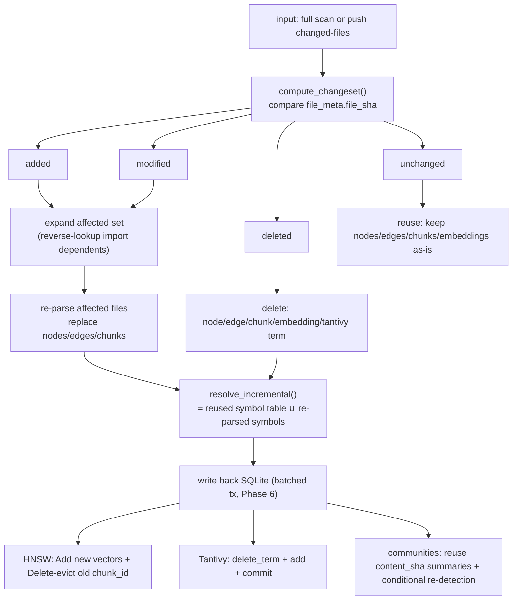
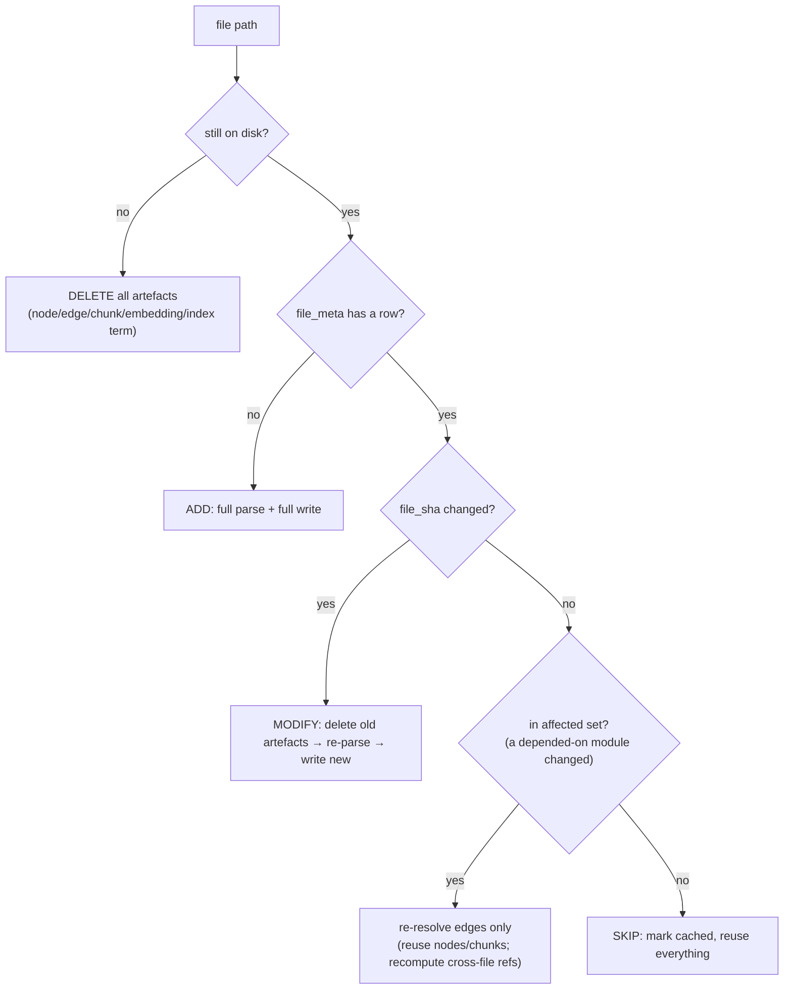
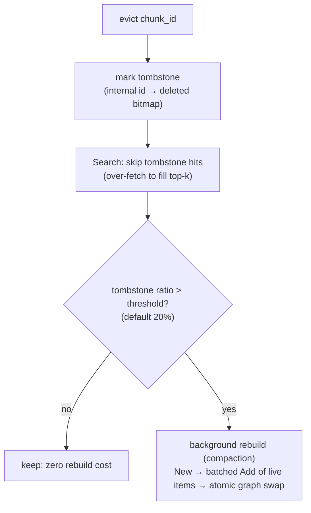

# Phase 7 — Incremental index (incremental reindex: re-parse only changed files) (technical design)

> This document corresponds to Phase 7 of [`docs/ROADMAP.md`](../ROADMAP.md).
> Created: 2026-07-16. **Status: 🚧 partially implemented** (changeset / affected set / per-file delete + pipeline incremental delete and change refresh have landed; incremental symbol resolution and HNSW tombstones still to do — see “Progress this slice” below).
> Style matches [phase-1-indexer.md](phase-1-indexer.md) … [phase-6-scale-out.md](phase-6-scale-out.md): proper nouns annotated in parentheses.
> Depends on: Phase 6 (large-repo scale-out). Depended on by: Phase 10 (GitHub App `push` events drive this phase).

## Progress this slice (LM-free code)

### 2026-07-16
- ✅ Changeset: [`indexer/incremental.py`](../../reposage/indexer/incremental.py) `ChangeSet` / `compute_changeset` (pure functions; full classification of added/modified/deleted/unchanged).
- ✅ Affected set: `affected_files` (L1 import ripple, DD-038) + storage `module_fqns_for_paths` / `paths_importing`.
- ✅ Per-file delete: `SQLiteSymbolGraphStore.delete_file` / `delete_edges_by_src_path` / `all_files` (`ChunkStore.delete_by_path` already existed).
- ✅ `get_repo_version` (head_sha/last_indexed_at) for Phase 9 cache invalidation.

### 2026-07-17 (pipeline integration + audit fixes)
- ✅ **Incremental delete wiring**: `IndexPipeline._run` (non-force) snapshots `all_files`, diffs against paths walked this run, and purges files deleted on disk from nodes/edges/chunks (`_purge_deleted_files`; `manifest.n_deleted_files` count, shown in the CLI table). The comparison is “walked”, not “successfully indexed”, so a transient read error does not delete a file that is still there.
- ✅ **Symbol refresh for changed files**: `_index_file` (non-force) runs `delete_nodes_by_path` + `delete_edges_by_src_path` before re-parse, fixing two real bugs — (1) edge `weight` inflation (`+1` on every reindex); (2) deleted/renamed symbols left behind.
- ✅ **Empty-file chunk cleanup**: `_index_file` always `delete_by_path` then inserts, fixing “file emptied but old chunks (and cascaded embeddings) remain”.
- ✅ **Equivalence test**: `test_incremental_matches_full_rebuild` — for a “symbol-preserving edit” (comment appended at the end), the symbol graph from incremental reindex (nodes + edges + weights) is **row-wise equal** to a full rebuild.
- ⏳ Still to do: incremental symbol resolution (re-read importer sources in the affected set, drop dangling inbound edges from deleted files), HNSW tombstone/incremental upsert, Tantivy incremental segments, GraphRAG conditional re-detection.

> Known limitation: **inbound edges** of a deleted file (edges from other unchanged files that `import` it) are not cleaned up yet; eliminating those dangling edges needs an affected-set re-read of importers — listed as still to do.

## 0. Background and current state (today’s “incremental” is incomplete)

Phase 1 already left hooks for incrementals: `chunks.file_sha`, `file_meta(file_sha, mtime, parse_status)`, `communities.content_sha` (see [`docs/INDEX_SCHEMA.md`](../INDEX_SCHEMA.md)). `IndexPipeline` also **already** does a naive skip:

```python
# indexer/pipeline.py :: _index_file
if not force:
    existing = graph_store.get_file_sha(self.repo_name, rel_path_str)
    if existing == file_sha:
        graph_store.upsert_file_meta(..., parse_status="cached")
        return   # skip this file
```

That skip, when **not** doing a full rebuild, produces an index that is **semantically incomplete or wrong**:

| Symptom | Root cause (code) | Consequence |
| --- | --- | --- |
| Cross-file refs lose resolution | `cached` files **never enter** `python_extractions`; `resolver.resolve()` only sees changed files → whole-repo symbol table is incomplete | `import`/calls in changed files that point at unchanged files become `<unresolved>` |
| Stale edges remain | `upsert_edges` uses `ON CONFLICT ... weight+1` — only grows; a call removed from a changed file leaves the old edge | Graph still has “calls that no longer exist” |
| Deleted files not handled | No cleanup for “gone on disk, still in the index” | Ghost nodes/edges/chunks linger |
| Communities always fully recomputed | `_run_graphrag` always `clear_repo` + whole-graph `detect` | Every push on a large repo reruns Leiden |
| Dense/sparse not incremental | HNSW/BM25 **cold-load SQLite** on the server; no delta channel | Changing one file means restart/reload the whole store |

**The only correct path is `--force` (`clear_repo` + full rebuild)** — on a large repo that is “minutes of full rebuild”.

**This phase’s proposition**: make “re-parse only changed files” **match a full rebuild**, and on large repos compress minutes to seconds.

## 1. Goals and scope

**Goal**: `reposage index` (without `--force`) and `push`-driven reindex process only added/modified/deleted files, and **output is equivalent to a full rebuild**.

**In scope**: change detection (including deletes), incremental symbol graph (CRUD on nodes/edges/chunks + cross-file ripple), HNSW incremental upsert + eviction, Tantivy incremental segment commit, incremental communities (reuse + conditional recompute), `push` changed-files entry point, **equivalence guarantee**.

**Out of scope**:
- Absolute sparse/dense speed, cache → Phase 9.
- First introduction of Tantivy (this phase depends on its incremental capability) → already Phase 6.
- GitHub webhook send/receive itself → Phase 10 (this phase only defines the interface that **consumes a changed-files list**).

## 2. Deliverables

| # | Deliverable | Landing spot |
| --- | --- | --- |
| D1 | Changeset computation: added / modified / deleted / unchanged | `indexer/incremental.py` (new) `compute_changeset()` |
| D2 | Per-file delete API for nodes/edges/chunks | `storage/sqlite_graph.py` `delete_file(repo, path)`; `chunk_store.delete_by_path` (already exists) |
| D3 | Cross-file ripple: expand the affected set | `incremental.py` reverse lookup on `edges(kind='import')` |
| D4 | Incremental resolve: reuse symbols of unchanged files from `nodes`; re-resolve only affected files’ edges | `python_resolver.py` `resolve_incremental()` |
| D5 | Incremental HNSW: `Add`/`bulk_load` new chunks; evict deleted chunks (tombstone + threshold rebuild) | `proto/hnsw.proto` + `Delete` RPC, go-hnsw, `hnsw_client.py` |
| D6 | Incremental Tantivy: `delete_term(chunk_id)` + add + commit | `retrieval/tantivy_sparse.py` |
| D7 | Incremental communities: reuse `content_sha` summaries + conditional re-detection | `pipeline._run_graphrag` |
| D8 | `push` entry: incremental directly from a changed-files list | `indexer/pipeline.py` `run_incremental(changed, deleted)` |
| D9 | Equivalence test harness: incremental vs full rebuild, per-table diff | `tests/…/test_incremental_equivalence.py` |

## 3. Exit criteria

| Metric | Target | How measured |
| --- | --- | --- |
| **Speedup** | At 5% files changed, incremental reindex is **≥ 10×** vs full | Timed comparison on the large-repo fixture |
| **Equivalence** | After incremental, `nodes`/`edges`/`chunks`/`embeddings`/`communities` are **row-wise equivalent** to a full rebuild (modulo autoincrement ids) | `test_incremental_equivalence` all green |
| **Retrieval consistency** | After incremental, the same query batch’s top-k matches a full rebuild | RAG comparison |
| **Deletes are clean** | After deleting a file, no ghost node/edge/chunk/embedding/tombstone leak | Delete-case assertions that counts go to zero |
| **HNSW stays valid** | After incremental upsert/eviction, recall is no worse than rebuild; auto-rebuild when tombstone ratio exceeds the threshold | go-hnsw unit + integration |

## 4. Architecture and data flow

### 4.1 Incremental main flow



### 4.2 Why “changing a chunk = a new chunk_id”

`chunk_id = sha1(repo|path|start_line|end_line|text)` (see `INDEX_SCHEMA` chunks). **Any content change changes the id.** So incrementals treat chunks as “invalidate the old id + insert the new id”, which is naturally idempotent:
- SQLite: `chunk_store.delete_by_path` removes old, `upsert` writes new; embeddings clear automatically via `ON DELETE CASCADE` (already implemented).
- HNSW/Tantivy: old chunk_ids need **explicit eviction** (they do not cascade with SQLite). That is the core capability this phase adds to both indexes.

## 5. Key design and trade-offs

### 5.1 Preference flowchart: how to handle one file



### 5.2 Trade-off: how deep the cross-file ripple (affected set) goes

Changing the location/signature of `B.foo` in `b.py` affects resolution of the `a → B.foo` edge in `a.py`. Depth is an accuracy vs speed trade-off:

| Level | Re-parse scope | Accuracy | Cost | Verdict |
| --- | --- | --- | --- | --- |
| L0 changed files only | The changed files themselves | Outbound edges from changed files are correct; **inbound edges from others to changed files** may be stale | lowest | ❌ not equivalent |
| **L1 changed files + direct import dependents (1 hop)** | Reverse-lookup `edges(kind='import', dst=changed module)` src files | Covers the vast majority of common ripples (rename/move/delete symbol) | low (import edges are sparse) | ✅ **adopt (default)** |
| L2 transitive closure | Recursive dependents | Theoretically complete | on a large repo may collapse to near-full | ⬜ only with explicit `--deep` |
| Lfull full | Whole repo | 100% | slow | fallback safety net (`--force`) |

**Adopt L1**: `import` edges in SQLite reverse-lookup in O(matches) (`edges_dst_kind` covering index). Extreme ripples L1 misses (indirect transitive rename) are covered by “equivalence CI comparison + periodic `--force` calibration”, and this boundary is documented.

### 5.3 Trade-off: where incremental resolve gets its symbol table

`PythonModuleResolver` needs a **whole-repo symbol table**. Incrementally we do not want to re-parse unchanged files — how is the table completed?

| Option | Notes | Verdict |
| --- | --- | --- |
| A. Re-parse the whole repo for the symbol table | Defeats the point of incrementals | ❌ |
| **B. Read unchanged files’ symbols back from the `nodes` table (it is the persisted symbol table)** | `nodes(fqn, kind, path, …)` is the whole-repo symbol catalogue; incremental resolve = “unchanged symbols in the DB ∪ re-parsed changed symbols” | ✅ **adopt** |
| C. Extra on-disk symbol-table cache | Redundant with `nodes`, easy to drift | ❌ |

Option B makes `nodes` do double duty: query hot-path data and the symbol catalogue for incremental resolution. `resolve_incremental(changed_symbols, db_symbols)` re-emits edges only for affected files.

### 5.4 Trade-off: how HNSW “deletes”

go-hnsw today **only adds, never deletes** (`Add` has replace semantics, but no delete). Deleted chunk_ids must be evicted from the graph:



| Option | Delete latency | Memory | Recall impact | Verdict |
| --- | --- | --- | --- | --- |
| Delete from the graph immediately + repair edges | high (mutate adjacency, may break connectivity) | stable | easy to degrade | ❌ deleting HNSW vertices is a known hard problem |
| **Tombstone + threshold rebuild (compaction)** | O(1) mark | tombstones accumulate until rebuild | skip at search time, over-fetch to fill; zero after rebuild | ✅ **adopt** (industry mainstream, including hnswlib `mark_deleted`) |
| Rebuild on every delete | — | stable | none | ❌ too expensive under frequent push |

New gRPC `Delete(id)` (proto needs `protoc-gen-go`; if the environment still lacks it, follow DD-029: park a **server method** first + Python side relies on “server auto-compaction when the rebuild threshold is hit”; proto extension is a cheap follow-up).

### 5.5 Trade-off: incremental communities

| Stage | Today | Phase 7 |
| --- | --- | --- |
| Summaries | Already reused by `content_sha` (unchanged communities skip the LLM) | keep |
| Detection (Leiden) | Whole-graph rerun every time | **Conditional rerun**: if the fraction of changed nodes/edges is below a threshold (default 10%), recompute only affected communities locally; otherwise full |
| Embedding | Re-embed every community that has a summary | Re-embed only new/changed summaries |

Local community recompute is relatively complex (Leiden is not an incremental algorithm). The trade-off is **threshold gating**: small changes skip re-detection and keep hitting old `content_sha`; large changes do a full re-detection. Typical “a few files changed” does not trigger Leiden, which matches equivalence (`content_sha` unchanged means the community membership set is unchanged).

## 6. Key file changes

- **`indexer/incremental.py`** (new): `compute_changeset(repo, disk_files, file_meta)` → `ChangeSet(added, modified, deleted, unchanged)`; `affected_files(changeset, graph_store)` (L1 import reverse lookup).
- **`indexer/pipeline.py`**: `run(force)` splits — `force` keeps today’s full path; otherwise `_run_incremental(changeset)`; new `run_incremental(changed, deleted)` for `push` to feed directly. Delete paths call each store’s `delete_file`.
- **`indexer/python_resolver.py`**: `resolve_incremental(changed_symbol_tables, db_symbols)` emits only affected edges.
- **`storage/sqlite_graph.py`**: `delete_file(repo, path)` (delete that file’s nodes + edges by `src_path` + file_meta row); `iter_symbols(repo)` (read back the symbol catalogue); `delete_edges_by_src_path`.
- **`storage/chunk_store.py`**: reuse existing `delete_by_path`; add `iter_chunk_ids_by_path` for index eviction.
- **`proto/hnsw.proto` + go-hnsw + `retrieval/hnsw_client.py`**: `Delete(ids)` / tombstone / compaction; client `delete(chunk_ids)`.
- **`retrieval/tantivy_sparse.py`**: `delete_terms(chunk_ids)` + `commit`.
- **`pipeline._run_graphrag`**: add change-fraction gating + re-embed only new summaries.

## 7. Test matrix

| Layer | Case | Assertion |
| --- | --- | --- |
| Unit | `compute_changeset` | added/modified/deleted/unchanged classified correctly (includes deletes and adds) |
| Unit | affected set L1 | Changing a depended-on module puts dependents in the affected set; unrelated files stay out |
| Unit | `delete_file` | That file’s node/edge/chunk/embedding counts go to zero; other files are untouched |
| **Equivalence** | Incremental vs full | For the same series of edits, tables after `_run_incremental` are **row-wise equivalent** to `run(force=True)` |
| Unit | HNSW tombstone | After delete, Search does not return the deleted id; over-fetch fills top-k; after threshold rebuild, tombstones go to zero and recall recovers |
| Unit | Incremental Tantivy | After `delete_term`+add+commit, old chunks are not recalled and new chunks are |
| Integration | `push` entry | Given changed/deleted lists, finishes in seconds and results are equivalent |
| Benchmark | 5% change speedup | Incremental wall-clock ≤ full / 10 |

**Equivalence tests are this phase’s north star**: any incremental optimisation must pass “incremental result == full-rebuild result”.

## 8. Design decisions (proposed; register when landing)

- **DD-037 Incrementals keyed on `file_sha`; `nodes` doubles as the persisted symbol catalogue**: unchanged-file symbols are read back from the DB into resolve — no re-parse, still cross-file-correct.
- **DD-038 L1 import ripple (affected set = changed files + direct dependents)**: covers common rename/move; transitive closure and full rebuild as `--deep`/`--force` safety nets; equivalence CI + periodic `--force` calibrate the boundary.
- **DD-039 HNSW tombstone + threshold compaction**: O(1) mark on delete, skip at search, background rebuild past the threshold; avoid online vertex deletion breaking graph connectivity.
- **DD-040 Community-detection threshold gating**: small changes reuse `content_sha` partitions and skip Leiden; large changes do a full re-detection.
- **DD-041 Incremental correctness is accepted against “equivalent to full rebuild”**: incrementals are an optimisation, not a new semantics; CI per-table diffs keep the gate.

## 9. Risks and mitigations

- **Risk: L1 misses transitive ripples**. Mitigation: document the boundary; periodic `--force` calibration; equivalence cases cover common rename/delete/move.
- **Risk: tombstones accumulate, slowing search / inflating memory**. Mitigation: threshold-triggered compaction; `Stats` exposes tombstone ratio for observability (Phase 5 OTel).
- **Risk: delete races with concurrent reads (server)**. Mitigation: Delete takes the write lock (Phase 5 `RWMutex`); compaction uses Phase 4 atomic graph swap (New→Add→atomic swap).
- **Risk: community gating desyncs partitions from content**. Mitigation: skip only when `content_sha` is unchanged (membership set unchanged); any membership change triggers the corresponding recompute.
- **Risk: `push` changed-files disagree with disk**. Mitigation: `run_incremental` still re-checks real on-disk `file_sha`; changed-files are only a “candidate set” speedup.

## 10. Milestones and demo commands

**Milestones**: M1 change detection + delete cleanup (equivalence foundation) → M2 incremental resolve + L1 ripple → M3 HNSW/Tantivy incremental eviction → M4 community gating + `push` entry + speedup met.

```bash
# First full index
python -m reposage.cli index --repo /path/to/django

# Incremental after editing one file (default non-force)
$EDITOR django/http/response.py
time python -m reposage.cli index --repo /path/to/django   # expect: seconds; only affected artefacts change

# Equivalence calibration
python -m reposage.cli index --repo /path/to/django --force # full
# CI: incremental vs full per-table diffs must match
pytest tests/ -k incremental_equivalence
```
