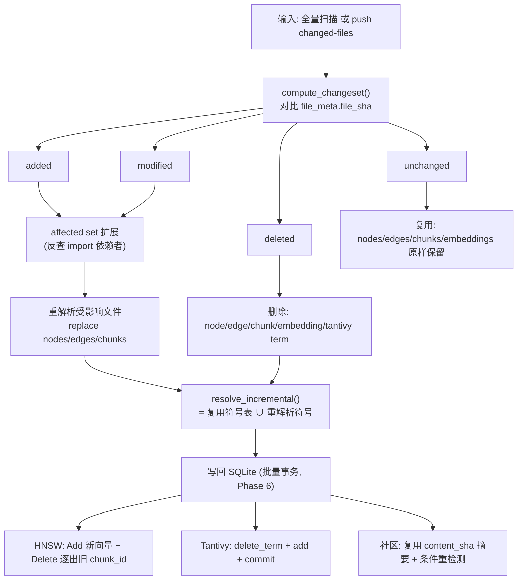
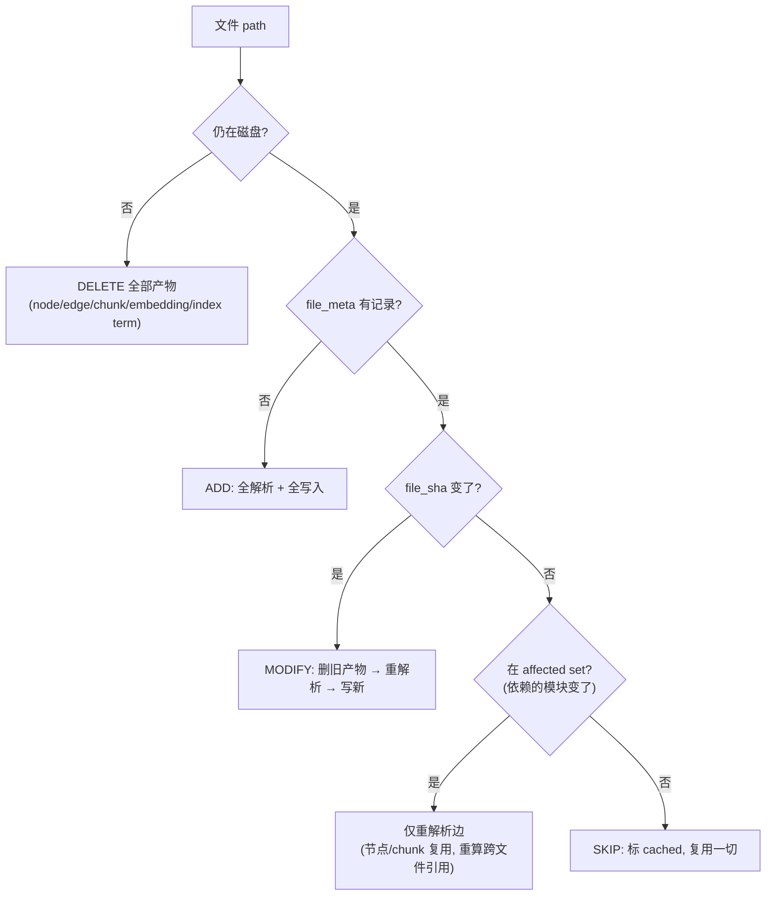
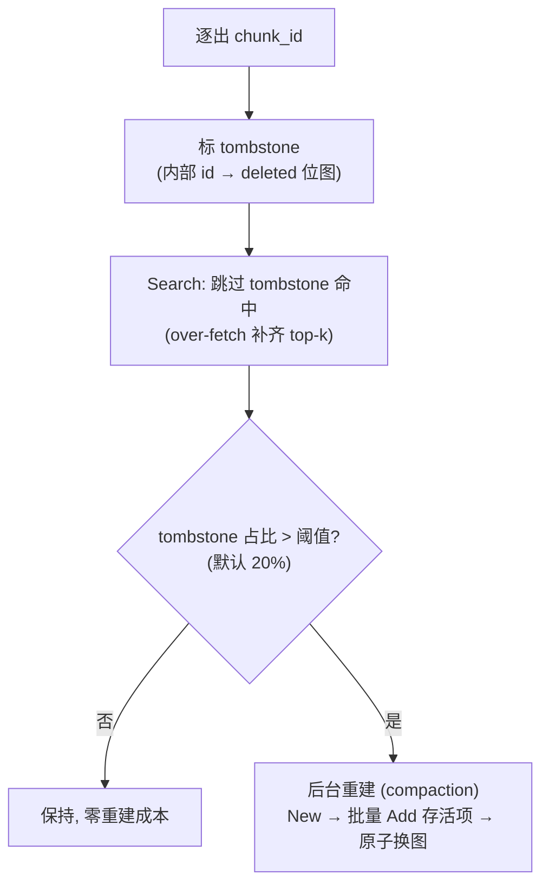

# Phase 7 — 增量索引（incremental reindex：只重解析变更文件）（技术方案）

> 本文档与 [`docs/ROADMAP.md`](../ROADMAP.md) 第 7 阶段对应。
> 创建日期：2026-07-16。**状态：🚧 部分实现**（变更集/影响集/单文件删除 + 管线增量删除与变更刷新已落地；增量符号解析与 HNSW 墓碑待补，见下「本次实现进展」）。
> 风格与 [phase-1-indexer.md](phase-1-indexer.md) … [phase-6-scale-out.md](phase-6-scale-out.md) 一致：专有名词括号注解。
> 依赖：Phase 6（大仓库扩展）。被依赖：Phase 10（GitHub App 的 `push` 事件驱动本阶段）。

## 本次实现进展（LM-free 代码切片）

### 2026-07-16
- ✅ 变更集：[`indexer/incremental.py`](../../reposage/indexer/incremental.py) 的 `ChangeSet` / `compute_changeset`（纯函数，added/modified/deleted/unchanged 全分类）。
- ✅ 影响集：`affected_files`（L1 import 涟漪，DD-038）+ 存储层 `module_fqns_for_paths` / `paths_importing`。
- ✅ 单文件删除：`SQLiteSymbolGraphStore.delete_file` / `delete_edges_by_src_path` / `all_files`（`ChunkStore.delete_by_path` 已具备）。
- ✅ `get_repo_version`（head_sha/last_indexed_at）供 Phase 9 缓存失效。

### 2026-07-17（管线整合 + 审计修复）
- ✅ **增量删除接线**：`IndexPipeline._run`（非 force）快照 `all_files`，对比本轮 walk 到的路径，把磁盘上已删除的文件从 nodes/edges/chunks 全部清除（`_purge_deleted_files`，`manifest.n_deleted_files` 计数、CLI 表格展示）。对比基于「walk 到」而非「索引成功」，避免瞬时读错误误删仍在的文件。
- ✅ **变更文件符号刷新**：`_index_file`（非 force）在重解析前 `delete_nodes_by_path` + `delete_edges_by_src_path`，修复两个真实 bug——① 边权 `weight` 每次重索引 `+1` 膨胀；② 被删/改名的符号残留。
- ✅ **空文件 chunk 清理**：`_index_file` 无条件 `delete_by_path` 后再插入，修复「文件被清空后旧 chunk（及级联 embedding）残留」。
- ✅ **等价性测试**：`test_incremental_matches_full_rebuild`——对「保符号编辑」（尾部加注释），增量重索引产出的符号图（nodes + edges + 权重）与全量重建**逐行相等**。
- ⏳ 待补：增量符号解析（affected set 回读 importer 源，消除删除文件的悬挂入边）、HNSW 墓碑/增量 upsert、Tantivy 增量段、GraphRAG 条件重检测。

> 已知限制：删除文件的**入边**（其它未变更文件 `import` 它产生的边）暂不清理，需 affected-set 回读 importer 才能消除悬挂边——列入待补。

## 0. 背景与现状（当前「增量」是不完整的）

Phase 1 就为增量埋了钩子：`chunks.file_sha`、`file_meta(file_sha, mtime, parse_status)`、`communities.content_sha`（见 [`docs/INDEX_SCHEMA.md`](../INDEX_SCHEMA.md)）。`IndexPipeline` 也**已经**做了一层朴素跳过：

```python
# indexer/pipeline.py :: _index_file
if not force:
    existing = graph_store.get_file_sha(self.repo_name, rel_path_str)
    if existing == file_sha:
        graph_store.upsert_file_meta(..., parse_status="cached")
        return   # 跳过该文件
```

但这层「跳过」在**非全量重建**时会产出**语义不完整甚至错误**的索引：

| 现象 | 根因（代码） | 后果 |
| --- | --- | --- |
| 跨文件引用丢解析 | 被 `cached` 的文件**不进** `python_extractions`，`resolver.resolve()` 只看到变更文件 → 全仓符号表不全 | 变更文件里指向未变文件的 `import`/调用变 `<unresolved>` |
| 陈旧边残留 | `upsert_edges` 用 `ON CONFLICT ... weight+1` 只增不减；变更文件删掉的调用，旧边仍在 | 图里有「已不存在的调用」 |
| 删除文件不处理 | 无「磁盘上已删、索引里还在」的清理 | 幽灵节点/边/chunk 长期残留 |
| 社区全量重算 | `_run_graphrag` 每次 `clear_repo` + 全图 `detect` | 大仓库上每次 push 都跑一遍 Leiden |
| 稠密/稀疏无增量 | HNSW/BM25 靠服务端**冷载 SQLite**；无 delta 通道 | 改一个文件要重启/重载整库 |

**唯一正确路径是 `--force`（`clear_repo` + 全量）**——大仓库上就是「分钟级全量」。

**本 Phase 的命题**：把「只重解析变更文件」做到**结果与全量重建一致**，且在大仓库上从分钟级压到秒级。

## 1. 目标与范围

**目标**：`reposage index`（无 `--force`）与 `push` 事件驱动的重索引，只处理新增/修改/删除文件，且**输出等价于全量重建**。

**In scope**：变更检测（含删除）、符号图增量（节点/边/chunk 的增删改 + 跨文件涟漪）、HNSW 增量 upsert + 逐出、Tantivy 增量段提交、社区增量（复用 + 条件重算）、`push` changed-files 入口、**等价性保证**。

**Out of scope**：
- 稀疏/稠密的绝对速度优化、缓存 → Phase 9。
- Tantivy 首次引入（本 Phase 依赖它的增量能力）→ 已在 Phase 6。
- GitHub webhook 收发本身 → Phase 10（本 Phase 只定义「吃 changed-files 列表」的接口）。

## 2. 交付物（deliverables）

| # | 交付物 | 落点 |
| --- | --- | --- |
| D1 | 变更集计算：added / modified / deleted / unchanged 四类 | `indexer/incremental.py`（新）`compute_changeset()` |
| D2 | 节点/边/chunk 的按文件删除 API | `storage/sqlite_graph.py` `delete_file(repo, path)`；`chunk_store.delete_by_path`（已存在） |
| D3 | 跨文件涟漪：受影响文件集（affected set）扩展 | `incremental.py` 基于 `edges(kind='import')` 反查 |
| D4 | 增量 resolve：未变文件符号从 `nodes` 复用，仅重解析受影响文件的边 | `python_resolver.py` `resolve_incremental()` |
| D5 | HNSW 增量：新增 chunk `Add`/`bulk_load`，删除 chunk 逐出（tombstone + 阈值重建） | `proto/hnsw.proto` +`Delete` RPC、go-hnsw、`hnsw_client.py` |
| D6 | Tantivy 增量：`delete_term(chunk_id)` + add + commit | `retrieval/tantivy_sparse.py` |
| D7 | 社区增量：复用 `content_sha` 摘要 + 条件重检测 | `pipeline._run_graphrag` |
| D8 | `push` 入口：吃 changed-files 列表直接增量 | `indexer/pipeline.py` `run_incremental(changed, deleted)` |
| D9 | 等价性测试工具：增量结果 vs 全量结果逐表 diff | `tests/…/test_incremental_equivalence.py` |

## 3. 准出指标（exit criteria）

| 指标 | 目标 | 量法 |
| --- | --- | --- |
| **提速** | 改动占比 5% 时，增量重索引相对全量 **≥ 10×** | 大仓库夹具计时对照 |
| **等价性** | 增量后 `nodes`/`edges`/`chunks`/`embeddings`/`communities` 与全量重建**逐行等价**（modulo 自增 id） | `test_incremental_equivalence` 全绿 |
| **检索一致** | 增量后同一批查询 top-k 与全量重建一致 | RAG 对照 |
| **删除干净** | 删文件后无幽灵 node/edge/chunk/embedding/tombstone 泄漏 | 删除用例断言计数归零 |
| **HNSW 不失效** | 增量 upsert/逐出后 recall 不低于重建；tombstone 比例超阈自动重建 | go-hnsw 单测 + 集成 |

## 4. 架构与数据流

### 4.1 增量主流程



### 4.2 为什么「改一个 chunk = 新 chunk_id」

`chunk_id = sha1(repo|path|start_line|end_line|text)`（见 `INDEX_SCHEMA` chunks）。**内容一变，id 变**。因此增量对 chunk 是「旧 id 作废 + 新 id 新增」，天然幂等：
- SQLite：`chunk_store.delete_by_path` 删旧，`upsert` 写新，embeddings 经 `ON DELETE CASCADE` 自动清（已实现）。
- HNSW/Tantivy：旧 chunk_id 需**显式逐出**（它们不随 SQLite 级联）。这是本 Phase 对两个索引新增的核心能力。

## 5. 关键设计与取舍

### 5.1 偏好流程图：一个文件该怎么处理



### 5.2 取舍：跨文件涟漪（affected set）做到多深

改 `b.py` 里 `B.foo` 的位置/签名，会影响 `a.py` 里 `a → B.foo` 那条边的解析。做多深是准确率与速度的权衡：

| 层级 | 重解析范围 | 准确性 | 成本 | 结论 |
| --- | --- | --- | --- | --- |
| L0 仅变更文件 | 变更文件本身 | 变更文件指向他人的边正确；**他人指向变更文件**的边可能陈旧 | 最低 | ❌ 不达等价 |
| **L1 变更文件 + 直接 import 依赖者（1 跳）** | 反查 `edges(kind='import', dst=变更模块)` 的 src 文件 | 覆盖绝大多数常见涟漪（重命名/移动/删符号） | 低（import 边稀疏） | ✅ **采用（默认）** |
| L2 传递闭包 | 递归依赖者 | 理论最全 | 大仓上可能退化为近全量 | ⬜ 仅 `--deep` 显式开启 |
| Lfull 全量 | 全仓 | 100% | 慢 | 回退保底（`--force`） |

**采用 L1**：`import` 边在 SQLite 里可 O(matches) 反查（`edges_dst_kind` 覆盖索引）。L1 未覆盖的极端涟漪（间接传递重命名）由「等价性 CI 对照 + 周期性 `--force` 校准」兜底，并在文档写明这条边界。

### 5.3 取舍：增量 resolve 的符号表从哪来

`PythonModuleResolver` 需要**全仓符号表**。增量时不想重解析未变文件，符号表怎么补全？

| 方案 | 说明 | 结论 |
| --- | --- | --- |
| A. 重解析全仓拿符号表 | 违背增量初衷 | ❌ |
| **B. 未变文件的符号从 `nodes` 表读回（它就是持久化的符号表）** | `nodes(fqn, kind, path, …)` 即全仓符号目录；增量 resolve = 「DB 里的未变符号 ∪ 重解析出的变更符号」 | ✅ **采用** |
| C. 额外维护一份符号表缓存文件 | 与 `nodes` 冗余、易漂 | ❌ |

方案 B 让 `nodes` 表一表两用：既是查询热路径数据，又是增量解析的符号目录。`resolve_incremental(changed_symbols, db_symbols)` 只为受影响文件重新发射边。

### 5.4 取舍：HNSW 如何「删」

go-hnsw 现在**只增不删**（`Add` 有替换语义，但无删除）。删除的 chunk_id 必须从图里逐出：



| 方案 | 删除时延 | 内存 | recall 影响 | 结论 |
| --- | --- | --- | --- | --- |
| 立即从图删 + 修边 | 高（改邻接、可能断连通） | 稳 | 易劣化 | ❌ HNSW 删点是公认难点 |
| **Tombstone + 阈值重建（compaction）** | O(1) 标记 | tombstone 累积到重建前 | 搜索期跳过、over-fetch 补齐；重建后归零 | ✅ **采用**（业界主流，含 hnswlib `mark_deleted`） |
| 每次删都重建 | —— | 稳 | 无 | ❌ 频繁 push 下太贵 |

新增 gRPC `Delete(id)`（proto 需 `protoc-gen-go`；若环境仍缺，按 DD-029 先挂**服务端方法** + Python 侧走「重建阈值到点由服务端自动 compaction」，proto 扩展留低成本后续）。

### 5.5 取舍：社区增量

| 环节 | 现状 | Phase 7 |
| --- | --- | --- |
| 摘要 | 已按 `content_sha` 复用（未变社区跳 LLM） | 保持 |
| 检测（Leiden） | 每次全图重跑 | **条件重跑**：变更节点/边占比 < 阈值（默认 10%）时，只对受影响社区局部重算；否则全量 |
| 嵌入 | 每次对有摘要社区重嵌 | 仅对新/变摘要重嵌 |

社区局部重算较复杂（Leiden 非增量算法），取舍为「**阈值门控**」：小改动跳过重检测、沿用旧 `content_sha` 命中；大改动才全量重检测。这样常见的「改几个文件」不触发 Leiden，符合等价性（`content_sha` 不变即社区成员集不变）。

## 6. 关键文件改动

- **`indexer/incremental.py`**（新）：`compute_changeset(repo, disk_files, file_meta)` → `ChangeSet(added, modified, deleted, unchanged)`；`affected_files(changeset, graph_store)`（L1 import 反查）。
- **`indexer/pipeline.py`**：`run(force)` 分流——`force` 走现状全量；否则走 `_run_incremental(changeset)`；新增 `run_incremental(changed, deleted)` 供 `push` 直喂。删除路径调用各 store 的 `delete_file`。
- **`indexer/python_resolver.py`**：`resolve_incremental(changed_symbol_tables, db_symbols)` 只发射受影响边。
- **`storage/sqlite_graph.py`**：`delete_file(repo, path)`（删该文件的 nodes + 以 `src_path` 删 edges + file_meta 行）；`iter_symbols(repo)`（读回符号目录）；`delete_edges_by_src_path`。
- **`storage/chunk_store.py`**：`delete_by_path`（已存在）复用；补 `iter_chunk_ids_by_path` 供索引逐出。
- **`proto/hnsw.proto` + go-hnsw + `retrieval/hnsw_client.py`**：`Delete(ids)` / tombstone / compaction；客户端 `delete(chunk_ids)`。
- **`retrieval/tantivy_sparse.py`**：`delete_terms(chunk_ids)` + `commit`。
- **`pipeline._run_graphrag`**：加变更占比门控 + 仅重嵌新摘要。

## 7. 测试矩阵

| 层 | 用例 | 断言 |
| --- | --- | --- |
| 单元 | `compute_changeset` | added/modified/deleted/unchanged 四类分类正确（含删除、含新增） |
| 单元 | affected set L1 | 改被依赖模块 → 依赖者进受影响集；无关文件不进 |
| 单元 | `delete_file` | 该文件 node/edge/chunk/embedding 计数归零，其他文件不受影响 |
| **等价性** | 增量 vs 全量 | 对同一系列改动，`_run_incremental` 后各表与 `run(force=True)` **逐行等价** |
| 单元 | HNSW tombstone | 删后 Search 不返回被删 id；over-fetch 补足 top-k；超阈重建后 tombstone 归零、recall 恢复 |
| 单元 | Tantivy 增量 | `delete_term`+add+commit 后旧 chunk 不召回、新 chunk 可召回 |
| 集成 | `push` 入口 | 给定 changed/deleted 列表，秒级完成且结果等价 |
| 基准 | 5% 改动提速 | 增量 wall-clock ≤ 全量 / 10 |

**等价性测试是本 Phase 的北极星**：任何增量优化都必须过「增量结果 == 全量结果」这一关。

## 8. 设计决策（拟新增，落地时登记）

- **DD-037 增量以 `file_sha` 为准、`nodes` 表兼作持久符号目录**：未变文件符号从 DB 读回参与 resolve，避免重解析又保跨文件正确。
- **DD-038 L1 import 涟漪（affected set = 变更文件 + 直接依赖者）**：覆盖常见重命名/移动；传递闭包与全量作为 `--deep`/`--force` 兜底；等价性 CI + 周期 `--force` 校准边界。
- **DD-039 HNSW tombstone + 阈值 compaction**：删除 O(1) 标记、搜索期跳过、超阈后台重建；避免在线删点破坏图连通。
- **DD-040 社区检测阈值门控**：小改动复用 `content_sha` 分区、跳过 Leiden；大改动才全量重检测。
- **DD-041 增量正确性以「等价全量」为验收契约**：增量是优化，不是新语义；CI 逐表 diff 守门。

## 9. 风险与对策

- **风险：L1 漏掉传递涟漪**。对策：文档写明边界；周期性 `--force` 校准；等价性用例覆盖常见重命名/删除/移动。
- **风险：tombstone 累积拖慢搜索 / 撑内存**。对策：阈值触发 compaction；`Stats` 暴露 tombstone 比例供观测（Phase 5 OTel）。
- **风险：删除与并发读竞态（服务端）**。对策：Delete 走写锁（Phase 5 `RWMutex`）；compaction 用 Phase 4 的原子换图（New→Add→atomic swap）。
- **风险：社区门控导致分区与内容不同步**。对策：门控只在 `content_sha` 不变（成员集不变）时跳过；成员集一变即触发相应重算。
- **风险：push 传来的 changed-files 与磁盘不一致**。对策：`run_incremental` 仍以磁盘真实 `file_sha` 复核，changed-files 只作「候选集」加速。

## 10. 里程碑与演示命令

**里程碑**：M1 变更检测 + 删除清理（等价性打底）→ M2 增量 resolve + L1 涟漪 → M3 HNSW/Tantivy 增量逐出 → M4 社区门控 + `push` 入口 + 提速达标。

```bash
# 首次全量
python -m reposage.cli index --repo /path/to/django

# 改一个文件后增量（默认非 force）
$EDITOR django/http/response.py
time python -m reposage.cli index --repo /path/to/django   # 期望：秒级、仅动受影响产物

# 等价性校准
python -m reposage.cli index --repo /path/to/django --force # 全量
# CI: 增量结果与全量结果逐表 diff 必须一致
pytest tests/ -k incremental_equivalence
```
