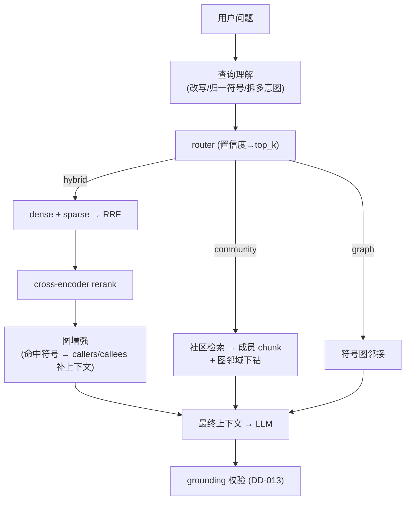
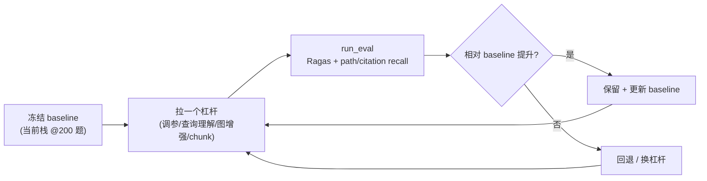
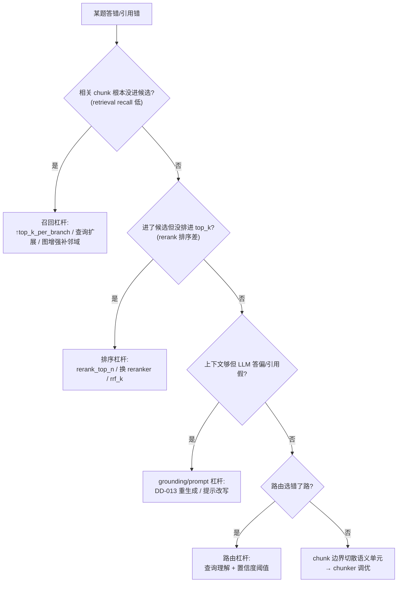

# Phase 8 — 检索准确性（retrieval quality：评测先行 + 查询理解 + 图增强）（技术方案）

> 本文档与 [`docs/ROADMAP.md`](../ROADMAP.md) 第 8 阶段对应。
> 创建日期：2026-07-16。**状态：⬜ 未开始（前瞻技术方案）**。
> 风格与 [phase-1-indexer.md](phase-1-indexer.md) … [phase-7-incremental.md](phase-7-incremental.md) 一致：专有名词括号注解。
> 依赖：Phase 6（引擎可扩展）。与 Phase 9（速度）大体并行，但**准确率优先，延迟由 Phase 9 收口**。

## 0. 背景与现状

到 Phase 5，三路检索的**机制**齐备，但**准确率从未被系统性优化**——因为缺一个足够大的度量基线（200 题只落地了 50，Phase 5 把补齐挪到了这里）。现有检索栈：

| 环节 | 现状（代码） | 局限 |
| --- | --- | --- |
| 路由 | [`retrieval/router.py`](../../reposage/retrieval/router.py)：正则三档（dotted/call/snake）+ LLM 兜底 | 只分「符号 vs 语义」；不改写、不拆多意图问题 |
| 混合检索 | [`retrieval/hybrid.py`](../../reposage/retrieval/hybrid.py)：dense+sparse → RRF(k=60) → rerank_top_n=20 → cross-encoder → top_k=8 | 参数**从未调**（`top_k_per_branch=50/rrf_k=60/rerank_top_n=20` 是初值） |
| 重排 | [`retrieval/reranker.py`](../../reposage/retrieval/reranker.py)：`bge-reranker-v2-m3` cross-encoder | 未与替代模型对照评测 |
| 图 | [`sqlite_graph.py`](../../reposage/storage/sqlite_graph.py)：`callers_of`/`callees_of` 仅供 graph 路由 | **不用于增强 hybrid 命中的上下文** |
| 社区 | [`community_retriever.py`](../../reposage/retrieval/community_retriever.py) 余弦扫描 | 命中社区后取 seed chunk（`_chunks_for_communities`），无「顺图下钻」 |
| chunk | `indexer/chunker.py`（AST + 最大行数 + 重叠） | 边界/重叠未按检索质量调 |
| 多语言 | TS/Go 仅 parse 校验（DD-010），无符号抽取 | 非 Python 内容对图/社区不可见（用户明确：**低优先**） |

评测侧已有 [`benchmarks/rag/run_eval.py`](../../benchmarks/rag/run_eval.py)（Phase 2）、[`benchmarks/cross_file_qa/run_eval.py`](../../benchmarks/cross_file_qa/run_eval.py)（Phase 3，path_recall / citation_recall / aggregate_correctness，Ragas 可选）。

## 1. 目标与范围

**目标**：用**评测 harness 驱动**，把三路检索的端到端准确率相对当前基线系统性抬升。

**In scope**：补齐 200 题基准（度量地基）、混合检索调参、查询理解（改写/扩展/拆分）、图增强检索、chunk 质量、Ragas 指标接线、per-bucket 提升表。

**Out of scope**：
- 延迟/吞吐/缓存（查询理解会加 LLM 调用，延迟由 **Phase 9** 收口）。
- 稀疏后端本身（Tantivy）→ Phase 6。
- **多语言符号抽取**：低优先，作为**可选增项**，不阻塞本阶段退出（§5.5）。

## 2. 交付物（deliverables）

| # | 交付物 | 落点 |
| --- | --- | --- |
| D1 | **完整 200 题基准**（Python + TS + Go，按 bucket：graph/community/hybrid） | `benchmarks/cross_file_qa/questions.jsonl` |
| D2 | Ragas 接线：`answer_correctness` / `faithfulness` 常态出数 | `benchmarks/cross_file_qa/run_eval.py` |
| D3 | 混合检索调参扫描（rrf_k / top_k_per_branch / rerank_top_n） | `benchmarks/retrieval_sweep.py`（新） |
| D4 | 查询理解：改写/扩展 + 多意图拆分 + router 置信度联动 top_k | `retrieval/query_understanding.py`（新）+ router |
| D5 | 图增强检索：hybrid 命中沿 `callers/callees` 扩展上下文 | `retrieval/graph_expand.py`（新）+ hybrid |
| D6 | 社区下钻：命中社区 → 成员 chunk 的图邻域补全 | `retrieval_service._chunks_for_communities` 增强 |
| D7 | chunk 边界/重叠调优（评测驱动） | `indexer/chunker.py` + 扫描 |
| D8 | per-bucket 提升表 + 回填 `docs/BENCHMARKS.md` §2 | `docs/BENCHMARKS.md` |
| D9 | （可选/低优先）TS/Go 符号抽取 | `indexer/*_resolver.py` |

## 3. 准出指标（exit criteria）

| 指标 | 目标 | 量法 |
| --- | --- | --- |
| **200 题就位** | Python+TS+Go 共 200 题，含 `expected_paths`/`expected_citations` | `questions.jsonl` 计数 + schema 校验 |
| **端到端准确率** | `auto` 相对 `hybrid-only` 基线 **+X%（绝对）**（headline：`auto − hybrid-only`） | Ragas `answer_correctness`（200 题总） |
| **引用对齐** | citation 对齐率相对基线提升（±5 行窗口，见 cross_file_qa） | `citation_recall` |
| **路径召回** | `path_recall` 相对基线提升 | 同上 |
| **无质量倒退** | 任一 bucket 不显著下降（守 -ε 门槛） | per-bucket 表 |
| **延迟不失控** | 查询理解开启后 P50 仍在 GraphRAG 包络内（≤ 30 s），细压留 Phase 9 | `LatencyBreakdown` |

> 退出以「**相对自身基线的可复现提升**」为准：先冻结当前栈在 200 题上的数字为 baseline，每个杠杆的收益都对照 baseline 记账。

## 4. 架构与数据流

### 4.1 增强后的检索管道（查询理解 + 图增强）



### 4.2 评测闭环（评测先行）



## 5. 关键设计与取舍

### 5.1 偏好流程图：按失败桶对症下药（诊断驱动）

准确率优化最忌「凭感觉调」。先跑 baseline，按**失败模式**选杠杆：



每个杠杆都对应一个可量化的中间指标（recall@候选 / rerank 命中率 / grounding 率 / 路由准确率），避免「动了但不知为何变好/变坏」。

### 5.2 取舍：查询理解要不要、做多重

查询改写/扩展能提召回，但**多一次 LLM 调用**（延迟 + 成本）。取舍：

| 方案 | 收益 | 成本 | 结论 |
| --- | --- | --- | --- |
| 不做 | —— | 0 | ❌ 符号名不归一、多意图问题被当单意图 |
| **轻量启发式改写（无 LLM）** | 归一 `User.login`↔`login`、去停用词、驼峰拆分 | ~0 | ✅ **默认开** |
| LLM 改写/扩展/拆分 | 最强召回（同义扩展、多意图） | +1 LLM 调用 | ✅ **可配 `query_understanding=llm`**，默认关，供准确率优先场景 |
| 复用 router 的 LLM 调用 | 一次调用兼出「路由 + 改写」 | 省一次往返 | ✅ 合并到 router prompt（减延迟） |

**偏好**：默认走零成本启发式；LLM 改写作为可选高档，且**与 router 合并调用**摊薄延迟（延迟细账归 Phase 9）。

### 5.3 取舍：图增强的广度（信噪比）

hybrid 命中一个 chunk 后，可顺 `callers_of`/`callees_of` 把相关符号的 chunk 也拉进上下文。广度是双刃：

| 广度 | 召回 | 噪声 | 结论 |
| --- | --- | --- | --- |
| 不扩展（现状） | 基线 | 低 | 跨文件题偏弱 |
| **1 跳 callees（被调用者）+ 命中符号所在类兄弟** | 明显补齐「调用链/协作」类题 | 可控 | ✅ **采用**，且**受 rerank 二次把关** |
| 2+ 跳 / callers+callees 全展开 | 边际递减 | 高（拉入无关模块） | ⬜ 仅评测证明有净收益才加 |

**关键纪律**：图增强只**扩候选集**，最终仍过 cross-encoder rerank（把噪声压回去），再截 top_k。即「宽召回、严排序」。

### 5.4 取舍：reranker 与调参怎么定

- 调参用**网格扫描 + 200 题**定，不拍脑袋。`retrieval_sweep.py` 扫 `rrf_k ∈ {10,30,60,100}` × `top_k_per_branch ∈ {30,50,100}` × `rerank_top_n ∈ {12,20,32}`，出 Pareto（准确率 vs 候选规模/延迟）。
- reranker 换型（如更大/更小 bge-reranker、或 LLM-as-reranker）对照评测；沿用 DD-012 的 `Reranker` Protocol 无缝切。

### 5.5 取舍：多语言（低优先）

用户明确「多语言不是很重要」。定位为**可选增项**，仅在「扩大准确率覆盖面且 ROI 高」时择机做：

| 语言 | 现状 | 本 Phase 态度 |
| --- | --- | --- |
| Python | 全解析 | 主战场 |
| TS/JS、Go | 仅 `parse_status='unsupported'`（DD-010） | 若 200 题含跨语言题且缺覆盖拖分，才补**符号抽取**（`nodes/edges/chunks`），走 DD-010 说的「纯增量」 |
| Java/Rust | 无 | ⬜ 不在本 Phase 承诺范围 |

不阻塞退出：200 题的语言配比可按「Python 为主 + 少量 TS/Go 语义题（走 hybrid，靠 chunk 文本即可）」设计，使多语言符号抽取成为加分项而非前置条件。

## 6. 关键文件改动

- **`benchmarks/cross_file_qa/questions.jsonl`**：扩到 200 题，标 `bucket`/`expected_paths`/`expected_citations`（沿用现有 schema，`run_eval` 的 bucket 统计与门禁无需改）。
- **`benchmarks/cross_file_qa/run_eval.py`**：Ragas 常态化（`answer_correctness`/`faithfulness`），补 `auto` 与 `hybrid-only` 两跑对照（headline gain）。
- **`benchmarks/retrieval_sweep.py`**（新）：检索参数网格扫描 → Pareto。
- **`retrieval/query_understanding.py`**（新）：启发式改写 + 可选 LLM 改写/拆分；`QueryRouter` 合并调用。
- **`retrieval/router.py`**：置信度联动 `top_k`；吃改写结果。
- **`retrieval/graph_expand.py`**（新）：`expand(chunks, graph_store, hops=1)` 顺图补候选。
- **`retrieval/hybrid.py`**：候选融合后、rerank 前插入图增强（可开关）。
- **`services/retrieval_service.py`**：`_chunks_for_communities` 加图邻域下钻。
- **`indexer/chunker.py`**：边界/重叠参数化 + 扫描调优。
- **`docs/BENCHMARKS.md`** §2：回填 200 题 per-bucket 表。

## 7. 测试矩阵

| 层 | 用例 | 断言 |
| --- | --- | --- |
| 数据 | 200 题 schema | 每题有合法 bucket/expected_paths；jsonl 可解析 |
| 单元 | 启发式改写 | `User.login`→含 `login`；驼峰/蛇形拆分正确；幂等 |
| 单元 | 图增强 | 命中符号的 1 跳 callees 进候选；无环、去重、受 top_n 限界 |
| 单元 | 调参扫描 | sweep 产出可解析 CSV + Pareto 选点正确（被支配点不入前沿） |
| 集成 | mock 端到端 | 查询理解/图增强开关下 `/ask` 全绿，结果确定 |
| 基准 | 200 题对照 | `auto − hybrid-only` ≥ 目标；无 bucket 显著倒退 |
| 回归 | Phase 2 `bench-rag` | P50/recall/citation 门禁保持绿 |

## 8. 设计决策（拟新增，落地时登记）

- **DD-042 评测先行、baseline 记账**：先冻结 200 题基线，每个杠杆对照 baseline 量收益；无净收益即回退。
- **DD-043 查询理解分档（启发式默认、LLM 可选且并入 router 调用）**：零成本默认 + 高召回可选，延迟摊薄。
- **DD-044 图增强 = 宽召回严排序**：顺图只扩候选，最终由 cross-encoder rerank 把关，控信噪比。
- **DD-045 多语言为可选增项**：以是否拖累 200 题分数决定投入，走 DD-010 的纯增量扩展。

## 9. 风险与对策

- **风险：200 题标注主观/有偏**。对策：多来源真实仓库、明确标注规范、±5 行引用容差；用 `hybrid-only` 作同分母基线降低绝对标注噪声影响。
- **风险：图增强/查询扩展引入噪声反降准**。对策：一切经 rerank 收口 + 评测门控，任一杠杆先证明净收益再默认开。
- **风险：Ragas 依赖真实 LLM、CI 跑不动**。对策：Ragas 仅 `run-eval` 标签/周跑；CI mock 只验插件与召回类确定性指标（沿用现有 `importorskip` 习惯）。
- **风险：查询理解显著抬高延迟**。对策：默认启发式；LLM 档合并 router 调用；绝对延迟收口交 Phase 9，本 Phase 只守「不超 GraphRAG 包络」。
- **风险：过拟合 200 题**。对策：留 holdout 子集不参与调参；周期性换题复核。

## 10. 里程碑与演示命令

**里程碑**：M1 200 题 + Ragas + 冻结 baseline → M2 调参扫描（排序/召回杠杆）→ M3 查询理解 + 图增强 → M4 chunk 调优 + 回填 BENCHMARKS + 达标。

```bash
# 冻结 baseline（当前栈 @200 题）
python -m benchmarks.cross_file_qa.run_eval --out results/baseline.csv

# 调参扫描
python -m benchmarks.retrieval_sweep --grid default

# 开查询理解 + 图增强后复评（headline: auto - hybrid-only）
REPOSAGE_QUERY_UNDERSTANDING=llm python -m benchmarks.cross_file_qa.run_eval

# CI mock 冒烟（确定性）
REPOSAGE_PROFILE=mock python -m benchmarks.cross_file_qa.run_eval
```
