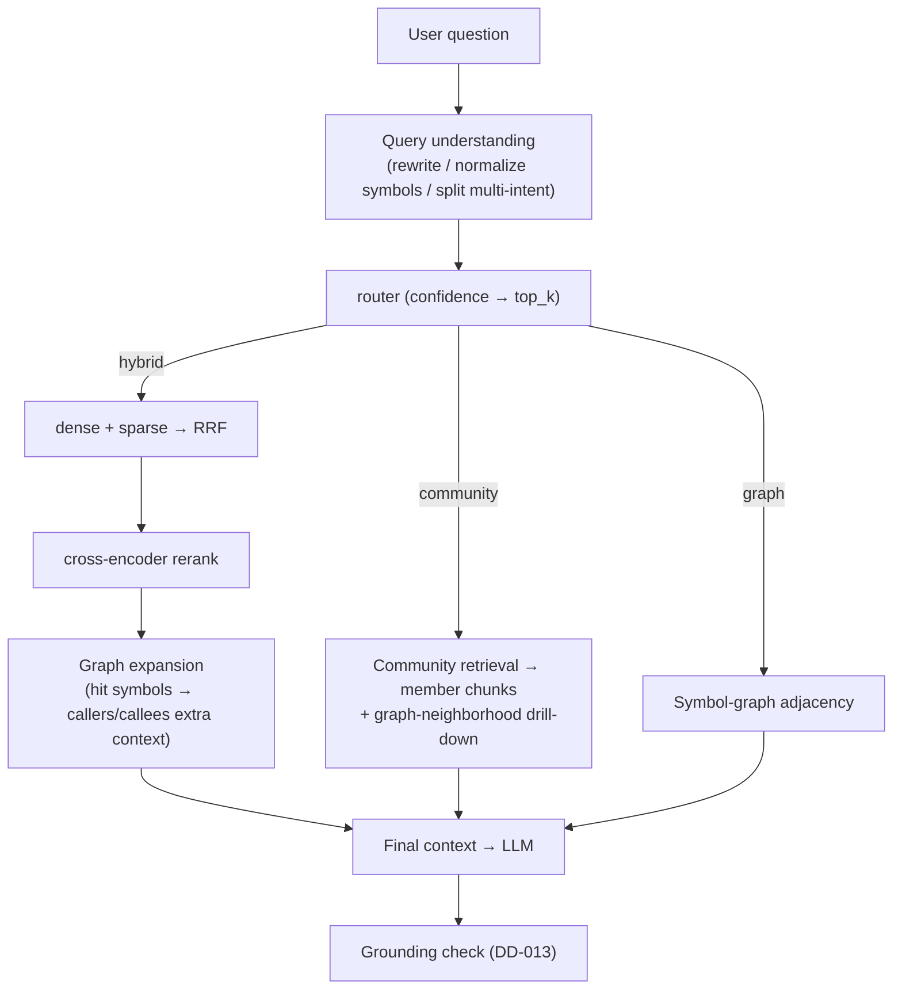
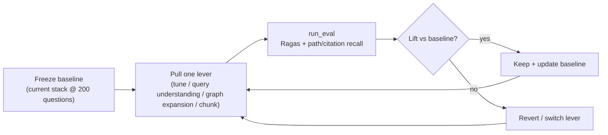
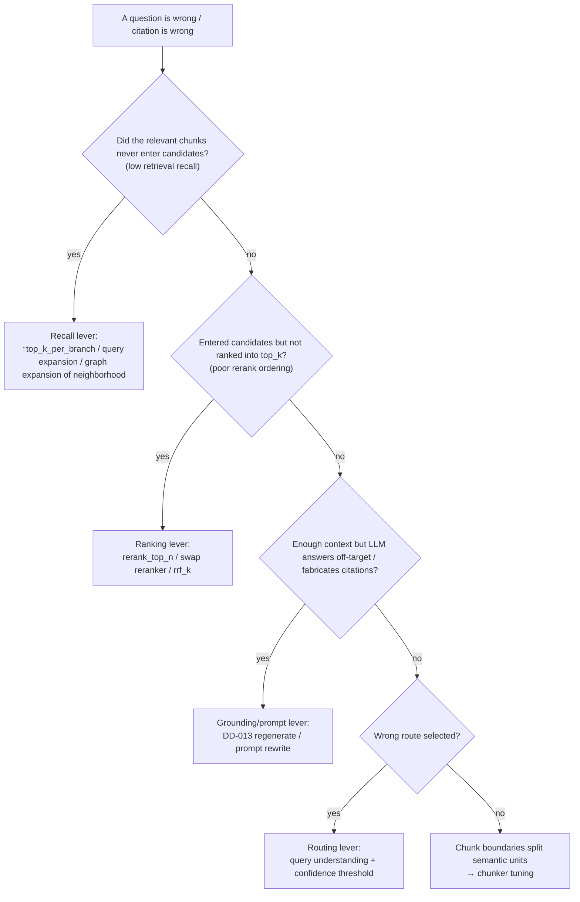

# Phase 8 — Retrieval quality (eval-first + query understanding + graph expansion) (technical design)

> This document corresponds to stage 8 of [`docs/ROADMAP.md`](../ROADMAP.md).
> Created: 2026-07-16. **Status: ⬜ Not started (forward-looking technical design)**.
> Style matches [phase-1-indexer.md](phase-1-indexer.md) … [phase-7-incremental.md](phase-7-incremental.md): proper nouns annotated in parentheses.
> Depends on: Phase 6 (engine scale-out). Largely parallel with Phase 9 (speed), but **accuracy first; latency is closed out in Phase 9**.

## 0. Background and current state

By Phase 5 the **mechanics** of three-way retrieval are in place, but **accuracy has never been systematically optimized** — because there is no large enough measurement baseline (200 questions, of which only 50 shipped; Phase 5 deferred the rest here). Current retrieval stack:

| Stage | Current state (code) | Limitation |
| --- | --- | --- |
| Routing | [`retrieval/router.py`](../../reposage/retrieval/router.py): regex three-way (dotted/call/snake) + LLM fallback | Only splits “symbol vs semantic”; no rewrite, no split of multi-intent questions |
| Hybrid retrieval | [`retrieval/hybrid.py`](../../reposage/retrieval/hybrid.py): dense+sparse → RRF(k=60) → rerank_top_n=20 → cross-encoder → top_k=8 | Parameters **never tuned** (`top_k_per_branch=50/rrf_k=60/rerank_top_n=20` are initial values) |
| Rerank | [`retrieval/reranker.py`](../../reposage/retrieval/reranker.py): `bge-reranker-v2-m3` cross-encoder | Not evaluated against alternative models |
| Graph | [`sqlite_graph.py`](../../reposage/storage/sqlite_graph.py): `callers_of`/`callees_of` only for the graph route | **Not used to enrich context around hybrid hits** |
| Community | [`community_retriever.py`](../../reposage/retrieval/community_retriever.py) cosine scan | After hitting a community, takes seed chunks (`_chunks_for_communities`); no “follow the graph and drill down” |
| Chunk | `indexer/chunker.py` (AST + max lines + overlap) | Boundaries/overlap not tuned for retrieval quality |
| Multilingual | TS/Go parse-validate only (DD-010); no symbol extraction | Non-Python content is invisible to graph/communities (user-stated: **low priority**) |

Eval side already has [`benchmarks/rag/run_eval.py`](../../benchmarks/rag/run_eval.py) (Phase 2) and [`benchmarks/cross_file_qa/run_eval.py`](../../benchmarks/cross_file_qa/run_eval.py) (Phase 3: path_recall / citation_recall / aggregate_correctness; Ragas optional).

## 1. Goals and scope

**Goal**: Drive **end-to-end accuracy** of three-way retrieval up systematically versus the current baseline, using an **eval harness**.

**In scope**: Complete the 200-question benchmark (measurement foundation), hybrid retrieval parameter sweep, query understanding (rewrite/expand/split), graph-augmented retrieval, chunk quality, Ragas metric wiring, per-bucket lift table.

**Out of scope**:
- Latency / throughput / caching (query understanding adds LLM calls; latency is **closed out in Phase 9**).
- The sparse backend itself (Tantivy) → Phase 6.
- **Multilingual symbol extraction**: low priority; an **optional add-on**, not a blocker for this phase’s exit (§5.5).

## 2. Deliverables

| # | Deliverable | Landing place |
| --- | --- | --- |
| D1 | **Full 200-question benchmark** (Python + TS + Go, by bucket: graph/community/hybrid) | `benchmarks/cross_file_qa/questions.jsonl` |
| D2 | Ragas wiring: `answer_correctness` / `faithfulness` as routine numbers | `benchmarks/cross_file_qa/run_eval.py` |
| D3 | Hybrid retrieval parameter sweep (rrf_k / top_k_per_branch / rerank_top_n) | `benchmarks/retrieval_sweep.py` (new) |
| D4 | Query understanding: rewrite/expand + multi-intent split + router confidence coupled to top_k | `retrieval/query_understanding.py` (new) + router |
| D5 | Graph-augmented retrieval: expand hybrid hits along `callers/callees` for extra context | `retrieval/graph_expand.py` (new) + hybrid |
| D6 | Community drill-down: hit community → graph-neighborhood completion of member chunks | Enhance `retrieval_service._chunks_for_communities` |
| D7 | Chunk boundary/overlap tuning (eval-driven) | `indexer/chunker.py` + sweep |
| D8 | Per-bucket lift table + backfill `docs/BENCHMARKS.md` §2 | `docs/BENCHMARKS.md` |
| D9 | (Optional / low priority) TS/Go symbol extraction | `indexer/*_resolver.py` |

## 3. Exit criteria

| Metric | Target | How measured |
| --- | --- | --- |
| **200 questions in place** | 200 questions total across Python+TS+Go, with `expected_paths`/`expected_citations` | Count in `questions.jsonl` + schema validation |
| **End-to-end accuracy** | `auto` vs `hybrid-only` baseline **+X% (absolute)** (headline: `auto − hybrid-only`) | Ragas `answer_correctness` (all 200 questions) |
| **Citation alignment** | Citation alignment rate up vs baseline (±5-line window; see cross_file_qa) | `citation_recall` |
| **Path recall** | `path_recall` up vs baseline | Same |
| **No quality regression** | No bucket drops significantly (hold a −ε floor) | Per-bucket table |
| **Latency stays bounded** | With query understanding on, P50 still within the GraphRAG envelope (≤ 30 s); fine-grained pressure is Phase 9 | `LatencyBreakdown` |

> Exit is judged by **reproducible lift vs our own baseline**: freeze the current stack’s numbers on the 200 questions as baseline; book each lever’s gain against that baseline.

## 4. Architecture and data flow

### 4.1 Retrieval pipeline after enhancement (query understanding + graph expansion)



### 4.2 Eval loop (eval-first)



## 5. Key design and trade-offs

### 5.1 Preference flow: treat by failure bucket (diagnosis-driven)

The worst way to improve accuracy is “tune by gut feel”. Run the baseline first; pick levers by **failure mode**:



Each lever maps to a quantifiable intermediate metric (recall@candidates / rerank hit rate / grounding rate / routing accuracy), so we never “change something without knowing why it got better or worse”.

### 5.2 Trade-off: whether and how much query understanding

Query rewrite/expansion can lift recall, but it is **one extra LLM call** (latency + cost). Trade-off:

| Option | Gain | Cost | Verdict |
| --- | --- | --- | --- |
| None | — | 0 | ❌ Symbol names not normalized; multi-intent questions treated as single-intent |
| **Lightweight heuristic rewrite (no LLM)** | Normalize `User.login`↔`login`, drop stopwords, split camelCase | ~0 | ✅ **On by default** |
| LLM rewrite/expand/split | Strongest recall (synonym expansion, multi-intent) | +1 LLM call | ✅ **Configurable `query_understanding=llm`**; off by default; for accuracy-first settings |
| Reuse the router’s LLM call | One call produces both “route + rewrite” | Saves one round-trip | ✅ Merge into the router prompt (cuts latency) |

**Preference**: default to zero-cost heuristics; LLM rewrite as an optional high tier, **merged into the router call** to amortize latency (detailed latency accounting is Phase 9).

### 5.3 Trade-off: graph-expansion breadth (signal vs noise)

After hybrid hits a chunk, we can follow `callers_of`/`callees_of` and pull related symbols’ chunks into context. Breadth cuts both ways:

| Breadth | Recall | Noise | Verdict |
| --- | --- | --- | --- |
| No expansion (current) | Baseline | Low | Weak on cross-file questions |
| **1-hop callees + sibling members of the hit symbol’s class** | Clearly fills “call-chain / collaboration” questions | Controllable | ✅ **Adopt**, and **rerank is a second gate** |
| 2+ hops / full callers+callees expansion | Diminishing returns | High (pulls in unrelated modules) | ⬜ Add only if eval proves net gain |

**Hard rule**: graph expansion only **widens the candidate set**; the final set still goes through cross-encoder rerank (to push noise back down), then is truncated to top_k. I.e. “wide recall, strict ranking”.

### 5.4 Trade-off: how to choose reranker and parameters

- Tune with a **grid sweep + 200 questions**, not by guesswork. `retrieval_sweep.py` sweeps `rrf_k ∈ {10,30,60,100}` × `top_k_per_branch ∈ {30,50,100}` × `rerank_top_n ∈ {12,20,32}`, and emits a Pareto (accuracy vs candidate size/latency).
- Swap reranker types (larger/smaller bge-reranker, or LLM-as-reranker) and compare; keep DD-012’s `Reranker` Protocol so swaps are seamless.

### 5.5 Trade-off: multilingual (low priority)

The user was explicit that “multilingual is not very important”. Treat it as an **optional add-on**, only when it expands accuracy coverage with high ROI:

| Language | Current state | Attitude this phase |
| --- | --- | --- |
| Python | Fully parsed | Primary focus |
| TS/JS, Go | `parse_status='unsupported'` only (DD-010) | If the 200 questions include cross-language items and missing coverage drags the score, then add **symbol extraction** (`nodes/edges/chunks`), as the “pure incremental” extension described in DD-010 |
| Java/Rust | None | ⬜ Not in this phase’s committed scope |

Does not block exit: the 200-question language mix can be “Python-heavy + a few TS/Go semantic questions (hybrid route, chunk text is enough)” so multilingual symbol extraction is a bonus, not a prerequisite.

## 6. Key file changes

- **`benchmarks/cross_file_qa/questions.jsonl`**: grow to 200 questions; tag `bucket`/`expected_paths`/`expected_citations` (reuse existing schema; `run_eval` bucket stats and gates need no change).
- **`benchmarks/cross_file_qa/run_eval.py`**: make Ragas routine (`answer_correctness`/`faithfulness`); add paired `auto` vs `hybrid-only` runs (headline gain).
- **`benchmarks/retrieval_sweep.py`** (new): retrieval parameter grid sweep → Pareto.
- **`retrieval/query_understanding.py`** (new): heuristic rewrite + optional LLM rewrite/split; merged call from `QueryRouter`.
- **`retrieval/router.py`**: confidence coupled to `top_k`; consume rewrite results.
- **`retrieval/graph_expand.py`** (new): `expand(chunks, graph_store, hops=1)` follows the graph to add candidates.
- **`retrieval/hybrid.py`**: insert graph expansion after candidate fusion and before rerank (toggleable).
- **`services/retrieval_service.py`**: add graph-neighborhood drill-down to `_chunks_for_communities`.
- **`indexer/chunker.py`**: parameterize boundary/overlap + sweep-tune.
- **`docs/BENCHMARKS.md`** §2: backfill the 200-question per-bucket table.

## 7. Test matrix

| Layer | Case | Assertion |
| --- | --- | --- |
| Data | 200-question schema | Each question has a valid bucket/expected_paths; jsonl parses |
| Unit | Heuristic rewrite | `User.login` → contains `login`; camelCase/snake_case split correct; idempotent |
| Unit | Graph expansion | 1-hop callees of hit symbols enter candidates; acyclic, deduped, bounded by top_n |
| Unit | Parameter sweep | Sweep emits parseable CSV + Pareto pick is correct (dominated points not on the frontier) |
| Integration | Mock end-to-end | `/ask` all-green with query-understanding / graph-expansion toggles; results deterministic |
| Benchmark | 200-question paired | `auto − hybrid-only` ≥ target; no bucket significantly regresses |
| Regression | Phase 2 `bench-rag` | P50/recall/citation gates stay green |

## 8. Design decisions (proposed; register when landing)

- **DD-042 Eval-first, baseline bookkeeping**: freeze the 200-question baseline first; measure each lever against it; revert if no net gain.
- **DD-043 Query understanding tiers (heuristics default; LLM optional and merged into the router call)**: zero-cost default + optional high recall; latency amortized.
- **DD-044 Graph expansion = wide recall, strict ranking**: follow the graph only to widen candidates; cross-encoder rerank is the final gate for SNR.
- **DD-045 Multilingual as an optional add-on**: invest only if it drags the 200-question score; extend via DD-010’s pure incremental path.

## 9. Risks and mitigations

- **Risk: 200-question labels are subjective/biased**. Mitigation: real repos from multiple sources, explicit labeling rules, ±5-line citation tolerance; use `hybrid-only` as a same-denominator baseline to reduce the effect of absolute label noise.
- **Risk: graph expansion / query expansion injects noise and *lowers* accuracy**. Mitigation: everything closes through rerank + eval gates; any lever must prove net gain before default-on.
- **Risk: Ragas depends on a real LLM and cannot run in CI**. Mitigation: Ragas only on `run-eval` label / weekly runs; CI mock checks plugins and deterministic recall-class metrics (reuse existing `importorskip` habit).
- **Risk: query understanding raises latency significantly**. Mitigation: heuristics by default; LLM tier merged into the router call; absolute latency closed out in Phase 9; this phase only holds “stay inside the GraphRAG envelope”.
- **Risk: overfitting the 200 questions**. Mitigation: hold out a subset from tuning; periodically swap questions and re-check.

## 10. Milestones and demo commands

**Milestones**: M1 200 questions + Ragas + frozen baseline → M2 parameter sweep (ranking/recall levers) → M3 query understanding + graph expansion → M4 chunk tuning + backfill BENCHMARKS + meet targets.

```bash
# Freeze baseline (current stack @ 200 questions)
python -m benchmarks.cross_file_qa.run_eval --out results/baseline.csv

# Parameter sweep
python -m benchmarks.retrieval_sweep --grid default

# Re-eval with query understanding + graph expansion on (headline: auto - hybrid-only)
REPOSAGE_QUERY_UNDERSTANDING=llm python -m benchmarks.cross_file_qa.run_eval

# CI mock smoke (deterministic)
REPOSAGE_PROFILE=mock python -m benchmarks.cross_file_qa.run_eval
```
