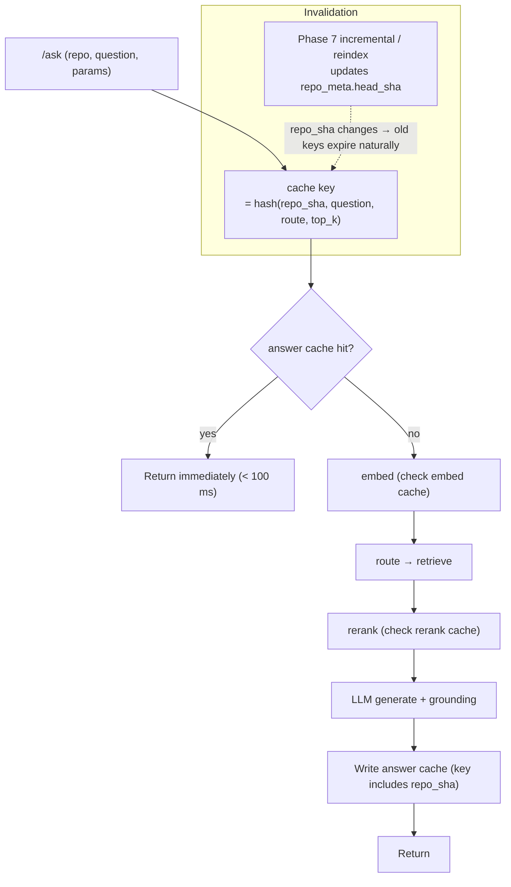
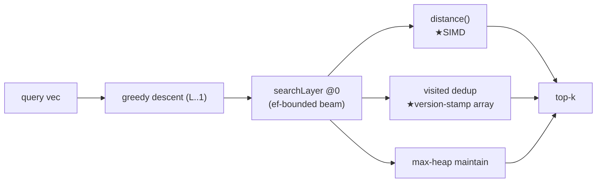
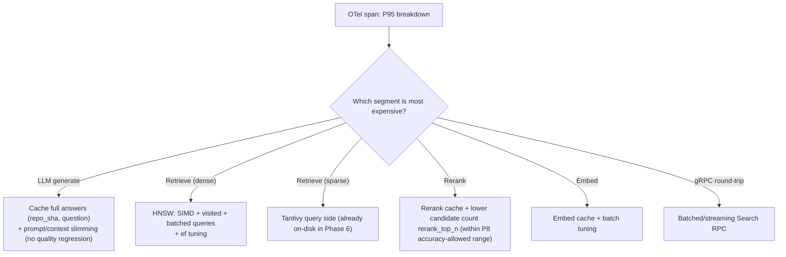
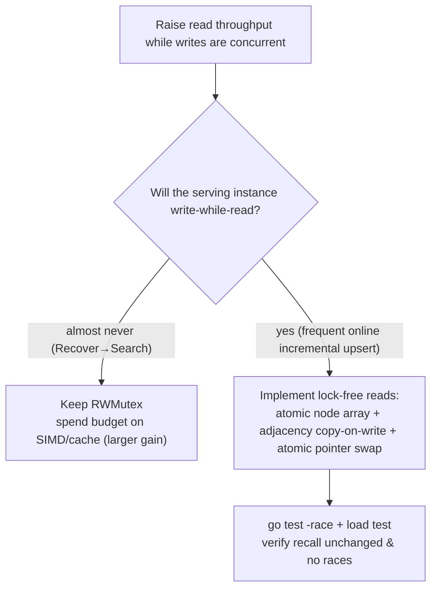

# Phase 9 — Speed and latency (latency & throughput: cache + SIMD + lock-free reads + batched queries) (technical design)

> This document corresponds to stage 9 of [`docs/ROADMAP.md`](../ROADMAP.md).
> Created: 2026-07-16. **Status: 🚧 Partially implemented** (versioned answer cache has landed; SIMD / batched queries / lock-free reads still pending — see “Implementation progress” below).
> Style matches [phase-1-indexer.md](phase-1-indexer.md) … [phase-8-retrieval-quality.md](phase-8-retrieval-quality.md): proper nouns annotated in parentheses.
> Depends on: Phase 6 (engine scale-out). Picks up two leftovers from Phases 4/5 (QPS gap, per-layer lock-free reads) and Phase 8 query-understanding latency.

## Implementation progress (LM-free code slice, 2026-07-16)

- ✅ Versioned answer cache: [`services/answer_cache.py`](../../reposage/services/answer_cache.py) (bounded LRU; key includes `repo`+`repo_version`+question+route_hint+top_k+model, DD-046).
- ✅ Service wiring (opt-in): `RetrievalService(answer_cache=...)`; a hit skips routing and the LLM; `composition.py` assembles from `settings.answer_cache_enabled`; **cache grounded results only**.
- ⏳ Still to do: embed / rerank caches, HNSW SIMD distance, visited-structure optimization, per-layer sharded locks, batched gRPC search, pprof report.

## 0. Background and current state

Once accuracy (Phase 8) and scale (Phase 6) are in place, what remains is **driving latency down** and **closing HNSW QPS toward Faiss**. Known speed gaps today:

| Stage | Current state (code) | Speed issue |
| --- | --- | --- |
| Distance | [`distance.go`](../../go-hnsw/distance.go): scalar for-loop; `Cosine` accumulates in **float64** | No SIMD; most expensive step on the hot path; Phase 4 measured ~2.5–3× behind Faiss |
| Search | [`search.go`](../../go-hnsw/search.go) one query, Algorithm 5; `searchLayer` has a visited structure | Each query independent; a map-based visited has alloc/hash cost |
| Query RPC | `hnsw_client.search` one vector at a time, gRPC **unary** | One network round-trip per call; batch cases amplify round-trips |
| Concurrency | Phase 5 already moved server `Mutex`→`RWMutex` (concurrent reads) | **Per-layer lock-free reads** still not done (Phase 5 explicitly deferred here) |
| Cache | **No caches at all** (answers / embeddings / rerank uncached) | Repeat questions and repeat embeddings fully recomputed |
| Observability | Phase 5 OTel spans cover three routes + index segments | Already in place — use it to find the expensive segments |

**Method**: use Phase 5 OTel spans to measure **which segment is most expensive in P95**, then optimize that — do not guess.

## 1. Goals and scope

**Goal**: drive online Q&A P50/P95 down, and lift single-thread HNSW QPS vs Phase 4 (close the gap toward Faiss).

**In scope**: answer / embed / rerank cache layer, HNSW SIMD distance, visited-structure optimization, per-layer sharded locks / lock-free reads, batched query RPC, embed batch tuning, end-to-end OTel profiling.

**Out of scope**:
- Retrieval **accuracy** (this phase does not change recall/ranking quality; changes must be **equivalent**) → Phase 8.
- Large-repo memory / index throughput → Phase 6.
- Incremental correctness → Phase 7.

## 2. Deliverables

| # | Deliverable | Landing place |
| --- | --- | --- |
| D1 | Answer cache: `(repo_sha, question, params)` → full answer; hit < 100 ms | `services/answer_cache.py` (new) + `retrieval_service` |
| D2 | Embed / rerank caches (content-hash keys) | `retrieval/*` + shared LRU/disk cache |
| D3 | Cache invalidation: versioned expiry when `repo_meta.head_sha` changes (hook Phase 7 incremental) | `answer_cache` key includes repo_sha |
| D4 | HNSW SIMD distance (cosine/L2/IP) | `go-hnsw/distance_simd_*.go` (new, build tags) + scalar fallback |
| D5 | Visited-structure optimization (version-stamp array instead of map) | `go-hnsw/search.go` / `insert.go` |
| D6 | Per-layer sharded locks / lock-free reads (deferred from Phase 5) | `go-hnsw/graph.go` / `hnsw.go` |
| D7 | Batched query RPC (server-streaming / batched Search) | `proto/hnsw.proto` + go-hnsw + `hnsw_client.py` |
| D8 | pprof profile report + Pareto re-run (QPS gap closed) | `docs/BENCHMARKS.md` §1/§3 |

## 3. Exit criteria

| Metric | Target | How measured |
| --- | --- | --- |
| **Cache-hit latency** | Repeat questions return in < **100 ms** | End-to-end timing (hit path) |
| **HNSW QPS** | Single-thread lift vs Phase 4 (close the gap toward Faiss; shrink the ~2.5× gap) | Re-run `hnsw-bench`; backfill BENCHMARKS §1 |
| **Service P95** | `/ask` P95 down **X%** vs pre-phase baseline | `LatencyBreakdown` / OTel |
| **No recall regression** | After SIMD/visited/lock-free-read changes, recall@10 is **bit-identical or no worse** than before | go-hnsw unit tests (existing `persist`/`insert` asserts + new SIMD equivalence tests) |
| **-race clean** | After lock-free-read / sharded-lock changes, `go test -race` all green | CI ci-go |
| **Cache correctness** | After a repo change, no stale answers (versioned keys work) | Cache-invalidation cases |

## 4. Architecture and data flow

### 4.1 Q&A path with cache



### 4.2 HNSW search hot path (optimization points marked)



## 5. Key design and trade-offs

### 5.1 Preference flow: profile first, then decide what to optimize



**Discipline**: before and after every optimization, run the OTel breakdown and confirm we “optimized a real bottleneck” and “overall P95 actually dropped” (a local speedup that does not move total P95 does not count).

### 5.2 Trade-off: how to do SIMD distance (keep DD-001 “no native deps we didn’t write”)

| Option | Dependencies | Portability | Verdict |
| --- | --- | --- | --- |
| A. cgo into a SIMD library (e.g. Faiss/simsimd) | External native deps | Breaks DD-001 “serving binary has no native deps we didn’t write” | ❌ |
| B. Pure Go loop unrolling + compiler auto-vectorization | None | All platforms | ✅ **Preferred starting point** (measure gain first) |
| **C. Go assembly / `avo`-generated AVX2·NEON kernels** (`//go:build amd64/arm64` + scalar fallback) | No external deps (we write/generate them) | All platforms if fallback exists | ✅ **Primary approach** (matches where Faiss’s SIMD advantage comes from) |

**Preference**: do B first (change `Cosine` accumulation from float64 to float32; prefer `InnerProductNormalised` — bge vectors are already normalized, so `1 - dot` ranks the same as cosine and skips the division), measure the ceiling; then C (AVX2/NEON dot kernels) with scalar fallback + bit-equivalence tests. Never introduce external native deps (DD-001).

Key existing fact: bge embeddings **are already L2-normalized** (see comments in `embedder`/`community_retriever`), so server-side cosine can switch entirely to `MetricInnerProduct` (`InnerProductNormalised`, float32 dot). That is a **zero-risk first-tier speedup**.

### 5.3 Trade-off: per-layer lock-free reads vs current RWMutex (land the Phase 5 deferral)

Phase 5 (DD-032) already argued: under single-writer multi-reader deploy, a server `RWMutex` already lets reads fully concurrent; per-layer locks only buy extra “write-while-read”. We do it in this phase because here there is a **clear QPS target + load-test baseline** to verify gain and bound risk.



| Option | Write-while-read throughput | Complexity/risk | Verdict |
| --- | --- | --- | --- |
| Current RWMutex | Briefly blocks readers during writes | Low | If profiling shows this is not the bottleneck → **keep**, spend budget on SIMD/cache |
| Per-layer sharded locks | Medium | Medium | Compromise |
| Atomic node array + adjacency COW lock-free reads | High | High (large change + thorough load tests) | Only if Phase 7 online incremental makes write-while-read a real bottleneck |

**Preference**: let profiling decide. If online incremental (Phase 7) makes the serving instance write frequently, implement lock-free reads; otherwise spend engineering budget on SIMD + cache (more direct P95 gain). This officially closes Phase 5’s “defer” as “decide from data”.

### 5.4 Trade-off: cache invalidation strategy

| Strategy | Staleness risk | Verdict |
| --- | --- | --- |
| TTL only | Yes (code can change inside the TTL and still return a stale answer) | ❌ Unacceptable for code Q&A |
| **Versioned keys: key includes `repo_meta.head_sha`** | None (repo change → key change; old entries expire naturally) | ✅ **Adopt**; hooks Phase 7 incremental naturally |
| Manual cache clear | Easy to miss | Ops fallback only |

Answer-cache key = `hash(repo_sha, normalized_question, route, top_k, model)`; `repo_sha` comes from `repo_meta.head_sha` (Phase 7 updates it on every reindex). Embed/rerank caches use **content-hash** keys (unchanged text hits; reusable across repos).

### 5.5 Trade-off: batched query RPC

- A single Q&A already has one query; **batch cases** (eval over 200 questions, future multi-question concurrency, graph expansion pulling several symbol vectors at once) benefit from batched/streaming `Search`.
- Add a **new** RPC alongside `SparseRetriever`/`DenseRetriever`; keep unary `Search` compatible; batched `SearchBatch(stream/repeated)` amortizes gRPC round-trips and Python↔Go serialization. If proto extension hits missing `protoc-gen-go`, follow the DD-029 strategy.

## 6. Key file changes

### 6.1 Cache (Python)
- **`services/answer_cache.py`** (new): versioned-key LRU (in-memory) + optional disk backend; `get/put`.
- **`services/retrieval_service.py`**: `answer()` entry checks cache, exit writes cache (key includes repo_sha).
- **`retrieval/embedder`/`reranker`**: content-hash cache wrappers.
- **`config.py`**: `answer_cache_size`, `cache_backend`, `cache_dir`.

### 6.2 HNSW (Go)
- **`distance.go` + `distance_simd_amd64.go`/`_arm64.go`/`_fallback.go`** (new, build tags): SIMD dot/L2 + scalar fallback; `Cosine` in float32.
- **`search.go` / `insert.go`**: visited becomes a version-stamp array (each search `gen++`; `visited[id]==gen` means already visited; no per-query map alloc); ef-tuning knob.
- **`graph.go` / `hnsw.go`**: (conditional) per-layer sharded locks / lock-free reads.
- **`internal/grpcserver/server.go` + `proto`**: `SearchBatch`.

### 6.3 Client / benchmarks
- **`retrieval/hnsw_client.py`**: `search_batch`.
- **`benchmarks/sift1m/run_sweep.py`**: re-run QPS gap-close; backfill `docs/BENCHMARKS.md` §1; backfill `/ask` P95 table in §3.

## 7. Test matrix

| Layer | Case | Assertion |
| --- | --- | --- |
| Unit (Go) | SIMD vs scalar equivalence | SIMD distances match scalar **bit-for-bit / within tolerance** on random vectors; consistent across amd64/arm64/fallback |
| Unit (Go) | visited version-stamp | Search results match the old visited implementation; `gen` wraparound-safe |
| Unit (Go) | Lock-free reads `-race` | Concurrent read + write `go test -race` clean; recall unchanged |
| Unit (Py) | Cache hit/invalidation | Same-key hit under threshold; `repo_sha` change → miss; content-hash hits across repos |
| Integration | Batched Search | `search_batch(N)` results == N times `search` and faster |
| Benchmark | QPS gap closed | `hnsw-bench` QPS up vs Phase 4; Pareto approaches Faiss |
| Benchmark | P95 down | `/ask` P95 down X% vs baseline; OTel segments corroborate |
| Regression | recall / RAG | recall@10 and `bench-rag` quality gates stay green (speed does not trade quality) |

## 8. Design decisions (proposed; register when landing)

- **DD-046 Versioned answer cache (key includes `repo_meta.head_sha`)**: never return a stale answer after code changes; hooks Phase 7 naturally; embed/rerank use content-hash caches reusable across repos.
- **DD-047 Self-contained SIMD distance (assembly/avo + scalar fallback), no external native deps**: keep DD-001; take zero-risk gain from float32/IP first, then AVX2/NEON kernels, gated by bit-equivalence tests.
- **DD-048 Visited version-stamp array**: avoid per-query map alloc; lower GC pressure and constant factors.
- **DD-049 Lock-free reads decided from data (close Phase 5’s DD-032 deferral)**: only if online incremental makes write-while-read a real bottleneck; otherwise spend budget on SIMD/cache.
- **DD-050 Speed changes have “quality equivalence” as a hard constraint**: no speedup may lower recall / RAG scores; CI double-gates.

## 9. Risks and mitigations

- **Risk: SIMD assembly platform differences / precision drift**. Mitigation: `//go:build` per platform + scalar fallback; float32 accumulation-order differences use tolerance asserts; little-endian assumption already asserted at package init (Phase 4).
- **Risk: cache returns stale answers**. Mitigation: versioned keys (repo_sha); invalidation cases as a gate; cache only **already grounded** answers (`grounded=True` required to insert).
- **Risk: lock-free reads introduce races / graph corruption**. Mitigation: only if profiling proves need; atomic pointers + COW; triple-check with `-race` + load test + recall equivalence; otherwise leave it alone.
- **Risk: local optimizations do not drop overall P95**. Mitigation: accept each step only on end-to-end OTel breakdown; only “total P95 down” counts.
- **Risk: batched RPC increases tail latency (waiting to fill a batch)**. Mitigation: batching only for naturally batched cases (eval / multi-question concurrency / graph expansion); single-question path stays unary.

## 10. Milestones and demo commands

**Milestones**: M1 OTel profile of the most expensive segment + answer/embed caches (first P95 drop) → M2 HNSW float32/IP + SIMD + visited (QPS gap closed) → M3 batched Search → M4 (as needed) lock-free reads + backfill BENCHMARKS.

```bash
# Profile: inspect P95 breakdown
export REPOSAGE_OTEL_ENABLED=true
python -m reposage.cli ask "how do auth and billing interact?"   # inspect span breakdown in Jaeger

# HNSW hot-path pprof + QPS re-run
cd go-hnsw && go test -bench=Search -cpuprofile cpu.out ./...
./bin/hnsw-bench --dataset-dir benchmarks/sift1m/data --M 16 --efC 200 --ef 64

# Cache-hit demo
python -m reposage.cli ask "..."   # first: full cost
python -m reposage.cli ask "..."   # same question again: < 100 ms hit

# Quality-no-regression gate
make hnsw-test && REPOSAGE_PROFILE=mock make bench-rag
```
