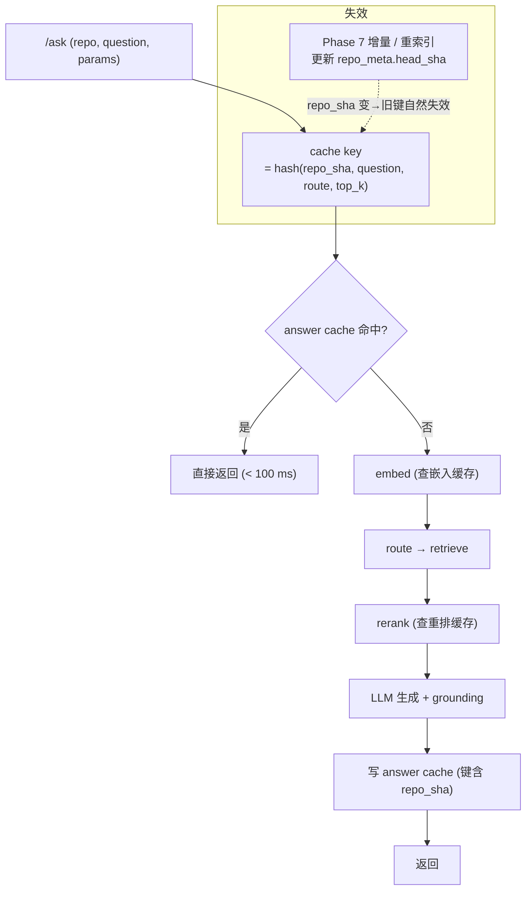
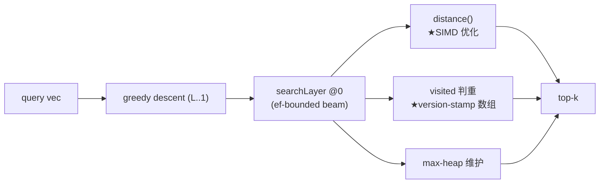
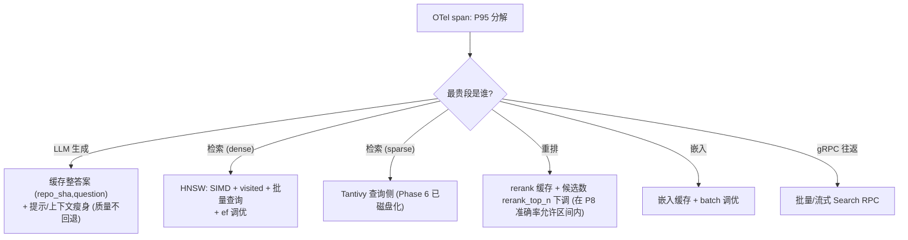
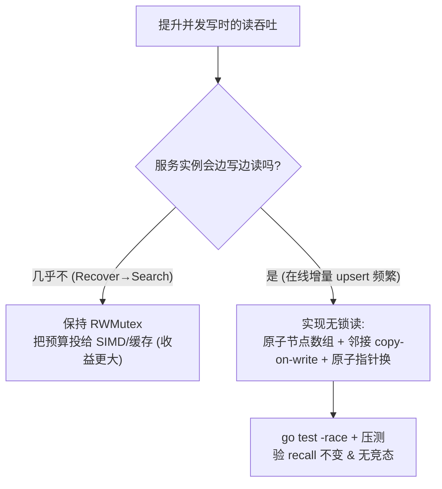

# Phase 9 — 速度与延迟（latency & throughput：缓存 + SIMD + 无锁读 + 批量查询）（技术方案）

> 本文档与 [`docs/ROADMAP.md`](../ROADMAP.md) 第 9 阶段对应。
> 创建日期：2026-07-16。**状态：🚧 部分实现**（版本化问答缓存已落地；SIMD/批量查询/无锁读待补，见下「本次实现进展」）。
> 风格与 [phase-1-indexer.md](phase-1-indexer.md) … [phase-8-retrieval-quality.md](phase-8-retrieval-quality.md) 一致：专有名词括号注解。
> 依赖：Phase 6（引擎可扩展）。承接 Phase 4/5 的两处遗留（QPS 差距、per-layer 无锁读）与 Phase 8 的查询理解延迟。

## 本次实现进展（LM-free 代码切片，2026-07-16）

- ✅ 版本化问答缓存：[`services/answer_cache.py`](../../reposage/services/answer_cache.py)（有界 LRU，键含 `repo`+`repo_version`+question+route_hint+top_k+model，DD-046）。
- ✅ 服务接线（opt-in）：`RetrievalService(answer_cache=...)`，命中即跳过路由与 LLM；`composition.py` 依 `settings.answer_cache_enabled` 装配；**仅缓存 grounded 结果**。
- ⏳ 待补：嵌入 / 重排缓存、HNSW SIMD 距离、visited 结构优化、per-layer 分片锁、批量 gRPC 查询、pprof 报告。

## 0. 背景与现状

准确率（Phase 8）与规模（Phase 6）到位后，剩下把**延迟压下来**、把 **HNSW QPS 向 Faiss 收口**。当前速度侧的已知短板：

| 环节 | 现状（代码） | 速度问题 |
| --- | --- | --- |
| 距离计算 | [`distance.go`](../../go-hnsw/distance.go)：标量 for 循环；`Cosine` 用 **float64** 累加 | 无 SIMD；热路径最贵一环，Phase 4 实测落后 Faiss ~2.5–3× |
| 搜索 | [`search.go`](../../go-hnsw/search.go) 单查询 Algorithm 5；`searchLayer` 有 visited 结构 | 每查询独立；visited 若用 map 有分配/哈希开销 |
| 查询 RPC | `hnsw_client.search` 一次一向量，gRPC **unary** | 每次一个网络往返；批量场景往返放大 |
| 并发 | Phase 5 已把服务端 `Mutex`→`RWMutex`（读读并发） | **per-layer 无锁读**仍未做（Phase 5 明确后移到此） |
| 缓存 | **无任何缓存**（问答/嵌入/重排都不缓存） | 重复问题、重复嵌入全额重算 |
| 可观测 | Phase 5 OTel span 覆盖三路 + 索引各段 | 已就位，正好用来定位最贵段 |

**方法论**：先用 Phase 5 的 OTel span 量出 P95 里**哪段最贵**，再对症优化——不猜。

## 1. 目标与范围

**目标**：把线上问答 P50/P95 压下来，把单线程 HNSW QPS 相对 Phase 4 抬升（向 Faiss 收口）。

**In scope**：问答/嵌入/重排缓存层、HNSW SIMD 距离、visited 结构优化、per-layer 分片锁/无锁读、批量查询 RPC、embed 批调优、端到端 OTel 剖析。

**Out of scope**：
- 检索**准确率**（本 Phase 不改召回/排序质量，只改速度，须**等价**）→ Phase 8。
- 大仓库内存/索引吞吐 → Phase 6。
- 增量正确性 → Phase 7。

## 2. 交付物（deliverables）

| # | 交付物 | 落点 |
| --- | --- | --- |
| D1 | 问答缓存：`(repo_sha, question, params)` → 整答案，命中 < 100 ms | `services/answer_cache.py`（新）+ `retrieval_service` |
| D2 | 嵌入 / 重排缓存（内容哈希键） | `retrieval/*` + 共享 LRU/磁盘缓存 |
| D3 | 缓存失效：`repo_meta.head_sha` 变更即版本化失效（对接 Phase 7 增量） | `answer_cache` 键含 repo_sha |
| D4 | HNSW SIMD 距离（cosine/L2/IP） | `go-hnsw/distance_simd_*.go`（新，构建标签）+ 标量回退 |
| D5 | visited 结构优化（version-stamp 数组替代 map） | `go-hnsw/search.go` / `insert.go` |
| D6 | per-layer 分片锁 / 无锁读（Phase 5 后移项） | `go-hnsw/graph.go` / `hnsw.go` |
| D7 | 批量查询 RPC（server-streaming / batched Search） | `proto/hnsw.proto` + go-hnsw + `hnsw_client.py` |
| D8 | pprof 剖析报告 + Pareto 复跑（QPS 收口） | `docs/BENCHMARKS.md` §1/§3 |

## 3. 准出指标（exit criteria）

| 指标 | 目标 | 量法 |
| --- | --- | --- |
| **缓存命中延迟** | 重复问题 < **100 ms** 返回 | 端到端计时（命中路径） |
| **HNSW QPS** | 单线程相对 Phase 4 提升（向 Faiss 收口，缩小 ~2.5× 差距） | `hnsw-bench` 复跑，回填 BENCHMARKS §1 |
| **服务 P95** | `/ask` P95 相对本 Phase 前基线下降 **X%** | `LatencyBreakdown` / OTel |
| **recall 不回退** | SIMD/visited/无锁读改造后 recall@10 与改造前**逐位一致或不低于** | go-hnsw 单测（`persist`/`insert` 既有断言 + 新 SIMD 等价测试） |
| **-race 干净** | 无锁读/分片锁改造 `go test -race` 全绿 | CI ci-go |
| **缓存正确** | repo 变更后不返回陈旧答案（版本化键生效） | 缓存失效用例 |

## 4. 架构与数据流

### 4.1 带缓存的问答路径



### 4.2 HNSW 搜索热路径（优化点标注）



## 5. 关键设计与取舍

### 5.1 偏好流程图：先剖析、再决定优化哪里



**纪律**：每一项优化前后都跑 OTel 分解，确认「优化的是真瓶颈」且「总 P95 真的降了」（局部快了但总没降就不算数）。

### 5.2 取舍：SIMD 距离怎么做（守住 DD-001「无我们没写的原生依赖」）

| 方案 | 依赖 | 可移植性 | 结论 |
| --- | --- | --- | --- |
| A. cgo 调 SIMD 库（如 Faiss/simsimd） | 引入外部原生依赖 | 破坏 DD-001「serving 二进制无我们没写的原生依赖」 | ❌ |
| B. 纯 Go 循环展开 + 编译器自动向量化 | 无 | 全平台 | ✅ **首选起步**（先量收益） |
| **C. Go 汇编 / `avo` 生成 AVX2·NEON kernel**（`//go:build amd64/arm64` + 标量回退） | 无外部依赖（我们自己写/生成） | 有回退即全平台 | ✅ **主攻**（对齐 Faiss 的 SIMD 优势来源） |

**偏好**：先做 B（把 `Cosine` 的 float64 累加改 float32、优先走 `InnerProductNormalised`——bge 向量已归一，`1 - dot` 与 cosine 同序且省除法），量出上限；再上 C（AVX2/NEON dot kernel），带标量回退 + 逐位等价测试。始终不引外部原生依赖（DD-001）。

关键既有事实：bge 嵌入**已 L2 归一**（见 `embedder`/`community_retriever` 注释），所以服务端 cosine 完全可切 `MetricInnerProduct`（`InnerProductNormalised`，float32 dot），这是**零风险的第一档提速**。

### 5.3 取舍：per-layer 无锁读 vs 现状 RWMutex（Phase 5 后移项落地）

Phase 5（DD-032）已论证：单写多读部署下，服务端 `RWMutex` 让读读全并发，per-layer 锁只多买「边写边读」。本 Phase 才做，是因为这里有**明确 QPS 目标 + 压测基线**来验证收益、控风险。



| 方案 | 边写边读吞吐 | 复杂度/风险 | 结论 |
| --- | --- | --- | --- |
| 现状 RWMutex | 写时短暂阻读 | 低 | 若剖析显示这不是瓶颈 → **保持**，预算投 SIMD/缓存 |
| per-layer 分片锁 | 中 | 中 | 折中 |
| 原子节点数组 + 邻接 COW 无锁读 | 高 | 高（需大改 + 充分压测） | 仅当 Phase 7 在线增量使「边写边读」成为真瓶颈才做 |

**偏好**：以剖析定夺。若在线增量（Phase 7）让服务实例频繁写，则做无锁读；否则把工程预算投向 SIMD + 缓存（对 P95 收益更直接）。这条把 Phase 5 的「后移」正式收口为「按数据决定」。

### 5.4 取舍：缓存失效策略

| 策略 | 陈旧风险 | 结论 |
| --- | --- | --- |
| 纯 TTL | 有（TTL 内代码变了仍返旧答案） | ❌ 对代码问答不可接受 |
| **版本化键：key 含 `repo_meta.head_sha`** | 无（repo 一变，键即变，旧条目自然失效） | ✅ **采用**，天然对接 Phase 7 增量 |
| 手动清缓存 | 易漏 | 仅作运维兜底 |

问答缓存键 = `hash(repo_sha, normalized_question, route, top_k, model)`；`repo_sha` 取自 `repo_meta.head_sha`（Phase 7 每次重索引更新）。嵌入/重排缓存用**内容哈希**键（文本不变即命中，跨 repo 复用）。

### 5.5 取舍：批量查询 RPC

- 单问答场景单查询已够；**批量场景**（评测跑 200 题、未来多问并发、图增强一次拉多个符号向量）受益于批量/流式 `Search`。
- 走 `SparseRetriever`/`DenseRetriever` 之外的**新增** RPC，保持 unary `Search` 兼容；批量 `SearchBatch(stream/repeated)` 摊薄 gRPC 往返与 Python↔Go 序列化。proto 扩展遇 `protoc-gen-go` 缺失，按 DD-029 策略处理。

## 6. 关键文件改动

### 6.1 缓存（Python）
- **`services/answer_cache.py`**（新）：版本化键 LRU（内存）+ 可选磁盘后端；`get/put`。
- **`services/retrieval_service.py`**：`answer()` 入口查缓存、出口写缓存（键含 repo_sha）。
- **`retrieval/embedder`/`reranker`**：内容哈希缓存包装。
- **`config.py`**：`answer_cache_size`、`cache_backend`、`cache_dir`。

### 6.2 HNSW（Go）
- **`distance.go` + `distance_simd_amd64.go`/`_arm64.go`/`_fallback.go`**（新，构建标签）：SIMD dot/L2 + 标量回退；`Cosine` float32 化。
- **`search.go` / `insert.go`**：visited 改 version-stamp 数组（每次搜索 `gen++`，`visited[id]==gen` 即已访问，免每查询分配 map）；ef 调优旋钮。
- **`graph.go` / `hnsw.go`**：（条件）per-layer 分片锁 / 无锁读。
- **`internal/grpcserver/server.go` + `proto`**：`SearchBatch`。

### 6.3 客户端 / 基准
- **`retrieval/hnsw_client.py`**：`search_batch`。
- **`benchmarks/sift1m/run_sweep.py`**：复跑 QPS 收口，回填 `docs/BENCHMARKS.md` §1；`/ask` P95 表回填 §3。

## 7. 测试矩阵

| 层 | 用例 | 断言 |
| --- | --- | --- |
| 单元(Go) | SIMD vs 标量等价 | 随机向量上 SIMD 距离与标量**逐位/容差内一致**；跨 amd64/arm64/回退一致 |
| 单元(Go) | visited version-stamp | 与旧 visited 实现搜索结果一致；`gen` 回绕安全 |
| 单元(Go) | 无锁读 `-race` | 并发读 + 写 `go test -race` 干净；recall 不变 |
| 单元(Py) | 缓存命中/失效 | 同键命中 < 阈值；`repo_sha` 变→未命中；内容哈希跨 repo 命中 |
| 集成 | 批量 Search | `search_batch(N)` 结果 == N 次 `search` 且更快 |
| 基准 | QPS 收口 | `hnsw-bench` QPS 相对 Phase 4 提升，Pareto 逼近 Faiss |
| 基准 | P95 下降 | `/ask` P95 相对基线降 X%；OTel 分段佐证 |
| 回归 | recall / RAG | recall@10 与 `bench-rag` 质量门禁保持绿（速度不换质量） |

## 8. 设计决策（拟新增，落地时登记）

- **DD-046 版本化问答缓存（键含 `repo_meta.head_sha`）**：杜绝代码变更后返回陈旧答案；天然对接 Phase 7；嵌入/重排走内容哈希缓存跨 repo 复用。
- **DD-047 SIMD 距离自持实现（汇编/avo + 标量回退），不引外部原生依赖**：守 DD-001；先 float32/IP 化拿零风险收益，再上 AVX2/NEON kernel，逐位等价测试守门。
- **DD-048 visited version-stamp 数组**：免每查询 map 分配，降 GC 压力与常数因子。
- **DD-049 无锁读按数据决定（收口 Phase 5 的 DD-032 后移）**：仅当在线增量使「边写边读」成真瓶颈才做，否则预算投 SIMD/缓存。
- **DD-050 速度改造以「质量等价」为硬约束**：任何提速都不得降低 recall / RAG 分数，CI 双守门。

## 9. 风险与对策

- **风险：SIMD 汇编平台差异 / 精度漂移**。对策：`//go:build` 分平台 + 标量回退；float32 累加顺序差异用容差断言；小端假设已在包初始化断言（Phase 4）。
- **风险：缓存返回陈旧答案**。对策：版本化键（repo_sha）；失效用例守门；缓存仅存**已 grounded** 的答案（`grounded=True` 才入缓存）。
- **风险：无锁读引入竞态/图损坏**。对策：只在剖析证明必要时做；原子指针 + COW；`-race` + 压测 + recall 等价三重验证；否则不动。
- **风险：局部优化不降总 P95**。对策：每步以 OTel 端到端分解验收，只认「总 P95 下降」。
- **风险：批量 RPC 增大尾延迟（等攒批）**。对策：批量仅用于天然批量场景（评测/多问并发/图增强），单问路径保持 unary。

## 10. 里程碑与演示命令

**里程碑**：M1 OTel 剖析定位最贵段 + 问答/嵌入缓存（P95 首降）→ M2 HNSW float32/IP + SIMD + visited（QPS 收口）→ M3 批量 Search → M4 （按需）无锁读 + 回填 BENCHMARKS。

```bash
# 剖析：看 P95 分解
export REPOSAGE_OTEL_ENABLED=true
python -m reposage.cli ask "how do auth and billing interact?"   # 在 Jaeger 看 span 分解

# HNSW 热路径 pprof + QPS 复跑
cd go-hnsw && go test -bench=Search -cpuprofile cpu.out ./...
./bin/hnsw-bench --dataset-dir benchmarks/sift1m/data --M 16 --efC 200 --ef 64

# 缓存命中演示
python -m reposage.cli ask "..."   # 首次: 全额
python -m reposage.cli ask "..."   # 再次同问: < 100 ms 命中

# 质量不回退守门
make hnsw-test && REPOSAGE_PROFILE=mock make bench-rag
```
