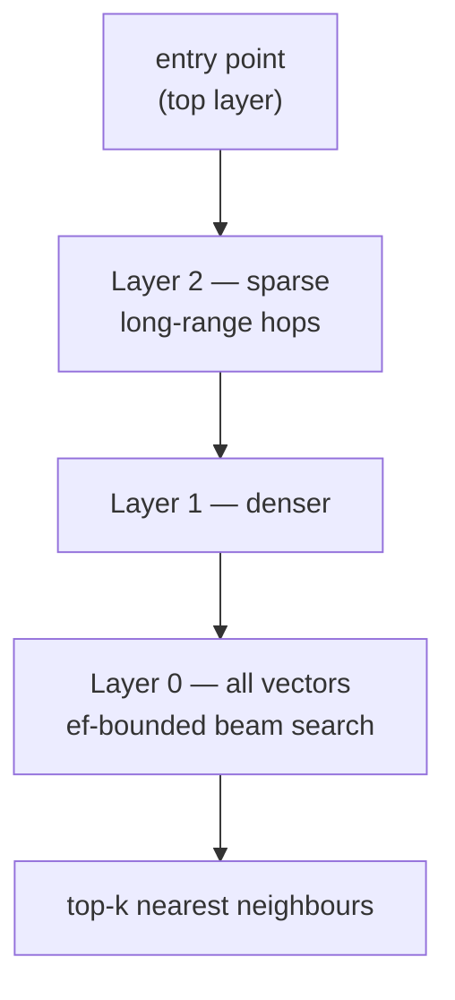

# go-hnsw

[](https://github.com/AndyUneducated/repo-sage/actions/workflows/ci-go.yml)
[](https://pkg.go.dev/github.com/AndyUneducated/repo-sage/go-hnsw)
[](../LICENSE)

Hierarchical Navigable Small World (HNSW) graph index — implemented from scratch in Go, following Malkov & Yashunin (2018, *"Efficient and robust approximate nearest neighbor search using Hierarchical Navigable Small World graphs"*).

This module is intentionally consumable on its own (`go get github.com/AndyUneducated/repo-sage/go-hnsw`). The `reposage` Python service talks to it through a tiny gRPC server in `cmd/server/`.

## HNSW in one picture

HNSW is a **layered** graph. The top layers are sparse (few nodes, long links); the bottom layer holds every vector. A search enters at the top, greedily hops toward the query, then drops a layer and repeats — so most of the corpus is skipped.



* **Insert** (Algorithm 1): pick a random max level for the new node, then link it to its `M` nearest neighbours on each layer it appears in.
* **Search** (Algorithm 5): descend layer by layer; at layer 0 keep an `efSearch`-sized candidate beam and return the closest `k`.

## Why a from-scratch implementation

* **Transparency**: every knob (`M`, `efConstruction`, `efSearch`, level multiplier, distance) is in code we own and can profile.
* **Persistence**: an `mmap`-backed on-disk format lets us reload million-vector indexes in milliseconds.
* **Observability**: per-op counters (distance computations, layer hops, candidate-list size) are first-class so we can answer *why* a query took the time it did.

## Status by phase

| Phase | Capability |
| --- | --- |
| 2 | In-memory `Index` with insert / search, cosine + L2 distances |
| 2 | gRPC server (`cmd/server`) consumed by the Python retriever |
| 5 | `mmap` persistence (snapshot + recover) |
| 5 | SIFT-1M benchmark vs Faiss; tuning curves over `M` × `ef` |
| 6 | Concurrency (sharded read locks, lock-free search path) |

## Layout

```
go-hnsw/
├── hnsw.go         # public API (Index, Config)
├── graph.go        # multi-layer graph + neighbour selection (heuristic)
├── insert.go       # insertion algorithm (Algorithm 1 in the paper)
├── search.go       # greedy search + ef-bounded beam (Algorithm 2 / 5)
├── distance.go     # cosine, L2, inner product
├── persist.go      # mmap snapshot / recover
├── stats.go        # per-op counters
├── cmd/
│   ├── server/     # gRPC server consumed by reposage.retrieval.hnsw_client
│   └── bench/      # SIFT-1M benchmark CLI (writes CSV for plotting)
└── internal/heap/  # bounded min/max heaps used in the candidate set
```

## Local development

```bash
make build       # build cmd/server, cmd/bench
make test        # go test ./...
make lint        # gofmt -l + go vet
make bench       # SIFT-1M benchmark (downloads dataset on first run)
```
